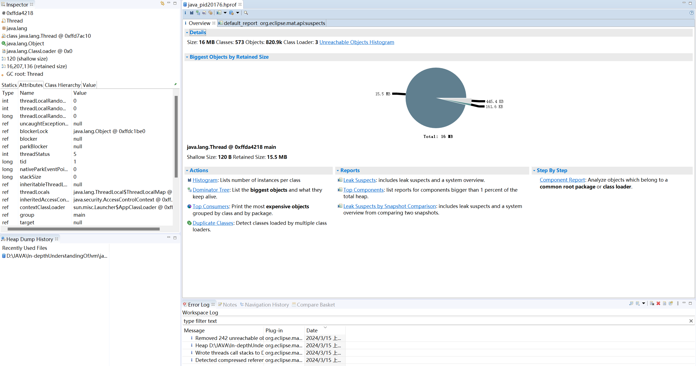

# How to recharge chatgpt through Alipay

> 重要！！！
>
> 本文通过美区Apple ID购买礼品卡后，在APPLE设备上进行购买。因此，你需要一台APPLE设备（别人的也可以，私以为这样比弄PayPal之类简单的多...）
>
> ps：虽然是在APPLE设备上购买，但是可以在其它平台上使用。

1. 通过支付宝搜索小程序Pockyt或者直接打开[网址](https://shop.pockyt.io/)
2. 先自行进行注册，注册过后搜索App Store

<figure><figcaption>
App Store
</figcaption></figure>

3. 购买礼品卡，充值20$，貌似APPLE设备上购买“只”需要19.99$
4. 在你的APPLE账户上兑换礼品卡
5. 在apple设备上登录ChatGPT，请尽量使用相同的邮箱
6. 升级PLUS，并使用apple账户付款
