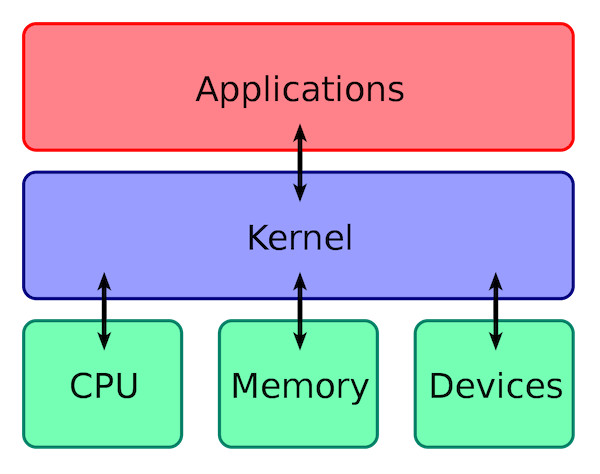

# Computer Operating System

## 什么是操作系统？

1. 操作系统（Operating System，简称 OS）是**管理计算机硬件与软件资源的程序**，是计算机的基石。
2. 操作系统存在屏蔽了硬件层的复杂性。
3. 操作系统的内核（Kernel）是操作系统的核心部分，它负责系统的内存管理，硬件设备的管理，文件系统的管理以及应用程序的管理。

内核与CPU的区别：

1. 操作系统的内核（Kernel）属于操作系统层面，而 CPU 属于硬件。
2. CPU 主要提供运算，处理各种指令的能力。内核（Kernel）主要负责系统管理。

## 操作系统的六大功能?

1. **进程和线程的管理**：进程的创建、撤销、阻塞、唤醒，进程间的通信等。
2. **存储管理**：内存，外存的分配和管理等。
3. **文件管理**：文件的读、写、创建及删除等。
4. **设备管理**：完成设备（输入输出设备和外部存储设备等）的请求或释放，以及设备启动等功能。
5. **网络管理**：操作系统负责管理计算机网络的使用。网络是计算机系统中连接不同计算机的方式，操作系统需要管理计算机网络的配置、连接、通信和安全等，以提供高效可靠的网络服务。
6. **安全管理**：用户的身份认证、访问控制、文件加密等，以防止非法用户对系统资源的访问和操作。

## 用户态和内核态是什么？

- **用户态(User Mode)** : 用户态运行的进程可以直接读取用户程序的数据，拥有较低的权限。当应用程序需要执行某些需要特殊权限的操作，例如读写磁盘、网络通信等，就需要向操作系统发起系统调用请求，进入内核态。

- **内核态(Kernel Mode)**：内核态运行的进程几乎可以访问计算机的任何资源，拥有非常高的权限。当操作系统接收到进程的系统调用请求时，就会从用户态切换到内核态，执行相应的系统调用，并将结果返回给进程，最后再从内核态切换回用户态。内核态相比用户态拥有更高的特权级别，因此能够执行更底层、更敏感的操作。

  

## 为什么不能只有一个内核态？

- 在CPU指令中，有些指令如果可以被所有程序调用，会对系统的正常运行造成灾难性的影响，因此需要限制这些**特权指令**只能在内核态运行。

- 只有内核态会引起资源竞争与冲突以及安全性降低。

> 总结：**同时具有用户态和内核态主要是为了保证计算机系统的安全性、稳定性和性能。**

## 用户态切换到内核态的 3 种方式？

1. **系统调用（Trap）**：用户态进程 **主动** 要求切换到内核态的一种方式，主要是为了使用内核态才能做的事情比如读取磁盘资源。系统调用的机制其核心还是使用了操作系统为用户特别开放的一个中断来实现。
2. **中断（Interrupt）**：当外围设备完成用户请求的操作后，会向 CPU 发出相应的中断信号，这时 CPU 会暂停执行下一条即将要执行的指令转而去执行与中断信号对应的处理程序，如果先前执行的指令是用户态下的程序，那么这个转换的过程自然也就发生了由用户态到内核态的切换。
3. **异常（Exception）**：当 CPU 在执行运行在用户态下的程序时，发生了某些事先不可知的异常，这时会触发由当前运行进程切换到处理此异常的内核相关程序中，也就转到了内核态，比如缺页异常。

## 系统调用的过程？

1. 用户态的程序发起系统调用，因为系统调用中涉及一些特权指令，用户态程序权限不足，因此会中断执行，也就是 `Trap`。
2. 发生中断后，当前 CPU 执行的程序会中断，跳转到中断处理程序。内核程序开始执行，也就是开始处理系统调用。
3. 内核处理完成后，主动触发 Trap，这样会再次发生中断，切换回用户态工作。

## 进程和线程

### 守护进程是什么？

**守护进程（Daemon Process）** 是在操作系统中后台运行的一种特殊类型的进程。它通常不与用户交互，而是在后台执行某些特定的任务、服务或功能。守护进程在操作系统启动时启动，并在整个系统运行期间持续运行，通常以服务的形式存在。

1. **后台运行**：守护进程不需要与终端或用户交互，它在后台默默地执行任务。
2. **独立于终端**：它不受终端关闭、用户注销等操作的影响，仍然继续运行。
3. **周期性任务**：守护进程通常会执行一些周期性的任务，如监控、日志记录、定时操作等。
4. **没有控制终端**：它通常不附加到终端，因此不会受到终端的信号（如Ctrl+C）影响。
5. **以系统服务方式存在**：它可以作为系统服务存在，以在系统启动时自动启动。
6. **作为系统组件**：它可能是操作系统、网络服务、数据库服务器等的一部分，为这些系统提供服务。

与守护进程对应的是**前台进程（Foreground Process）**。前台进程是直接在终端上运行的进程，可以与用户交互。

> 例如sshd是OpenSSH守护进程，用于提供ssh服务，它允许用户通过安全的方式连接到系统，在后台运行，提供加密的远程登录，文件传输等功能

### 操作系统如何实现线程?

线程的实现方式在不同的操作系统中有不同的方式，可分为三种：内核支持线程，用户级线程，组合方式。

**1.内核支持线程**：内核支持线程在内核的支持下运行，在内核空间内完成创建，阻塞，撤销，切换。每一个内核线程设置了一个线程控制块TCB，可通过TCB来感知内核线程的存在，进而加以控制。

**优点：**

1. 在多处理器系统中，内核能够同时调用同一进程的多个线程并行（真正的同时执行）执行。
2. 一个进程中的线程被阻塞了，内核可以调度该进程中的其他线程或者其他进程中的线程占有处理器运行。
3. 线程切换较快，切换开销小。

**缺点：**对于用户的线程的切换，需要从用户态转到内核态中进行，切换的开销较大。

**2.用户级线程**

用户级线程在用户空间中实现，对线程的创建，撤销，同步，通信都无需内核的支持，一个系统中用户级线程可以达到数百个至数千个。

> 注意，用户级线程的调度是一进程为单位的，采用轮转调度算法时对于大小线程数目较少的进程来说是有利的。

**优点：**

1. 线程的切换不需要转换到内存空间，因此节省了模式切换的开销
2. 调度算法是专用的，不同的进程可以有不同的调度算法
3. 用户级线程的实现与OS平台无关，因此用户级线程可以在不持有该线程机制的操作系统平台上运行

**缺点：**

1. 一个线程执行系统调用会阻塞该进程的所用线程
2. 单纯的用户级线程实现方式中，内核每次只分配一个CPU给进程，因此每次只能有一个线程获得CPU执行，其他线程在该线程放弃CPU之前只能等待

**3.组合方式**

组合方式是内核支持线程和用户级线程的组合。根据用户级线程和内核支持线程连接方式的不同可划分出三种模型，多对一模型，一对多模型，多对多模型

1. 多对一模型：用户级线程对内核支持线程进行多路复用，一次只允许一个用户级线程对内核进行访问，当一个线程阻塞时，其他线程也必须阻塞
2. 一对一模型：一个用户级线程映射一个内核支持线程，一个线程阻塞时，允许另一个线程调度运行。每创建一个用户级线程都需要创建一个内核支持线程与之对应，开销较大
3. 多对多模型：相同数量的用户级线程可以映射到相同数量或者更少的内核支持线程，综合了上述两种模型的优点。

### 什么是线程和进程

**进程（Process）** 是指计算机中正在运行的一个程序实例。进程是资源分配的基本单位。

**线程（Thread）** 也被称为轻量级进程，更加轻量。**共享**进程的资源比如内存空间、文件句柄、网络连接等。

> 例如：打开微信就是一个进程，而微信中有一个线程用于拉取最新消息

### 有了进程为什么还需要线程?

- 进程切换是一个开销很大的操作，线程切换的成本较低。
- 线程更**轻量**，一个进程可以创建多个线程。
- 多线程并发处理不同的工作**效率更高**。
- 同一进程内的线程相互通信无须调用内核（共享内存）。

### 进程和线程的关系？

> 摘自[美团技术博客](https://mp.weixin.qq.com/s/a9BUf6N93uOw8JSAxza7cg)

先看看linus的论述，在1996年的一封邮件里，Linus详细阐述了他对进程和线程关系的深刻洞见，他在邮件里写道：

- 把进程和线程区分为不同的实体是背着历史包袱的传统做法，没有必要做这样的区分，甚至这样的思考方式是一个主要错误。
- 进程和线程都是一回事：一个**执行上下文（Context Of Execution）**，简称为COE，其状态包括：
  - CPU状态（寄存器等）
  - MMU状态（页映射）
  - 权限状态（uid、gid等）
  - 各种通信状态（打开的文件、信号处理器等）
- 传统观念认为：进程和线程的主要区别是线程有CPU状态（可能还包括其他最小必要状态），而其他上下文来自进程；然而，这种区分法并不正确，这是一种愚蠢的自我设限。
- **Linux内核认为根本没有所谓的进程和线程的概念，只有COE（Linux称之为任务），不同的COE可以相互共享一些状态**，通过此类共享向上构建起进程和线程的概念。
- 从实现来看，Linux下的线程目前是LWP实现，**线程就是轻量级进程，所有的线程都当作进程来实现，因此线程和进程都是用task_struct来描述的**。这一点通过/proc文件系统也能看出端倪，线程和进程拥有比较平等的地位。对于多线程来说，原本的进程称为主线程，它们在一起组成一个线程组。
- 简言之，内核不要基于进程/线程的概念做设计，而应该围绕COE的思考方式去做设计，然后，通过暴露有限的接口给用户去满足pthreads库的要求。

### 为什么要使用多线程?

- 在单核时代，多线程可以解决**cpu和io的阻塞问题**，提高cpu利用率

- 在多核时代，如果只有一个线程，不能**充分发挥多核的优势**，始终只会利用一个CPU

  > 例如说我们在对数组求和时，如果数组特别大，则哪怕是一个简单的循环累加也可能耗费很长的时间，可以把这个整型数组分成多个小数组，或者表示成二维数组（数组的数组），每个线程负责一个小数组的求和，多个线程并发执行，最后再累加结果。
  >
  > 但是此时，如果分解的小数组太多，则会创建大量的线程，这将大量时间浪费在线程创建和销毁上，可以使用线程池去改进当前的设计。

- 线程更加轻量化，切换调度成本低，多核情况下多个线程可以同时执行，**减少线程上下文切换**，提高cpu利用率

- **异步任务执行**，将后台线程和主线程分离，例如响应式用户界面。

### 线程间的同步的方式有哪些？

1. **互斥锁(Mutex)**：可以保证公共资源不会被多个线程同时访问。比如 Java 中的 `synchronized` 关键词和各种 `Lock` 都是这种机制。
2. **读写锁（Read-Write Lock）**：允许多个线程同时读取共享资源，但只有一个线程可以对共享资源进行写操作。
3. **信号量(Semaphore)**：它允许同一时刻多个线程访问同一资源，但是**需要控制同一时刻访问此资源的最大线程数量**。
4. **屏障（Barrier）**：屏障是一种同步原语，用于等待多个线程到达某个点再一起继续执行。当一个线程到达屏障时，它会停止执行并等待其他线程到达屏障，直到所有线程都到达屏障后，它们才会一起继续执行。比如 Java 中的 `CyclicBarrier` 是这种机制。
5. **事件(Event)** :Wait/Notify：通过通知操作的方式来保持多线程同步，还可以方便的实现多线程优先级的比较操作。

### PCB 是什么？包含哪些信息？

PCB（Process Control Block） 即**进程控制块**，是操作系统中用来**管理和跟踪进程**的数据结构，每个进程都对应着一个独立的 PCB。包含进程的描述信息、调度信息等。

### 进程有哪几种状态?

- **创建状态(new)**：进程正在被创建，尚未到就绪状态。

- **就绪状态(ready)**：进程已处于准备运行状态，即进程获得了除了处理器之外的一切所需资源，一旦得到处理器资源(处理器分配的时间片)即可运行。

- **运行状态(running)**：进程正在处理器上运行(单核 CPU 下任意时刻只有一个进程处于运行状态)。

- **阻塞状态(waiting)**：又称为等待状态，进程正在等待某一事件而暂停运行如等待某资源为可用或等待 IO 操作完成。即使处理器空闲，该进程也不能运行。

- **结束状态(terminated)**：进程正在从系统中消失。可能是进程正常结束或其他原因中断退出运行。

  > 结束状态的作用：
  >
  > 一个进程可以处于已退出但尚未清理的最终（final）状态（在基于UNIX的系统中，这称为僵尸状态[1]）。这个最终状态非常有用，因为它允许其他进程（通常是创建进程的父进程）检查进程的返回代码，并查看刚刚完成的进程是否成功执行（通常，在基于UNIX的系统中，程序成功完成任务时返回零，否则返回非零）。完成后，父进程将进行最后一次调用（例如，wait()），以等待子进程的完成，并告诉操作系统它可以清理这个正在结束的进程的所有相关数据结构。
  >
  > ​																							——操作系统导论

### 进程间通信的方式有哪些？

1. **管道/匿名管道(Pipes)**：用于具有亲缘关系的父子进程间或者兄弟进程之间的通信
2. **有名管道(Named Pipes)** : 可以实现本机任意两个进程通信
3. **信号(Signal)**：信号是一种比较复杂的通信方式，用于通知接收进程某个事件已经发生
4. **消息队列(Message Queuing)**：消息队列克服了信号承载信息量少，管道只能承载无格式字 节流以及缓冲区大小受限等缺点。
5. **信号量(Semaphores)**：信号量是一个计数器，用于多进程对共享数据的访问，信号量的意图在于进程间同步。这种通信方式主要用于解决与同步相关的问题并避免竞争条件。
6. **共享内存(Shared memory)**：使得多个进程可以访问同一块内存空间，不同进程可以及时看到对方进程中对共享内存中数据的更新。这种方式需要依靠某种同步操作，如互斥锁和信号量等。可以说这是最有用的进程间通信方式。
7. **套接字(Sockets)** : 此方法主要用于在客户端和服务器之间通过网络进行通信。套接字是支持 TCP/IP 的网络通信的基本操作单元，可以看做是不同主机之间的进程进行双向通信的端点，简单的说就是通信的两方的一种约定，用套接字中的相关函数来完成通信过程。

### 进程的调度算法有哪些？

- **先到先服务调度算法(FCFS，First Come, First Served)** : 从就绪队列中选择一个最先进入该队列的进程为之分配资源，使它立即执行并一直执行到完成或发生某事件而被阻塞放弃占用 CPU 时再重新调度。
- **短作业优先的调度算法(SJF，Shortest Job First)** : 从就绪队列中选出一个估计运行时间最短的进程为之分配资源，使它立即执行并一直执行到完成或发生某事件而被阻塞放弃占用 CPU 时再重新调度。
- **时间片轮转调度算法（RR，Round-Robin）** : 时间片轮转调度是一种最古老，最简单，最公平且使用最广的算法。每个进程被分配一个时间段，称作它的时间片，即该进程允许运行的时间。
- **多级反馈队列调度算法（MFQ，Multi-level Feedback Queue）**：前面介绍的几种进程调度的算法都有一定的局限性。如**短进程优先的调度算法，仅照顾了短进程而忽略了长进程** 。多级反馈队列调度算法既能使高优先级的作业得到响应又能使短作业（进程）迅速完成。，因而它是目前**被公认的一种较好的进程调度算法**，UNIX 操作系统采取的便是这种调度算法。
- **优先级调度算法（Priority）**：为每个流程分配优先级，首先执行具有最高优先级的进程，依此类推。具有相同优先级的进程以 FCFS 方式执行。可以根据内存要求，时间要求或任何其他资源要求来确定优先级。

### 僵尸进程or孤儿进程?

僵尸进程：子进程已经结束但PCB仍然存在，父进程通过此PCB拿不到子进程信息

孤儿进程：父进程结束了子进程仍在运行

## 死锁

### 产生死锁的四个必要条件?

- **互斥**：资源必须处于非共享模式，即一次只有一个进程可以使用。如果另一进程申请该资源，那么必须等待直到该资源被释放为止。
- **占有并等待**：一个进程至少应该占有一个资源，并等待另一资源，而该资源被其他进程所占有。
- **非抢占**：资源不能被抢占。只能在持有资源的进程完成任务后，该资源才会被释放。
- **循环等待**：有一组等待进程 {P0, P1,..., Pn}， P0 等待的资源被 P1 占有，P1 等待的资源被 P2 占有，......，Pn-1 等待的资源被 Pn 占有，Pn 等待的资源被 P0 占有。

### 解决死锁的方法?

- 破坏占有且等待**：**一次性申请全部所需的资源
- 破坏非抢占：如java.util.concurrent包下的Lock
- 破坏循环等待：**按照相同的顺序请求资源**

### 如何避免死锁?

[银行家算法](https://zh.wikipedia.org/wiki/%E9%93%B6%E8%A1%8C%E5%AE%B6%E7%AE%97%E6%B3%95)

## 内存管理

### 内存管理主要做什么？

- **内存的分配与回收**：对进程所需的内存进行分配和释放，malloc 函数：申请内存，free 函数：释放内存。
- **地址转换**：将程序中的虚拟地址转换成内存中的物理地址。
- **内存扩充**：当系统没有足够的内存时，利用虚拟内存技术或自动覆盖技术，从逻辑上扩充内存。
- **内存映射**：将一个文件直接映射到进程的进程空间中，这样可以通过内存指针用读写内存的办法直接存取文件内容，速度更快。
- **内存优化**：通过调整内存分配策略和回收算法来优化内存使用效率。
- **内存安全**：保证进程之间使用内存互不干扰，避免一些恶意程序通过修改内存来破坏系统的安全性。

### 什么是内存碎片？

内存碎片是由内存的申请和释放产生的，通常分为下面两种：

- **内部内存碎片(Internal Memory Fragmentation，简称为内存碎片)**：已经分配给进程使用但未被使用的内存。举个例子，一个进程只需要 65 字节的内存，但为其分配了 128（2^7） 大小的内存，那 63 字节的内存就成为了内部内存碎片。
- **外部内存碎片(External Memory Fragmentation，简称为外部碎片)**：由于未分配的连续内存区域太小，以至于不能满足任意进程所需要的内存分配请求，这些小片段且不连续的内存空间被称为外部碎片。也就是说，外部内存碎片指的是那些并为分配给进程但又不能使用的内存。后面的分段机制就会导致外部内存碎片。

### 常见的内存管理方式

**连续内存管理**：为一个用户程序分配一个连续的内存空间，内存利用率一般不高。

**非连续内存管理**：允许一个程序使用的内存分布在离散或者说不相邻的内存中，相对更加灵活一些。

## 虚拟内存

### 什么是虚拟内存？有什么用？

虚拟内存(Virtual Memory) 是计算机系统内存管理非常重要的一个技术，本质上来说它只是逻辑存在的，是一个假想出来的内存空间，主要作用是作为进程访问主存（物理内存）的桥梁并简化内存管理。

### 没有虚拟内存会出现什么问题？

- 用户可任意访问物理空间，有安全问题
- 多个应用程序之间的内存可能会冲突，导致应用崩溃
- 程序运行时会向物理空间写入很多没用的内容，浪费空间

### 什么是虚拟地址和物理地址？

物理地址（Physical Address） 是真正的物理内存中地址，更具体点来说是内存地址寄存器中的地址。程序中访问的内存地址不是物理地址，而是 虚拟地址（Virtual Address） 。编程时操作的都是虚拟地址。

操作系统一般通过 CPU 芯片中的一个重要组件 MMU(Memory Management Unit，内存管理单元) 将虚拟地址转换为物理地址，这个过程被称为 地址翻译/地址转换（Address Translation） 。

通过 MMU 将虚拟地址转换为物理地址后，再通过总线传到物理内存设备，进而完成相应的物理内存读写请求。

MMU 将虚拟地址翻译为物理地址的主要机制有两种: 分段机制 和 分页机制 。现代操作系统广泛采用分页机制。

### 什么是虚拟地址空间和物理地址空间？

- 虚拟地址空间是虚拟地址的集合，是虚拟内存的范围。每一个进程都有一个一致且私有的虚拟地址空间。
- 物理地址空间是物理地址的集合，是物理内存的范围。

## 文件系统

### 文件系统主要功能?

**存储管理**：将文件数据存储到物理存储介质中，并且管理空间分配，以确保每个文件都有足够的空间存储，并避免文件之间发生冲突。

**文件管理**：文件的创建、删除、移动、重命名、压缩、加密、共享等等。

**目录管理**：目录的创建、删除、移动、重命名等等。

**文件访问控制**：管理不同用户或进程对文件的访问权限，以确保用户只能访问其被授权访问的文件，以保证文件的安全性和保密性。

### 硬链接和软链接有什么区别？

- 文件类型：
  - 硬链接是一个指向inode的指针，它创建了一个与原始文件相同的文件目录项，这意味着硬链接与原始文件是完全相同的文件，它们共享相同的inode和文件内容。
  - 软链接是一个特殊类型的文件，它包含了指向原始文件或目录的路径，它创建了一个新的文件目录项，但实际上并不包含原始文件的内容。
- 跨文件系统：
  - 硬链接只能在同一文件系统中的文件之间创建链接，因为硬链接是通过inode来实现的。
  - 软链接可以跨越不同文件系统，因为它们是通过路径来引用文件的。
- 文件大小：
  - 硬链接与原始文件共享相同的文件内容和inode，它们在磁盘上占用相同的空间。
  - 软链接只是一个指向原始文件的路径，它自身的大小非常小，只占用一小块磁盘空间。
- 修改和删除：
  - 当原始文件被修改时，所有硬链接和原始文件都会反映出这些修改，因为它们指向相同的inode。
  - 当原始文件被删除时，硬链接仍然保持有效，因为它们指向相同的inode。只有当所有硬链接都被删除时，才会释放磁盘空间。
  - 当原始文件被删除时，软链接仍然存在，但它指向的是一个不存在的文件路径，称为死链接。
- 目录链接：
  - 硬链接不能创建目录的链接，只能创建文件的链接。
  - 软链接可以创建目录的链接，可以指向其他目录，这样可以方便地创建文件或目录的快捷方式。

> 在给文件创建一个硬链接后，删除原来的文件，我们仍可以通过硬链接查看原来的文件内容，只有当所有硬链接都被删除时，才会释放磁盘空间。

### 硬链接为什么不能跨文件系统？

我们之前提到过，硬链接是通过 inode 节点号建立连接的，而硬链接和源文件共享相同的 inode 节点号。

然而，每个文件系统都有自己的独立 inode 表，且每个 inode 表只维护该文件系统内的 inode。如果在不同的文件系统之间创建硬链接，可能会导致 inode 节点号冲突的问题，即目标文件的 inode 节点号已经在该文件系统中被使用。

### 提高文件系统性能的方式有哪些？

- **优化硬件**：使用高速硬件设备（如 SSD、NVMe）替代传统的机械硬盘，使用 RAID（Redundant Array of Inexpensive Disks）等技术提高磁盘性能。
- **选择合适的文件系统选型**：不同的文件系统具有不同的特性，对于不同的应用场景选择合适的文件系统可以提高系统性能。
- **运用缓存**：访问磁盘的效率比较低，可以运用缓存来减少磁盘的访问次数。不过，需要注意缓存命中率，缓存命中率过低的话，效果太差。
- **避免磁盘过度使用**：注意磁盘的使用率，避免将磁盘用满，尽量留一些剩余空间，以免对文件系统的性能产生负面影响。
- **对磁盘进行合理的分区**：合理的磁盘分区方案，能够使文件系统在不同的区域存储文件，从而减少文件碎片，提高文件读写性能。

### 常见的磁盘调度算法有哪些？

磁盘调度算法是操作系统中对磁盘访问请求进行排序和调度的算法，其目的是提高磁盘的访问效率。

一次磁盘读写操作的时间由磁盘寻道/寻找时间、延迟时间和传输时间决定。磁盘调度算法可以通过改变到达磁盘请求的处理顺序，减少磁盘寻道时间和延迟时间。

常见的磁盘调度算法有下面这 6 种（其他还有很多磁盘调度算法都是基于这些算法改进得来的）：

1. **先来先服务算法（First-Come First-Served，FCFS）**：按照请求到达磁盘调度器的顺序进行处理，先到达的请求的先被服务。FCFS 算法实现起来比较简单，不存在算法开销。不过，由于没有考虑磁头移动的路径和方向，平均寻道时间较长。同时，该算法**容易出现饥饿问题**，即一些后到的磁盘请求可能需要等待很长时间才能得到服务。
2. **最短寻道时间优先算法（Shortest Seek Time First，SSTF）**：也被称为最佳服务优先（Shortest Service Time First，SSTF）算法，优先选择距离当前磁头位置最近的请求进行服务。SSTF 算法能够最小化磁头的寻道时间，但容易出现饥饿问题，即磁头附近的请求不断被服务，远离磁头的请求长时间得不到响应。
3. **扫描算法（SCAN）**：也被称为电梯（Elevator）算法，基本思想和电梯非常类似。磁头沿着一个方向扫描磁盘，如果经过的磁道有请求就处理，直到到达磁盘的边界，然后改变移动方向，依此往复。SCAN 算法能够保证所有的请求得到服务，解决了饥饿问题。但是，如果磁头从一个方向刚扫描完，请求才到的话。这个请求就需要等到磁头从相反方向过来之后才能得到处理。
4. **循环扫描算法（Circular Scan，C-SCAN）**：SCAN 算法的变体，只在磁盘的一侧进行扫描，并且只按照一个方向扫描，直到到达磁盘边界，然后回到磁盘起点，重新开始循环。
5. **边扫描边观察算法（LOOK）**：LOOK 算法对 SCAN 算法进行了改进，如果磁头移动方向上已经没有别的请求，就可以立即改变磁头移动方向，依此往复。也就是边扫描边观察指定方向上还有无请求，因此叫 LOOK。
6. **均衡循环扫描算法（C-LOOK）**：C-LOOK 算法对 C-SCAN 算法进行了改进，如果磁头移动的方向上已经没有磁道访问请求了，就可以立即让磁头返回，并且磁头只需要返回到有磁道访问请求的位置即可。
