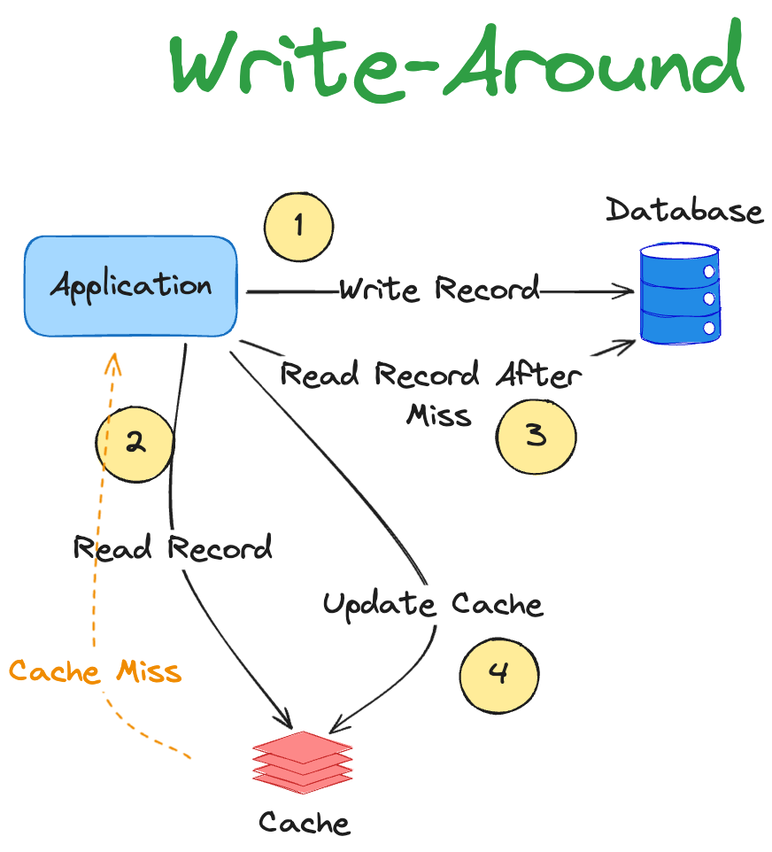
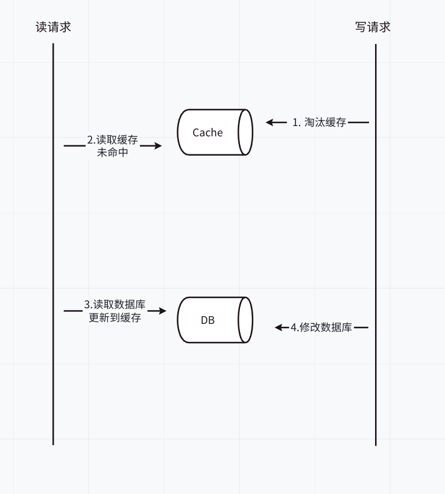
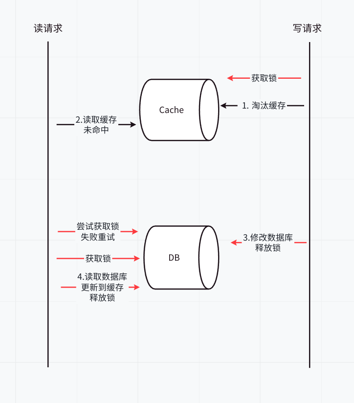
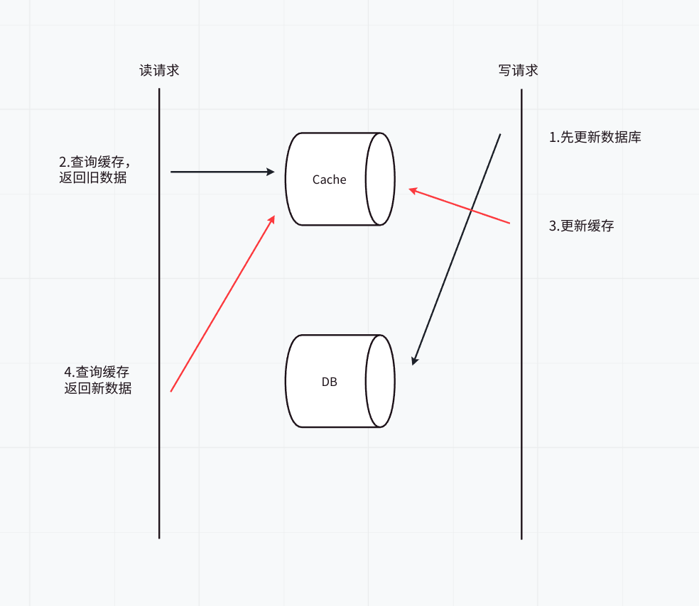
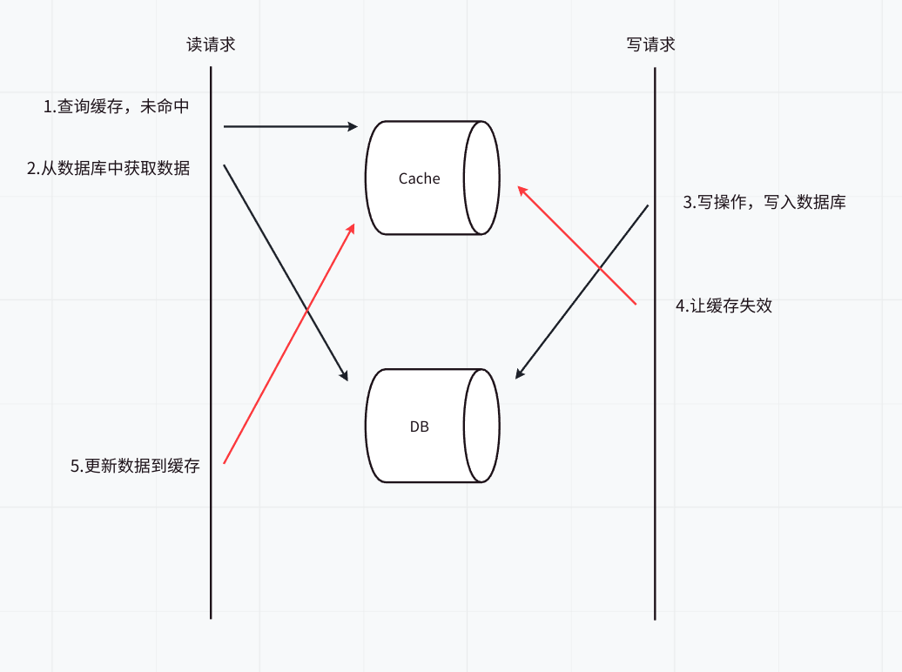
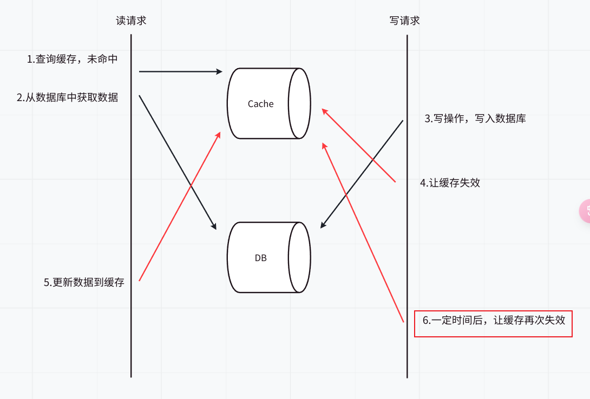
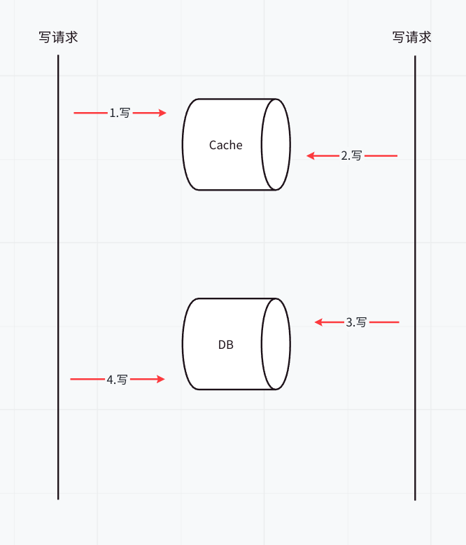
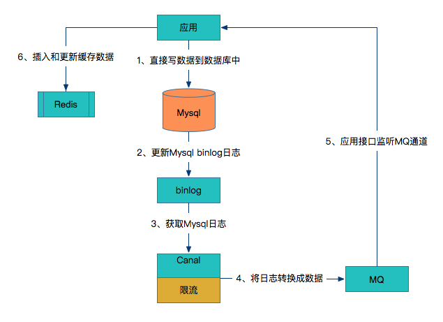

# 缓存一致性的三个障碍

1. **当对主数据库的更改未反映在缓存中时**
2. **更新缓存结果时出现延迟**
3. **当缓存节点之间不一致时**

> 如何设计缓存更新模式？首先，提出我阅读相关文章时遇到的疑惑。
>
> 当我使用搜索引擎（百度 or Google）去搜索缓存与`数据库的数据一致性如何保证`时,我会看到三种结果：
>
> - 仅讲解先操作数据库 or 先操作缓存（最多）
> - 讲解四种缓存更新策略模式
> - 将上述两者结合起来（较少）
>
> 在分别阅读完一些前两者的文章后，我就一直在思考
>
> - 四种缓存更新策略模式与操作顺序的**关系**是什么？（因为看到了类似“四种缓存更新策略广泛用于分布式系统和高性能应用中”，但是又有很多实践操作顺序的文章，比如先写数据库，再更新缓存的“延时双删”策略）
> - 为什么很多文章推荐我们去阅读另一种呢？（eg：我看见了一些写操作顺序的文章推荐我去阅读缓存更新策略模式相关文章）
>
> 带着上面的两个问题，我去搜索，去尝试写出下面的博客，并在介绍两者后，总结出我对它们的理解。

# 缓存更新设计模式

## 1. Cache-Aside

应用程序从缓存中读取数据

- 如果命中，直接返回
- 没有命中，**改为从数据库读取**，并写回缓存

> ps：我在一些博客上会在这里加上写入的设计
>
> - 有的博客说先把数据存到数据库，成功后，再让缓存失效
> - 有的博客说仅仅将数据存到数据库（即后面提到的Write-Around）
> - 还看见了变体，先淘汰缓存，再写数据库…
>
> 在看完这些博客之后，我的理解是：Cache-Aside更多的定义读请求的更新方案，它可以结合不同的写入策略，来保证数据一致性。依据是，在[亚马逊的文档](https://docs.aws.amazon.com/whitepapers/latest/database-caching-strategies-using-redis/caching-patterns.html)和[微软的文档](https://learn.microsoft.com/en-us/azure/architecture/patterns/cache-aside)中，均只提到了它读请求的更新方案，并未提及必须要有固定的写入策略。

### 优点

1. 使用最少的内存（至少在理论上），因为缓存的项目仅在需要时才获取（延迟加载）
2. Memcached 和 Redis 被广泛使用。使用Cache-Aside的系统可以适应缓存故障。如果缓存集群宕机，系统仍然可以通过直接访问数据库来操作。 （尽管如此，如果缓存在峰值负载期间出现故障，也没有多大帮助。响应时间可能会变得很糟糕，在最坏的情况下，数据库可能会停止工作。）

### 缺点

1. 缓存未命中时，延迟较高，因为需要从数据库获取数据。如果缓存未命中太多，会影响系统性能（缓存穿透？）。
2. 当使用cache-aside时，写入策略之一是直接将数据写入数据库（Write-Around）。发生这种情况时，缓存可能会与数据库变得不一致。为了解决这个问题，开发人员通常使用生存时间 (TTL) 并继续提供过时的数据，直到 TTL 过期。**如果必须保证数据新鲜度，开发人员要么使==缓存失效==，要么使用适当的==写入策略==**，我们稍后将对此进行探讨（新鲜度也会稍后探讨）。

### 何时使用

1. 最适合读取密集型工作时使用。

2. 资源需求是不可预测的。这种模式使应用程序能够按需加载数据。它不会预先假设应用程序需要哪些数据。
3. 缓存不提供Read-Through和Write-Through功能。

## 2. Read-Through

应用程序查询数据时

- 当缓存未命中时，**由缓存去查询数据库**，并且将结果写入到缓存中，最后返回结果给应用程序。（也是延迟加载）
- 如果命中，直接返回

### 优点

适合读取密集型工作

### 缺点

1. 缺点是当第一次请求数据时，总是会导致缓存未命中，并带来将数据加载到缓存的额外开销。开发人员通过手动发出查询来“加热”或“预热”缓存来处理此问题。
2. 就像cache-aside一样，缓存和数据库之间的数据也可能不一致，解决方案在于写入策略，我们接下来会看到。

### 何时使用

1. 当多次请求相同数据时，最适合读取密集型工作。例如，一则新闻报道。
2. 缓存产品应该能够通过配置从数据库执行读取。

## 3. Write-Through

在Write-Through模式下，当发生写入时，它会在同一事务中传播到缓存和数据库。

应用程序更新缓存，然后缓存同步更新主数据库，而不是更新主数据库并删除缓存。换句话说，**缓存不依赖主数据库来启动任何更新，而是负责维护其自身的一致性并将其所做的任何更改传递回主数据库**。当写入完成时，缓存和数据库都具有相同的值，并且缓存始终保持一致。

### 优点

1. 就其本身而言，直写式缓存似乎没有多大作用，事实上，它们引入了额外的写入延迟，因为数据首先写入缓存，然后写入主数据库（两个写入操作）。但是当与Read-Through配对使用时，我们可以获取到Read-Through的所有好处
2. 确保缓存和底层数据存储之间的一致性

### 缺点

1. 使操作更加负责，需要考虑失败情况。
2. 写入更慢，因为需要更新两个位置。

### 何时使用

直写式缓存非常适合需要**强数据一致性**且无法提供过时数据的应用程序。它通常用于数据写入后必须立即准确且最新的环境中。

## 4. Write-Around

此策略填充底层存储，但不填充缓存本身。该技术可以与 Cache-Aside 结合使用。

### 优点

减少缓存污染，因为缓存不会在每次写入时填充。

### 缺点

1. **如果某些记录经常被读取，那么性能会受到影响**，因此主动加载到缓存中以防止在第一次命中时访问数据库会受益。
2. 因为写操作绕过了缓存，只更新数据库，这会导致缓存中的**数据在写操作后变得不一致**。具体来说，在数据被写入数据库之后，缓存中的数据仍然是旧的，直到**缓存失效**或**被删除**为止。这可能会导致读取到过期数据，影响数据的一致性和准确性。

### 何时使用

当写入量很大但读取量明显较低时，通常会使用此方法。但是这没有充分发挥缓存的优势呀（请各位思考一下为什么使用缓存）。

## 5. Write-Behind

这里，应用程序将数据写入缓存，缓存存储数据并立即向应用程序确认。然后，缓存将数据写回数据库。

它通过先仅更新缓存然后异步更新主数据库来避免此问题。当然，主数据库也需要更新，而且越早越好，但这样的话用户就不必付出两次写入的“成本”。对主数据库的第二次写入是在幕后**异步**发生的（因此得名“Write-Behind”），此时不太可能影响性能。

### 优点

1. 可以提高写入性能，**适合写密集型工作**。在与Read-Through配合使用时，非常适合混合工作负载（将两者优势结合）。
2. 它对数据库故障具有弹性，并且可以容忍一些数据库停机。如果支持批处理或合并，则可以减少对数据库的总体写入，从而减少负载并降低成本（如果数据库提供商按请求数收费，例如请求数）

### 缺点

1. 如果缓存出现故障，数据可能会永久丢失。
2. 可能会出现不一致，因为数据库和缓存将变得不同步，直到数据库收到新的更改为止。

### 何时使用

当写性能很关键，并且数据库中的数据暂时与缓存稍微不同步是可以接受的时候，可以使用Write-behind缓存。适合写入量大但一致性要求不太严格的应用。可以使用此功能的一个示例是 CDN（内容交付网络），用于快速更新缓存的内容，然后将这些内容同步到记录系统。

大多数关系数据库存储引擎（即 InnoDB）在其内部默认启用回写式缓存。查询首先写入内存，最终刷新到磁盘。

# Cache Invalidation 缓存失效

现在我们了解了更新缓存的不同方法，我们还需要了解如何保持它与数据库系统同步。

当谈到缓存失效时，两种主要方法是**基于时间**和**基于事件**。基于时间的失效方法可以通过大多数缓存产品中可用的生存时间 (TTL) 设置进行控制。基于事件的方法需要应用程序或其他东西将新数据发送到缓存。

关于数据缓存的问题是，它几乎总是与底层数据存储（记录系统）**至少稍微不同步**。换句话说——它变得陈旧了。为了保持缓存与记录系统尽可能同步，我们需要实现某种缓存失效策略。换句话说，我们需要确保缓存内数据的“**新鲜度**”。

缓存失效会导致从数据库查询数据并将其放入缓存中。因此，了解缓存失效之间的关系及其与我们上面讨论的缓存更新策略的关系非常重要。
**==缓存更新策略与如何从缓存加载和检索数据有关。另一方面，缓存失效更多地与记录系统和缓存之间的数据一致性和新鲜度有关。==**

因此，这两个概念之间存在一些重叠，并且如果使用某些缓存策略，失效将比其他策略更简单。例如，通过Write-Through方法，缓存会在每次写入时更新，因此您无需另外实现缓存失效。

## Event-Driven 事件驱动

使用事件驱动方法，每次数据库数据发生更改时，应用程序都会通知缓存。无论是同步还是异步。

## Time Based 基于时间

使用基于时间的方法，所有缓存记录都将具有与其关联的 TTL（生存时间）。记录的 TTL 过期后，该缓存记录将被删除。这通常由缓存产品控制。

# 可以与Cache-Aside配合使用的另外两种方案

> 看到这里，我或许明白了，缓存更新策略是配合使用的，不同的顺序可以获取到不同的性能，对读要求高和对写要求高需要使用的方案也不一样。
>
> 选择什么方案通常取决于以下两个指标
>
> 1. 对数据一致性的要求，强一致性还是最终一致性？
> 2. 对系统性能的要求，是读多场景还是写多场景？
>
> 如果你有不一样的见解，请务必指教！

## 方案一：先淘汰缓存，再写数据库

因为先淘汰缓存，因此数据的最终一致性可以得到保证（因为如果先淘汰缓存，即使写数据库发生异常，也就是下次读取缓存时，多读取一次数据库）。

但是这种方案会导致数据不一致的情况，理由见图 1。由图可知，最后缓存中的数据还是旧的数据，出现数据不一致的情况。

**那么，如何解决缓存并行写，实现串行写呢？引入分布式锁**

- 在写请求时，先淘汰缓存之前，先获取该分布式锁。
- 在读请求时，发现缓存不存在时，先获取分布式锁。

## 方案二：先写数据库，再更新缓存

**先来讲讲可能遇到的读写竞争问题**

一个是查询操作，一个是更新操作的并发，首先，先更新了数据库中的数据，此时，缓存依然有效，所以，并发的查询操作拿的是没有更新的数据，但是，更新操作马上让缓存的失效了，后续的查询操作再把数据从数据库中拉出来。

那么，是不是Cache Aside这个就不会有并发问题了？不是的，比如，一个是读操作，但是没有命中缓存，然后就到数据库中取数据，此时来了一个写操作，写完数据库后，让缓存失效，然后，之前的那个读操作再把老的数据放进去，所以，会造成脏数据。

但，这个case理论上会出现，不过，**实际上出现的概率可能非常低**，因为这个条件需要发生在读缓存时缓存失效，而且并发着有一个写操作。而实际上数据库的写操作会比读操作慢得多，而且还要锁表，而读操作必需在写操作前进入数据库操作，而又要晚于写操作更新缓存，所有的这些条件都具备的概率基本并不大。

那么，如何解决上述问题呢？可以使用**双重删除策略**

**双重删除策略**：更新数据库后，删除缓存；为了防止并发问题，可以在短暂的延迟后再执行一次缓存删除。这种方法可以减少缓存和数据库不一致的窗口期 。如下图

**再来讲讲中途失败问题**

如果在更新数据库成功后但在清除缓存之前发生故障（如进程崩溃或网络中断），缓存中的旧数据将不会被更新，这会导致读请求拿到错误的数据。

可以通过两种方式来解决该问题，先尝试更新缓存，如果失败，再进行下面任一的操作。

1. 基于定时任务实现
   - 如果失败，插入一条记录到任务表，该记录会存储需要更新的缓存<Key,Value>
   - 【异步】定时任务定时扫描任务表，更新到缓存，之后删除该记录。
2. 基于消息队列来实现
   - 如果失败，发送带有缓存<Key,Value>的事务消息。此时，需要有支持事务消息特性的消息队列，或者我们自己封装消息队列，支持事务消息。
   - 【异步】最后，消费者消费该消息，更新到缓存中。

上述解决方案仍可能存在问题，例如发生下列情况，此时，数据被覆盖了，可以通过**分布式锁**或者**CAS**解决该问题。

# 拓展：基于数据库的binlog日志

> 这也是近些年多出的一种缓存更新策略

- 应用直接写数据到数据库中（这不就是Write-Through嘛）。
- 数据库更新binlog日志。
- 利用Canal中间件读取binlog日志。
- Canal借助于限流组件按频率将数据发到MQ中。
- 应用监控MQ通道，将MQ的数据更新到Redis缓存中。

可以看到这种方案对研发人员来说比较轻量，不用关心缓存层面，而且这个方案虽然比较重，但是却容易形成统一的解决方案。

# 引用

<https://svip.iocoder.cn/Cache/Interview/>

<https://redis.io/blog/three-ways-to-maintain-cache-consistency/>

<https://dev.to/lazypro/consistency-between-cache-and-database-part-1-2e97>

<https://coolshell.cn/articles/17416.html>

<https://codeahoy.com/2017/08/11/caching-strategies-and-how-to-choose-the-right-one/>

<https://medium.com/@yt-cloudwaydigital/mastering-caching-in-distributed-applications-e7449f4db399>

<https://blog.csdn.net/v123411739/article/details/114803998>

> 一切都是性能与一致性的权衡，没有最好的方案，只有最适合的方案。

> ps：这篇文章写完已经是深夜了，写完我自个都感觉或许有些不对的地方，如果读者发现什么问题，或者有什么不同的体会，请务必告诉我！毕竟，我不能闭门造车2333
