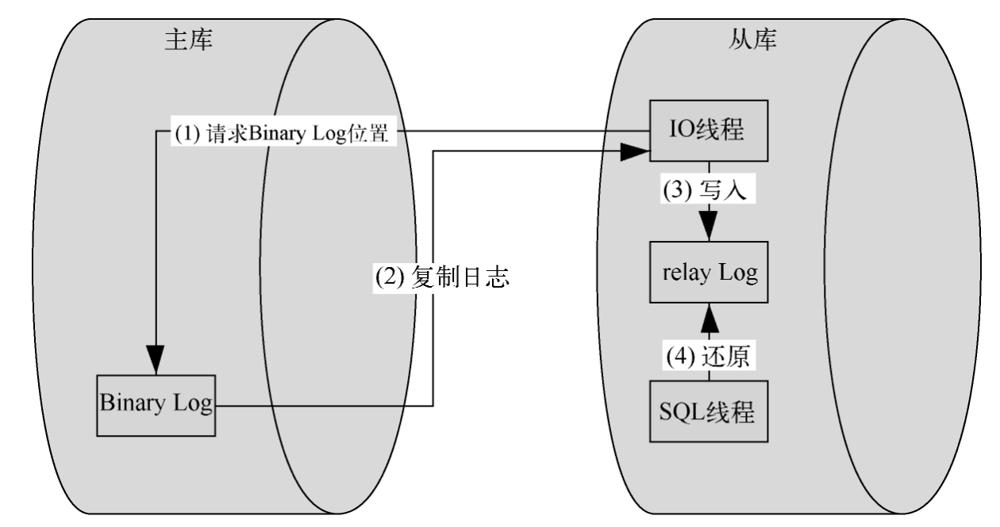

# 面试总结及整理

> 面试记录，格式如下

公司：公司名称

时间：面试时间

结果：面试结果

问：面试官问的问题

答：问题的正确答案

评价：我对本次面试的评价

## 第1次面试

公司：蓝色脉动

时间：2024/7/10

结果：寄

问：

1. ```java
   List<String> a, b;
   // 如果只执行了这一行，堆或者栈中是否分配内存？
   
   a = new ArrayList<>();
   a.add("hello world");
   a.add("hello");
   
   // a.size() 等于几?
   
   b = a;
   
   // 虚拟机是否为b开辟了堆空间?
   
   a.remove("hello");
   
   // b.size() 等于几?
   ```

2. 读取文本文件时，是使用字符流还是使用字节流？为什么？

答：

1. 栈，因为有局部变量表在栈中，2，否，1

2. 字节流与字符流的区别

   - **字节流**（Byte Stream）：处理的是原始的字节数据（8位），例如 `InputStream` 和 `OutputStream` 及其子类。适用于处理二进制数据，如图像、音频、视频等。
   - **字符流**（Character Stream）：处理的是字符数据（16位），例如 `Reader` 和 `Writer` 及其子类。适用于处理文本数据，能够按照字符编码处理字符。

   使用字符流的原因

   1. **文本文件的本质**：
      - 文本文件是由字符组成的，字符流能够很好地处理和理解这些字符数据，包括字符编码问题（如UTF-8、ISO-8859-1等）。
   2. **字符编码的处理**：
      - 字符流在读取文本文件时，能够根据指定的字符编码将字节转换为字符，这样能够正确地解码文本内容。
      - 字节流不具备字符编码的处理能力，需要手动处理字符编码转换，容易出错。
   3. **方便的API**：
      - Java 的字符流类（如 `FileReader`、`BufferedReader` 等）提供了方便的API来读取文本行、字符等，更适合文本处理的需求。

评价：面试感觉很差，直白的说，我基础确实存在问题当时，但是面试官给我的印象很差。


## 第2次面试

公司：深言科技

时间：2024.7.12

结果：感觉寄了，面试官人很好，我回答的内容有点僵硬

问：

1. 个人介绍
2. 学习一门新语言的时间
3. 看你简历上写了rpc框架，说说你是怎么设计的？
4. rpc的使用场景，为什么要用rpc？各服务之间的连接是怎么建立的？消息是怎么进行传输的？
5. 为什么要用服务注册和服务发现？服务注册与服务发现的原理？为什么不能采用直连？
6. nacos是怎么发现节点异常的？
7. 你使用过nacos吗？（**其实感觉问这个问题就说明我回答的不是很好了**）
8. 看你写了NGINX动态缓存，说说NGINX动态缓存相关的关键配置？说说你是怎么实现的？
9. 明明使用的是redis缓存，为什么叫NGINX动态缓存？
10. redis中的基本数据结构用过几种？
11. redis中如何向list中添加元素？redis中list中存储的对象类型是什么？只能是string吗？
12. redis和mysql的区别
13. 看你写了MySQL和redis使用canal进行数据同步？说说原理，怎么实现的？
14. rpc框架很复杂，内容很多，为什么只写了这一点？

答：

1. 略

2. 略

3. 嗯，我主要是从rpc的执行流程来设计的，我们知道，rpc调用端调用一般分为以下几个流程

   1. 创建代理对象
   2. 构建消息请求
   3. 对消息进行编码解码，这一步也是解决粘包问题的关键步骤
   4. 从服务发现与注册中心获取到要调用的远程服务的ip和端口，使用netty发送远程调用，并构建一个channalFulture用于接收结果。这一步还可以添加负载均衡策略。

   在服务端，则分为以下流程

   1. 接收到消息后，进行解码，并进行验证，判断是否是需要的消息
   2. 通过反射调用方法
   3. 对结果进行构建，并编码发送回调用端。

   为了支持多种序列化方式，我使用工厂方法创建不同的消息对象，在用户选择序列化方式后，使用条件装配将需要的bean注入容器，并使用策略模式进行序列化，由于序列化实现的类比较多，如果全由用户直接访问该类，不利于拓展，因此使用外观模式作为用户访问这些类的门户。

4. rpc多在微服务架构中使用，使用rpc的原因有很多，比较老生常谈的就是

   1. 简化细节：它屏蔽了低层的网络通信细节，使得开发者可以像调用本地服务一样调用远程服务，比如在我正在开发的小说app中，我在书籍服务中会调用评论服务的方法，如果使用传统的http发送的话，那么还需要进行手动构建发送请求，但是使用grpc的话，只需要定义一份proto文件并编译，就可以很轻松的完成调用。也就是说，rpc对效率的提升也是蛮大的。
   2. 跨语言支持：如果使用传统http的话虽然也可以，但是会有更大的开销和更低的性能。而使用rpc的话，不仅可以跨语言，还可以在性能上有一定的提升。

5. 最大的一个原因是方便进行管理吧，比如说

   1. 在并发量较大时，可以对同一实例创建多个服务，进行负载均衡
   2. 可以在某个服务宕机时自动剔除该服务，确保客户端总是连接到可用的服务。
   3. 一些服务注册中心也有配置中心的功能，比如nacos，它有一个很好用的特点就是可以实时刷新配置而不用重启服务。

   原理：启动时注册，心跳机制用于检查健康状态，在服务停止时向注册中心发送注销请求。

   为什么不采用直连：采用直连的坏处：

   1. 只能固定连接一个服务，如果该服务宕机，那么客户端也不能使用。也无法实现负载均衡，难以拓展和维护。

6. 发送心跳消息，进行心跳检测。

7. 用过

8. 

9. 工作主要在代理层的NGINX上去进行的，NGINX除了负载均衡之外，可以利用lua脚本调用本地缓存或者缓存集群，减少服务调用步骤，以提高响应速度。

10. string存储token，zset设计排行榜

11. lpush，rpush，序列化后的内容，是

12. redis是**kv**数据库，工作在**缓存**上，因此读写速度非常快，适合需要高性能低延迟的场景。虽然也支持持久化，但是核心优势在内存存储以及响应速度。然后的话，数据结构也比较丰富。比方说我的业务中就用它来存储排行榜这种短时间会发生较大变化的数据。

    mysql是关系型数据库，需要我们明确的定义字段、索引信息，适用于结构化数据存储，存储在磁盘上，因此适合大量存储数据的场景。支持ACID特性，支持事务。比方说我们会把用户信息存储在数据库而不是redis。

13. 这里我先讲一下**主从复制原理**

    

    1. 从库（也叫做slave或replica）上的I/O线程会连接到主库（也叫做master），并请求从一个特定的二进制日志（BinLog）文件和一个特定的位置开始读取日志数据。这些信息通常存储在从库的master.info文件中，用于标记上次成功复制的位置。
    2. 主库会根据从库I/O线程的请求，从指定的BinLog文件和位置开始，将二进制日志事件发送给从库。
    3. 从库的I/O线程接收到主库发送的二进制日志事件后，会将这些事件写入从库的relay log文件中。同时，从库会更新其master.info文件，记录下最新的日志文件名和位置，以便在发生故障或重启时可以从正确的位置继续复制。

    4. 从库的SQL线程会持续地读取relay log中的事件，并将这些事件解析为对应的SQL语句。这些SQL语句会在从库上执行，以便将主库上的数据更改同步到从库上。这就是所谓的"重播"过程。


    再讲一下canal的原理：
    
    - canal 模拟 MySQL slave 的交互协议，伪装自己为 MySQL slave ，向 MySQL master 发送dump 协议
    - MySQL master 收到 dump 请求，开始推送 binary log 给 slave (即 canal )
    - canal 解析 binary log 对象(原始为 byte 流)

14. 后续还会继续改善。

评价：面试感觉很棒，回答僵硬


## 第3次面试

公司：天源迪科

时间：7.29

结果：无后续

问：全是问业务问题

答：无

评价：还可以，没有深问


## 第4次面试

公司：Moka

时间：8.1

结果：无后续

问：

1. ArrayList与LinkedList区别
2. ArrayList扩容机制
3. 线程安全的集合
4. 创建线程的方法，线程池的核心参数
5. ConcurrentHashMap的底层实现
6. ThreadLocal，Thread中的ThreadLocalMap
7. 是否有JVM调优经验，如何处理OOM
8. JVM运行时数据区域有哪些
9. 程序计数器的作用，保存的指令具体是什么？
10. 字符串常量池在哪，String s=“abc”和String s=new String(“abc”);创建了几个对象。
11. 垃圾回收过程
12. 你了解的垃圾回收器及其也优点
13. MVCC实现
14. MySQL如何调优
15. @Autowire和@Resource的区别
16. Spring Bean的创建流程
17. 业务问题
18. 手撕（没撕完，讲了大概流程）
19. 反问

答：问题的正确答案

评价：面试官说表现还行，但是应该简洁一点，感觉寄


## 第5次面试

公司：字节跳动

时间：8.2

结果：感觉不太行

问：

1. 半个小时的业务拷打
2. MySQL的事务特性及其原理
3. Redis原子性如何保证
4. 手撕岛屿个数

答：

评价：面试官挺好，聊得挺开心。


## 第6次面试

公司：游卡

时间：8.7

结果：过了

问：

1. 半个小时的业务拷打
2. 手撕翻转链表
3. TCP和UDP区别
4. TCP如何保证可靠性？流量控制，拥塞控制如何实现？
5. HTTP的报文结构。
6. GET和POST的区别？
7. 介绍HTTPS
8. 对称加密和非对称加密？如果有人劫持CA证书并改变了证书中的Host怎么办？3个随机数有几个可能会泄露？
9. 反问：公司的氛围，您是否有成长？

答：

评价：面试官挺好，聊得挺开心。但是建议我从底层实现RPC框架

## 第7次面试

公司：游卡

时间：8.8

结果：过了

问：

1. 20分钟的业务拷打
2. 在开发过程中体会最深的，学到了什么（不能太笼统）
3. 玩过什么游戏？
4. 介绍LRU，简单实现一下（有引导）
5. 反问：如何Debug，如何学习一个新技术，如何看待代码Review，如何看待代码重构

答：

评价：面试官挺好，聊得挺开心。
