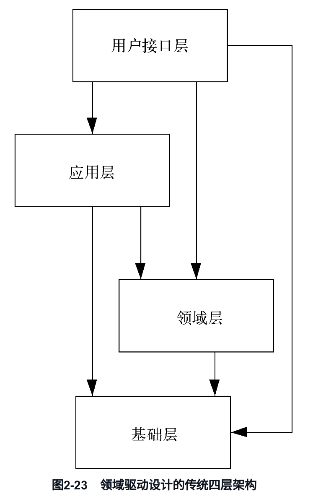
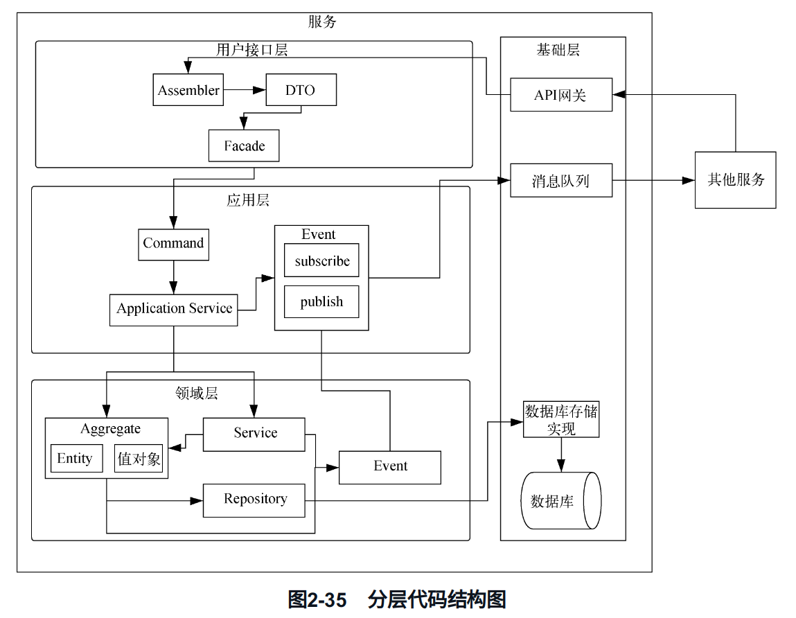

# Project Experience

## 遇到的困难及解决方案

**困难一**

在做登录的时候，原来是单token登录，但是遇到了一个问题，就是用户需要频繁的登录，几乎每隔两天就要登录一次，造成用户体验不佳。

解决：使用双token策略，详见[双token的使用](# 2. 使用双Token保存登录状态)

**困难二**

在项目的初始阶段，会经常因为jar包冲突导致报错

解决：采用已经有的经典项目的依赖，从官网查找推荐版本

**困难三**

在刚开始的时候设计日志告警系统的时候，采用同步的方式发送邮件，导致在测试时响应时间非常大。

解决：加入rabbitmq消息队列，并做补偿机制，对发送失败的邮件进行重试，重试次数过多则通知开发人员

## Nginx动态缓存 — OpenResty

OpenResty 是一个基于 Nginx 的高性能 Web 平台，它集成了很多强大的第三方模块和库，特别是 LuaJIT，它**内置lua支持**！

软件负载均衡位于系统的入口，流入分布式系统的请求都会经过这里，换句话说，相对整个系统而言，软件负载均衡是离客户端更近的地方，所以可以将一些不经常变化的数据放到这里作为缓存，降低用户请求访问应用服务器的频率。**例如一些用户的基本信息，修改频率就不是很高，并且使用比较频繁，这些信息就可以放到缓存服务器 `Redis` 中，当用户请求这部分信息时通过软件负载均衡器直接返回给用户，这样就省去了调用应用服务器的环节，从而能够更快地响应用户。**

如图所示，从**接入层**来的用户请求，通过 **`Nginx` 代理层**，按照如下几个步骤对数据进行访问。

1. 用户请求首先通过 `F5`访问 `Nginx`，如果请求需要获取的数据在 `Nginx` 本地缓存中有，就直接返回给用户。
2. 如果没有命中 `Nginx` 缓存，则可以通过 `Nginx` 直接调用缓存服务器获取数据并返回。
3. 如果缓存服务器中也不存在用户需要的数据，则需要回源到上游应用服务器并返回数据。


使用上图第 (3) 步的方案，无非可以减少调用步骤，因为应用服务有可能存在其他的调用、数据转换、网络传输成本，同时还包含一些业务逻辑和访问数据库操作，影响响应时间。从代理层调用的缓存数据有如下特点：

1. 这类数据变化不是很频繁，例如用户信息；
2. 业务逻辑简单，例如判断用户是否有资格参加秒杀活动、判断商品是否在秒杀活动范围内；
3. 此类缓存数据需要专门的进程对其进行刷新，如果无法命中数据还是需要请求应用服务器。

我在闪送项目中主要用OpenResty做两件事情：

1. 做IP白名单限制访问（结合GeoIP库，OpenResty集成ngx\_http\_geo\_module第三方模块，根据地域做IP限制，并检查ip是否在redis中存放的黑名单中）
2. 对一些需要登录的接口判断用户是否登录（检查token）

### 1. IP白名单限制访问

**步骤详解**：

1. **集成GeoIP库和ngx\_http\_geo\_module模块**：
   * OpenResty可以通过集成GeoIP库来根据IP地址确定地理位置。
   * `ngx_http_geo_module`是一个第三方模块，可以用来根据地理位置设置不同的访问策略。
2. **设置IP白名单和黑名单**：
   * 白名单和黑名单可以存储在Redis中，便于动态更新和管理。
   * 通过OpenResty的Lua脚本来读取Redis中的IP信息，并进行判断。
3. **实现流程**：
   * 首先通过GeoIP库获取访问IP的地理位置信息。
   * 检查IP是否在白名单中，如果在则允许访问。
   * 检查IP是否在黑名单中，如果在则拒绝访问。
   * 如果IP既不在白名单也不在黑名单中，则根据默认策略进行处理。

### 2. 对需要登录的接口判断用户是否登录

**步骤详解**：

1. **获取Token**：
   * 从用户请求的Header中获取Token信息。
2. **验证Token**：
   * 通过Redis查询Token的有效性，判断用户是否登录。
   * Redis中的Token可以定期刷新，确保Token的有效性。
3. **实现流程**：
   * 从请求的Header中获取Token。
   * 查询Redis，检查Token是否存在且有效。
   * 如果Token有效，允许访问；否则，拒绝访问并返回相应的错误信息。

## 日志记录 & 告警

> 先提一下使用AOP+exception Handler用于日志记录，并解释一下为什么。

### 1. 异常感知与日志记录

应用程序在运行过程中可能会出现各种异常，这些异常需要被及时捕获并记录下来。日志记录是应用程序的重要组成部分，常见的日志框架如Logback、Log4j等都支持异常日志的捕获和记录。

### 2. 异常上报

当捕获到异常时，可以通过邮件、短信等方式通知系统管理员或开发人员。本文主要介绍通过邮件进行异常上报。

### 3. Logback的扩展机制

Logback支持自定义Appender，允许开发者扩展日志记录功能。通过自定义Appender，可以实现日志信息的过滤、处理和上报。

### 4. 邮件发送

Spring Boot提供了Spring Mail模块，可以方便地实现邮件发送功能。通过配置邮件服务器信息并使用JavaMailSender类，我们可以在应用中轻松发送邮件。

### 5. 拓展

可以结合飞书、钉钉机器人使用，更加人性化。

## 登录鉴权

开发用户登录鉴权逻辑，并接入微信开放平台以免除用户注册，是一种提升用户体验的有效方式。以下是详细的介绍：

### 1. 使用JustAuth接入微信开放平台

#### OAuth的流程

OAuth（开放授权）是一种开放标准，允许用户通过第三方服务访问资源而无需向服务提供者透露登录凭证。OAuth 2.0是当前广泛使用的版本，其流程如下：

1. **用户授权**：用户在微信平台同意授权应用访问其信息。
2. **获取授权码**：微信平台重定向到应用，并附带授权码。
3. **交换令牌**：应用使用授权码向微信平台请求访问令牌（Access Token）。
4. **获取用户信息**：应用使用访问令牌从微信平台获取用户信息。
5. **维护会话**：应用为用户创建会话并维持登录状态。

使用JustAuth（一个Java开源的第三方登录库）可以简化这个流程。以下是接入微信开放平台的大致步骤：

> 在用户完成登录之后呢，我们会生成一个双token去返回给前端，双token的优势如下：

### 2. 使用双Token保存登录状态

在用户登录状态维护中，双Token（通常是Access Token和Refresh Token）策略具有以下优势：

#### 单Token的局限

1. **安全性问题**：单Token一旦泄露，攻击者可以长期使用该Token进行操作。
2. **生命周期管理**：单Token通常有较短的生命周期，为了安全，必须频繁地重新登录。

#### 双Token机制

双Token机制引入了Access Token和Refresh Token两种令牌：

1. **Access Token**：有效期较短，用于访问资源。
2. **Refresh Token**：有效期较长，用于刷新Access Token。

#### 优势

1. **增强安全性**：即使Access Token泄露，其短生命周期限制了攻击者的操作时间。Refresh Token只有在特定情况下才会被使用，且可以放置在更加安全的存储中。
2. **减少频繁登录**：用户在Access Token过期后，不需要重新登录，可以使用Refresh Token获取新的Access Token，提升用户体验。
3. **细粒度权限控制**：Access Token可以包含具体的权限信息，短期内授权使用。Refresh Token则主要用于获取新的Access Token，而不直接用于访问资源。

#### 具体流程

1. **用户登录**：用户通过OAuth流程登录后，应用服务器颁发Access Token和Refresh Token。
2. **访问资源**：用户使用Access Token访问资源，当Access Token有效时，资源服务器允许访问。
3. **刷新令牌**：当Access Token过期时，用户使用Refresh Token请求新的Access Token。
4. **颁发新令牌**：授权服务器验证Refresh Token有效性后，颁发新的Access Token，并可根据需要颁发新的Refresh Token。

## 订单延时过期

### 1. 各种队列介绍

**仲裁队列 (Quorum Queues)**\
仲裁队列是一种高可用性队列，使用Raft共识算法来管理多个副本以确保消息的持久性和可用性。这种队列适用于需要高可用性和数据一致性的场景。

**经典队列 (Classic Queues)**\
经典队列是RabbitMQ中的默认队列类型，支持基本的队列功能，如消息的持久化和确认。经典队列在高可用性和性能方面表现平衡，但在某些极端场景下可能不如仲裁队列可靠。

**惰性队列 (Lazy Queues)**\
惰性队列旨在处理大量的消息，消息会被存储到磁盘而不是内存中，以减少内存使用。这种队列适用于需要处理大批量消息且对延迟要求不高的场景。

**死信队列 (Dead Letter Queues, DLQ)**\
死信队列用于存储无法被消费的消息，例如消息被拒绝、消息过期或者队列达到最大长度。这种队列有助于后续的消息分析和处理。

**优先级队列 (Priority Queues)**\
优先级队列允许消息根据其优先级被消费，优先级高的消息会被优先处理。适用于需要区分消息处理优先级的场景。

### 2. RabbitMQ 路由方式介绍

**Work Queue**


工作队列是一种消息传递模式，也称为任务队列或任务分发。它允许发送者将消息发送到一个队列中，然后由多个消费者并发地处理这些消息。

**Topic Exchange**


通过主题交换机，消息按模式匹配路由键，将消息发送到一个或多个队列。路由键支持通配符，例如“order.\*”可以匹配“order.created”和“order.updated”。

**Direct Exchange**


通过直接交换机，消息按精确匹配路由键，将消息发送到对应队列。适用于明确的、一对一的消息路由场景。

**Headers Exchange**\
通过头交换机，消息按消息头属性进行路由，而不是路由键。可以根据多种条件组合进行路由，灵活性较高，但性能略低于直接交换机和主题交换机。

**Fanout Exchange**


通过扇出交换机，消息会广播到所有绑定的队列，不进行路由键匹配。适用于发布-订阅模式，例如广播事件通知。

通过这些交换机类型，可以根据具体的业务需求灵活配置消息路由方式，以实现高效的消息传递和处理。

### 3. 使用RabbitMQ实现订单延时过期及补偿机制

**场景描述**\
在电商系统中，用户下单后未及时支付，需要在一定时间后自动取消订单。可以通过RabbitMQ的延时队列来实现订单延时过期，同时使用死信队列和补偿机制保证消息可靠性。

**步骤描述**

1. **创建延时队列**\
   创建一个延时队列用于存放需要延迟处理的订单消息。该队列设置消息的TTL（Time-To-Live）属性，例如设置TTL为30分钟。
2. **配置死信交换机和死信队列**\
   当消息在延时队列中过期后，会被转发到一个死信交换机。需要创建一个死信交换机和相应的死信队列用于接收过期的订单消息。
3. **订单处理逻辑**\
   当用户下单后，将订单消息发送到延时队列。消息在延时队列中等待TTL到期，如果用户在TTL时间内支付，订单状态更新并消息从延时队列中移除；如果未支付，消息过期并转发到死信队列。
4. **死信队列消费与补偿机制**\
   死信队列的消费者监听过期订单消息，并执行订单取消操作。为了保证消息可靠性和系统的高可用性，消费者应实现幂等性操作，并可以记录处理失败的消息以进行补偿处理。

**补偿机制**\
补偿机制是指在消息处理失败时，重新尝试处理或记录失败消息以便后续手动处理。可以使用以下方式实现补偿：

* **重试机制**：在消费失败时，重新将消息发送到延时队列进行重试。
* **错误日志记录**：记录处理失败的消息到数据库或日志系统，定期检查并手动处理。**如果超过一定阈值会发送邮件给业务人员报警**。

## Redis与MySQL的数据同步问题

先说说[几种常见的同步方案](cache-yu-db-de-shu-ju-yi-zhi-xing.md)吧

1. **Write Through**：向Cache中直接写入数据，再由Cache自身将数据同步到MySQL，但是由于我们的redis没有这样的功能，pass
2.  **延时双删策略**：先更新数据库，再删除缓存，为了防止此时之前的读请求将数据同步至redis，因此一段时间后再执行一次删除操作，与Cache-Aside模式相结合，但是这种方式，如果说在清楚缓存之前发生失败，则需要进行补偿措施，常见的补偿措施有以下两种。

    **基于定时任务实现**

    * 如果失败，插入一条记录到任务表，该记录会存储需要更新的缓存\<Key,Value>
    * 【异步】定时任务定时扫描任务表，更新到缓存，之后删除该记录。

    **基于消息队列来实现**

    * 如果失败，发送带有缓存\<Key,Value>的事务消息。此时，需要有支持事务消息特性的消息队列，或者我们自己封装消息队列，支持事务消息。
    * 【异步】最后，消费者消费该消息，更新到缓存中。
3.  **基于Binlog实现**：主要是读取MySQL的Binlog，在springboot项目中新建一个canal-client客户端，依赖`ApplicationRunner`开启守护进程同步任务，将相关的数据插入redis中。

    当然，在实现的时候，我还看到另一种实现方式，就是不是在springboot项目中新建一个客户端，而是让canal利用限流组件去讲数据按频率发送到mq中，再由消费者去进行处理，但是经过我们小组的商讨后，认为使用人数较少，可以不用去进行这样的操作。示例如下：


1. 应用直接写数据到数据库中
2. 数据库更新binlog日志。
3. 利用Canal中间件读取binlog日志。
4. Canal借助于限流组件按频率将数据发到MQ中。
5. 应用监控MQ通道，将MQ的数据更新到Redis缓存中。

## 点赞系统的实现

### 需求

1. 作品点赞数量
2. 某个用户的点赞列表，都是有哪些作品点赞了
3. 某个作品的点赞人列表

### 设计与实现

1. 建表：两者可以相互补偿
   * 点赞记录表：某个人点赞了某个作品的信息
   * 点赞计数表：某个作品的点赞数量
2. 设计Redis的点赞数和点赞记录
   * 点赞数使用正常的key-value即可
   * 点赞记录使用zset来实现，**zset的长度有限制，不然可能导致bigkey问题，阻塞主线程**
3. 查询点赞数：用户发送请求来查询点赞数，使用Cache-Aside模式，先检查缓存，如果没有再检查MySQL并回写。
4. 查询点赞列表：先查询redis
   * 如果存在，进行zset分页处理
     * 如果条数超过长度限制，再拉取数据库数据做拼接操作后返回给客户端
     * 如果没有超过长度限制，则取出当前页数据直接返回
   *   如果不存在，则从MySQL中取出当前页数据直接返回并会写到redis。

       ```mermaid
       graph TD;
           A[查询点赞列表] --> B[查询Redis缓存]
           B -->|存在| C[zset分页处理]
           C -->|条数超过长度限制| D[拉取数据库数据]
           D --> E[数据拼接操作]
           E --> F[返回给客户端]
           C -->|未超过长度限制| G[取出当前页数据]
           G --> H[直接返回给客户端]
           B -->|不存在| I[从MySQL中取出当前页数据]
           I --> J[写入Redis缓存]
           J --> K[直接返回给客户端]
       ```
5.  点赞作品：先查询之前有没有点赞记录

    * 如果无，则插入点赞记录表，并将点赞数+1
    *   如果有，则判断最近一次点赞的记录时间

        * 如果当前点赞的时间小于之前点赞的时间，直接返回
        * 如果大于，则判断当前的点赞状态，如果已经点赞过了，则直接返回，如果是取消点赞状态，更新点赞状态并将点赞计数+1

        > 上述工作应该加锁，在一次事务中完成

    同时使用canal同步缓存与MySQL，执行lua脚本刷新点赞记录，先检查key是否存在

    * 如果不存在，结束
    * 如果存在，则zadd，再检查zset长度，如果超出长度，则删除多余元素。

    ```mermaid
    graph TD;
        A[查询点赞记录] --> B[加锁事务]
        B -->|查询是否有点赞记录| C
        C -->|无| D[插入点赞记录表]
        D --> E[更新点赞数]
        C -->|有| F[判断最近一次点赞时间]
        F -->|当前时间小于之前点赞时间| G[释放锁并返回]
        F -->|当前时间大于之前点赞时间| H[判断当前点赞状态]
        H -->|已经点赞过| I[释放锁并返回]
        H -->|取消点赞状态| J[更新点赞状态]
        J --> K[更新点赞数]
        K --> L[释放锁]
    
        A --> M[使用Canal同步缓存与MySQL]
        M --> N[执行Lua脚本刷新点赞记录]
        N --> O[检查key是否存在]
        O -->|不存在| P[结束]
        O -->|存在| Q[zadd操作]
        Q --> R[检查zset长度]
        R -->|超出长度| S[删除多余元素]
    
    ```

    > 目前是这样设计的，当然，如果这样设计，mysql的磁盘io会面临很大的考验，但考虑到目前用户量不大，因此没有做出改进，但是我也看过更进一步的设计，就是在应用层和数据层之间加上一层消息队列以作削峰填谷的处理。

## 领域驱动开发DDD

推荐阅读原文：https://weread.qq.com/web/reader/948326f0813ab7294g014bb7k3c5327902153c59dc0488e1

架构设计地址：https://buxinwanins.feishu.cn/wiki/wikcnU5kJ3RzMzxK3DZvAXyqzmg

### 设计初衷

领域驱动设计（DDD）旨在通过领域专家和技术团队的协作，将复杂的业务需求转化为清晰的架构设计，并最终实现代码。其主要初衷包括：

*   **领域专家与技术团队的互补**：DDD通过构建一个通用语言，使领域专家（业务专家）和技术团队能够顺畅地沟通，从而保证对业务需求的理解一致，避免因沟通障碍导致的错误和延误。

    > 为了屏蔽业务需求与技术实现之间的差异，他们需要使用同一种语言进行沟通，这种语言就是通用语言。
* **解耦业务与技术**：通过领域模型的抽取和限界上下文的划分，DDD帮助技术团队构建一个高内聚、低耦合的系统架构，使得系统在应对变化和扩展时更加灵活。

### 业务拆分思路

**需求分析**：

* 从企业目标出发，识别需要解决的问题，生成业务需求。
* 领域专家和技术团队使用通用语言对需求进行分析，提取领域知识。

**领域知识抽取**：

* 使用通用语言对需求进行分析，得到领域知识。
* 领域知识包括对业务的一般性描述，如参与者、业务流程、命令和事件。
* 通过抽取形成领域模型。

> 例如用户通过浏览网站，选择商品下单，付款以后收到确认付款和准备发货的通知，其中参与者（实体）是用户，业务流程是浏览、下单、付款、收到付款通知，命令有下单、付款，事件有已经下单、已经付款、已经发送通知。

**形成领域模型**：

* 领域模型是一个抽象的概念，包括一个大的领域和多个子域（子领域）。
* 子域通过限界上下文进行分割，子域中包含领域对象（聚合、聚合根、实体、值对象）。
* 领域对象之间通过领域事件进行沟通。

**软件架构搭建**：

* 根据领域模型，技术团队构建软件架构。
* 架构分为用户接口层、应用层、领域层和基础层。
* 每一层通过代码实现具体功能。

**持续沟通与迭代**：

* 领域专家和技术团队在整个过程中使用通用语言进行沟通，确保对业务的理解和实现是一致的。


### 领域、子域、限界上下文的概述

**领域**

领域从字面上理解为从事某种专项活动或事情的范围，具体指一个特定的范围或区域。领域驱动设计（DDD）中，**领域指的是业务边界**，用于确定业务、系统、服务等的范围，以便对分布式架构进行拆分，实现高内聚、低耦合。

**子域**

由于业务的复杂度和包含性，大的业务边界（领域）会包含较小的业务边界，这些较小的业务边界称为子域。例如，在电商平台领域中，包含商品系统、订单系统、支付系统和库存系统等子域。子域的概念帮助将复杂的事物拆分为更具体、易理解的部分。

子域进一步分类为：

* **核心域**：系统的核心业务部分，如电商平台中的商品系统和订单系统。
* **支撑域**：辅助核心域运行的部分，如库存系统。
* **通用域**：提供技术层面的通用功能，如消息通知和日志系统。


**限界上下文**

限界上下文是划分业务边界的方法，指**通过限制边界来确定业务的上下文**。它用来分割领域中的子域，明确业务的上下文环境，从而在不同环境下赋予同一事物不同的意义。

限界上下文具有以下特点：

* **唯一性**：在不同限界上下文中，对同一事物的定义具有唯一性。例如，商品在商品限界上下文中关注产地、属性、价格等信息，而在库存限界上下文中关注库存量、所在仓库等信息。
* **分割工具**：用于将业务领域分割成不同的子域，并在\*\*问题空间（业务层面）和解决方案空间（技术层面）\*\*之间建立对应关系。

限界上下文是分布式架构和微服务架构拆分的依据，通过它将业务从问题空间转换到解决方案空间，使领域专家和技术团队能够通过通用语言有效沟通和合作。


### 实体、值对象及其关系的概述

**实体**

实体是指在业务中实际存在的物体，如商品、订单等。在领域驱动设计（DDD）中，实体具有以下两个关键性质：

* **唯一性**：每个实体在限界上下文中都是唯一的，并可以被唯一标识。例如，用户、商品、订单等在系统中都有唯一的 ID。
* **可变性**：实体的状态和行为是可变的，这些变化源于业务流程的推进。例如，订单状态从“未支付”到“已支付”再到“已发货”等。

**值对象**

值对象用来描述属性值，通过对象的方式体现，具有以下特性：

* **唯一性**：在限界上下文中，对象是唯一存在的，且一个对象可以被多个其他对象使用。例如，地址对象“中国上海市徐汇区梦想路201号”。
* **集合性**：值对象由多个属性组合而成，如地址由国家、省市、区县、路、门牌号码组成。
* **稳定性**：值对象一旦生成，在外部是无法修改的。例如，商品的产地地址一旦设定，就不能更改，只能重新生成或选择新的地址。
* **可判别**：值对象之间可以比较，例如两个地址的不同门牌号可以判别两个地址不相同。

**实体和值对象的关系**

实体和值对象都是领域对象，用于实现基础的领域逻辑。两者的关系如下：

* **互补关系**：实体包含值对象作为其属性。例如，商品实体包含地址值对象作为其产地。
* **互换性**：在某些场景下，值对象和实体可以互换，具体应用需视情况而定。例如，商品的地址可以作为一个值对象嵌入商品实体中。

实体用于表示业务中唯一且可变的对象，而值对象用于表示业务中稳定且可共享的属性。两者共同构成了领域驱动设计中的基础对象，通过协作实现业务逻辑和系统功能。


### 聚合、聚合根的概述

**聚合**

**聚合是将多个领域对象（实体和值对象）组合在一起，并对其进行统一的管理和协调的逻辑单元。**

聚合针对领域对象（实体、值对象）进行组合以及业务封装，并且保证聚合后内部数据的一致性。如果说限界上下文对应一个服务或者应用，是系统的物理边界，那么聚合就是领域对象处在限界上下文内部的逻辑边界。


如果把领域对象理解为个体，那么聚合就是一个团体。团体通过管理和协调个体之间的关系，带领个体共同完成同一个工作。

聚合内部的领域对象协同实现业务逻辑，因此需保证数据的一致性。同时聚合也是数据存储的基本单元，一个聚合对应一个仓库，对数据进行存储。如果把聚合比作一个组织，那么这个组织肯定需要一个领导者，领导者负责本组织和其他组织之间的沟通。其中提到的领导者便是聚合根，它本质也是一个实体，具有实体的业务属性、状态和行为。**作为聚合的管理者，聚合根负责协调实体和值对象，让它们协同完成工作**。

如图所示，订单聚合可以进行添加、删除商品的操作，因此订单聚合根需要定义添加、删除商品行为，还要保证这个行为在聚合内的事务性和数据一致性。同时商品实体作为商品聚合的聚合根，在聚合内部可以修改商品的基本信息。订单聚合和商品聚合通过值对象——商品 ID 进行关联引用，这个商品 ID 就是商品聚合根的一个值对象。


### 领域事件的概述

**定义**

领域事件是指在领域驱动设计（DDD）中，一个聚合完成某个业务操作后，产生的一种用于通知其他聚合的事件。领域事件用于实现不同聚合之间的协同工作，确保业务操作的最终一致性。

有了领域事件的加入，每个聚合都能专注于自己的工作，并依赖领域事件和其他聚合进行沟通和协同，保证了聚合内部的事务独立性和数据一致性。

领域事件是解耦的工具，在分布式应用拆分和微服务的场景下，会被频繁用到。特别是当服务部署在不同的网络节点时，尤为重要。


### DDD模型结构总结

领域就是我们需要关注并且实施的业务范围，它还可以分为子域，子域是业务角度的理解。使用通用语言可以将领域分为限界上下文，它与子域相对应，是技术角度的理解，限界上下文中对业务有唯一的语义标识。我们可以根据限界上下文定义系统的物理边界，也就是应用或者服务。限界上下文中包含多个领域对象，领域对象包括实体和值对象，它们是对业务的真实反映，具有唯一性和可变性等特性。为了更好地协同和管理领域对象，用聚合的概念将它们组织起来。聚合是一个逻辑上的概念，它是一个领域对象的组织，聚合根是这个组织的管理者，或者说是对外接口。聚合根本身也是一个实体，它让聚合之间产生联系。最后，聚合之间的协作和通信需要通过领域事件完成，它让每个聚合不仅可以专注在自身的业务操作中，还可以和其他聚合共同完成工作。

### 领域驱动设计分层设计

领域驱动设计分层能够帮助我们把领域对象转化为软件架构。在分解复杂的软件系统时，分层是最常用的一种手段。

在领域驱动设计的思想中，分层代表软件框架，是整个分布式架构的“骨架”；领域对象是业务在软件中的映射，好比“血肉”。

#### **分层的概述与原则**

* 高内聚
* 低耦合
* 可扩展
* 可复用

领域驱动设计将架构分成四层，从上往下分别是用户接口层、应用层、领域层和基础层。箭头表示层和层之间的依赖与被依赖关系。例如，箭头从用户接口层指向应用层，表示用户接口层依赖于应用层。从图中可以看到，基础层被其他所有层依赖，位于最核心的位置。



**但这种分法和业务领导技术的理念是相冲突的**，搭建分布式架构时是先理解业务，然后对业务进行拆解，最后将业务映射到软件架构。这么看来，**领域层才是架构的核心**，所以图 2-23 中的依赖关系是有问题的。于是出现了 DIP（Dependency Inversion Principle，**依赖倒置原则**），DIP 的思想指出：**高层模块不应该依赖于底层模块，这两者都应该依赖于抽象；抽象不应该依赖于细节，细节应该依赖于抽象**。

因此，\*\*作为底层的基础层应该依赖于用户接口层、应用层和领域层提供的接口。\*\*高层是根据业务展开的，通过对业务抽象产生了接口，底层依赖这些接口为高层提供服务。

还是以商店卖面包为例，商店卖面包是业务行为，对该业务进行抽象得到的接口对应面包的种类、口感、价格、包装等。面包厂作为底层服务，要为商店提供面包这一服务，就需要依赖刚抽象出的接口，把这个接口作为生产目的对待。带着这个思想重新审视架构分层，所得结果如图所示。可以看到，领域层跑到了最下面，应用层和基础层依赖于领域层，基础层和用户接口层均依赖于应用层。此时，领域层成为了分层架构的核心。


#### **分层的内容**

1.  **用户接口层**：也称为表现层，包括用户界面、Web 服务和远程调用三部分。该层**负责向用户显示信息和解释用户指令**。

    这里的用户既可以是系统的使用者，也可以是一个程序或者一个计算机系统。用户接口层负责系统与外界的通信和交互，例如 Web 服务负责接收和解释 HTTP 请求，以及解释、验证、转换输入参数。由于是跨系统的调用，因此会涉及信息的序列化与反序列化。说白了，该层的**主要职责是与外部用户、系统交互，接受反馈，展示数据**。
2.  **应用层**：不包含业务逻辑，用来**协调领域层的任务和工作**。它不需要反映业务状态，只反映用户或程序的进展状态。

    应用层负责组织整个应用流程，是面向用例设计的。通常，应用服务是运行在应用层的，负责服务组合、服务编排和服务转发，组合业务执行顺序以及拼装结果。并不能说应用层和业务完全无关，它以粗粒度的方式对业务做简单组合。**具体功能有信息安全认证、用户权限校验、事务控制、消息发送和消息订阅等**。
3.  **领域层**：**实现了应用服务的核心业务逻辑**，并保证业务的正确性。这层体现了系统的业务能力，用来表达业务概念、业务状态和业务规则。

    领域层包含领域驱动设计中的领域对象，例如聚合、聚合根、实体、值对象、领域服务。领域模型的业务逻辑由实体和领域服务实现。**领域服务和应用服务的区别是，它具有更多的业务相关性**。
4.  **基础层**：为其他三层**提供通用的技术和基础服务，包括数据持久化、工具、消息中间件、缓存等**。

    基础服务部分采取了前面提到的 DIP 技术，由该技术支持的基础资源给用户接口层、应用层与领域层提供服务，帮助层与层之间沟通，减少层与层之间的依赖，从而实现层与层之间的解耦。

    > 例如在基础层实现的数据库访问，就是面向领域层接口的。领域层只是根据业务向基础层发出命令，告诉它需要提供的数据规格（数据规格包括用户名字、身份证、性别、年龄等信息），基础层负责获取对应的数据并交给领域层。具体如何获取数据、从什么地方获取数据，这些问题全部都是基础层需要考虑的，领域层是不关心的。领域层都面向同一个抽象的接口，这个接口就是数据规格。当数据库的实现方式发生更换时，例如从Oracle 数据库换成了 MySQL 数据库，只要基础层把获取数据的实现方式修改一下即可；领域层则还是遵循之前的数据规格，进行数据获取，不受任何影响。

**分层的总结**


首先是用户接口层，包括用户界面、Web 服务以及信息通信功能。

作为系统的入口，用户接口层下面是应用层，这一层主要包括应用服务，但不包含具体的业务，只是负责对领域层中的领域服务进行组合、编排和转发。

应用层下面是领域层，这一层包括聚合、实体、值对象等领域对象，负责完成系统的主要业务逻辑。领域服务负责对一个或者多个领域对象进行操作，从而完成需要跨越领域对象的业务逻辑。

用户接口层、应用层、领域层下方和右方的是基础层，这层就和它的名字一样，为其他三层提供基础服务，包括 API 网关、消息中间件、数据库、缓存、基础服务、通用工具等。除了提供基础服务，基础层还是针对通用技术的解耦。

#### **服务内部的分层调用与服务间的调用**


1. 先看在服务内部，层与层之间是如何调用的。上图中的左边有一个服务 A，顺着实心箭头的方向看，调用先通过用户接口层来到应用层。由于应用层会对领域层的领域服务进行组合编排，以满足用户接口层的需要，因此可以看到应用服务 A 中包含两个领域服务，分别是领域服务 1 和领域服务 2，这两个领域服务分别对应领域层的领域服务1 和领域服务 2。又因为领域服务是通过聚合中的实体以及实体方法完成业务逻辑的，所以箭头指向了实体，表示调用实体。在完成具体业务逻辑的同时，还需要调用基础层的数据库、缓存、基础服务等组件。
2.  再看服务之间如何完成调用。我们知道可以通过限界上下文的方式对应用服务进行拆分，拆分后的每个应用或者服务在逻辑功能上都是一致的。于是服务之间的调用会跨越限界上下文，也就是跨越业务逻辑的边界。这种跨越边界的调用从应用层发起，体现在上图中，就是从左边服务 A 的应用层里面的应用服务 A 引出一根带箭头的虚线，指向右边服务 B 的应用层里面的应用服务 B。同时由于分层协作的关系，一个服务在调用其他服务时，需要通过基础层的 API 网关。

    解释完表示服务之间调用关系的虚线以后，往下看还有一条虚线，从领域服务 2 发出，先指向消息中间件，后指向领域服务3。领域服务 2 产生领域事件以后，会把这个事件发往消息中间件，当领域服务 3 监听到这个产生的领域事件后，会继续执行后面的逻辑。总结一下，这两根虚线通过基础层完成两个服务之间的调用和信息传递。

#### **把分层映射到代码结构**



**例子**


