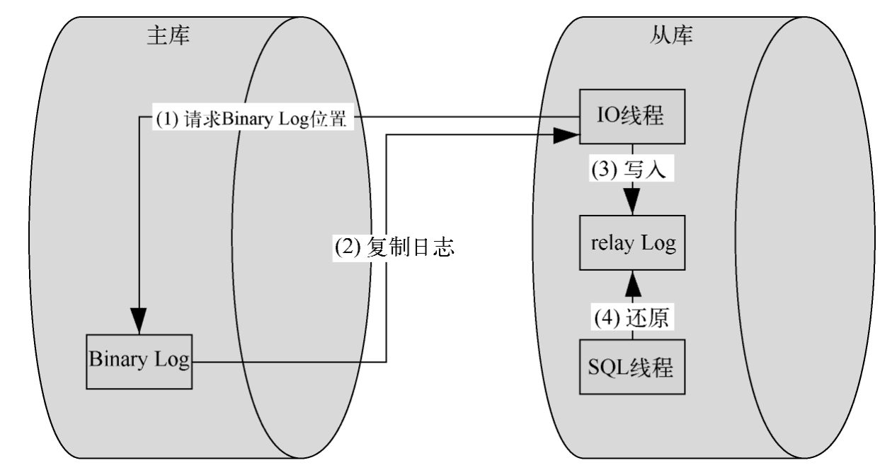

# 吾之蜜糖（续一）

## 基础

### java创建对象的方式

1. new关键字
2. 反射
3. clone()方法
4. 对象序列化与反序列化
5. 使用静态工厂方法`MyClass obj = MyClass.createInstance();`

io

## 集合


## 并发


## 虚拟机


## SpringMVC


## SpringBoot


## Spring


## 缓存


## MySQL

### 内连，左连和右连

1. **内连接（Inner Join）**：
   - 内连接根据两个表中的连接谓词（Join Predicate）匹配的行，将符合条件的行组合起来。
   - 语法示例：
     ```sql
     SELECT *
     FROM table1
     INNER JOIN table2 ON table1.column = table2.column;
     ```
   - 内连接返回两个表中连接列匹配的行，如果某个表中的行在另一个表中找不到匹配行，则不包括在结果集中。

2. **左连接（Left Join 或 Left Outer Join）**：
   - 左连接返回左表中的所有行，以及右表中与左表中的行匹配的行。
   - 如果右表中没有与左表中的行匹配的行，则结果集中右表的对应列显示为 NULL。
   - 语法示例：
     ```sql
     SELECT *
     FROM table1
     LEFT JOIN table2 ON table1.column = table2.column;
     ```

3. **右连接（Right Join 或 Right Outer Join）**：
   - 右连接与左连接类似，返回右表中的所有行，以及左表中与右表中的行匹配的行。
   - 如果左表中没有与右表中的行匹配的行，则结果集中左表的对应列显示为 NULL。
   - 语法示例：
     ```sql
     SELECT *
     FROM table1
     RIGHT JOIN table2 ON table1.column = table2.column;
     ```

### 主从复制原理



1. 从库（也叫做slave或replica）上的I/O线程会连接到主库（也叫做master），并请求从一个特定的二进制日志（BinLog）文件和一个特定的位置开始读取日志数据。这些信息通常存储在从库的master.info文件中，用于标记上次成功复制的位置。
2. 主库会根据从库I/O线程的请求，从指定的BinLog文件和位置开始，将二进制日志事件发送给从库。
3. 从库的I/O线程接收到主库发送的二进制日志事件后，会将这些事件写入从库的relay log文件中。同时，从库会更新其master.info文件，记录下最新的日志文件名和位置，以便在发生故障或重启时可以从正确的位置继续复制。

4. 从库的SQL线程会持续地读取relay log中的事件，并将这些事件解析为对应的SQL语句。这些SQL语句会在从库上执行，以便将主库上的数据更改同步到从库上。这就是所谓的"重播"过程。


再讲一下canal的原理：

- canal 模拟 MySQL slave 的交互协议，伪装自己为 MySQL slave ，向 MySQL master 发送dump 协议
- MySQL master 收到 dump 请求，开始推送 binary log 给 slave (即 canal )
- canal 解析 binary log 对象(原始为 byte 流)

## Redis

### 如何优化Redis内存？

1. **优化数据结构选择**：使用更适合存储数据的数据结构。例如，如果某些数据可以使用更省内存的数据结构如Hashes、Sets、Zsets等替代，可以考虑进行转换。
2. **数据压缩**：对于某些值较大的字符串类型的数据，可以考虑使用Redis的压缩功能（如Redis 6.x引入的字符串压缩）来减少存储空间。
3. **过期策略调整**：根据业务需求和数据特性，合理设置过期时间，及时清理不再需要的数据，避免内存被长时间占用。
4. **增加持久性**：Redis 支持将内存中的数据保存到磁盘中，这样即使出现服务器宕机等情况，也不会丢失数据。但是，将数据写入磁盘需要消耗额外的内存和 CPU
5. **定期清理过期数据**：可以定期清理 Redis 中的过期键值对，以避免 Redis 中出现大量无用数据，从而节省内存。
6. **控制最大内存**：可以通过配置文件中的“maxmemory”选项设置 Redis 最大可用内存，当 Redis 内存使用达到该值时，Redis 将自动删除一些键值对，以释放空间。


## Redis保证原子性的方式

1. 单线程模型

Redis采用单线程模型来处理客户端请求,这是保证原子性的最基本方式。单线程意味着所有操作都是串行执行的,不存在并发问题,自然就保证了操作的原子性。

具体原理:

- Redis使用I/O多路复用技术来处理多个客户端连接。
- 所有命令的实际执行都是由一个线程完成的。
- 命令会被存放在一个队列中,按顺序执行。

2. Redis事务

Redis提供了MULTI、EXEC、DISCARD等命令来实现事务功能。

原理分析:

- MULTI命令开启一个事务。
- 之后的命令不会立即执行,而是被放入队列中。
- EXEC命令触发事务中所有命令的执行。
- 整个事务是一个不可分割的整体,要么全部执行,要么全部不执行。

3. Lua脚本

Redis支持使用Lua脚本来封装一系列操作,保证这些操作的原子性。

原理:

- **Lua脚本在Redis中是以原子方式执行的。**
- **脚本执行期间,Redis不会执行其他命令。**
- **可以将多个操作封装在一个Lua脚本中,确保这些操作的原子性。**

## ElasticSearch


## MongoDB

