# 项目经历

## Nginx动态缓存 — OpenResty

软件负载均衡位于系统的入口，流入分布式系统的请求都会经过这里，换句话说，相对整个系统而言，软件负载均衡是离客户端更近的地方，所以可以将一些不经常变化的数据放到这里作为缓存，降低用户请求访问应用服务器的频率。**例如一些用户的基本信息，修改频率就不是很高，并且使用比较频繁，这些信息就可以放到缓存服务器 `Redis` 中，当用户请求这部分信息时通过软件负载均衡器直接返回给用户，这样就省去了调用应用服务器的环节，从而能够更快地响应用户。**

如图所示，从**接入层**来的用户请求，通过 **`Nginx` 代理层**，按照如下几个步骤对数据进行访问。

1. 用户请求首先通过 `F5`访问 `Nginx`，如果请求需要获取的数据在 `Nginx` 本地缓存中有，就直接返回给用户。
2. 如果没有命中 `Nginx` 缓存，则可以通过 `Nginx` 直接调用缓存服务器获取数据并返回。
3. 如果缓存服务器中也不存在用户需要的数据，则需要回源到上游应用服务器并返回数据。


使用上图第 (3) 步的方案，无非可以减少调用步骤，因为应用服务有可能存在其他的调用、数据转换、网络传输成本，同时还包含一些业务逻辑和访问数据库操作，影响响应时间。从代理层调用的缓存数据有如下特点：

1. 这类数据变化不是很频繁，例如用户信息；
2. 业务逻辑简单，例如判断用户是否有资格参加秒杀活动、判断商品是否在秒杀活动范围内；
3. 此类缓存数据需要专门的进程对其进行刷新，如果无法命中数据还是需要请求应用服务器。


我在闪送项目中主要用OpenResty做两件事情：

1. 做IP白名单限制访问（结合GeoIP库，OpenResty集成ngx_http_geo_module第三方模块，根据地域做IP限制，并检查ip是否在redis中存放的黑名单中）
2. 对一些需要登录的接口判断用户是否登录（检查token）

### 1. IP白名单限制访问

**步骤详解**：

1. **集成GeoIP库和ngx_http_geo_module模块**：
    - OpenResty可以通过集成GeoIP库来根据IP地址确定地理位置。
    - `ngx_http_geo_module`是一个第三方模块，可以用来根据地理位置设置不同的访问策略。

2. **设置IP白名单和黑名单**：
    - 白名单和黑名单可以存储在Redis中，便于动态更新和管理。
    - 通过OpenResty的Lua脚本来读取Redis中的IP信息，并进行判断。

3. **实现流程**：
    - 首先通过GeoIP库获取访问IP的地理位置信息。
    - 检查IP是否在白名单中，如果在则允许访问。
    - 检查IP是否在黑名单中，如果在则拒绝访问。
    - 如果IP既不在白名单也不在黑名单中，则根据默认策略进行处理。

### 2. 对需要登录的接口判断用户是否登录

**步骤详解**：

1. **获取Token**：
    - 从用户请求的Header中获取Token信息。

2. **验证Token**：
    - 通过Redis查询Token的有效性，判断用户是否登录。
    - Redis中的Token可以定期刷新，确保Token的有效性。

3. **实现流程**：
    - 从请求的Header中获取Token。
    - 查询Redis，检查Token是否存在且有效。
    - 如果Token有效，允许访问；否则，拒绝访问并返回相应的错误信息。


## 日志记录 & 告警

> 先提一下使用AOP+exception Handler用于日志记录，并解释一下为什么。

### 1. 异常感知与日志记录

应用程序在运行过程中可能会出现各种异常，这些异常需要被及时捕获并记录下来。日志记录是应用程序的重要组成部分，常见的日志框架如Logback、Log4j等都支持异常日志的捕获和记录。

### 2. 异常上报

当捕获到异常时，可以通过邮件、短信等方式通知系统管理员或开发人员。本文主要介绍通过邮件进行异常上报。

### 3. Logback的扩展机制

Logback支持自定义Appender，允许开发者扩展日志记录功能。通过自定义Appender，可以实现日志信息的过滤、处理和上报。

### 4. 邮件发送

Spring Boot提供了Spring Mail模块，可以方便地实现邮件发送功能。通过配置邮件服务器信息并使用JavaMailSender类，我们可以在应用中轻松发送邮件。

### 5. 拓展

可以结合飞书、钉钉机器人使用，更加人性化。


## 登录鉴权

开发用户登录鉴权逻辑，并接入微信开放平台以免除用户注册，是一种提升用户体验的有效方式。以下是详细的介绍：

### 1. 使用JustAuth接入微信开放平台

#### OAuth的流程

OAuth（开放授权）是一种开放标准，允许用户通过第三方服务访问资源而无需向服务提供者透露登录凭证。OAuth 2.0是当前广泛使用的版本，其流程如下：

1. **用户授权**：用户在微信平台同意授权应用访问其信息。
2. **获取授权码**：微信平台重定向到应用，并附带授权码。
3. **交换令牌**：应用使用授权码向微信平台请求访问令牌（Access Token）。
4. **获取用户信息**：应用使用访问令牌从微信平台获取用户信息。
5. **维护会话**：应用为用户创建会话并维持登录状态。

使用JustAuth（一个Java开源的第三方登录库）可以简化这个流程。以下是接入微信开放平台的大致步骤：


> 在用户完成登录之后呢，我们会生成一个双token去返回给前端，双token的优势如下：

### 2. 使用双Token保存登录状态

在用户登录状态维护中，双Token（通常是Access Token和Refresh Token）策略具有以下优势：

#### 单Token的局限

1. **安全性问题**：单Token一旦泄露，攻击者可以长期使用该Token进行操作。
2. **生命周期管理**：单Token通常有较短的生命周期，为了安全，必须频繁地重新登录。

#### 双Token机制

双Token机制引入了Access Token和Refresh Token两种令牌：

1. **Access Token**：有效期较短，用于访问资源。
2. **Refresh Token**：有效期较长，用于刷新Access Token。

#### 优势

1. **增强安全性**：即使Access Token泄露，其短生命周期限制了攻击者的操作时间。Refresh Token只有在特定情况下才会被使用，且可以放置在更加安全的存储中。
2. **减少频繁登录**：用户在Access Token过期后，不需要重新登录，可以使用Refresh Token获取新的Access Token，提升用户体验。
3. **细粒度权限控制**：Access Token可以包含具体的权限信息，短期内授权使用。Refresh Token则主要用于获取新的Access Token，而不直接用于访问资源。

#### 具体流程

1. **用户登录**：用户通过OAuth流程登录后，应用服务器颁发Access Token和Refresh Token。
2. **访问资源**：用户使用Access Token访问资源，当Access Token有效时，资源服务器允许访问。
3. **刷新令牌**：当Access Token过期时，用户使用Refresh Token请求新的Access Token。
4. **颁发新令牌**：授权服务器验证Refresh Token有效性后，颁发新的Access Token，并可根据需要颁发新的Refresh Token。


## 订单延时过期

### 1. 各种队列介绍

**仲裁队列 (Quorum Queues)**  
仲裁队列是一种高可用性队列，使用Raft共识算法来管理多个副本以确保消息的持久性和可用性。这种队列适用于需要高可用性和数据一致性的场景。

**经典队列 (Classic Queues)**  
经典队列是RabbitMQ中的默认队列类型，支持基本的队列功能，如消息的持久化和确认。经典队列在高可用性和性能方面表现平衡，但在某些极端场景下可能不如仲裁队列可靠。

**惰性队列 (Lazy Queues)**  
惰性队列旨在处理大量的消息，消息会被存储到磁盘而不是内存中，以减少内存使用。这种队列适用于需要处理大批量消息且对延迟要求不高的场景。

**死信队列 (Dead Letter Queues, DLQ)**  
死信队列用于存储无法被消费的消息，例如消息被拒绝、消息过期或者队列达到最大长度。这种队列有助于后续的消息分析和处理。

**优先级队列 (Priority Queues)**  
优先级队列允许消息根据其优先级被消费，优先级高的消息会被优先处理。适用于需要区分消息处理优先级的场景。

### 2. RabbitMQ 路由方式介绍

**Work Queue**

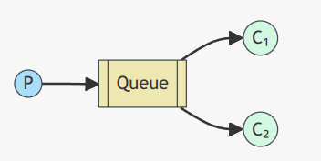

工作队列是一种消息传递模式，也称为任务队列或任务分发。它允许发送者将消息发送到一个队列中，然后由多个消费者并发地处理这些消息。

**Topic Exchange**  

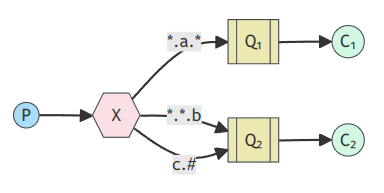

通过主题交换机，消息按模式匹配路由键，将消息发送到一个或多个队列。路由键支持通配符，例如“order.*”可以匹配“order.created”和“order.updated”。

**Direct Exchange**  


通过直接交换机，消息按精确匹配路由键，将消息发送到对应队列。适用于明确的、一对一的消息路由场景。

**Headers Exchange**  
通过头交换机，消息按消息头属性进行路由，而不是路由键。可以根据多种条件组合进行路由，灵活性较高，但性能略低于直接交换机和主题交换机。

**Fanout Exchange**  


通过扇出交换机，消息会广播到所有绑定的队列，不进行路由键匹配。适用于发布-订阅模式，例如广播事件通知。

通过这些交换机类型，可以根据具体的业务需求灵活配置消息路由方式，以实现高效的消息传递和处理。


### 3. 使用RabbitMQ实现订单延时过期及补偿机制

**场景描述**  
在电商系统中，用户下单后未及时支付，需要在一定时间后自动取消订单。可以通过RabbitMQ的延时队列来实现订单延时过期，同时使用死信队列和补偿机制保证消息可靠性。

**步骤描述**

1. **创建延时队列**  
   创建一个延时队列用于存放需要延迟处理的订单消息。该队列设置消息的TTL（Time-To-Live）属性，例如设置TTL为30分钟。

2. **配置死信交换机和死信队列**  
   当消息在延时队列中过期后，会被转发到一个死信交换机。需要创建一个死信交换机和相应的死信队列用于接收过期的订单消息。

3. **订单处理逻辑**  
   当用户下单后，将订单消息发送到延时队列。消息在延时队列中等待TTL到期，如果用户在TTL时间内支付，订单状态更新并消息从延时队列中移除；如果未支付，消息过期并转发到死信队列。

4. **死信队列消费与补偿机制**  
   死信队列的消费者监听过期订单消息，并执行订单取消操作。为了保证消息可靠性和系统的高可用性，消费者应实现幂等性操作，并可以记录处理失败的消息以进行补偿处理。

**补偿机制**  
补偿机制是指在消息处理失败时，重新尝试处理或记录失败消息以便后续手动处理。可以使用以下方式实现补偿：

- **重试机制**：在消费失败时，重新将消息发送到延时队列进行重试。
- **错误日志记录**：记录处理失败的消息到数据库或日志系统，定期检查并手动处理。**如果超过一定阈值会发送邮件给业务人员报警**。


## Redis与MySQL的数据同步问题

先说说[几种常见的同步方案](https://app.gitbook.com/o/kCU9nigbAxy9O5ghLetb/s/WRL1j27PbuO34tVcJxpq/cache-yu-db-de-shu-ju-yi-zhi-xing)吧

1. **Write Through**：向Cache中直接写入数据，再由Cache自身将数据同步到MySQL，但是由于我们的redis没有这样的功能，pass

2. **延时双删策略**：先更新数据库，再删除缓存，为了防止此时之前的读请求将数据同步至redis，因此一段时间后再执行一次删除操作，与Cache-Aside模式相结合，但是这种方式，如果说在清楚缓存之前发生失败，则需要进行补偿措施，常见的补偿措施有以下两种。

   **基于定时任务实现**

   - 如果失败，插入一条记录到任务表，该记录会存储需要更新的缓存<Key,Value>
   - 【异步】定时任务定时扫描任务表，更新到缓存，之后删除该记录。

   **基于消息队列来实现**

   - 如果失败，发送带有缓存<Key,Value>的事务消息。此时，需要有支持事务消息特性的消息队列，或者我们自己封装消息队列，支持事务消息。
   - 【异步】最后，消费者消费该消息，更新到缓存中。

3. **基于Binlog实现**：主要是读取MySQL的Binlog，在springboot项目中新建一个canal-client客户端，依赖`ApplicationRunner`开启守护进程同步任务，将相关的数据插入redis中。

   当然，在实现的时候，我还看到另一种实现方式，就是不是在springboot项目中新建一个客户端，而是让canal利用限流组件去讲数据按频率发送到mq中，再由消费者去进行处理，但是经过我们小组的商讨后，认为使用人数较少，可以不用去进行这样的操作。示例如下：

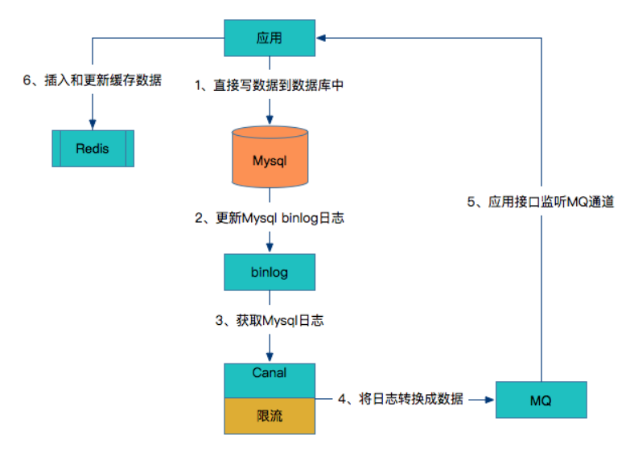

1. 应用直接写数据到数据库中
2. 数据库更新binlog日志。
3. 利用Canal中间件读取binlog日志。
4. Canal借助于限流组件按频率将数据发到MQ中。
5. 应用监控MQ通道，将MQ的数据更新到Redis缓存中。


## 点赞系统的实现

### 需求

1. 作品点赞数量
2. 某个用户的点赞列表，都是有哪些作品点赞了
3. 某个作品的点赞人列表

### 设计与实现

1. 建表：两者可以相互补偿

   - 点赞记录表：某个人点赞了某个作品的信息
   - 点赞计数表：某个作品的点赞数量

2. 设计Redis的点赞数和点赞记录

   - 点赞数使用正常的key-value即可
   - 点赞记录使用zset来实现，**zset的长度有限制，不然可能导致bigkey问题，阻塞主线程**

3. 查询点赞数：用户发送请求来查询点赞数，使用Cache-Aside模式，先检查缓存，如果没有再检查MySQL并回写。

4. 查询点赞列表：先查询redis

   - 如果存在，进行zset分页处理

     - 如果条数超过长度限制，再拉取数据库数据做拼接操作后返回给客户端
     - 如果没有超过长度限制，则取出当前页数据直接返回

   - 如果不存在，则从MySQL中取出当前页数据直接返回并会写到redis。

     ```mermaid
     graph TD;
         A[查询点赞列表] --> B[查询Redis缓存]
         B -->|存在| C[zset分页处理]
         C -->|条数超过长度限制| D[拉取数据库数据]
         D --> E[数据拼接操作]
         E --> F[返回给客户端]
         C -->|未超过长度限制| G[取出当前页数据]
         G --> H[直接返回给客户端]
         B -->|不存在| I[从MySQL中取出当前页数据]
         I --> J[写入Redis缓存]
         J --> K[直接返回给客户端]
     ```

5. 点赞作品：先查询之前有没有点赞记录

   - 如果无，则插入点赞记录表，并将点赞数+1

   - 如果有，则判断最近一次点赞的记录时间

     - 如果当前点赞的时间小于之前点赞的时间，直接返回
     - 如果大于，则判断当前的点赞状态，如果已经点赞过了，则直接返回，如果是取消点赞状态，更新点赞状态并将点赞计数+1

     > 上述工作应该加锁，在一次事务中完成

   同时使用canal同步缓存与MySQL，执行lua脚本刷新点赞记录，先检查key是否存在

   - 如果不存在，结束
   - 如果存在，则zadd，再检查zset长度，如果超出长度，则删除多余元素。

   ```mermaid
   graph TD;
       A[查询点赞记录] --> B[加锁事务]
       B -->|查询是否有点赞记录| C
       C -->|无| D[插入点赞记录表]
       D --> E[更新点赞数]
       C -->|有| F[判断最近一次点赞时间]
       F -->|当前时间小于之前点赞时间| G[释放锁并返回]
       F -->|当前时间大于之前点赞时间| H[判断当前点赞状态]
       H -->|已经点赞过| I[释放锁并返回]
       H -->|取消点赞状态| J[更新点赞状态]
       J --> K[更新点赞数]
       K --> L[释放锁]
   
       A --> M[使用Canal同步缓存与MySQL]
       M --> N[执行Lua脚本刷新点赞记录]
       N --> O[检查key是否存在]
       O -->|不存在| P[结束]
       O -->|存在| Q[zadd操作]
       Q --> R[检查zset长度]
       R -->|超出长度| S[删除多余元素]
   
   ```

   > 目前是这样设计的，当然，如果这样设计，mysql的磁盘io会面临很大的考验，但考虑到目前用户量不大，因此没有做出改进，但是我也看过更进一步的设计，就是在应用层和数据层之间加上一层消息队列以作削峰填谷的处理。

## 领域驱动开发DDD

> 推荐阅读原文：https://weread.qq.com/web/reader/948326f0813ab7294g014bb7k3c5327902153c59dc0488e1

领域驱动设计分层能够帮助我们把领域对象转化为软件架构。在分解复杂的软件系统时，分层是最常用的一种手段。在领域驱动设计的思想中，分层代表软件框架，是整个分布式架构的“骨架”；领域对象是业务在软件中的映射，好比“血肉”。本节要做的事情是认识骨架，并且告诉大家如何将血肉填充到骨架中去，即领域驱动设计中的分层架构和每层的意义，以及如何将领域对象放置到分层架构中。

2.5.1　分层的概述与原则在软件设计中，分层随处可见，分布式架构也不例外。我们面对的是一个纷繁复杂的世界，业务的发展和用户的需求变化一直萦绕着我们，软件架构作为业务和用户的支撑，更需要面对这种复杂的环境。我们需要一个使复杂问题简单化的工具，这个工具就是分层。分层不仅让我们能够站在一个更高的位置看待软件设计，还给整个架构带来了高内聚、低耦合、可扩展、可复用等优势，下面就具体分析一下这些优势。

● 高内聚：定义每层需要关注的重点，使复杂问题简单化，让整个架构清晰化。例如商店只负责卖好商品就行了，不需要考虑商品都是如何制作的。同样，基础设施层做好提供日志、通知服务的工作就好了，不用关注具体的业务流程是怎样的。

● 低耦合：各层分工明确，层与层之间通过标准接口进行通信。一个层次不需要关心其他层次的具体实现过程，即便其他层次的内部结构或者流程发生改变了，只要接口不变化就不会影响自己的工作。例如面包厂改变了生产面包的流程甚至工艺，但只要面包的口感、价格、包装没有发生改变，商店还是一样可以卖这些面包，不会因为面包厂的那些改变而影响卖面包这件事。这个例子中的口感、价格、包装就是层与层之间的接口。接口能够降低层与层之间的耦合度。

● 可扩展：由于每层都各司其职，层与层之间的沟通都通过接口完成，因此无论在哪层扩展功能，都是很方便的，只需要对其他层的功能进行组合即可。例如商店之前只卖面包，现在想扩展业务——卖蛋糕，于是就去联系蛋糕厂。以此类推，如果想扩展其他业务，可以去找其他厂家。究其根本，商店只需要知道如何经营和组合好这些商品就可以了。

● 可复用：每层都可以向一层或者多层提供服务，特别是基础、通用功能会被多处使用。例如面包厂的面包不仅可以提供给商店 A，也可以提供给商店 B。这样的复用提高了应用服务的使用率，避免了重复造轮子的现象。

了解了分层的优势以后，来看看如何具体实现分层。架构分层看上去，就是按照功能对每层进行分割和堆叠。但在具体落地时还需要考虑清楚，每层的职责以及层与层之间的依赖关系。架构有分成三层的，也有分成四层、五层的。业务情况、技术背景，以及团队架构不同，分层也会有所不同。这里通过领域驱动设计的分层方式，给分布式架构提供分层思路。

如图 2-23 所示，领域驱动设计将架构分成四层，从上往下分别是用户接口层、应用层、领域层和基础层。箭头表示层和层之间的依赖与被依赖关系。例如，箭头从用户接口层指向应用层，表示用户接口层依赖于应用层。从图中可以看到，基础层被其他所有层依赖，位于最核心的位置。

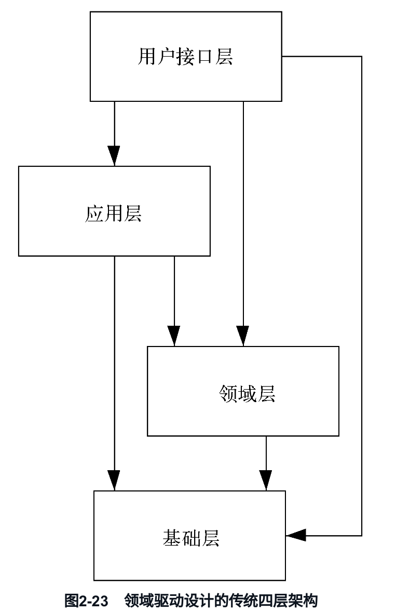

但这种分法和业务领导技术的理念是相冲突的，搭建分布式架构时是先理解业务，然后对业务进行拆解，最后将业务映射到软件架构。这么看来，领域层才是架构的核心，所以图 2-23 中的依赖关系是有问题的。于是出现了 DIP（Dependency Inversion Principle，依赖倒置原则），DIP 的思想指出：高层模块不应该依赖于底层模块，这两者都应该依赖于抽象；抽象不应该依赖于细节，细节应该依赖于抽象。因此，作为底层的基础层应该依赖于用户接口层、应用层和领域层提供的接口。高层是根据业务展开的，通过对业务抽象产生了接口，底层依赖这些接口为高层提供服务。还是以商店卖面包为例，商店卖面包是业务行为，对该业务进行抽象得到的接口对应面包的种类、口感、价格、包装等。面包厂作为底层服务，要为商店提供面包这一服务，就需要依赖刚抽象出的接口，把这个接口作为生产目的对待。带着这个思想重新审视架构分层，所得结果如图 2-24 所示。可以看到，领域层跑到了最下面，应用层和基础层依赖于领域层，基础层和用户接口层均依赖于应用层。此时，领域层成为了分层架构的核心。


上面介绍了架构分层的概念和优点，并且展开说明了领域驱动设计的架构分层。针对基础层、用户接口层、应用层以及领域层的分层说明会在 2.5.2 节中详细介绍。

2.5.2　分层的内容

本节从离用户最近的用户接口层开始介绍。

用户接口层也称为表现层，包括用户界面、Web 服务和远程调用三部分。该层负责向用户显示信息和解释用户指令。这里的用户既可以是系统的使用者，也可以是一个程序或者一个计算机系统。用户接口层负责系统与外界的通信和交互，例如 Web 服务负责接收和解释 HTTP 请求，以及解释、验证、转换输入参数。由于是跨系统的调用，因此会涉及信息的序列化与反序列化。说白了，该层的主要职责是与外部用户、系统交互，接受反馈，展示数据。特别需要说明的是，远程调用是分布式系统的核心思想，会在 3.4 节中重点介绍。

应用层比较简单，不包含业务逻辑，用来协调领域层的任务和工作。它不需要反映业务状态，只反映用户或程序的进展状态。应用层负责组织整个应用流程，是面向用例设计的。通常，应用服务是运行在应用层的，负责服务组合、服务编排和服务转发，组合业务执行顺序以及拼装结果。并不能说应用层和业务完全无关，它以粗粒度的方式对业务做简单组合。具体功能有信息安全认证、用户权限校验、事务控制、消息发送和消息订阅等。

领域层实现了应用服务的核心业务逻辑，并保证业务的正确性。这层体现了系统的业务能力，用来表达业务概念、业务状态和业务规则。

领域层包含领域驱动设计中的领域对象，例如聚合、聚合根、实体、值对象、领域服务。领域模型的业务逻辑由实体和领域服务实现。其次，当某些业务功能单一，且实体无法实现的时候，会由领域服务协助实现。领域服务可以将聚合内的多个实体组合在一起，实现复杂的业务逻辑。领域服务描述了业务操作的过程，可以对领域对象进行转换，处理多个领域对象，产生一个结果。说白了，就是领域服务可以操作一个或者多个领域对象，而这些操作是一个实体无法完成的。领域服务和应用服务的区别是，它具有更多的业务相关性。

基础层为其他三层提供通用的技术和基础服务，包括数据持久化、工具、消息中间件、缓存等。基础服务部分采取了前面提到的 DIP 技术，由该技术支持的基础资源给用户接口层、应用层与领域层提供服务，帮助层与层之间沟通，减少层与层之间的依赖，从而实现层与层之间的解耦。

例如在基础层实现的数据库访问，就是面向领域层接口的。领域层只是根据业务向基础层发出命令，告诉它需要提供的数据规格（数据规格包括用户名字、身份证、性别、年龄等信息），基础层负责获取对应的数据并交给领域层。具体如何获取数据、从什么地方获取数据，这些问题全部都是基础层需要考虑的，领域层是不关心的。领域层都面向同一个抽象的接口，这个接口就是数据规格。当数据库的实现方式发生更换时，例如从Oracle 数据库换成了 MySQL 数据库，只要基础层把获取数据的实现方式修改一下即可；领域层则还是遵循之前的数据规格，进行数据获取，不受任何影响。

2.5.3　分层的总结	

2.5.2 节将领域驱动设计中四个分层的概念都介绍了一遍，这里将它们总结到图 2-25中，以便大家加深对分层概念的理解。理解分层概念有助于拆解技术架构，特别是在分布式架构中，业务技术混在一起，需要有一个方法论作为指导。而由于业务、经验、组织背景的不同，造成架构拆解和应用服务拆分也不同，因此本书无法给出一个标准答案，只是希望借助领域驱动设计的经典方法，为大家提供一个思路。

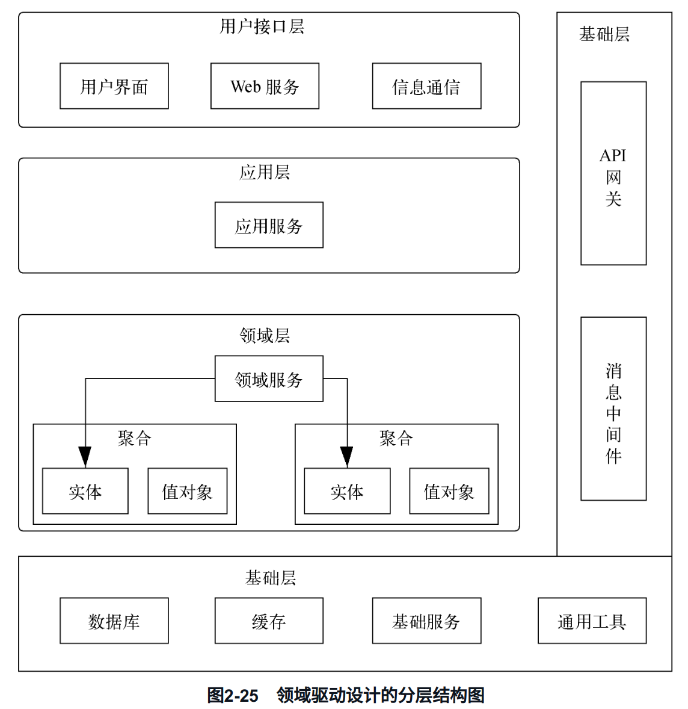

图 2-25 从上往下看。首先是用户接口层，包括用户界面、Web 服务以及信息通信功能。作为系统的入口，用户接口层下面是应用层，这一层主要包括应用服务，但不包含具体的业务，只是负责对领域层中的领域服务进行组合、编排和转发。应用层下面是领域层，这一层包括聚合、实体、值对象等领域对象，负责完成系统的主要业务逻辑。领域服务负责对一个或者多个领域对象进行操作，从而完成需要跨越领域对象的业务逻辑。用户接口层、应用层、领域层下方和右方的是基础层，这层就和它的名字一样，为其他三层提供基础服务，包括 API 网关、消息中间件、数据库、缓存、基础服务、通用工具等。除了提供基础服务，基础层还是针对通用技术的解耦。

2.5.4　服务内部的分层调用与服务间的调用

将分层思想落地到分布式架构或者微服务架构，每个被拆分的应用或者服务都包含用户接口层、应用层、领域层。那么服务内部以及服务之间是如何完成调用的呢？来看图2-26，这张图可以回答这个问题。

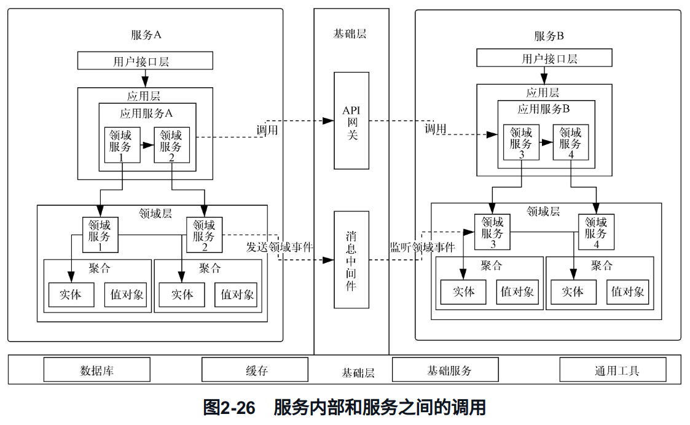

先看在服务内部，层与层之间是如何调用的。图 2-26 中的左边有一个服务 A，顺着实心箭头的方向看，调用先通过用户接口层来到应用层。由于应用层会对领域层的领域服务进行组合编排，以满足用户接口层的需要，因此可以看到应用服务 A 中包含两个领域服务，分别是领域服务 1 和领域服务 2，这两个领域服务分别对应领域层的领域服务1 和领域服务 2。又因为领域服务是通过聚合中的实体以及实体方法完成业务逻辑的，所以箭头指向了实体，表示调用实体。在完成具体业务逻辑的同时，还需要调用基础层的数据库、缓存、基础服务等组件。

再看服务之间如何完成调用。我们知道可以通过限界上下文的方式对应用服务进行拆分，拆分后的每个应用或者服务在逻辑功能上都是一致的。于是服务之间的调用会跨越限界上下文，也就是跨越业务逻辑的边界。这种跨越边界的调用从应用层发起，体现在图 2-26 中，就是从左边服务 A 的应用层里面的应用服务 A 引出一根带箭头的虚线，指向右边服务 B 的应用层里面的应用服务 B。同时由于分层协作的关系，一个服务在调用其他服务时，需要通过基础层的 API 网关。解释完表示服务之间调用关系的虚线以后，往下看还有一条虚线，从领域服务 2 发出，先指向消息中间件，后指向领域服务3。领域服务 2 产生领域事件以后，会把这个事件发往消息中间件，当领域服务 3 监听到这个产生的领域事件后，会继续执行后面的逻辑。总结一下，这两根虚线通过基础层完成两个服务之间的调用和信息传递。

2.5.5　把分层映射到代码结构

正如 2.5 节开头提到的那样，领域驱动设计的分层把领域对象转化为软件架构。分层的思路一直都影响着软件架构的设计，如果顺着这个思路继续往下，就是代码的实施部分了。因此本节介绍如何将分层架构转化为代码结构，代码结构是层次结构在代码实现维度的映射。好的层次设计有助于设计代码结构，好的代码结构设计更容易让人对整体软件架构有清晰的理解。下面就来逐层介绍代码结构。

用户接口层（UserInterface）的代码结构包括 Assembler、DTO 和 Facade 三部分内容，如图 2-27 所示。

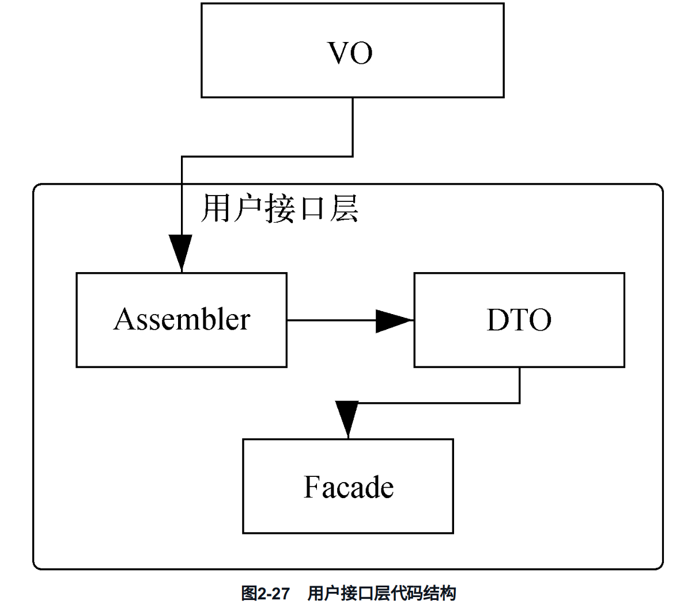

顺着箭头所指的方向从上往下看图 2-27，展示层的 VO（ViewObject）传入到用户接口层后，先通过 Assembler 转换为 DTO，再由 Facade 往下传递。下面分别介绍一下用户接口层代码结构的三部分组成内容。

● Assembler：起格式转换的作用。传入用户接口层的数据和用户接口层中的数据，格式有可能是不一样的。例如展示层提交了一个表单，我们称之为 VO（View Object，视图对象），这个 VO 传入用户接口层之后需要经过 Assembler 转换，形成用户接口层能够识别的 DTO 格式的数据。

● DTO（Data Transfer Object，数据传输对象）：它是用户接口层数据传输的载体，不包含业务逻辑，由 Assembler 转换而得。DTO 可以将用户接口层与外界隔离。

● Facade：门面，是服务提供给外界系统的接口，也是调用领域服务的入口。Facade 提供较粗粒度的调用接口，通常不包含业务逻辑，只是将用户请求转交给应用服务进行处理。一般地，提供 API 服务的 Controller 就是一个 Facade。

根据代码结构的思路，如图 2-28 所示，代码目录中处在最上层的是 userinterface，它下面分别是 assembler、dto 和 facade 目录。

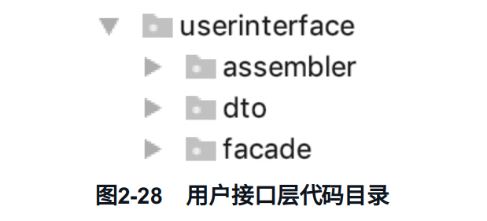

应用层的代码结构由 Command、Application Service 和 Event 组成，如图 2-29 所示。

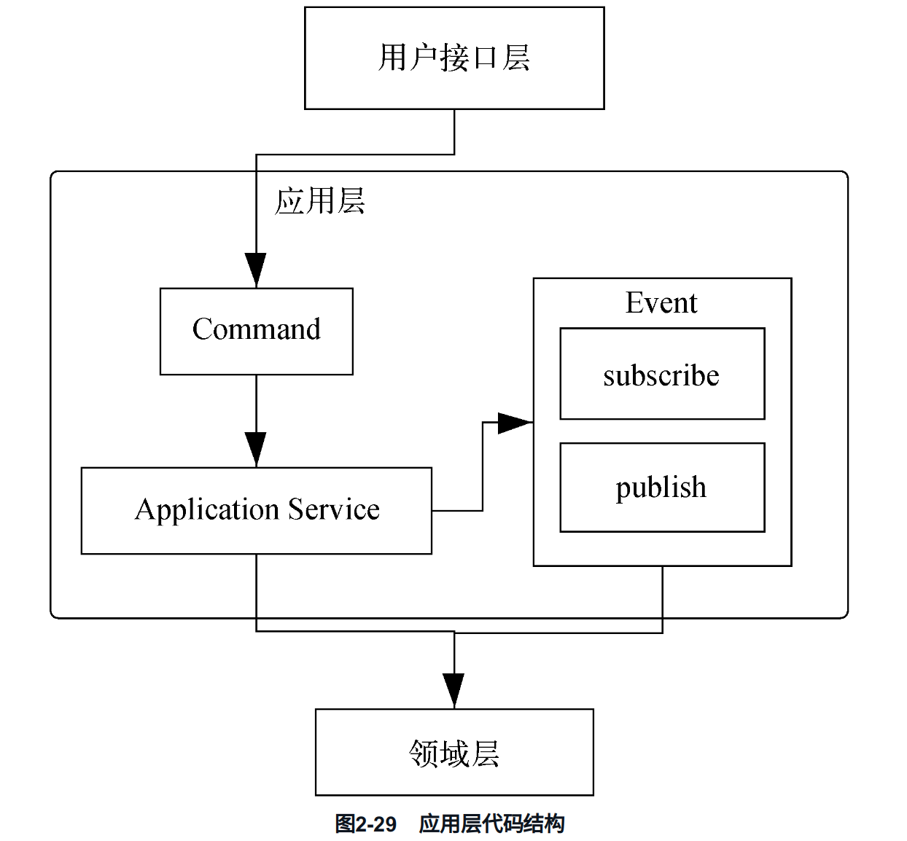

同样是顺着箭头所指的方向从上往下看图 2-29，用户接口层传入的消息先转换成Command，然后交给 Application Service 做处理。Application Service 负责连接领域层，调用领域服务、聚合（根）等领域对象，对业务逻辑进行编排和组装。同时，Application Service 还协助领域层订阅和发布 Event。下面分别介绍一下应用层代码结构的三部分组成内容。

● Command：命令，可以理解为用户所做的操作，例如下订单、支付等，是应用服务的传入参数。

● Application Service：应用服务，会调用和封装领域层的 Aggregate、Service、Entity、Repository、Factory。其主要实现组合和编排，本身不实现业务，只对业务进行组合。

● Event：事件，这里主要存放事件相关的代码，负责事件的订阅和发布。事件的发起和响应则放在领域层处理。如果用订报纸来举例，那么应用层的 Event 负责的是订阅报纸和联系发布报纸，阅读订阅的报纸和发布报纸的具体工作则由领域层的 Event 完成。

应用层的代码目录如图 2-30 所示，处在最上面的是 application 目录，它下面包括command、event（publish、subscribe）和 service 目录。

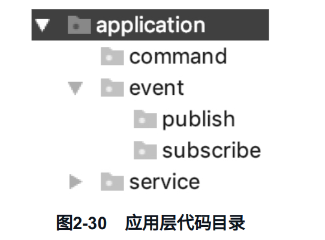

领域层的代码结构包括一个或者多个 Aggregate（聚合）。每个 Aggregate 又包括Entity、Event、Repository、Service、Factory 等，这些领域模型共同完成核心业务逻辑。领域层的代码结构如图 2-31 所示。

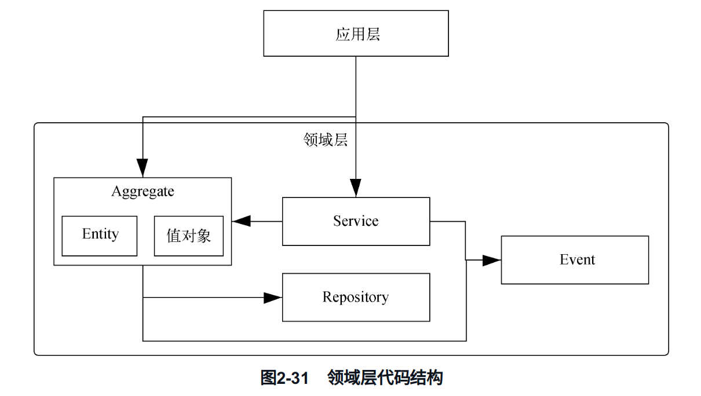

由图 2-31 可以看出，应用层依赖于领域层中的 Aggregate 和 Service。Aggregate 中包含 Entity 和值对象。Service 会对领域对象进行组合，完成复杂的业务逻辑。Aggregate 中的方法和 Service 中的动作都会产生 Event。所有领域对象的持久化和查询都由 Repository 实现。下面分别介绍一下领域层代码结构的组成内容。

● Aggregate：聚合，聚合的根目录通常由一个实体的名字来表示，例如订单、商品。由于聚合定义了服务内部的逻辑边界，因此聚合中的实体、值对象、方法都围绕某一个逻辑功能展开，例如订单聚合包括订单项信息、下单方法、修改订单的方法和付款方法等，其主要目的是实现业务的高内聚。由于一个服务由多个聚合组成，因此服务的拆分和扩容都可以根据聚合重新编排。如图 2-32 所示，当服务 1 中的聚合 C 成为业务瓶颈时，可以将其扩展到服务 3 中。又或者由于业务重组，聚合 A 可以从服务 1 迁移到服务 2 中。

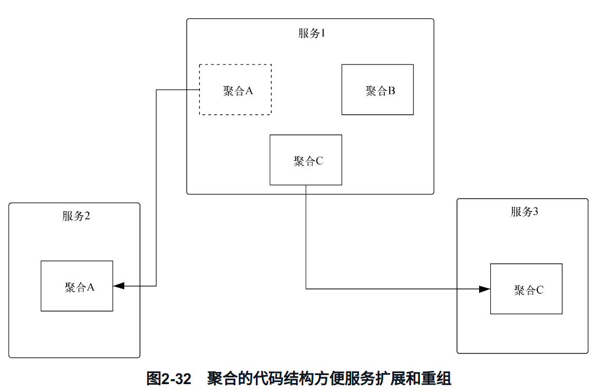

● Entity：实体，包括业务字段和业务方法。跨实体的业务逻辑代码则可以放到Service 中。

● Event：领域事件，包括与业务活动相关的逻辑代码，例如订单已创建、订单已付款。作为负责聚合间沟通的工具，Event 需要实现发送和监听事件的功能。建议将监听事件的代码单独存放在 listener 目录中。

● Service：领域服务，包括需要由一个或者多个实体共同完成的服务，或者需要调用外部服务完成的功能，例如订单系统需要调用外部的支付服务来完成支付操作。如果Service 的业务逻辑比较复杂，可以针对每个 Service 分别设计类，遇到需要调用外部系统的地方最好采用代理类来实现，以做到最大程度的解耦。

● Repository：仓库，其作用是持久化对象。针对数据的操作都放在这里，主要是读取和查询。一般来说，一个 Aggregate 对应一个 Repository。

领域层的代码目录如图 2-33 所示，处在最上面的是 domain 目录，它下面可以存放多个 aggregate 目录，其命名可以根据业务来定义。每个 aggregate 目录下面存放着entity、event、repository、service 目录，分别代表实体、领域事件、仓库和服务。

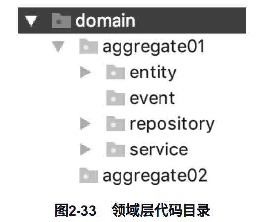

基础层的代码结构主要包括工具、算法、缓存、网关以及一些基础通用类。这层的目录存放比较随意，根据具体情况具体决定。这里也不做具体的规定，仅给出一个例子以供参考，如图 2-34 所示。最上面是 infrastructure 目录，它下面存放着 config 和 util 文件夹，分别存放与配置和工具相关的代码。2.5.6 节会根据业务场景再加入一些其他目录。

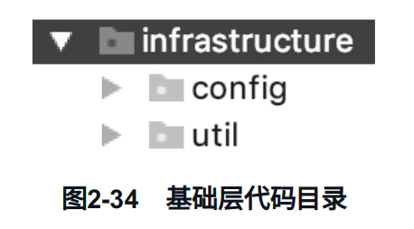

至此，就聊完了各层的代码结构和代码目录。这里总结一下，如图 2-35 所示。

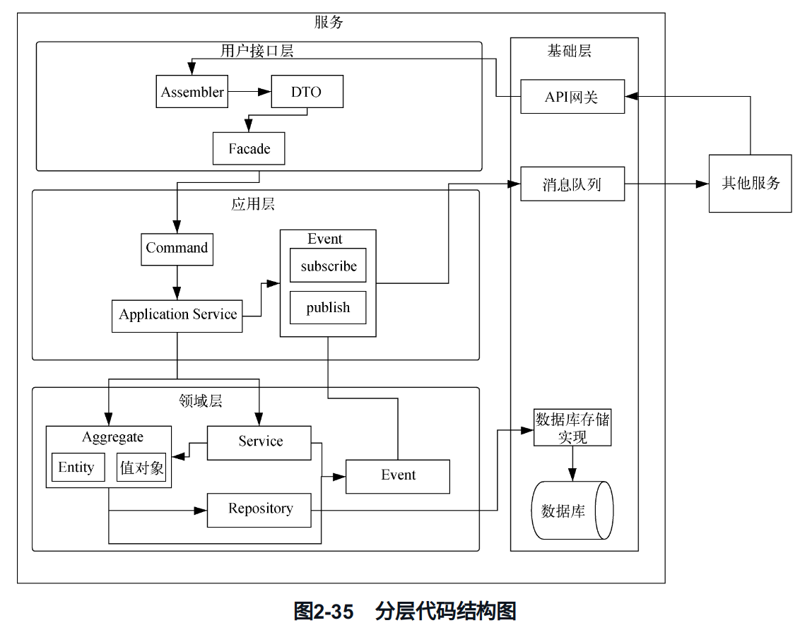

图 2-35 中最右边的其他服务通过基础层中的 API 网关，将信息传入用户接口层。传入的信息先通过 Assembler 转换成 DTO 对象，再传给 Facade。Facade 负责把信息传递给应用层，信息以命令的形式被传递给 Application Service。Application Service 会组合领域层中的 Aggregate 和 Service。领域层中的 Entity 和值对象，配合 Aggregate 和 Service 完成业务逻辑，并且通过 Repository 将 Entity 和值对象存储到数据库中。领域层中的 Event 会根据业务的发生，获取事件信息，通过应用层中 Event 里的订阅和发布，与其他服务进行通信。

最后，图 2-36 给出了所有代码目录组成的一张大图，分为四层，每层再根据自己的功能做进一步拆分。

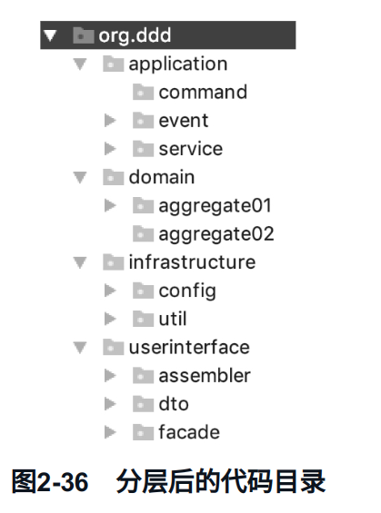

2.5.6　代码分层示例

2.5.5 节讲了如何把架构分层映射到代码结构，每层根据不同的功能分别需要做哪些实现。本节举一个例子，将代码落地。先介绍业务背景，我们要实现一个创建订单的功能，其中每个订单都有多个订单项，每个订单项分别对应一个产品，产品有对应的价格；可以根据订单项和订单的价格计算订单总价，针对每个订单设置对应的送单地址。接下来具体实现这个小业务的聚合代码架构。

图 2-37 从实体、事件和命令三个维度对上一段中的业务进行了切分。该业务涉及订单、订单项、地址、订单状态、产品实体。围绕这些实体，有订单已创建、订单地址已修改、订单已支付、订单项已创建、产品已修改事件。每个事件都有一个命令与之对应，分别是创建订单、修改订单地址、支付订单、创建订单项、修改产品。

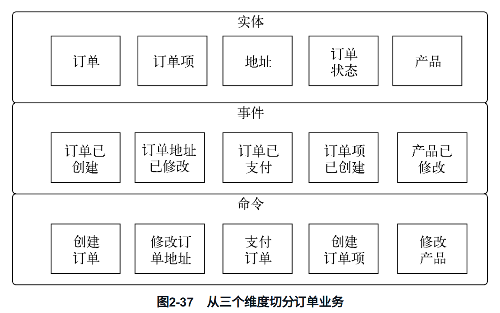

可以看出，订单业务是围绕订单展开的，实体、事件、命令中都涉及订单相关的内容。按照这个思路，可以画出订单与其他领域对象的关系，如图 2-38 所示。

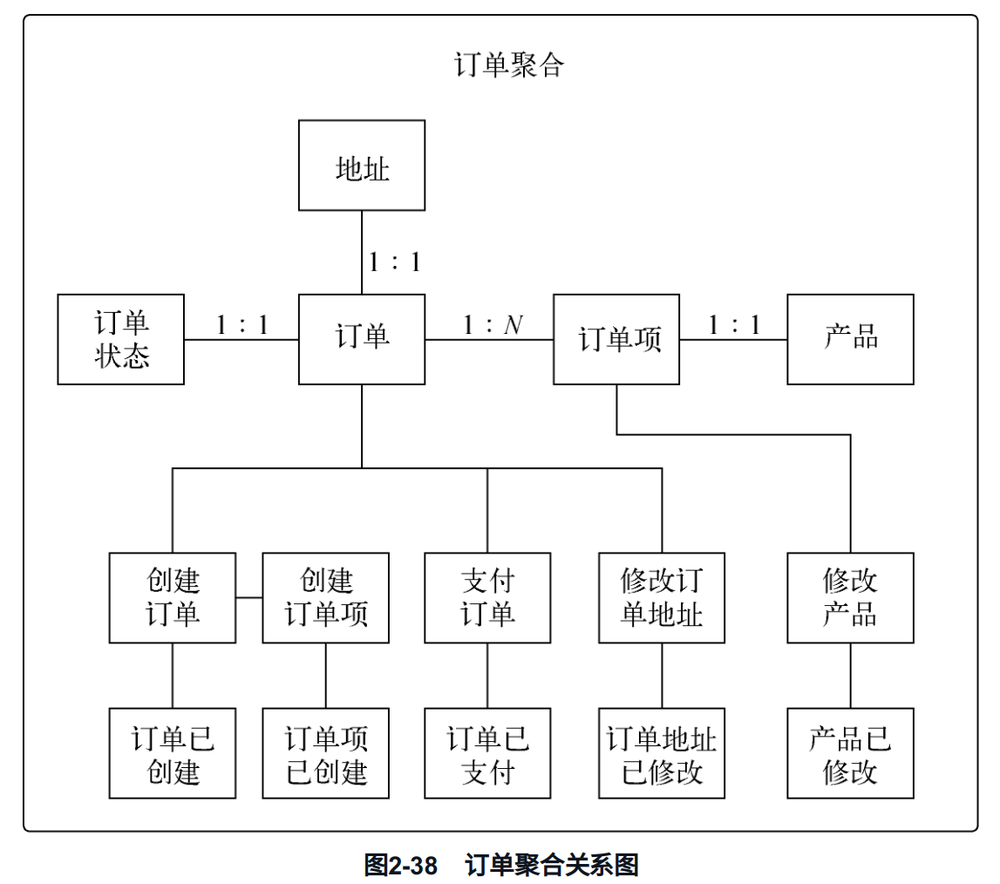

在图 2-38 中，一个订单包含 N 个订单项，一个订单项对应一个产品。此外，订单还包含地址和订单状态信息，它们之间都是 1 对 1 的关系。订单中包含创建订单（项）、支付订单、修改订单地址的命令，这些命令可以理解为实体类中的方法。这三个命令分别对应三个事件：订单（项）已创建、订单已支付、订单地址已修改。订单项作为订单的一部分，对应修改产品的命令和产品已修改的事件。

分析完聚合，会发现整个聚合都是围绕订单展开的，因此可以将订单作为这个聚合的聚合根。对图 2-38 进行进一步的拆解，就产生了具体的类、属性和方法，即图 2-39。其中主要描述了领域层中的领域对象（订单、订单项、地址、订单状态），以及对应的领域事件（如订单已创建、订单项已创建、订单已支付、订单地址已修改、产品已修改），还有订单仓库和订单服务。后几列分别对这些内容定义了对象类型、包名、类名、属性和方法名。

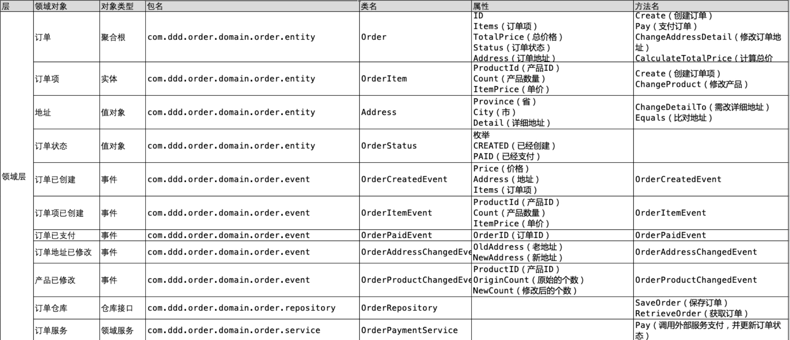

图 2-40 描述的是应用层的关系图。应用层主要实现订单服务，这个服务中需要定义三个属性，分别如下。

● OrderRepository：订单仓库，用于获取订单仓库的数据库接口。一般来说，主要的业务逻辑会在领域层中的聚合根和领域服务中完成，应用层是不会直接操作数据库的，但在有些情况下是可以操作的。例如通过订单 ID 获取订单信息，或者将订单实体直接保存到数据库中。这些操作并不包含复杂业务，如果交由领域层处理，将会导致操作烦琐，因此要放在应用层完成。

● OrderFactory：订单工厂，用来生成聚合根或者领域对象。本例中的 Order 对象就是由 OrderFactory 产生，然后投入使用的。

● OrderPaymentService：支付服务，这是一个用来完成支付功能的领域服务。

除了订单服务，图 2-40 中其他 5 个命令的作用都是作为订单服务的输入，这在后面的代码调用过程中会详细介绍。

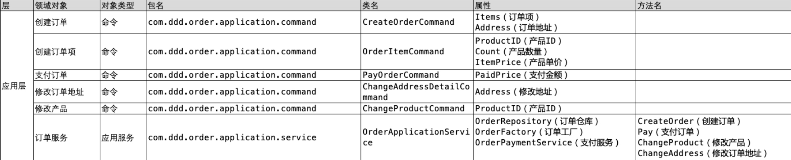

领域层和应用层是代码的主要组成部分，用户接口层和基础层的代码则比较简单。订单业务的完整代码目录见图 2-41。其中 userinterface 文件夹下面就是用户接口层的内容，这里比较简单，是一个 Web API 的 controller，负责对外提供访问接口，由于没有对象转换，所以 assembler 和 dto 文件夹是空的。infrastructure 目录里面存放的是基础层的内容。由于需要定义聚合根，因此 aggregate 目录中存放的是聚合的基础类。event 目录中存放的是事件相关的基础类。同样，exception 目录存放针对异常定义的基础类，jackson 目录存放针对序列化、反序列化的基础类，repository 目录存放数据仓库的基础类。

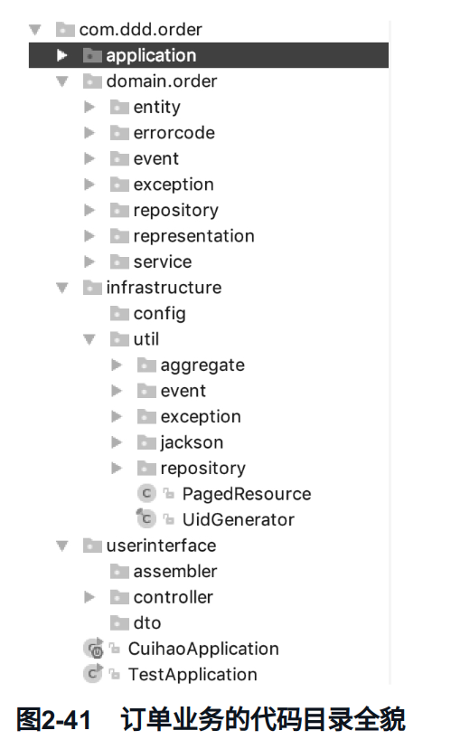

到现在，我相信大家知道如何将分层结构落地到代码层面了。这里再通过一个调用过程介绍一下这些代码是如何协作的。图 2-42 描述了如何用代码创建订单，这里对调用过程做了最大程度的简化，尽量让每层调用都清晰化。数据库存储和事件发送属于基础层完成的部分，由于篇幅关系，这里不具体实现。

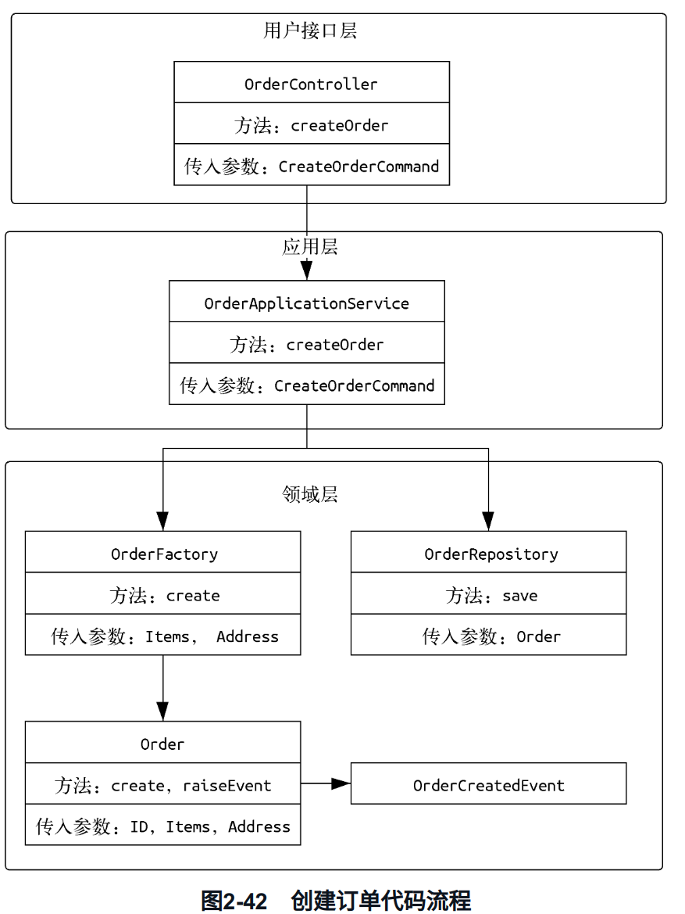

首先，请求由用户接口层传入，由于是创建订单操作，所以会把CreateOrderCommand 命令作为参数传入 OrderController 类中。接收到该命令以后，用户接口层会调用应用层中的 OrderApplicationService，其中的 createOrder 方法会分别调用领域层的 OrderFactory 和 OrderRepository。OrderFactory 的 create 方法可以生成聚合根 Order，然后调用 Order 中的 create 方法生成订单。之后 Order 会调用raiseEvent 方法向其他服务发送 OrderCreatedEvent，以通知其他服务订单已创建。createOrder 会调用 OrderRepository 中的 save 方法，传入参数是 Order，将 Order 保存到数据库中。

从图 2-43 可以看出，应用层中的服务只负责生成聚合根 Order，然后将其保存下来。

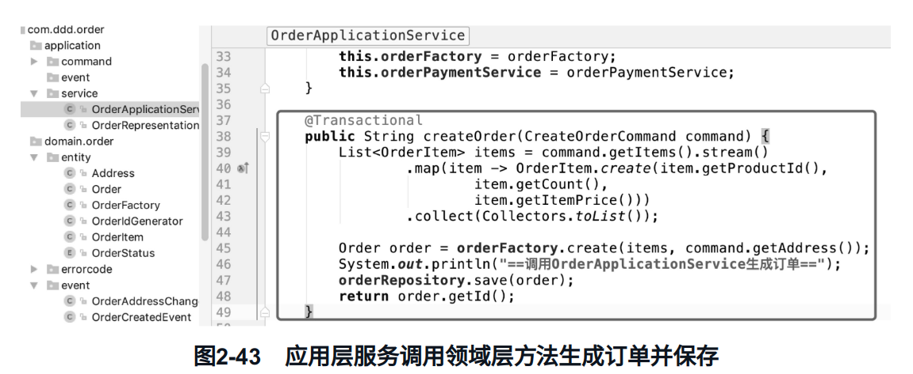

而从图 2-44 可以看出，在领域层的聚合根 Order 中，是通过 create 方法创建订单的，在订单生成以后才通过 raiseCreatedEvent 发送消息。

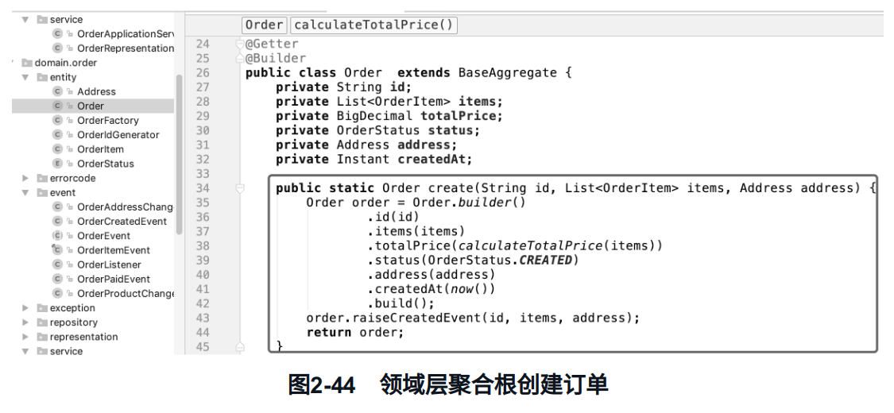


