# 吾之蜜糖

## 基础

### **equals与hashCode**

**关联和约定**

1. **哈希表的使用：** 在 Java 中，哈希表（如 `HashMap`、`HashSet` 等）是基于哈希算法实现的数据结构，它通过哈希码（hash code）来快速定位对象的存储位置。
2. **约定一：相等对象必须具有相等的哈希码：** 如果两个对象根据 `equals()` 方法判断相等（即 `obj1.equals(obj2)` 返回 `true`），那么这两个对象的哈希码必须相等（即 `obj1.hashCode() == obj2.hashCode()`）。
3. **约定二：不相等的对象尽量有不同的哈希码：** 如果两个对象根据 `equals()` 方法判断不相等，不要求它们的哈希码一定不相等，但是为了提高哈希表的性能，不相等的对象尽量有不同的哈希码，减少哈希冲突。

**为什么需要重写 `hashCode()` 方法？**

* **保证哈希表性能：** 如果重写了 `equals()` 方法，但没有重写 `hashCode()` 方法，那么两个根据 `equals()` 判断相等的对象可能会有不同的哈希码，这违反了约定一，会导致这两个对象在哈希表中无法正确被处理，甚至无法通过 `HashMap` 或 `HashSet` 正确地进行存储和检索。
* **确保对象一致性：** 重写 `hashCode()` 方法可以保证根据 `equals()` 方法判断相等的对象拥有相等的哈希码，从而在使用哈希表时能够正确地识别和处理相等的对象。

### 抽象类和接口有什么区别？

1. **成员方法实现：**
   * **抽象类：** 可以包含普通方法的实现，也可以包含抽象方法（没有具体实现，只有方法声明）。抽象类中的非抽象方法可以提供默认实现，子类可以选择性地覆盖这些方法。
   * **接口：** 只能包含抽象方法的声明，不包含方法的实现。在 Java 8 及以后的版本中，接口可以包含默认方法和静态方法的实现。
2. **多继承：**
   * **抽象类：** Java 中的类只能单继承，因此抽象类只能继承一个具体类或抽象类。但是抽象类可以实现多个接口。
   * **接口：** 接口支持多继承，一个类可以实现多个接口，从而实现多重继承的效果。
3. **构造方法：**
   * **抽象类：** 可以有构造方法，并且抽象类的构造方法在子类实例化时会被调用。
   * **接口：** 不允许有构造方法，接口中不能定义实例字段，因为接口中的方法都是抽象的，没有实例变量可以初始化。
4. **用途和设计：**
   * **抽象类：** 是对类的一种抽象，是一种模版设计。
   * **接口：** 用于定义一种能力或行为，描述了一种规范或契约，实现接口的类需要提供接口中定义的所有方法的具体实现。接口适合用于不同类之间的行为规范和统一的契约。

### Class#forName 和 ClassLoader 区别

* `Class#forName(...)` 方法，除了将类的 `.class` 文件加载到JVM 中之外，还会对类进行解释，执行类中的 `static` 块。
* ClassLoader 只干一件事情，就是将 `.class` 文件加载到 JVM 中，不会执行 `static` 中的内容，只有在 newInstance 才会去执行 `static` 块。

### 动态代理

CGlib（Code Generation Library）和JDK动态代理都是Java中实现动态代理的技术。

**JDK动态代理**

**概念**：JDK动态代理基于Java的反射机制，只能代理实现了接口的类。它在运行时生成代理类，该代理类实现了指定的接口，并将所有调用委派给一个InvocationHandler。

**使用场景**：适用于需要代理实现接口的类。

**CGlib动态代理**

**概念**：CGlib是一个开源的字节码生成库，通过使用ASM库操作字节码实现。CGlib可以代理没有实现接口的类，它生成目标类的子类，并覆盖其中的方法。

**使用场景**：适用于需要代理没有实现接口的类。

**比较**

* **实现方式**：
  * JDK动态代理基于接口实现，必须通过实现接口来代理类。
  * CGlib动态代理通过生成目标类的子类进行代理，可以代理没有实现接口的类。
* **性能**：
  * JDK动态代理在小规模代理情况下性能较好，但在大规模代理时性能不如CGlib。
  * CGlib通过直接操作字节码，性能较高，但生成代理类开销较大。
* **使用限制**：
  * JDK动态代理要求目标类必须实现接口。
  * CGlib动态代理无法代理final类和final方法。

选择哪种代理方式主要取决于具体的应用场景和需求。

## 集合

### 快速失败（fail-fast）和安全失败（fail-safe）的区别

* 快速失败：当你在迭代一个集合的时候，如果有另一个线程正在修改你正在访问的那个集合时，就会抛出一个 ConcurrentModification 异常。 在 `java.util` 包下的都是快速失败。
* 安全失败：你在迭代的时候会去底层集合做一个拷贝，所以你在修改上层集合的时候是不会受影响的，不会抛出 ConcurrentModification 异常。在 `java.util.concurrent` 包下的全是安全失败的。

### Comparable 和 Comparator 的区别?

* Comparable 接口，在 `java.lang` 包下，用于当前对象和其它对象的比较，所以它有一个 `#compareTo(Object obj)` 方法用来排序，该方法只有一个参数。
* Comparator 接口，在 `java.util` 包下，用于传入的两个对象的比较，所以它有一个 `#compare(Object obj1, Object obj2)` 方法用来排序，该方法有两个参数。

### ArrayList 与 LinkedList 区别？

**ArrayList**

* 优点：ArrayList 是实现了基于动态数组的数据结构，因为地址连续，一旦数据存储好了，查询操作效率会比较高（在内存里是连着放的）。
* 缺点：因为地址连续，ArrayList 要移动数据，所以插入和删除操作效率比较低。

**LinkedList**

* 优点：LinkedList 基于链表的数据结构，地址是任意的，所以在开辟内存空间的时候不需要等一个连续的地址。对于新增和删除操作 add 和 remove ，LinedList 比较占优势。LinkedList 适用于要头尾操作或插入指定位置的场景。
* 缺点：因为 LinkedList 要移动指针，所以查询操作性能比较低。

### ArrayList 是如何扩容

* 如果通过无参构造的话，初始数组容量为 0 ，当真正对数组进行添加时，才真正分配容量。每次按照 **1.5** 倍（位运算）的比率通过 copeOf 的方式扩容。
* 在 JKD6 中实现是，如果通过无参构造的话，初始数组容量为10，每次通过 copeOf 的方式扩容后容量为原来的 **1.5** 倍。

### HashMap 和 Hashtable 的区别

**线程安全性**

* **Hashtable：** 是线程安全的类，它的方法都是同步的（synchronized），多个线程可以安全地访问一个 `Hashtable` 实例，但这也导致在多线程环境下性能相对较低。
* **HashMap：** 是非线程安全的类，它的方法没有进行同步处理，因此多个线程同时访问 `HashMap` 可能导致数据不一致或其他问题。若需要在多线程环境下使用 `HashMap`，可以通过 `Collections.synchronizedMap()` 方法来创建同步的 `HashMap`。

**Null 键和值的处理**

* **Hashtable：** 不允许使用 null 作为键或值，否则会抛出 `NullPointerException`。
* **HashMap：** 允许使用 null 作为键和值，即 `HashMap` 中可以存储键或值为 null 的条目。

**性能**

* **HashMap：** 由于 `HashMap` 非线程安全，不进行同步处理，因此在单线程环境下性能较高。
* **Hashtable：** 由于 `Hashtable` 所有方法都进行了同步处理，因此在多线程环境下保证了线程安全，但性能相对较低。

**现状**

* **Hashtable：** 继承自 `Dictionary` 类，已经被淘汰（Deprecated）。
* **HashMap：** 实现了 `Map` 接口，是 `AbstractMap` 的子类，属于 Java Collections Framework 的一部分。

**初始容量和扩容机制**

* HashTable 中数组默认大小是 11 ，扩容方法是 `old * 2 + 1` ，HashMap 默认大小是 16 ，扩容每次为 2 的指数大小。

### HashMap 和 ConcurrentHashMap区别

1. **内部结构**：在JDK1.8之前，ConcurrentHashMap使用分段锁（Segmentation）来提供并发性。每个段本质上是一个独立的HashMap，并且拥有一个锁。在JDK1.8之后，Segmentation被移除了。ConcurrentHashMap采用了一种不同的锁机制（synchronized和CAS操作）来提高并发性。
   * 当数组中当前位置为空时，使用CAS来把新的节点写入数组中对应的位置。
   * 当数组中当前位置不为空时，通过加锁（synchronized）来添加或删除节点。如果当前位置是链表，就遍历链表找到合适的位置插入或删除节点。如果当前位置是红黑树，就按照红黑树的规则插入或删除节点。
   * 当链表长度超过阈值（默认为8）时，就把链表转换为红黑树。当红黑树节点数小于阈值（默认为6）时，就把红黑树转换为链表。
2. **线程安全**：HashMap非线程安全，不能保证在多线程环境下的共享访问，而ConcurrentHashMap是线程安全的，设计用于多线程的环境中。
3. **性能**：由于ConcurrentHashMap的线程安全特性，它在多线程环境下比HashMap有更好的性能。它通过使用复杂的锁策略和CAS操作来最小化锁的竞争。
4. **内存一致性**：ConcurrentHashMap的读操作可以不加锁，并且其写操作可以延迟更新到主存，不同步其他读写操作，而HashMap在多线程下使用时需要外部同步。

`HashMap` 是 Java 中常用的哈希表实现的数据结构，用于存储键值对。在理解 `HashMap` 的工作原理和在 JDK 1.8 之后向其中添加元素可能发生的情况之前，我们先来了解 `HashMap` 的基本原理和核心概念。

### HashMap 的工作原理

1. **哈希表数组：** `HashMap` 内部维护一个数组，数组的每个元素称为桶（bucket）。桶是存放键值对的基本单元，每个桶可能存放一个链表或红黑树，用来解决哈希冲突（即多个键映射到同一个桶的情况）。
2. **哈希函数：** 当向 `HashMap` 中添加键值对时，首先会根据键的 `hashCode()` 方法计算哈希值，然后通过哈希函数确定键值对应该存放在数组的哪个桶中。
3. **解决哈希冲突：** 如果多个键的哈希值映射到同一个桶中（即发生哈希冲突），`HashMap` 使用链表或红黑树来存储这些键值对。链表用于简单的存储，而当链表长度超过一定阈值（默认为8），链表会转换为红黑树，提高查找效率。

### JDK 1.8 向 HashMap 添加元素可能发生的情况

在 JDK 1.8 中，向 `HashMap` 添加元素时可能会触发以下情况：

1. **计算哈希值：** 根据新加入键的 `hashCode()` 方法计算哈希值。
2. **确定存放位置：** 根据哈希值和当前数组的长度计算键值对应该存放在数组的哪个桶中（hashCode & capacity）。使用&而不是%是因为&的计算效率更高，这也是为什么hashMap扩容后是2的n次幂。
3. **桶为空或非空处理：**
   * 如果目标桶为空（即没有发生哈希冲突），直接将新的键值对存放在该桶中。
   * 如果目标桶已经有其他键值对：
     * 如果目标桶中的元素为链表，将新的键值对追加到链表的末尾。
       * 如果链表的长度超过8，如果桶数组的长度超过64则将链表修改为红黑树。
       * 如果链表的长度超过8，如果桶数组的长度没有超过64则出发扩容操作。
     * 如果目标桶中的元素为红黑树，按照红黑树的规则插入新的键值对。
4. **链表转红黑树：**
   * 当向一个桶中添加元素时，如果该桶中链表长度达到阈值（默认为8），会将链表转换为红黑树，提高查找效率。
5. **扩容：** 如果添加元素后 `HashMap` 中的元素数量达到数组容量的阈值（负载因子，默认为0.75），会触发扩容操作。扩容会将数组容量增加一倍，并重新计算每个键值对的存放位置。

    ```java
    int index = hash(key) & (newCapacity - 1);
    ```

## 并发

> 非常推荐《Java并发编程的艺术》一书，虽然是15年出版的，某些知识已经过时，但由于jdk向下兼容，因此很多知识点还是没有变化的。
>
> 最重要的：思想永不过时！

### 简述线程、进程、程序的基本概念？

**程序**

程序，是含有指令和数据的文件，被存储在磁盘或其他的数据存储设备中，也就是说程序是静态的代码。

**进程**

进程，是程序的一次执行过程，是系统运行程序的基本单位，因此进程是动态的。系统运行一个程序即是一个进程从创建，运行到消亡的过程。简单来说，一个进程就是一个执行中的程序，它在计算机中一个指令接着一个指令地执行着，同时，每个进程还占有某些系统资源如CPU时间，内存空间，文件，文件，输入输出设备的使用权等等。换句话说，当程序在执行时，将会被操作系统载入内存中。

**线程**

线程，与进程相似，但线程是一个比进程更小的执行单位。一个进程在其执行的过程中可以产生多个线程。与进程不同的是同类的多个线程共享同一块内存空间和一组系统资源，所以系统在产生一个线程，或是在各个线程之间作切换工作时，负担要比进程小得多，也正因为如此，线程也被称为轻量级进程。

### 你了解守护线程吗？它和非守护线程有什么区别？

Java 中的线程分为两种：守护线程（Daemon）和用户线程（User）。

守护线程一般由JVM自动创建，也可以通过Thread#setDaemon(boolean on)方法进行手动设置。

当用户线程执行完毕，只剩下守护线程时，JVM会自动退出。

### 什么是线程饥饿？

饥饿，一个或者多个线程因为种种原因无法获得所需要的资源，导致一直无法执行的状态。

Java 中导致饥饿的原因：

* 高优先级线程吞噬所有的低优先级线程的 CPU 时间。
* 线程被永久堵塞在一个等待进入同步块的状态，因为其他线程总是能在它之前持续地对该同步块进行访问。
* 线程在等待一个本身也处于永久等待完成的对象(比如调用这个对象的 wait 方法)，因为其他线程总是被持续地获得唤醒。

### 线程的五状态与七状态模型

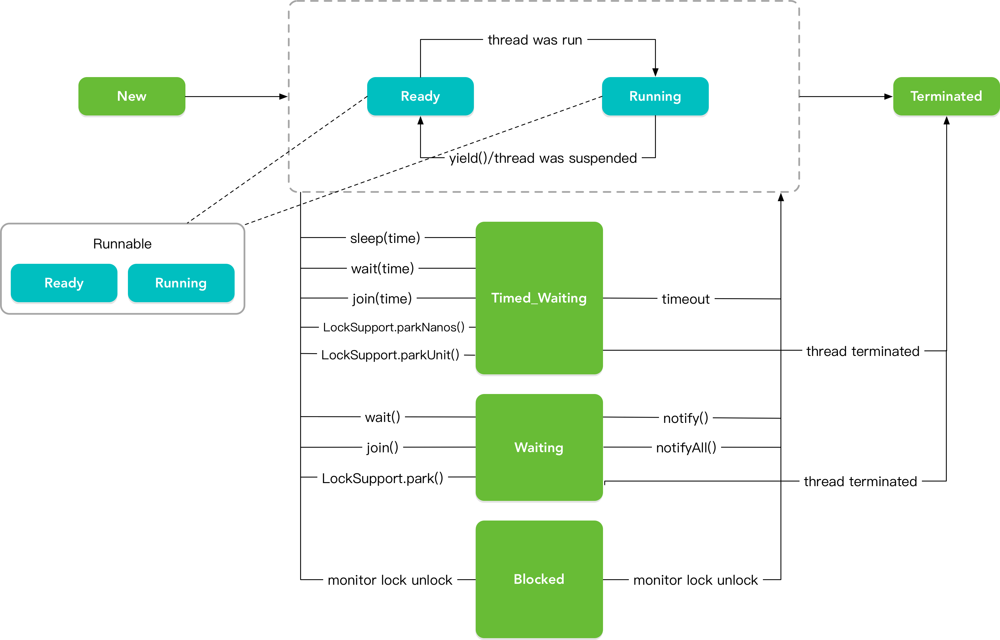

### 创建线程的方式

* 方式一，继承 Thread 类创建线程类。
* 方式二，通过 Runnable 接口创建线程类。
* 方式三，通过 Callable 接口和 Future 创建线程。
* 方式四，通过线程池创建线程。

### 一个线程运行时发生异常会怎样？

如果异常没有被捕获该线程将会停止执行。

`Thread.UncaughtExceptionHandler` 是用于处理未捕获异常造成线程突然中断情况的一个内嵌接口。

当一个未捕获异常将造成线程中断的时候 JVM 会使用 `Thread#getUncaughtExceptionHandler()` 方法来查询线程的 UncaughtExceptionHandler 并将线程和异常作为参数传递给 handler 的 `#uncaughtException(exception)` 方法进行处理。

### Thread#sleep()与Object#wait()区别

* sleep 方法，是线程类 Thread 的静态方法。调用此方法会让当前线程暂停执行指定的时间，将执行机会（CPU）让给其他线程，但是对象的锁依然保持，因此休眠时间结束后会自动恢复（线程回到就绪状态）
* wait 方法，是 Object 类的方法。调用对象的 `#wait()` 方法，会导致当前线程放弃对象的锁（线程暂停执行），进入对象的等待池（wait pool），只有调用对象的 `#notify()` 方法（或`#notifyAll()`方法）时，才能唤醒等待池中的线程进入等锁池（lock pool），如果线程重新获得对象的锁就可以进入就绪状态。

### 为什么 wait 和 notify 方法要在同步块中调用？

* Java API 强制要求这样做，如果你不这么做，你的代码会抛出 IllegalMonitorStateException 异常。
* wait和notify是用于线程间进行通信的，显然两线程通信过程中让其他线程横叉一脚是不合适的。

### 为什么你应该在循环中检查等待条件

处于等待状态的线程可能会收到错误警报和伪唤醒，如果不在循环中检查等待条件，程序就会在没有满足结束条件的情况下退出。

```java
// The standard idiom for using the wait method
synchronized (obj) {
    while (condition does not hold) {
        obj.wait(); // (Releases lock, and reacquires on wakeup)
    }
    ... // Perform action appropriate to condition
}
```

### sleep(0) 有什么用途？

`Thread#sleep(0)` 方法，并非是真的要线程挂起 0 毫秒，意义在于这次调用 `Thread#sleep(0)` 方法，把当前线程确实的被冻结了一下，让其他线程有机会优先执行。`Thread#sleep(0)` 方法，是你的线程暂时放弃 CPU ，也就是释放一些未用的时间片给其他线程或进程使用，就相当于一个**让位动作**。

### 单例模式的线程安全性?

* 饿汉式单例模式的写法：线程安全
* 懒汉式单例模式的写法：非线程安全
* 双检锁单例模式的写法：线程安全

### synchronized的实现原理与应用

总结：

1. 可以被修饰的对象有哪些？
2. 对象头中存储的内容？
3. 锁有几种状态？
4. 锁如何升级？
5. 在轻量级锁和重量级锁中，会将对象头中原来的内容存放到哪里？

参考链接：

<https://app.gitbook.com/o/kCU9nigbAxy9O5ghLetb/s/4nPAqAgKpdmjLNSFVzrX/java-bing-fa-de-yi-shu#synchronized-de-shi-xian-yuan-li-yu-ying-yong>

推荐阅读：

《Java并发编程的艺术》第二章 第2节

<https://weread.qq.com/web/reader/a1b42863643425f316430426755426757427657366e61366f5642696438626160ckaab325601eaab3238922e53>?

### 同步方法和同步块，哪个是更好的选择

同步块是更好的选择，因为它不会锁住整个对象（当然你也可以让它锁住整个对象）。同步方法会锁住整个对象，哪怕这个类中有多个不相关联的同步块，这通常会导致他们停止执行并需要等待获得这个对象上的锁。

同步块更要符合开放调用的原则，只在需要锁住的代码块锁住相应的对象，这样从侧面来说也可以避免死锁。

### 关于volatile你应该知道的事

总结：

volatile在两个方面发挥作用

1. **以volatile修饰变量保证变量的内存可见性**
2. **以volatile修饰变量防止内存重排序**

上述两点都与volatile底层的**内存屏障**有关，一条指令序列从编译到依次执行会经过三次重排序：

1. **编译器优化重排序**。在不改变单线程语义的前提下，可以重新安排语句的执行顺序，也就是说遵从`as if serial`规则。
2. **处理器指令集并行重排序**。处理器采用指令级并行技术将多条指令重叠执行。
3. **内存系统重排序**。与处理器使用缓存和读/写缓冲区有关。

正是由于处理器会使用缓存和读/写缓冲区，导致了多线程对同一共享变量读取的并发问题（即JMM中的工作内存和主内存），而volatile使用内存屏障来解决这个问题，volatile插入内存屏障的规则如下：

* 在volatile写前插入`StoreStore`内存屏障，使得写之前的所有写指令的结果对本次写可见（底层是使工作内存保存的副本无效）。
* 在volatile写后插入`StoreLoad`屏障，使得本次写的结果对之后的读指令可见。
* 在volatile读后插入一个`LoadLoad`屏障，确保本次数据的装载先于后续指令数据的装载。
* 在volatile读后插入一个`LoadStore`屏障，确保本次数据装载先于后续存储指令刷新到内存。

上面的内存屏障，既可以保证内存可见性，也可以防止指令重排序。

详细总结：

<https://app.gitbook.com/o/kCU9nigbAxy9O5ghLetb/s/4nPAqAgKpdmjLNSFVzrX/java-bing-fa-de-yi-shu#huan-cun-yi-zhi-xing>

推荐阅读：

《Java并发编程的艺术》第三章 第4节

> ps：更推荐阅读第三章的全部内容，虽然有些内容可能已经过时，但是还是会称赞设计者的奇思妙想~
>
> ps：比我写的好多了！

<https://weread.qq.com/web/reader/a1b42863643425f316430426755426757427657366e61366f5642696438626160ck1c3321802231c383cd30bb3>?

### 可以创建 `volatile` 数组吗?

结论：使用 `volatile` 修饰数组或对象引用可以确保对引用的写入操作对其他线程是可见的，但并不能保证引用指向的对象或数组内部的状态的可见性和一致性。如果需要保证数组或对象内部的状态在多线程环境中的可见性和一致性，需要考虑使用其他并发工具或技术，例如锁（`synchronized`）、并发集合类（如 `ConcurrentHashMap`、`CopyOnWriteArrayList` 等）、`Atomic` 类等

Java 中可以创建 `volatile` 类型数组，不过只是一个指向数组的引用，而不是整个数组。如果改变引用指向的数组（即将该引用指向一个新数组），将会受到 `volatile` 的保护，但是如果多个线程同时改变数组的元素，`volatile` 标示符就不能起到之前的保护作用了。

同理，对于 Java POJO 类，使用 `volatile` 修饰，只能保证这个引用的可见性，不能保证其内部的属性。

### long和double型变量的读写是否存在并发问题

在32位操作系统中存在并发问题，推荐使用volatile修饰。

32位操作系统的总线只有32位，而double和long类型的数据是64位，可能A线程刚将数据存放至寄存器的高32位，低32位还没有存放，B线程就开始读取该线程。

### `volatile` 和 `synchronized` 的异同？

推荐先阅读[关于volatile你应该知道的事](#关于volatile你应该知道的事)

1. **原理不同**：volatile的底层原理是通过插入内存屏障与`happens before`规则来保证多线程之间的内存可见性与防止指令重排，工作在虚拟机和处理器级别。而Synchronize关键字的底层原理是通过对`Mark word`（对象头）的操作来实现多线程之间的同步，工作在虚拟机级别。

2. **关键字修饰的内容不同**：volatile修饰变量，Synchronize修饰变量，方法，类。

3. **内存语义相同**：

   锁释放与volatile写有相同的内存语义。锁获取与volatile读有相同的内存语义。

   在线程获取锁时，JMM会把该线程对应的本地内存置为无效。从而使得被监视器保护的临界区代码必须从主内存中读取共享变量。释放也与之类似。

   而当读一个volatile变量时，JMM会把该线程对应的本地内存置为无效。线程接下来将从主内存中读取共享变量。写一个volatile变量同理。

   由于他们的内存语义相同，因此对volatile变量的单个读/写，看成是使用同一个锁对这些单个读/写操作做了同步。

4. **是否具有原子性**：Synchronize修饰的内容具有原子性，而对任意单个volatile变量的读/写具有原子性，但类似于volatile++这种复合操作不具有原子性。

5. **是否造成线程阻塞**：volatile不会，Synchronize会。

### 什么是 Java Lock 接口？

它提供了与synchronized关键字类似的同步功能，只是在使用时需要显式地获取和释放锁。虽然它缺少了（通过synchronized块或者方法所提供的）隐式获取释放锁的便捷性，但是却拥有了锁获取与释放的可操作性、可中断的获取锁以及超时获取锁等多种synchronized关键字所不具备的同步特性。

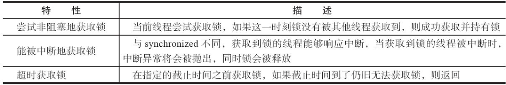

### 什么是AQS？

队列同步器AbstractQueuedSynchronizer，是用来构建锁或者其他同步组件的基础框架，它**使用了一个int成员变量表示同步状态，通过内置的FIFO队列来完成资源获取线程的排队工作**。

锁是面向使用者的，它定义了使用者与锁交互的接口（比如可以允许两个线程并行访问），隐藏了实现细节；同步器面向的是锁的实现者，它简化了锁的实现方式，屏蔽了同步状态管理、线程的排队、等待与唤醒等底层操作。锁和同步器很好地隔离了使用者和实现者所需关注的领域。

FIFO队列示意图：

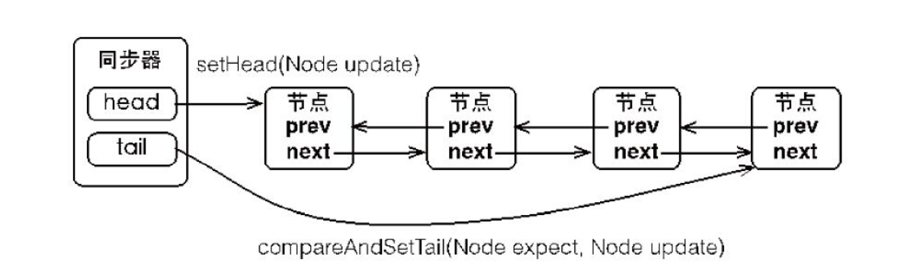

独占式获取同步状态示意图：

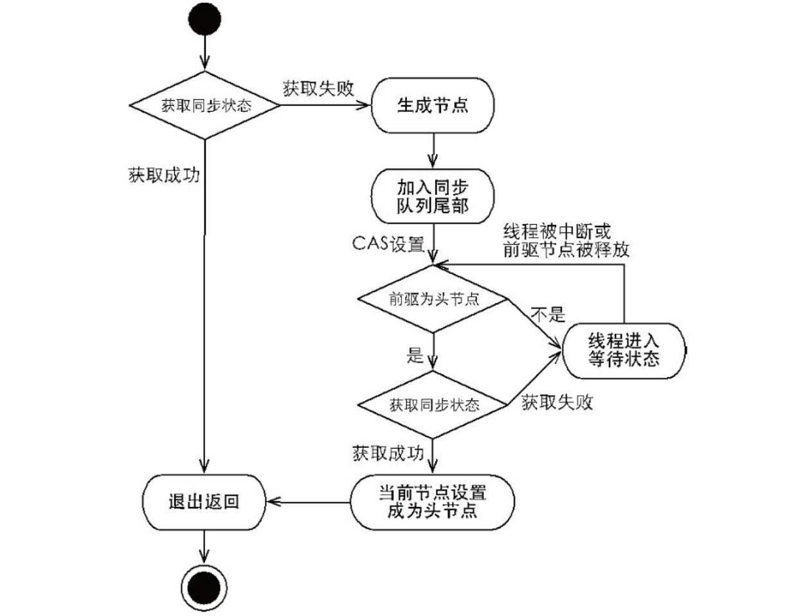

在获取同步状态时，同步器维护一个同步队列，获取状态失败的线程都会被加入到队列中并在队列中进行自旋；移出队列（或停止自旋）的条件是前驱节点为头节点且成功获取了同步状态。在释放同步状态时，同步器调用tryRelease(int arg)方法释放同步状态，然后唤醒头节点的后继节点。

推荐阅读：

《Java并发编程的艺术》第五章 第2节

<https://weread.qq.com/web/reader/a1b42863643425f316430426755426757427657366e61366f5642696438626160cked332ca0262ed3d2c2191f2>?

### synchronized 和 ReentrantLock 异同？

* 相同点
  * 都实现了多线程同步和内存可见性语义。
  * 都是可重入锁。
* 不同点
  * 同步实现机制不同
    * `synchronized` 通过 Java 对象头锁标记和 Monitor 对象实现同步。
    * ReentrantLock 通过CAS、AQS（AbstractQueuedSynchronizer）实现同步。
  * 可见性实现机制不同,即不同线程对同一代码块中共享变量的可见性。
    * `synchronized` 依赖 JMM保证共享变量的多线程内存可见性。
      * ps：synchronize关键字是通过`happens before`规则来保证内存可见性的。当线程释放锁时，JMM会将本地内存中共享变量刷新到共享内存；获取锁时，会使本地内存中的共享变量无效化。
    * ReentrantLock 通过 AQS 的 `volatile state` 保证共享变量的多线程内存可见性。
      * ps：例如在公平锁中，释放锁时会写`volatile`变量state；在获取锁时会读state。而根据`volatile`的`happens before`规则，释放锁的线程写state变量之前的共享变量，在获取锁的线程读取同一个state变量后会立即变得对获取锁的线程可见。本质上也是`happens before`规则。
    * 两者的本质上是利用同一套方法来保证内存可见性的，即`happens before`规则插入内存屏障防止指令重排序，以及刷新内存。
      * ps：**如果实在不理解这一点，可以仔细阅读《Java并发编程的艺术》第三章内容**。
  * 使用方式不同
    * `synchronized` 可以修饰实例方法（锁住实例对象）、静态方法（锁住类对象）、代码块（显示指定锁对象）。
    * ReentrantLock 显示调用 tryLock 和 lock 方法（在try之前调用），需要在 `finally` 块中释放锁。
  * 功能丰富程度不同
    * `synchronized` 不可设置等待时间、不可被中断（interrupted）。
    * ReentrantLock 提供有限时间等候锁（设置过期时间）、可中断锁（lockInterruptibly），尝试非阻塞的获取锁、condition（提供 await、signal 等方法）等丰富功能
  * 锁类型不同
    * `synchronized` 只支持非公平锁。
    * ReentrantLock 提供公平锁和非公平锁实现。当然，在大部分情况下，非公平锁是高效的选择。

### 什么是JMM？

> 有些面试官会把java运行时数据区域和JMM混淆。。。（我就yudao过...）

JMM即Java内存模型，JMM决定一个线程对共享变量的写入何时对另一个线程可见。

关键词：工作内存，主内存，无效

### 什么是重排序？

为了提高性能，编译器和处理器会对指令序列进行重排序，排序的几种方式见[关于volatile你应该知道的事](#关于volatile你应该知道的事)

但是单线程环境中重排序不会改变程序运行的结果。

存在数据依赖关系的指令不允许重排序。例如`int a = 3; int b = a;`这样的指令序列。

### 什么是happens before？

结论：A happens before B即A指令序列的结果对B可见，但是A指令序列不一定要在B之前执行。

* as-if-serial语义保证单线程内程序的执行结果不被改变，happens-before关系保证正确同步的多线程程序的执行结果不被改变。
* as-if-serial语义给编写单线程程序的程序员创造了一个幻境：单线程程序是按程序的顺序来执行的。
* happens-before关系给编写正确同步的多线程程序的程序员创造了一个幻境：正确同步的多线程程序是按happens-before指定的顺序来执行的。

推荐阅读：《Java并发编程的艺术》第三章 第1.5节 第7.2、7.3节

<https://weread.qq.com/web/reader/a1b42863643425f316430426755426757427657366e61366f5642696438626160ck1ff325f02181ff1de7742fc>?

<https://weread.qq.com/web/reader/a1b42863643425f316430426755426757427657366e61366f5642696438626160ck9f6326602389f61408e3715>?

### 什么是阻塞队列？

BlockingQueue 接口，是 Queue 的子接口，它的主要用途并不是作为容器，而是作为线程同步的的工具，因此他具有一个很明显的特性：

* 当生产者线程试图向 BlockingQueue 放入元素时，如果队列已满，则线程被阻塞。
* 当消费者线程试图从中取出一个元素时，如果队列为空，则该线程会被阻塞。
* 正是因为它所具有这个特性，所以在程序中多个线程交替向BlockingQueue中 放入元素，取出元素，它可以很好的控制线程之间的通信。

阻塞队列使用最经典的场景，就是 Socket 客户端数据的读取和解析：

* 读取数据的线程不断将数据放入队列。
* 然后，解析线程不断从队列取数据解析。

### Java有哪些阻塞队列？

* 【最常用】ArrayBlockingQueue ：一个由数组结构组成的有界阻塞队列。

  > 此队列按照先进先出（FIFO）的原则对元素进行排序，但是默认情况下不保证线程公平的访问队列，即如果队列满了，那么被阻塞在外面的线程对队列访问的顺序是不能保证线程公平（即先阻塞，先插入）的。

* LinkedBlockingQueue ：一个由链表结构组成的有界阻塞队列。

  > 此队列按照先出先进的原则对元素进行排序

* PriorityBlockingQueue ：一个支持优先级排序的无界阻塞队列。

* DelayQueue：支持延时获取元素的无界阻塞队列，即可以指定多久才能从队列中获取当前元素。

* SynchronousQueue：一个不存储元素的阻塞队列。

  > 每一个 put 必须等待一个 take 操作，否则不能继续添加元素。并且他支持公平访问队列。

* LinkedTransferQueue：一个由链表结构组成的无界阻塞队列。

  > 相对于其他阻塞队列，多了 tryTransfer 和 transfer 方法。
  >
  > * transfer 方法：如果当前有消费者正在等待接收元素（take 或者待时间限制的 poll 方法），transfer 可以把生产者传入的元素立刻传给消费者。如果没有消费者等待接收元素，则将元素放在队列的 tail 节点，并等到该元素被消费者消费了才返回。
  > * tryTransfer 方法：用来试探生产者传入的元素能否直接传给消费者。如果没有消费者在等待，则返回 false 。和上述方法的区别是该方法无论消费者是否接收，方法立即返回。而 transfer 方法是必须等到消费者消费了才返回。

* LinkedBlockingDeque：一个由链表结构组成的双向阻塞队列。

  > 优势在于多线程入队时，减少一半的竞争。

### CAS操作有什么缺点？

1. ABA问题
2. 循环时间长开销大，当存在资源竞争时，CAS会发生自旋，浪费CPU资源
3. 只能保证一个共享变量的院子操作。

### 为什么使用 Executor 框架？

1. 耗费性能与资源：每次执行任务创建线程 `new Thread()` 比较消耗性能，创建一个线程是比较耗时、耗资源的。
2. 缺乏管理：调用 `new Thread()` 创建的线程缺乏管理，被称为野线程，而且可以无限制的创建，线程之间的相互竞争会导致过多占用系统资源而导致系统瘫痪，还有线程之间的频繁交替也会消耗很多系统资源。
3. 不利于拓展：使用 `new Thread()` 启动的线程不利于扩展，比如定时执行、定期执行、定时定期执行、线程中断等都不便实现。

### 使用Executors创建的线程池？

* 普通任务线程池
  * `#newFixedThreadPool(int nThreads)`方法，创建一个固定长度的线程池。
    * 每当提交一个任务就创建一个线程，直到达到线程池的最大数量，这时线程规模将不再变化。
    * 当线程发生未预期的错误而结束时，线程池会补充一个新的线程。
  * `#newCachedThreadPool()`方法，创建一个可缓存的线程池。
    * 如果线程池的规模超过了处理需求，将自动回收空闲线程。
    * 当需求增加时，则可以自动添加新线程。线程池的规模不存在任何限制。
  * `#newSingleThreadExecutor()`方法，创建一个单线程的线程池。
    * 它创建单个工作线程来执行任务，如果这个线程异常结束，会创建一个新的来替代它。
    * 它的特点是，能确保依照任务在队列中的顺序来串行执行。
* 定时任务线程池
  * 4、`#newScheduledThreadPool(int corePoolSize)` 方法，创建了一个固定长度的线程池，而且以延迟或定时的方式来执行任务，类似 Timer 。
  * 5、`#newSingleThreadExecutor()` 方法，创建了一个固定长度为 1 的线程池，而且以延迟或定时的方式来执行任务，类似 Timer 。

### 如何使用 ThreadPoolExecutor 创建线程池？

Executors 提供了创建线程池的常用模板，实际场景下，我们可能需要更灵活的线程池，此时就需要使用 ThreadPoolExecutor 类。

核心参数：

* `corePoolSize` 参数，核心线程数大小，当线程数 < corePoolSize ，会创建线程执行任务。
* `maximumPoolSize`参数，最大线程数， 当线程数 >= corePoolSize 的时候，会把任务放入`workQueue`队列中。
* `keepAliveTime` 参数，保持存活时间，当线程数大于 `corePoolSize` 的空闲线程能保持的最大时间。
* `unit` 参数，时间单位。
* `workQueue`参数，保存任务的阻塞队列。
* `handler` 参数，超过阻塞队列的大小时，使用的拒绝策略。
* `threadFactory` 参数，创建线程的工厂。

### ThreadPoolExecutor 有哪些拒绝策略？

ThreadPoolExecutor 默认有四个拒绝策略：

* `ThreadPoolExecutor.AbortPolicy()` ，直接抛出异常 RejectedExecutionException 。
* `ThreadPoolExecutor.CallerRunsPolicy()` ，直接调用 run 方法并且阻塞执行。
* `ThreadPoolExecutor.DiscardPolicy()` ，直接丢弃后来的任务。
* `ThreadPoolExecutor.DiscardOldestPolicy()` ，丢弃在队列中队首的任务。

如果我们有需要，可以自己实现 RejectedExecutionHandler 接口，实现自定义的拒绝逻辑。当然，绝大多数是不需要的。

### 线程池中 submit 和 execute 方法有什么区别？

两个方法都可以向线程池提交任务。

* `#execute(...)` 方法，返回类型是 `void` ，它定义在 Executor 接口中。
* `#submit(...)` 方法，可以返回持有计算结果的 Future 对象。

## 虚拟机

> 非常推荐《深入理解Java虚拟机》一书，思想永不过时！

### 虚拟机是什么？

Java 虚拟机，是一个可以执行 Java 字节码的虚拟机进程。Java 源文件被编译成能被 Java 虚拟机执行的字节码文件( `.class` )。

Java 被称为拥有平台无关性的语言。Java 虚拟机让这个变为可能，因为它知道底层硬件平台的指令长度和其他特性。

但是，**跨平台的是 Java 程序(包括字节码文件)，，而不是 JVM**。JVM 是用 C/C++ 开发的，是编译后的机器码，不能跨平台，不同平台下需要安装不同版本的 JVM 。


### JVM由哪些部分组成？


**类加载器**：Java虚拟机设计团队有意把类加载阶段中的“通过一个类的全限定名来获取描述该类的二进制字节流”这个动作放到Java虚拟机外部去实现，以便让应用程序自己决定如何去获取所需的类。实现这个动作的代码被称为“类加载器”(Class Loader)。

**运行时数据区域**：Java虚拟机在执行Java程序的过程中会把它所管理的内存划分为若干个不同的数据区域。这些区域有各自的用途，以及创建和销毁的时间，有的区域随着虚拟机进程的启动而一直存在，有些区域则是依赖用户线程的启动和结束而建立和销毁。

**执行引擎**：负责执行字节码指令。

**本地接口**：调用C或C++实现的本地方法。

### 运行时数据区域

#### 程序计数器

程序计数器(Program Counter Register)是一块较小的内存空间，它可以看作是当前线程所执行的字节码的行号指示器。在Java虚拟机的概念模型里，字节码解释器工作时就是通过改变这个计数器的值来**选取下一条需要执行的字节码指令**。

如果线程正在执行的是一个Java方法，这个计数器记录的是正在执行的虚拟机字节码指令的地址；如果正在执行的是本地(Native)方法，这个计数器值则应为空(Undefined)。

#### 虚拟机栈

虚拟机栈描述的是Java方法执行的线程内存模型：每个方法被执行的时候，Java虚拟机都会同步**创建一个栈帧用于存储局部变量表、操作数栈、动态连接、方法出口**等信息。**每一个方法被调用直至执行完毕的过程，就对应着一个栈帧在虚拟机栈中从入栈到出栈的过程**。

局部变量表存放了编译期可知的各种Java虚拟机基本数据类型(boolean、byte、char、short、int、float、long、double)、对象引用（reference类型，它并不等同于对象本身，可能是一个指向对象起始地址的引用指针，也可能是指向一个代表对象的句柄或者其他与此对象相关的位置）和returnAddress类型（指向了一条字节码指令的地址）。

**这些数据类型在局部变量表中的存储空间以局部变量槽(Slot)来表示**，其中64位长度的long和double类型的数据会占用两个变量槽，其余的数据类型只占用一个。局部变量表所需的内存空间在编译期间完成分配，当进入一个方法时，这个方法需要在栈帧中分配多大的局部变量空间是完全确定的，在方法运行期间不会改变局部变量表的大小。

#### 本地方法栈

本地方法栈则为虚拟机使用到的本地(Native)方法服务。

#### Java堆

此内存区域的唯一目的就是存放对象实例，Java世界里“几乎”所有的对象实例都在这里分配内存。

ps：“几乎”是指从实现角度来看，随着Java语言的发展，现在已经能看到些许迹象表明日后可能出现**值类型**的支持，即使只考虑现在，由于即时编译技术的进步，尤其是**逃逸分析技术**的日渐强大，栈上分配、标量替换优化手段已经导致一些微妙的变化悄然发生，所以说Java对象实例都分配在堆上也渐渐变得不是那么绝对了。

Java堆是垃圾收集器管理的内存区域，因此一些资料中它也被称作“GC堆”（Garbage Collected Heap）。

如果从分配内存的角度看，所有线程共享的Java堆中可以划分出多个线程私有的分配缓冲区(Thread Local Allocation Buffer，TLAB)，以提升对象分配时的效率。（TLAB预分配，指针碰撞分配）

#### 方法区

用于存储已被虚拟机加载的类型信息、常量、静态变量、即时编译器编译后的代码缓存等数据。

方法区是《Java虚拟机规范》定义的抽象概念，而永久代和元空间是对该概念的两种不同实现方式。

#### 运行时常量池

运行时常量池(Runtime Constant Pool)是方法区的一部分。**Class文件中除了有类的版本、字段、方法、接口等描述信息外，还有一项信息是常量池表(Constant Pool Table)，用于存放编译期生成的各种字面量与符号引用，这部分内容将在类加载后存放到方法区的运行时常量池中**

运行时常量池相对于Class文件常量池的另外一个重要特征是**具备动态性，Java语言并不要求常量一定只有编译期才能产生**，也就是说，并非预置入Class文件中常量池的内容才能进入方法区运行时常量池，运行期间也可以将新的常量放入池中，这种特性被开发人员利用得比较多的便是String类的intern()方法。

### 直接内存是什么？

直接内存(Direct Memory)并不是虚拟机运行时数据区的一部分，也不是《Java虚拟机规范》中定义的内存区域。但是这部分内存也被频繁地使用。

在JDK 1.4中新加入了NIO(New Input/Output)类，引入了一种基于通道(Channel)与缓冲区(Buffer)的I/O方式，**它可以使用Native函数库直接分配堆外内存，然后通过一个存储在Java堆里面的DirectByteBuffer对象作为这块内存的引用进行操作**。这样能在一些场景中显著提高性能，因为避免了在Java堆和Native堆中来回复制数据。

### 直接内存（堆外内存）与堆内存比较？

1. 直接内存申请空间**耗费更高的性能**，当频繁申请到一定量时尤为明显。
2. 直接内存 **IO 的性能要优于普通的堆内存**，在多次读写操作的情况下差异明显。

### 为什么废弃永久代？

1. 容易出现内存溢出。
2. 降低GC的回收效率。

### 类的加载过程？

总结：加载、验证、准备、解析、初始化

记住关键的作用计科，在无序列表后为解释说明内容。

推荐阅读：《深入理解Java虚拟机》第七章 第3节

<https://weread.qq.com/web/reader/cf1320d071a1a78ecf19254kf7632b60310af76640600fa>?

* **加载**

  * 通过一个类的全限定名来获取定义此类的二进制字节流。（不仅仅是从class文件中获取）
  * 将这个字节流所代表的静态存储结构转化为方法区的运行时数据结构。
  * 在内存中生成一个代表这个类的java.lang.Class对象，作为方法区这个类的各种数据的访问入口。

  加载阶段结束后，Java虚拟机外部的二进制字节流就按照虚拟机所设定的格式存储在方法区之中了，方法区中的数据存储格式完全由虚拟机实现自行定义。

  类型数据妥善安置在方法区之后，会在Java堆内存中实例化一个java.lang.Class类的对象，这个对象将作为程序访问方法区中的类型数据的外部接口。

* **验证**

  * 文件格式验证，验证字节流是否符合Class文件格式的规范，并且能被当前版本的虚拟机处理。
  * 元数据验证，对类的元数据信息进行语义校验，保证不存在与《Java语言规范》定义相悖的元数据信息。
  * 字节码验证，这阶段就要对类的方法体（Class文件中的Code属性）进行校验分析，保证被校验类的方法在运行时不会做出危害虚拟机安全的行为
  * 符号引用验证，发生在虚拟机将符号引用转化为直接引用的时候，这个转化动作将在连接的第三阶段——**解析阶段中发生**。

  验证是连接阶段的第一步，这一阶段的目的是确保Class文件的字节流中包含的信息符合《Java虚拟机规范》的全部约束要求，保证这些信息被当作代码运行后不会危害虚拟机自身的安全。

* **准备**

  * 为类中定义的变量（即静态变量）分配内存。
  * 为类中定义的变量设置类变量初始值。

  从概念上讲，这些变量所使用的内存都应当在方法区中进行分配，但必须注意到方法区本身是一个逻辑上的区域，在JDK 7及之前，HotSpot使用永久代来实现方法区时，实现是完全符合这种逻辑概念的；而在JDK 8及之后，类变量则会随着Class对象一起存放在Java堆中，这时候**“类变量在方法区”就完全是一种对逻辑概念的表述**了

* **解析**

  * 解析阶段是Java虚拟机将常量池内的符号引用替换为直接引用的过程。

  符号引用(Symbolic References)：符号引用以一组符号来描述所引用的目标，符号可以是任何形式的字面量，只要使用时能无歧义地定位到目标即可。**符号引用与虚拟机实现的内存布局无关，引用的目标并不一定是已经加载到虚拟机内存当中的内容。**各种虚拟机实现的内存布局可以各不相同，但是它们能接受的符号引用必须都是一致的，因为符号引用的字面量形式明确定义在《Java虚拟机规范》的Class文件格式中。

  直接引用(Direct References)：直接引用是可以直接指向目标的指针、相对偏移量或者是一个能间接定位到目标的句柄。直接引用是和虚拟机实现的内存布局直接相关的，同一个符号引用在不同虚拟机实例上翻译出来的直接引用一般不会相同。**如果有了直接引用，那引用的目标必定已经在虚拟机的内存中存在。**

* 初始化

  * **初始化阶段就是执行类构造器`<clinit>()`方法的过程**。

  `<clinit>()`并不是程序员在Java代码中直接编写的方法，它是Javac编译器的自动生成物，但我们非常有必要了解这个方法具体是如何产生的，以及`<clinit>()`方法执行过程中各种可能会影响程序运行行为的细节，这部分比起其他类加载过程更贴近于普通的程序开发人员的实际工作

  `<clinit>()`方法是由编译器自动收集类中的所有类变量的赋值动作和静态语句块（static{}块）中的语句合并产生的，编译器收集的顺序是由语句在源文件中出现的顺序决定的，静态语句块中只能访问到定义在静态语句块之前的变量，定义在它之后的变量，在前面的静态语句块可以赋值，但是不能访问，如代码清单7-5所示。

  `<clinit>()`方法与类的构造函数（即在虚拟机视角中的实例构造器`<init>()`方法）不同，它不需要显式地调用父类构造器，Java虚拟机会保证在子类的`<clinit>()`方法执行前，父类的`<clinit>()`方法已经执行完毕。因此在Java虚拟机中第一个被执行的`<clinit>()`方法的类型肯定是java.lang.Object。

  由于父类的`<clinit>()`方法先执行，也就意味着父类中定义的静态语句块要优先于子类的变量赋值操作

  `<clinit>()`方法对于类或接口来说并不是必需的，**如果一个类中没有静态语句块，也没有对变量的赋值操作，那么编译器可以不为这个类生成`<clinit>()`方法。**

  接口中不能使用静态语句块，但仍然有变量初始化的赋值操作，因此接口与类一样都会生成`<clinit>()`方法。但接口与类不同的是，执行接口的`<clinit>()`方法不需要先执行父接口的`<clinit>()`方法，因为只有当父接口中定义的变量被使用时，父接口才会被初始化。此外，接口的实现类在初始化时也一样不会执行接口的`<clinit>()`方法。

  Java虚拟机必须保证一个类的`<clinit>()`方法在多线程环境中被正确地加锁同步，如果多个线程同时去初始化一个类，那么只会有其中一个线程去执行这个类的`<clinit>()`方法，其他线程都需要阻塞等待，直到活动线程执行完毕`<clinit>()`方法。如果在一个类的`<clinit>()`方法中有耗时很长的操作，那就可能造成多个进程阻塞，在实际应用中这种阻塞往往是很隐蔽的。

### 对象的创建过程？

1. **检查是否执行类加载**：当Java虚拟机遇到一条**字节码new指令**时，首先将去检查这个指令的参数是否能在常量池中定位到一个类的符号引用，并且检查这个符号引用代表的类是否已被加载、解析和初始化过。如果没有，那必须先执行相应的[类加载过程](#类的加载过程？)。

2. **分配内存**：在类加载检查通过后，接下来虚拟机将为新生对象分配内存。对象所需内存的大小在类加载完成后便可完全确定。

   * 指针碰撞
   * 空闲列表

   分配内存时如何保证线程安全？

   * CAS失败重试
   * TLAB预分配，每个线程在Java堆中预先分配一小块内存，称为本地线程分配缓冲(Thread Local Allocation Buffer，TLAB)

3. **初始化零值**：内存分配完成之后，虚拟机必须将分配到的内存空间（但不包括对象头）都初始化为零值，如果使用了TLAB的话，这一项工作也可以提前至TLAB分配时顺便进行。

4. **设置对象头**：例如，是哪个类的实例、对象的GC分代年龄、对象哈希码（实际使用时彩绘进行计算）等。

5. **执行构造函数`<init>`**：new指令之后会接着执行`<init>()`方法，按照程序员的意愿对对象进行初始化，这样一个真正可用的对象才算完全被构造出来。

### 对象的访问定位？

句柄定位，对象移动时只需要修改句柄中的实例数据指针。

直接指针定位，快快快快快！

### 如何判断对象是否死亡？

1. 引用技术：没有一个对象引用该对象，引用计数加1，释放则减1，引用计数为0说明可以回收。无法解决循环依赖问题。
2. 可达性分析算法：从GC Roots向下搜索，不可达对象可以回收（三色标记）。

推荐阅读《深入理解Java虚拟机》第3.2节 第3.4.6节

### 为什么要有不同的引用类型？

在 Java 中有时候我们需要**适当的控制对象被回收的时机**，因此就诞生了不同的引用类型，可以说不同的引用类型实则是对 GC 回收时机不可控的妥协。例如，使用弱引用或软引用关联一些大对象，防止OOM。利用强引用加上Map构建告诉缓存等。

### 垃圾收集算法？

* 标记清除：内存碎片
* 标记整理：效率较低
* 标记复制：浪费一般的内存空间
* 分代收集：Eden，Survivor From，Survivor To，Old

### 什么是安全点？

SafePoint 安全点，顾名思义是指一些特定的位置，当线程运行到这些位置时，线程的一些状态可以被确定(the thread’s representation of it’s Java machine state is well described)，比如记录OopMap 的状态，从而确定 GC Root 的信息，使 JVM 可以安全的进行一些操作，比如开始 GC 。

SafePoint 指的特定位置主要有：

1. 循环的末尾 (防止大循环的时候一直不进入 Safepoint ，而其他线程在等待它进入 Safepoint )。
2. 方法返回前。
3. 调用方法的 Call 之后。
4. 抛出异常的位置。

> OopMap：一旦类加载动作完成的时候，HotSpot就会把对象内什么偏移量上是什么类型的数据计算出来，在即时编译过程中，也会在特定的位置记录下栈里和寄存器里哪些位置是引用。

### 垃圾收集器？

#### Serial收集器

单线程，新生代，标记复制算法

#### ParNew收集器

多线程版serial收集器，新生代，标记复制算法

#### Parallel Scavenge收集器

达到一个可控制的吞吐量，新生代，标记复制算法

#### Serial Old收集器

单线程，老年代，标记整理算法

#### Parallel Old收集器

Parallel Scavenge的老年代版本，**吞吐量优先**，老年代，标记整理算法

#### CMS收集器

Concurrent Mark Sweep收集器，**获取最短回收停顿时间**

1. 初始标记
2. 并发标记
3. 重新标记：标记增量更新中更新的对象
4. 并发清除

缺点：

* 对资源敏感：多线程降低应用吞吐量
* 无法处理并发清除阶段产生的浮动垃圾
* 内存碎片

#### Garbage First收集器

* **基于Region的内存布局**：遵循分代收集理论，每一个Region都可以根据需要扮演新生代的Eden空间、Survivor空间，或者老年代空间。

  收集器能够对扮演不同角色的Region采用不同的策略去处理，这样无论是新创建的对象还是已经存活了一段时间、熬过多次收集的旧对象都能获取很好的收集效果。

* **建立起“停顿时间模型”**：能够支持指定在一个长度为M毫秒的时间片段内，消耗在垃圾收集上的时间大概率不超过N毫秒这样的目标

* Region中还有一类特殊的Humongous区域，**专门用来存储大对象**。G1认为只要大小超过了一个Region容量一半的对象即可判定为大对象。

* **优先处理回收价值最大的Region**：让G1收集器去跟踪各个Region里面的垃圾堆积的“价值”大小，价值即回收所获得的空间大小以及回收所需时间的经验值，然后在后台维护一个优先级列表，每次根据用户设定允许的收集停顿时间，优先处理回收价值收益最大的那些Region，这也就是“Garbage First”名字的由来。

* 整体来看基于“标记-整理”算法，从局部来看（两个Region之间）基于“标记-复制”算法。

回收过程

1. 初始标记
2. 并发标记
3. 最终标记：标记原始快照（SATB）记录下的在并发时有引用变动的对象。
4. 筛选回收

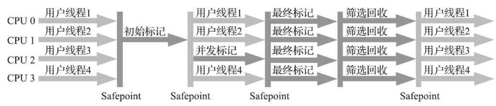

#### Shenandoah收集器

> 了解即可

* 支持并发的整理算法，G1的回收阶段是可以多线程并行的，但却不能与用户线程并发
* 没有实现分代
* 不在使用记忆集记录跨Region引用

详细步骤参见《深入理解Java虚拟机》第3.6.1节

<https://weread.qq.com/web/reader/cf1320d071a1a78ecf19254ka25329702bda2557a7b2ba9>?

#### ZGC收集器

* **低延迟垃圾收集器**：ZGC和Shenandoah的目标是高度相似的，都希望在尽可能对吞吐量影响不太大的前提下，实现在任意堆内存大小下都可以把垃圾收集的停顿时间限制在十毫秒以内的低延迟。

* **基于Region的内存布局**：ZGC的Region（在一些官方资料中将它称为Page或者ZPage）具有动态性——动态创建和销毁，以及动态的区域容量大小。在x64硬件平台下，ZGC的Region可以具有大、中、小三类容量：

  * 小型Region(Small Region)：容量固定为2MB，用于放置小于256KB的小对象。
  * 中型Region(Medium Region)：容量固定为32MB，用于放置大于等于256KB但小于4MB的对象。
  * 大型Region(Large Region)：容量不固定，可以动态变化，但必须为2MB的整数倍，用于放置4MB或以上的大对象。每个大型Region中只会存放一个大对象，这也预示着虽然名字叫作“大型Region”，但**它的实际容量完全有可能小于中型Region**，最小容量可低至4MB。大型Region在ZGC的实现中是不会被重分配（重分配是ZGC的一种处理动作，用于复制对象的收集器阶段）的，因为复制一个大对象的代价非常高昂。

* **使用染色指针技术**：

  * HotSpot虚拟机的几种收集器有不同的标记实现方案，有的把标记直接记录在对象头上（如Serial收集器），有的把标记记录在与对象相互独立的数据结构上（如G1、Shenandoah使用了一种相当于堆内存的1/64大小的，称为BitMap的结构来记录标记信息），而ZGC的染色指针是最直接的、最纯粹的，**它直接把标记信息记在引用对象的指针上**，这时，与其说可达性分析是遍历对象图来标记对象，还不如说是遍历“引用图”来标记“引用”了。
  * 染色指针是一种直接将少量额外的信息存储在指针上的技术，可是为什么指针本身也可以存储额外信息呢？在64位系统中，理论可以访问的内存高达16EB（2的64次幂）字节。实际上，基于需求（用不到那么多内存）、性能（地址越宽在做地址转换时需要的页表级数越多）和成本（消耗更多晶体管）的考虑，在AMD64架构中只支持到52位(4PB)的地址总线和48位(256TB)的虚拟地址空间，所以目前64位的硬件实际能够支持的最大内存只有256TB。此外，操作系统一侧也还会施加自己的约束，**64位的Linux则分别支持47位(128TB)的进程虚拟地址空间和46位(64TB)的物理地址空间**，64位的Windows系统甚至只支持44位(16TB)的物理地址空间。
  * 尽管Linux下64位指针的高18位不能用来寻址，但剩余的46位指针所能支持的64TB内存在今天仍然能够充分满足大型服务器的需要。鉴于此，**ZGC的染色指针技术继续盯上了这剩下的46位指针宽度，将其高4位提取出来存储四个标志信息。**通过这些标志位，虚拟机可以直接从指针中看到其引用对象的三色标记状态、是否进入了重分配集（即被移动过）、是否只能通过finalize()方法才能被访问到，如图3-20所示。当然，由于这些标志位进一步压缩了原本就只有46位的地址空间，也直接导致ZGC能够管理的内存不可以超过4TB（2的42次幂)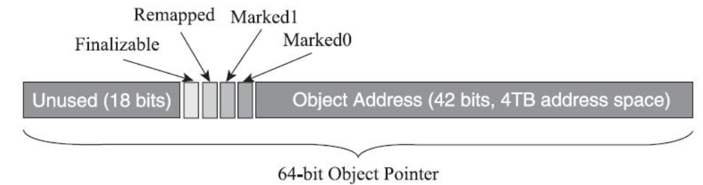

  染色指针的优势：

  * 染色指针可以使得一旦某个Region的存活对象被移走之后，这个Region立即就能够被释放和重用掉，而不必等待整个堆中所有指向该Region的引用都被修正后才能清理。
  * 染色指针可以大幅减少在垃圾收集过程中内存屏障的使用数量，设置内存屏障，尤其是写屏障的目的通常是为了记录对象引用的变动情况，如果将这些信息直接维护在指针中，显然就可以省去一些专门的记录操作。实际上，到目前为止ZGC都并未使用任何写屏障，只使用了读屏障（一部分是染色指针的功劳，一部分是ZGC现在还不支持分代收集，天然就没有跨代引用的问题）。内存屏障对程序运行时性能的损耗在前面章节中已经讲解过，能够省去一部分的内存屏障，显然对程序运行效率是大有裨益的，所以ZGC对吞吐量的影响也相对较低。
  * 染色指针可以作为一种可扩展的存储结构用来记录更多与对象标记、重定位过程相关的数据，以便日后进一步提高性能。现在Linux下的64位指针还有前18位并未使用，它们虽然不能用来寻址，却可以通过其他手段用于信息记录。如果开发了这18位，既可以腾出已用的4个标志位，将ZGC可支持的最大堆内存从4TB拓展到64TB，也可以利用其余位置再存储更多的标志，譬如存储一些追踪信息来让垃圾收集器在移动对象时能将低频次使用的对象移动到不常访问的内存区域。

  染色指针如何解决寻址问题：多个虚拟内存对应一块真是的物理内存。

* 并发收集过程：

  

  1. **并发标记**，在染色指针上进行
  2. **并发预备重分配**：这个阶段需要根据特定的查询条件统计得出本次收集过程**要清理哪些Region，将这些Region组成重分配集(Relocation Set)**。重分配集与G1收集器的回收集(Collection Set)还是有区别的，ZGC划分Region的目的并非为了像G1那样做收益优先的增量回收。相反，ZGC每次回收都会扫描所有的Region，用范围更大的扫描成本换取省去G1中记忆集的维护成本。因此，ZGC的重分配集只是决定了里面的存活对象会被重新复制到其他的Region中，里面的Region会被释放，而并不能说回收行为就只是针对这个集合里面的Region进行，因为标记过程是针对全堆的。
  3. **并发重分配**：重分配是ZGC执行过程中的核心阶段，这个过程要**把重分配集中的存活对象复制到新的Region上，并为重分配集中的每个Region维护一个转发表(Forward Table)，记录从旧对象到新对象的转向关系。**得益于染色指针的支持，ZGC收集器能仅从引用上就明确得知一个对象是否处于重分配集之中，如果用户线程此时并发访问了位于重分配集中的对象，这次访问将会被预置的内存屏障所截获，然后立即根据Region上的转发表记录将访问转发到新复制的对象上，并同时修正更新该引用的值，使其直接指向新对象，ZGC将这种行为称为指针的“自愈”(Self-Healing)能力。
  4. **并发重映射**：重映射所做的就是**修正整个堆中指向重分配集中旧对象的所有引用**，这一点从目标角度看是与Shenandoah并发引用更新阶段一样的，但是ZGC的并发重映射并**不是一个必须要“迫切”去完成的任务**，因为前面说过，即使是旧引用，它也是可以自愈的，最多只是第一次使用时多一次转发和修正操作。重映射清理这些旧引用的主要目的是为了不变慢（还有清理结束后可以释放转发表这样的附带收益），所以说这并不是很“迫切”。因此，ZGC很巧妙地把并发重映射阶段要做的工作，合并到了下一次垃圾收集循环中的并发标记阶段里去完成，反正它们都是要遍历所有对象的，这样合并就节省了一次遍历对象图的开销。一旦所有指针都被修正之后，原来记录新旧对象关系的转发表就可以释放掉了。

* **支持“NUMA-Aware”的内存分配**：NUMA（Non-Uniform Memory Access，非统一内存访问架构）是一种为多处理器或者多核处理器的计算机所设计的内存架构。由于摩尔定律逐渐失效，现代处理器因频率发展受限转而向多核方向发展，以前原本在北桥芯片中的内存控制器也被集成到了处理器内核中，这样每个处理器核心所在的裸晶(DIE)都有属于自己内存管理器所管理的内存，如果要访问被其他处理器核心管理的内存，就必须通过Inter-Connect通道来完成，这要比访问处理器的本地内存慢得多。**在NUMA架构下，ZGC收集器会优先尝试在请求线程当前所处的处理器的本地内存上分配对象，以保证高效内存访问。**在ZGC之前的收集器就只有针对吞吐量设计的Parallel Scavenge支持NUMA内存分配，如今ZGC也成为另外一个选择。

### 分代收集理论中如何解决跨代引用问题？

讲解分代收集理论的时候，提到了为解决对象跨代引用所带来的问题，**垃圾收集器在新生代中建立了名为记忆集(Remembered Set)的数据结构，用以避免把整个老年代加进GC Roots扫描范围。**事实上并不只是新生代、老年代之间才有跨代引用的问题，所有涉及部分区域收集(Partial GC)行为的垃圾收集器，典型的如G1、ZGC和Shenandoah收集器，都会面临相同的问题。

**记忆集是一种用于记录从非收集区域指向收集区域的指针集合的抽象数据结构。**如果我们不考虑效率和成本的话，最简单的实现可以用非收集区域中所有含跨代引用的对象数组来实现这个数据结构

这种记录全部含跨代引用对象的实现方案，无论是空间占用还是维护成本都相当高昂。而在垃圾收集的场景中，**收集器只需要通过记忆集判断出某一块非收集区域是否存在有指向了收集区域的指针就可以了**，并不需要了解这些跨代指针的全部细节。那设计者在实现记忆集的时候，便可以选择更为粗犷的记录粒度来节省记忆集的存储和维护成本，下面列举了一些可供选择（当然也可以选择这个范围以外的）的记录精度：

* 字长精度：每个记录精确到一个机器字长（就是处理器的寻址位数，如常见的32位或64位，这个精度决定了机器访问物理内存地址的指针长度），该字包含跨代指针。
* 对象精度：每个记录精确到一个对象，该对象里有字段含有跨代指针。
* **卡精度**：每个记录精确到一块内存区域，该区域内有对象含有跨代指针。

其中，第三种“卡精度”所指的是用一种称为“卡表”(Card Table)的方式去实现记忆集，这也是目前最常用的一种记忆集实现形式，一些资料中甚至直接把它和记忆集混为一谈。前面定义中提到记忆集其实是一种“抽象”的数据结构，抽象的意思是只定义了记忆集的行为意图，并没有定义其行为的具体实现。卡表就是记忆集的一种具体实现，它定义了记忆集的记录精度、与堆内存的映射关系等。关于卡表与记忆集的关系，读者不妨按照Java语言中HashMap与Map的关系来类比理解。

一个卡页的内存中通常包含不止一个对象，只要卡页内有一个（或更多）对象的字段存在着跨代指针，那就将对应卡表的数组元素的值标识为1，称为这个元素变脏(Dirty)，没有则标识为0。**在垃圾收集发生时，只要筛选出卡表中变脏的元素，就能轻易得出哪些卡页内存块中包含跨代指针，把它们加入GC Roots中一并扫描。**

### 对象分配规则？

1. **对象优先在新生代Eden区中分配。**当Eden区没有足够空间进行分配时，虚拟机将发起一次Minor GC。
2. **大对象直接进入老年代**：在分配空间时，它容易导致内存明明还有不少空间时就提前触发垃圾收集
3. **长期存活的对象将进入老年代**：HotSpot虚拟机中多数收集器都采用了分代收集来管理堆内存，那内存回收时就必须能决策哪些存活对象应当放在新生代，哪些存活对象放在老年代中。为做到这点，虚拟机给每个对象定义了一个对象年龄(Age)计数器，存储在对象头中。**对象通常在Eden区里诞生，如果经过第一次Minor GC后仍然存活，并且能被Survivor容纳的话，该对象会被移动到Survivor空间中，并且将其对象年龄设为1岁。对象在Survivor区中每熬过一次Minor GC，年龄就增加1岁，当它的年龄增加到一定程度（默认为15），就会被晋升到老年代中。**
4. **动态对象年龄判定**：如果在Survivor空间中相同年龄所有对象大小的总和大于Survivor空间的一半，年龄大于或等于该年龄的对象就可以直接进入老年代，无须等到`-XX：MaxTenuringThreshold`中要求的年龄。
5. **空间分配担保**：在发生Minor GC之前，虚拟机必须先检查老年代最大可用的连续空间是否大于新生代所有对象总空间，如果这个条件成立，那这一次Minor GC可以确保是安全的。**如果不成立，则虚拟机会先查看-XX：HandlePromotionFailure参数的设置值是否允许担保失败(Handle Promotion Failure)；如果允许，那会继续检查老年代最大可用的连续空间是否大于历次晋升到老年代对象的平均大小，如果大于，将尝试进行一次Minor GC**，尽管这次Minor GC是有风险的；如果小于，或者-XX：HandlePromotionFailure设置不允许冒险，那这时就要改为进行一次Full GC。

### 类加载器是什么？

Java虚拟机设计团队有意把类加载阶段中的“**通过一个类的全限定名来获取描述该类的二进制字节流**”这个动作放到Java虚拟机外部去实现，以便让应用程序自己决定如何去获取所需的类。实现这个动作的代码被称为“类加载器”(Class Loader)。

简单化：类加载器，负责读取 Java 字节代码（可能从.class文件，也可能动态生成或从网络获取），并转换成 `java.lang.Class` 类的一个实例。

> 比较两个类是否“相等”，**只有在这两个类是由同一个类加载器加载的前提下才有意义，否则，即使这两个类来源于同一个Class文件，被同一个Java虚拟机加载，只要加载它们的类加载器不同，那这两个类就必定不相等。**

### 双亲委派模型是什么？

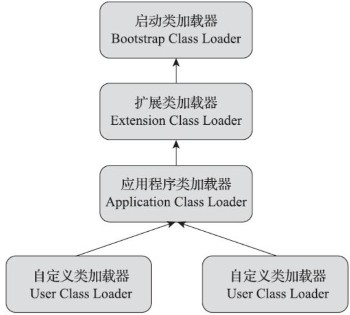

> 双亲委派模型要求除了顶层的启动类加载器外，其余的类加载器都应有自己的父类加载器。不过这里类加载器之间的父子关系一般不是以继承(Inheritance)的关系来实现的，而是通常使用组合(Composition)关系来复用父加载器的代码。

如果一个类加载器收到了类加载的请求，它首先不会自己去尝试加载这个类，而是把这个请求委派给父类加载器去完成，每一个层次的类加载器都是如此，因此所有的加载请求最终都应该传送到最顶层的启动类加载器中，只有当父加载器反馈自己无法完成这个加载请求（它的搜索范围中没有找到所需的类）时，子加载器才会尝试自己去完成加载。

一个显而易见的好处就是Java中的类随着它的类加载器一起具备了一种带有优先级的层次关系。例如类java.lang.Object，它存放在rt.jar之中，无论哪一个类加载器要加载这个类，最终都是委派给处于模型最顶端的启动类加载器进行加载，因此Object类在程序的各种类加载器环境中都能够**保证是同一个类**。

### 为什么破坏双亲委派模型？

1. 双亲委派很好地解决了各个类加载器协作时基础类型的一致性问题（越基础的类由越上层的加载器进行加载），基础类型之所以被称为“基础”，是因为它们总是作为被用户代码继承、调用的API存在，但程序设计往往没有绝对不变的完美规则，如果有**基础类型又要调用回用户的代码**，那该怎么办呢？

2. 对程序动态性的追求而导致的，这里所说的“动态性”指的是一些非常“热”门的名词：代码热替换(Hot Swap)、模块热部署(Hot Deployment)等。说白了就是希望Java应用程序能像我们的电脑外设那样，接上鼠标、U盘，不用重启机器就能立即使用，鼠标有问题或要升级就换个鼠标，不用关机也不用重启。对于个人电脑来说，重启一次其实没有什么大不了的，但对于一些生产系统来说，关机重启一次可能就要被列为生产事故。

## SpringMVC

### DispatcherServlet的工作流程？


1. **发送请求**

   用户向服务器发送 HTTP 请求，请求被 Spring MVC 的调度控制器 DispatcherServlet 捕获。

2. **映射处理器**

   DispatcherServlet 根据请求 URL ，调用 HandlerMapping 获得该 Handler 配置的所有相关的对象（包括 **Handler** 对象以及 Handler 对象对应的**拦截器**），最后以 `HandlerExecutionChain` 对象的形式返回。

3. **处理器适配**

   **DispatcherServlet 根据获得的 Handler，选择一个合适的HandlerAdapter 。（附注：如果成功获得 HandlerAdapter 后，此时将开始执行拦截器的 `#preHandler(...)` 方法）。**

   **提取请求 Request 中的模型数据，填充 Handler 入参，开始执行Handler（Controller)。** 在填充Handler的入参过程中，根据你的配置，Spring 将帮你做一些额外的工作：

   * HttpMessageConverter ：会将请求消息（如 JSON、XML 等数据）转换成一个对象。
   * 数据转换：对请求消息进行数据转换。如 String 转换成 Integer、Double 等。
   * 数据格式化：对请求消息进行数据格式化。如将字符串转换成格式化数字或格式化日期等。
   * 数据验证： 验证数据的有效性（长度、格式等），验证结果存储到 BindingResult 或 Error 中。

   **Handler(Controller) 执行完成后，向 DispatcherServlet 返回一个 ModelAndView 对象。**

4. **解析视图**

   根据返回的 ModelAndView ，选择一个适合的 ViewResolver（必须是已经注册到 Spring 容器中的 ViewResolver)，解析出 View 对象，然后返回给 DispatcherServlet。

5. **渲染视图** + **响应请求**

   ViewResolver 结合 Model 和 View，来渲染视图，并写回给用户( 浏览器 )。

> 如果我们的`Controller`类的方法有`@ResponseBody`注解时，会将对象进行转换并直接返回给客户端。

### SpringMVC常见注解有哪些？

* `@Controller`
* `@RestController`
* `@RequestMapping`
* `@GetMapping`
* `@PathVariable`

### 拦截器和过滤器有什么区别？

> 推荐阅读：<https://blog.csdn.net/xinzhifu1/article/details/106356958>

#### 1、实现原理不同

过滤器和拦截器 底层实现方式大不相同，`过滤器` 是基于函数回调的，`拦截器` 则是基于Java的反射机制（动态代理）实现的。

#### 2、使用范围不同

我们看到过滤器 实现的是 `javax.servlet.Filter` 接口，而这个接口是在`Servlet`规范中定义的，也就是说过滤器`Filter` 的使用要依赖于`Tomcat`等容器，导致它只能在`web`程序中使用。

而拦截器(`Interceptor`) 它是一个`Spring`组件，并由`Spring`容器管理，并不依赖`Tomcat`等容器，是可以单独使用的。不仅能应用在`web`程序中，也可以用于`Application`、`Swing`等程序中。

#### 3、触发时机不同

`过滤器` 和 `拦截器`的触发时机也不同，我们看下边这张图。

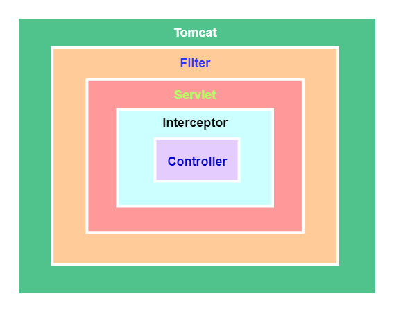

过滤器Filter是在请求进入容器后，但在进入servlet之前进行预处理，请求结束是在servlet处理完以后。

拦截器 Interceptor 是在请求进入servlet后，在进入Controller之前进行预处理的，Controller 中渲染了对应的视图之后请求结束。

#### 4、拦截的请求范围不同

过滤器几乎可以对所有进入容器的请求起作用，而拦截器只会对`Controller`中请求或访问`static`目录下的资源请求起作用。

#### 5、控制执行顺序不同

先声明的拦截器 `preHandle()` 方法先执行，而`postHandle()`方法反而会后执行。

#### 6、注入Bean情况不同

`拦截器`加载的时间点在`springcontext`之前,而`过滤器`加载时间在其之后。

## SpringBoot

### Spring Boot 是什么？

[Spring Boot](https://github.com/spring-projects/spring-boot) 是 Spring 的**子项目**，正如其名字，提供 Spring 的引导( **Boot** )的功能。

通过 Spring Boot ，我们开发者可以快速配置 Spring 项目，引入各种 Spring MVC、Spring Transaction、Spring AOP、MyBatis 等等框架，而**无需不断重复编写繁重的 Spring 配置，降低了 Spring 的使用成本。**

**Spring Boot 提供了各种 Starter 启动器，提供标准化的默认配置。**

### SpringBoot的优缺点？

优点：使编码、配置、部署变得简单。

缺点：就像Java内存一样，墙里的人想出来，墙外面的人想进去。springboot提供了Bean自动注入的功能，但也正因如此，如果我们想自定义一些Bean时，就可能存在冲突。

### Spring Boot 中的 Starter 是什么？

Starter **POM** 是一组方便的依赖描述符，我们可以将其引入项目以提供标准化的默认配置。

### SpringBoot热部署？

或许可以使用`spring-boot-devtools`插件？我也没有试过，我嘛也不知道哇！

### SpringBoot核心注解？

`@SpringBootApplication`注解，标注在该注解上的注解重要的有以下三个：

1. `@Configuration`：指定类是Bean定义的配置类。
2. `@ComponentScan`：扫描指定包下的Bean。
3. `@EnableAutoConfiguration`：打开自动配置的功能。
   1. Spring Boot 在启动时扫描项目所依赖的 jar 包，寻找包含`spring.factories` 文件的 jar 包。
   2. 根据 `spring.factories` 配置加载 AutoConfigure 类。
   3. 根据 `@Conditional` 等条件注解的条件，进行自动配置并将 Bean 注入 Spring IoC 中。

## Spring

### Spring是什么？

 "Spring" 在不同的语境中意味着不同的东西。它可以用来指代Spring Framework项目本身，它是一切的开始。随着时间的推移，其他Spring项目也被建立在Spring Framework之上。大多数时候，当人们说 "Spring" 时，他们指的是整个项目家族（全家桶）。这个参考文档的重点是基础：Spring框架本身。

>上述是官方文档的翻译。

### Spring Framwork核心模块？

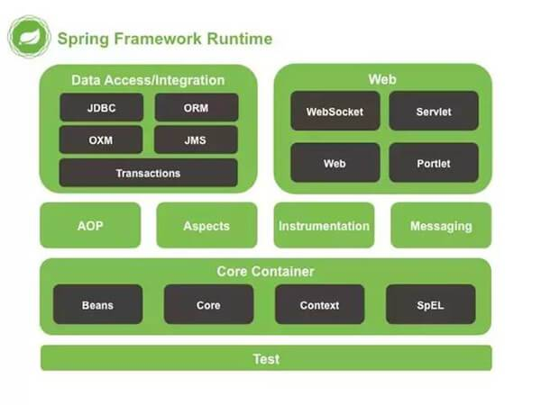

**Core Container**

* Spring Core：核心容器提供 Spring 框架的基本功能。核心容器的主要组件是 BeanFactory，它是工厂模式的实现。BeanFactory 使用控制反转 （IOC）模式将应用程序的配置和依赖性规范与实际的应用程序代码分开。

* Spring Bean
* Spring Context：Spring 上下文是一个配置文件，向 Spring 框架提供上下文信息。Spring 上下文包括企业服务，例如 JNDI、EJB、电子邮件、国际化、事件机制、校验和调度功能。
* SpEL (Spring Expression Language)

**Data Accesss**

* JDBC：Spring 对 JDBC 的封装模块，提供了对关系数据库的访问。
* ORM (Object Relational Mapping)：Spring ORM 模块，提供了对 hibernate5 和 JPA 的集成。
  * hibernate5 是一个 ORM 框架。
  * JPA 是一个 Java 持久化 API 。
* OXM (Object XML Mappers)：Spring 提供了一套类似 ORM 的映射机制，用来将 Java 对象和 XML 文件进行映射。这就是 Spring 的对象 XML 映射功能，有时候也成为 XML 的序列化和反序列化。
* Transaction：Spring 简单而强大的事务管理功能，包括声明式事务和编程式事务。

**Web**

* WebMVC：MVC 框架是一个全功能的构建 Web 应用程序的 MVC 实现。通过策略接口，MVC 框架变成为高度可配置的，MVC 容纳了大量视图技术，其中包括 JSP、Velocity、Tiles、iText 和 POI。
* WebFlux：基于 Reactive 库的响应式的 Web 开发框架
* WebSocket：
  * Spring 4.0 的一个最大更新是增加了对 Websocket 的支持。
  * Websocket 提供了一个在 Web 应用中实现高效、双向通讯，需考虑客户端(浏览器)和服务端之间高频和低延时消息交换的机制。
  * 一般的应用场景有：在线交易、网页聊天、游戏、协作、数据可视化等。

**AOP**

* AOP：通过配置管理特性，Spring AOP 模块直接将面向方面的编程功能集成到了 Spring 框架中。所以，可以很容易地使 Spring 框架管理的任何对象支持 AOP。
* Aspects：该模块为与 AspectJ 的集成提供支持。
* Instrumentation：该层为类检测和类加载器实现提供支持。

**其它**

* JMS (Java Messaging Service)：提供了一个 JMS 集成框架，简化了 JMS API 的使用。
* Test：为JUnit和TestNG提供支持。
* Messaging：该模块为 STOMP 提供支持。它还支持注解编程模型，该模型用于从 WebSocket 客户端路由和处理 STOMP 消息。

### 使用 Spring 框架能带来哪些好处？

* **DI** ：**Dependency Injection** 方法，使得构造器和 JavaBean、properties 文件中的依赖关系一目了然。
* **轻量级**：与 EJB 容器相比较，IoC 容器更加趋向于**轻量级**。这样一来 IoC 容器在有限的内存和 CPU 资源的情况下，进行应用程序的开发和发布就变得十分有利。
* **面向切面编程(AOP)**： Spring 支持面向**切面编程**，同时把应用的业务逻辑与系统的服务分离开来。
* **集成主流框架**：Spring 并没有闭门造车，Spring **集成**了已有的技术栈，比如 ORM 框架、Logging 日期框架、J2EE、Quartz 和 JDK Timer ，以及其他视图技术。
* 模块化：Spring 框架是按照**模块**的形式来组织的。由包和类的命名，就可以看出其所属的模块，开发者仅仅需要选用他们需要的模块即可。
* **便捷的测试**：要测试一项用Spring开发的应用程序十分简单，因为**测试**相关的环境代码都已经囊括在框架中了。
* **Web 框架**：Spring 的 **Web 框架**亦是一个精心设计的 Web MVC 框架，为开发者们在 Web 框架的选择上提供了一个除了主流框架比如 Struts 、过度设计的、不流行 Web 框架的以外的有力选项。
* **事务管理**：Spring 提供了一个便捷的**事务管理**接口，适用于小型的本地事物处理（比如在单 DB 的环境下）和复杂的共同事物处理（比如利用 JTA 的复杂 DB 环境）。
* **异常处理**：Spring 提供一个方便的 API ，将特定技术的异常(由JDBC, Hibernate, 或 JDO 抛出)转化为一致的、Unchecked 异常。

### 什么是Spring IoC容器？

`org.springframework.context.ApplicationContext` 接口代表 Spring IoC 容器，负责实例化、配置和组装 bean。

* 容器通过读取**[配置元数据](# 什么是配置元数据？)**来获取要实例化、配置和组装哪些对象的指令。

> 例如，OpenFeign是流行的RPC框架，在它的源码里就是通过自定义客户端代理接口配置元数据，再由IoC容器进行组装，从而在标注`@FeignClient`注解的地方可以看到注册的Bean。

### 什么是配置元数据？

配置元数据表示开发者告诉Spring Container如何去实例化、配置和组装应用程序中的对象。

Spring容器写入配置元数据有以下几种方式：

1. 基于XML
2. 基于注解，例如@Service
3. 基于java configuration，例如@Configuration、@Bean、@Import

### IoC和DI有什么区别？

IoC是目的，DI是手段。

* IoC控制反转，是指将用户创建对象的权利（例如通过传统方式new等硬编码方式）交给容器，由容器去创建和管理对象。

* DI是IoC的一种特殊形式，对象仅通过构造函数参数、工厂方法参数或在对象实例上设置的属性来**定义其依赖关系（XML，Java注解、Java配置）**，由工厂方法构造或返回。之后，IoC容器在创建bean时注入这些依赖项。

  程序运行过程中，若需要调用另一个对象协助时，无须在代码中创建被调用者，而是依赖于外部容器，由外部容器创建后传递给程序。依赖注入是目前最优秀的**解耦**方式。

> 还是以Openfeign为例，它有一个方法`org.springframework.cloud.openfeign.FeignClientsRegistrar#eagerlyRegisterFeignClientBeanDefinition`,在这里，就是通过配置元数据，定义Bean Definition，再由容器创建管理该Bean。关键代码如下：
>
> ```java
> BeanDefinitionHolder holder = new BeanDefinitionHolder(beanDefinition, className, qualifiers);
> BeanDefinitionReaderUtils.registerBeanDefinition(holder, registry);
> ```

### 依赖注入的两种方式？

* 基于构造函数的DI
* 基于Setter的DI

`ApplicationContext` 支持其管理的 bean 的基于构造函数和基于 setter 的 DI。**在通过构造函数方法注入一些依赖项后，它还支持基于 setter 的 DI。**您可以以 `BeanDefinition` 的形式配置依赖项，将其与 `PropertyEditor` 实例结合使用，将属性从一种格式转换为另一种格式。然而，大多数 Spring 用户并不直接使用这些类（即以编程方式），而是使用 XML `bean` 定义、带注释的组件（即用 `@Component` 、 `@Controller` 等），或基于 Java 的 `@Configuration` 类中的 `@Bean` 方法。然后，这些源在内部转换为 `BeanDefinition` 的实例，并用于加载整个 Spring IoC 容器实例。

### 预实例化单例bean？

**Spring框架在容器加载时能够检测到一些配置问题，比如引用了不存在的Bean或存在循环依赖。**Spring会在实际创建Bean时设置属性和解析依赖，因此当请求对象时，如果创建对象或其依赖存在问题，可能会生成异常。**为了及早发现这些配置问题**，默认情况下ApplicationContext实现会提前实例化单例Bean，以便在创建ApplicationContext时就发现配置问题。但你仍然可以覆盖这种默认行为，使得单例Bean延迟初始化，而不是在实际需要时提前创建。

### Spring的两种IoC容器？

| BeanFactory                | ApplicationContext       |
| :------------------------- | :----------------------- |
| 它使用懒加载               | 它使用即时加载           |
| 它使用语法显式提供资源对象 | 它自己创建和管理资源对象 |
| 不支持国际化               | 支持国际化               |
| 不支持基于依赖的注解       | 支持基于依赖的注解       |

BeanFactory接口能够管理任何类型对象的高级配置机制。而ApplicationContext是BeanFactory的子接口。

**简而言之， `BeanFactory` 提供了配置框架和基本功能， `ApplicationContext` 添加了更多企业特定的功能。**

另外，BeanFactory 也被称为**低级**容器，而 ApplicationContext 被称为**高级**容器。

### IoC的一些好处？

* 它以最小的影响和最少的侵入机制促进**松耦合**。
* 它支持**即时的实例化和延迟加载** Bean 对象。

* 它将最小化应用程序中的代码量。
* 它将使您的应用程序易于测试，因为它不需要单元测试用例中的任何单例或 JNDI 查找机制。

### IoC的实现机制？

Spring 中的 IoC 的实现原理，就是**工厂模式**加**反射机制**。

我们在元数据中获取到Bean的全限定类名，在工厂使用反射机制动态加载类，并通过反射创建 Bean 的实例。再根据配置信息中定义的依赖关系（构造器注入、属性注入）将创建好的Bean实例装配到其他Bean中。而容器负责管理Bean的生命周期，应用程序通过容器获取需要的 Bean，而不需要自己创建对象，从而实现了控制反转。

```java
interface Fruit {

     public abstract void eat();
     
}
class Apple implements Fruit {

    public void eat(){
        System.out.println("Apple");
    }
    
}
class Orange implements Fruit {
    public void eat(){
        System.out.println("Orange");
    }
}

class Factory {

    public static Fruit getInstance(String className) {
        Fruit f = null;
        try {
            f = (Fruit) Class.forName(className).newInstance();
        } catch (Exception e) {
            e.printStackTrace();
        }
        return f;
    }
    
}

class Client {

    public static void main(String[] args) {
        Fruit f = Factory.getInstance("io.github.dunwu.spring.Apple");
        if(f != null){
            f.eat();
        }
    }
    
}
```

### Bean的定义是什么？

在spring中，[Bean](https://docs.spring.io/spring-framework/reference/core/beans/definition.html)是由Spring IoC容器实例化、组装和管理的对象，换而言之，Bean只是应用程序中的众多对象之一。**Bean以及它们之间的依赖关系在容器使用的配置元数据中得到反映**。

在容器内，这些Bean定义表示为BeanDefinition对象，其中包括以下元数据：

* 包限定类名：通常是Bean的实际实现类
* Bean行为配置元素：说明Bean中容器中的行为方式（范围、生命周期回调等）
* 对Bean完成其工作所需的其他Bean的引用。
* 在新创建的对象中设置的其它配置参数，举例来说，如果你在Spring中创建了一个用于管理数据库连接池的bean，你可能需要设置一些配置参数，比如连接池的最大大小、最小大小、空闲连接超时时间等。

### 定义Bean的几种方式？

1. XML配置文件
2. 注解配置（@Service）
3. Java Config配置（@Bean）
4. 自定义Bean Definition（多在框架中使用，一般的crud根本用不到。。。）

> 关于第4点的补充：
>
> 除了包含有关如何创建特定 bean 的信息的 bean 定义之外， **`ApplicationContext` 还允许注册在容器外部（由用户）创建的现有对象**。这是通过 `getBeanFactory()` 方法访问 ApplicationContext 的 `BeanFactory` 来完成的，该方法返回 `DefaultListableBeanFactory` 实现。 `DefaultListableBeanFactory` 通过 `registerSingleton(..)` 和 `registerBeanDefinition(..)` 方法支持此注册。**然而，典型的应用程序仅使用通过常规 bean 定义元数据定义的 bean。**
>
> Bean 元数据和手动提供的单例实例需要尽早注册，以便容器在自动装配和其他自省步骤期间正确推理它们。

### Spring 支持几种Bean Scope？

* Singleton - 每个 Spring IoC 容器仅有一个单 Bean 实例。**默认**
* Prototype - 每次请求都会产生一个新的实例。
* Request - 每一次 HTTP 请求都会产生一个新的 Bean 实例，并且该 Bean 仅在当前 HTTP 请求内有效。
* Session - 每一个的 Session 都会产生一个新的 Bean 实例，同时该 Bean 仅在当前 HTTP Session 内有效。
* Application - 每一个 Web Application 都会产生一个新的 Bean ，同时该 Bean 仅在当前 Web Application 内有效。

### Spring Bean初始化流程

关键词：实例化Bean，Aware属性设置，init初始化

* 实例化 Bean 对象

  * Spring 容器根据配置中的 Bean Definition(定义)中**实例化** Bean 对象。
  * Spring 使用依赖注入**填充**所有属性，如 Bean 中所定义的配置。

* Aware 相关的属性，注入到 Bean 对象

  * 如果 Bean 实现 **BeanNameAware** 接口，则工厂通过传递 Bean 的 beanName 来调用 `#setBeanName(String name)` 方法。
  * 如果 Bean 实现 **BeanFactoryAware** 接口，工厂通过传递自身的实例来调用 `#setBeanFactory(BeanFactory beanFactory)` 方法。

  > 初学者可能会对Aware这个单词不太理解，Aware直译为“意识到的”，但是放在Spring的语境显然不合适。
  >
  > 我们可以将其理解为表示某个对象具有意识（awareness）或感知（awareness）某些特定环境或情况的能力。例如，Spring 中的各种 "Aware" 接口，允许对象意识到（aware）或感知（aware）到容器的某些特定方面或功能。
  >
  > 例如，`ResourceLoaderAware` 可以翻译为 "资源加载器感知器"，表示对象是一个资源加载器的感知器。

* 调用相应的方法，进一步初始化 Bean 对象

  * 如果存在与 Bean 关联的任何 **BeanPostProcessor** 们，则调用 `#preProcessBeforeInitialization(Object bean, String beanName)` 方法。
  * 如果 Bean 实现 **InitializingBean** 接口，则会调用 `#afterPropertiesSet()` 方法。
  * 如果为 Bean 指定了 **init** 方法（例如 `<bean />` 的 `init-method` 属性），那么将调用该方法。
  * 如果存在与 Bean 关联的任何 **BeanPostProcessor** 们，则将调用 `#postProcessAfterInitialization(Object bean, String beanName)` 方法。

Spring Bean 的**销毁**流程如下：

* 如果 Bean 实现 **DisposableBean** 接口，当 spring 容器关闭时，会调用 `#destroy()` 方法。
* 如果为 bean 指定了 **destroy** 方法（例如 `<bean />` 的 `destroy-method` 属性），那么将调用该方法。

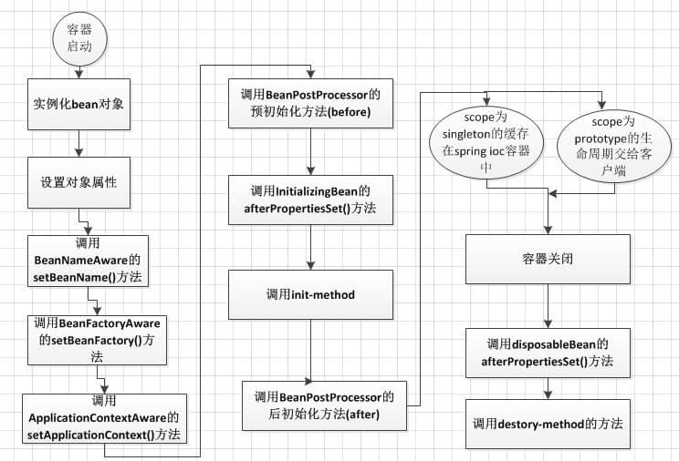

### 什么是延迟加载？

* 当容器启动之后，作用域为单例的 Bean ，不会立即创建。
* 而是在获得该 Bean 时，才真正在创建加载。

### 方法注入是什么？

在大多数应用场景中，容器中的大部分bean都是单例的。当一个单例 bean 需要与另一个单例 bean 协作或一个非单例 bean 需要与另一个非单例 bean 协作时，通常可以通过将一个 bean 定义为另一个 bean 的属性来处理依赖关系。当 bean 生命周期不同时就会出现问题。假设单例 bean A 需要使用非单例（原型）bean B，可能是在 A 上的每次方法调用上。容器仅创建单例 bean A 一次，因此只有一次设置属性的机会。**每次需要 bean B 时，容器无法为 bean A 提供新的 bean B 实例。**

**在Spring中，方法注入（Method Injection）是一种依赖注入的方式，允许你在每次方法调用时动态地提供一个依赖对象。**这对于解决上述提到的问题非常有用，其中一个单例Bean需要与一个非单例Bean协作，但需要在每次方法调用时获得一个新的非单例Bean实例。

**方法注入可以通过在目标Bean中定义一个方法，该方法的参数类型是所需的依赖对象，然后由Spring容器动态调用该方法来注入依赖对象。**

```java
@Component
public class SingletonA {

    public void someMethod() {
        // 调用方法获取新的PrototypeB实例
        PrototypeB prototypeB = getPrototypeB();
        // 使用prototypeB进行一些操作
    }

    // 使用方法注入获取PrototypeB实例
    @Lookup
    protected PrototypeB getPrototypeB() {
        // Spring会在运行时动态生成子类来覆盖该方法，并提供所需的PrototypeB实例
        // do something...
        return ...;
    }
}
@Component
@Scope("prototype")
public class PrototypeB {
    // PrototypeB的一些属性和方法
}
```

### Spring是如何解决循环依赖的？

> 推荐阅读：<https://blog.csdn.net/qq_41907991/article/details/107164508>

Spring通过三级缓存解决了循环依赖，其中一级缓存为单例池（singletonObjects）,二级缓存为早期曝光对象earlySingletonObjects，三级缓存为早期曝光对象工厂（singletonFactories）。当A、B两个类发生循环引用时，在A完成实例化后，就使用实例化后的对象去创建一个对象工厂，并添加到三级缓存中，如果A被AOP代理，那么通过这个工厂获取到的就是A代理后的对象，如果A没有被AOP代理，那么这个工厂获取到的就是A实例化的对象。当A进行属性注入时，会去创建B，同时B又依赖了A，所以创建B的同时又会去调用getBean(a)来获取需要的依赖，此时的getBean(a)会从缓存中获取，第一步，先获取到三级缓存中的工厂；第二步，调用对象工工厂的getObject方法来获取到对应的对象，得到这个对象后将其注入到B中。紧接着B会走完它的生命周期流程，包括初始化、后置处理器等。当B创建完后，会将B再注入到A中，此时A再完成它的整个生命周期。至此，循环依赖结束！

### Spring AOP是什么？

> [前置阅读](https://segmentfault.com/a/1190000007469968#item-1-1)

AOP(Aspect-Oriented Programming), 即 **面向切面编程**, 它与 OOP( Object-Oriented Programming, 面向对象编程) 相辅相成, 提供了与 OOP 不同的抽象软件结构的视角.
在 OOP 中, 我们以类(class)作为我们的基本单元, 而 AOP 中的基本单元是 **Aspect(切面)**

### Aspect(切面)是什么？

`aspect` 由 `pointcount` 和 `advice` 组成, 它既包含了横切逻辑的定义, 也包括了连接点的定义. ==Spring AOP就是负责实施切面的框架, 它将切面(Aspect)所定义的横切逻辑(advice)织入到切面所指定(point cut)的连接点(join point)中.==
AOP的工作重心在于如何将增强织入目标对象的连接点上, 这里包含两个工作:

1. 如何通过 pointcut 和 advice 定位到特定的 joinpoint 上
2. 如何在 advice 中编写切面代码.

**可以简单地认为, 使用 @Aspect 注解的类就是切面.**

### advice(增强)是什么？

由 aspect 添加到特定的 join point(即满足 point cut 规则的 join point) 的一段代码.
许多 AOP框架, 包括 Spring AOP, 会将 advice 模拟为一个拦截器(interceptor), 并且在 join point 上维护多个 advice, 进行层层拦截.
例如 HTTP 鉴权的实现, 我们可以为每个使用 RequestMapping 标注的方法织入 advice, 当 HTTP 请求到来时, 首先进入到 advice 代码中, 在这里我们可以分析这个 HTTP 请求是否有相应的权限, 如果有, 则执行 Controller, 如果没有, 则抛出异常. 这里的 advice 就扮演着鉴权拦截器的角色了.

### 连接点(join point)是什么？

> a point during the execution of a program, such as the execution of a method or the handling of an exception. In Spring AOP, a join point always represents a method execution.

程序运行中的一些时间点, 例如一个方法的执行, 或者是一个异常的处理.
`在 Spring AOP 中, join point 总是方法的执行点, 即只有方法连接点.`

### 切点(point cut)是什么？

匹配 join point 的谓词(a predicate that matches join points).
Advice 是和特定的 point cut 关联的, 并且在 point cut 相匹配的 join point 中执行.
`在 Spring 中, 所有的方法都可以认为是 joinpoint, 但是我们并不希望在所有的方法上都添加 Advice, 而 pointcut 的作用就是提供一组规则(使用 AspectJ pointcut expression language 来描述) 来匹配joinpoint, 给满足规则的 joinpoint 添加 Advice.`

### 关于join point 和 point cut 的区别？

在 Spring AOP 中, 所有的方法执行都是 join point. 而 point cut 是一个描述信息, 它修饰的是 join point, 通过 point cut, 我们就可以确定哪些 join point 可以被织入 Advice. 因此 join point 和 point cut 本质上就是两个不同纬度上的东西.
`advice 是在 join point 上执行的, 而 point cut 规定了哪些 join point 可以执行哪些 advice`

### 目标对象(Target)是什么？

织入 advice 的目标对象. 目标对象也被称为 `advised object`.
`因为 Spring AOP 使用运行时代理的方式来实现 aspect, 因此 adviced object 总是一个代理对象(proxied object)`
`注意, adviced object 指的不是原来的类, 而是织入 advice 后所产生的代理类.`

### AOP proxy是什么？

一个类被 AOP 织入 advice, 就会产生一个结果类, 它是融合了原类和增强逻辑的代理类.
在 Spring AOP 中, 一个 AOP 代理是一个 JDK 动态代理对象或 CGLIB 代理对象.

### 织入(Weaving)是什么？

将 aspect 和其他对象连接起来, 并创建 adviced object 的过程.
根据不同的实现技术, AOP织入有三种方式:

* 编译器织入, 这要求有特殊的Java编译器.
* 类装载期织入, 这需要有特殊的类装载器.
* 动态代理织入, 在运行期为目标类添加增强(Advice)生成子类的方式.
  Spring 采用动态代理织入, 而AspectJ采用编译器织入和类装载期织入.

### 关于 AOP Proxy是什么？

Spring AOP 默认使用标准的 JDK 动态代理(dynamic proxy)技术来实现 AOP 代理, 通过它, 我们可以为任意的接口实现代理.
**`如果需要为一个类实现代理, 那么可以使用 CGLIB 代理.`** 当一个业务逻辑对象没有实现接口时, 那么Spring AOP 就默认使用 CGLIB 来作为 AOP 代理了. 即如果我们需要为一个方法织入 advice, 但是这个方法不是一个接口所提供的方法, 则此时 Spring AOP 会使用 CGLIB 来实现动态代理. 鉴于此, **Spring AOP 建议基于接口编程, 对接口进行 AOP 而不是类.**

### Spring Translation是什么？

事务是逻辑上的一组操作，要么都执行，要么都不执行.

### Spring Translation管理接口介绍

* **PlatformTransactionManager：** （平台）事务管理器
* **TransactionDefinition：** 事务定义信息(事务隔离级别、传播行为、超时、只读、回滚规则)
* **TransactionStatus：** 事务运行状态

==**所谓事务管理，其实就是“按照给定的事务规则来执行提交或者回滚操作”。**==

### PlatformTransactionManager接口介绍

**Spring并不直接管理事务，而是提供了多种事务管理器** ，他们将事务管理的职责委托给Hibernate或者JTA等持久化机制所提供的相关平台框架的事务来实现。 Spring事务管理器的接口是： **org.springframework.transaction.PlatformTransactionManager** ，通过这个接口，Spring为各个平台如JDBC、Hibernate等都提供了对应的事务管理器，但是具体的实现就是各个平台自己的事情了。

```java
// 代码实现
/**
 * 这是Spring命令式事务基础结构中的中心接口，应用程序可以直接使用它，但它主要并不作为API使用：
 * 通常，应用程序将通过AOP与TransactionTemplate或声明式事务划分配合使用。
 *
 * 对于实现者，建议从提供的
 * {@link org.springframework.transaction.support.AbstractPlatformTransactionManager}
 * 类派生，该类预实现了定义的传播行为并处理事务同步。子类必须为底层事务的特定状态实现模板方法，
 * 例如：begin, suspend, resume, commit。
 *
 * 这个策略接口的经典实现是
 * {@link org.springframework.transaction.jta.JtaTransactionManager}。
 * 然而，在常见的单资源场景中，Spring特定的事务管理器
 * 比如JDBC, JPA, JMS是首选。
 */
public interface PlatformTransactionManager extends TransactionManager {

    /**
     * 根据指定的传播行为返回当前活动的事务或创建一个新事物。
     *
     * 请注意，隔离级别和超时等参数只会应用于新事物，因此在参与当前活动的事务时将会被忽略。
     *
     * 此外，并非所有事务定义设置都会被每个事务管理器支持：当遇到不受支持的事务时，一个正确的事务管理器实现应该抛出异常。
     *
     * 上述规则的一个例外是只读标志，如果不支持显式的只读模式，则应忽略该标志。本质上，只读标志只是潜在优化的一个提示。
     *
     * @param definition TransactionDefinition实例，可以为null，描述传播行为、隔离级别、超时等。
     * @return 表示新事务或当前事务的事务状态对象
  * @throws TransactionException 在查找、创建或系统错误情况下抛出
  * @throws IllegalTransactionStateException 如果给定的事务定义无法执行（例如，如果当前活动的事务与指定的传播行为冲突）
     */
    TransactionStatus getTransaction(@Nullable TransactionDefinition definition) throws TransactionException;

    /**
     * 根据事务的状态提交给定的事务。如果事务已被程序标记为仅回滚，则执行回滚。
  * 
  * 如果不是新事务，则省略提交以正确参与周围的事务。如果之前的事务已被挂起以便创建一个新事务，则在提交新事务后恢复之前的事务。
  * 
  * 请注意，当提交调用完成时，无论是正常完成还是抛出异常，事务都必须完全完成并清理。在这种情况下，不应期望有回滚调用。
  * 
  * 根据具体的事务管理器设置，{@code commit}可能会传播{@link org.springframework.dao.DataAccessException}，
  * 无论是在提交前刷新还是在实际提交步骤中。
  * @param status 由{@code getTransaction}方法返回的对象
  * @throws UnexpectedRollbackException 在事务协调器发起意外回滚的情况下抛出
  * @throws HeuristicCompletionException 在事务失败的情况下，由事务协调器的启发式决策引起
  * @throws TransactionSystemException 在提交或系统错误的情况下抛出
  * （通常由基本资源失败引起）
  * @throws IllegalTransactionStateException 如果给定的事务已经完成（即已提交或回滚）
     */
    void commit(TransactionStatus status) throws TransactionException;

    /**
     * 执行给定事务的回滚。
     * 如果事务不是新事务，只需将其设置为仅回滚即可正确参与周围事务。如果先前的事务已被暂停以便能够创建新事务，
     * 则在回滚新事务后恢复先前的事务。
     * 
     * 如果提交引发异常，则不要对事务调用回滚。即使出现提交异常，提交返回时事务也已经完成并清理完毕。
     * 因此，提交失败后的回滚调用将导致 IllegalTransactionStateException。
     * 根据具体的事务管理器设置， rollback也可能会传播org. springframework. dao. DataAccessException 。
     * @param:status – getTransaction方法返回的对象
     * @throws:
     * TransactionSystemException – 发生回滚或系统错误（通常由基本资源故障引起）
     * IllegalTransactionStateException – 如果给定事务已完成（即已提交或已回滚）
     */
    void rollback(TransactionStatus status) throws TransactionException;

}
```

> 请注意这句话`如果提交引发异常，则不要对事务调用回滚。即使出现提交异常，提交返回时事务也已经完成并清理完毕。

我们刚刚也说了Spring中PlatformTransactionManager根据不同持久层框架所对应的接口实现类,几个比较常见的如下图所示

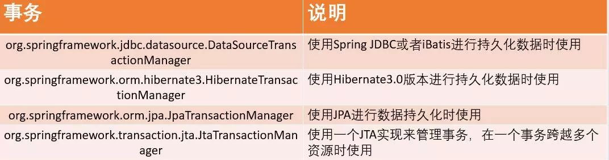

比如我们在使用JDBC或者iBatis（就是Mybatis）进行数据持久化操作时,我们的xml配置通常如下：

```xml
<!-- 事务管理器 -->
<bean id="transactionManager"
      class="org.springframework.jdbc.datasource.DataSourceTransactionManager">
    <!-- 数据源 -->
    <property name="dataSource" ref="dataSource" />
</bean>
```

### TransactionDefinition接口介绍

事务管理器接口 **PlatformTransactionManager** 通过 **getTransaction(TransactionDefinition definition)** 方法来得到一个事务，这个方法里面的参数是 **TransactionDefinition类** ，这个类就定义了一些基本的事务属性。

事务属性可以理解成事务的一些基本配置，描述了事务策略如何应用到方法上。事务属性包含了5个方面。下面便是这个五个属性的内容。

### 隔离级别

1. 隔离级别带来的问题

   * **脏读（Dirty read）:** 当一个事务正在访问数据并且对数据进行了修改，而这种修改还没有提交到数据库中，这时另外一个事务也访问了这个数据，然后使用了这个数据。因为这个数据是还没有提交的数据，那么另外一个事务读到的这个数据是“脏数据”，依据“脏数据”所做的操作可能是不正确的。

   * **丢失修改（Lost to modify）:** 指在一个事务读取一个数据时，另外一个事务也访问了该数据，那么在第一个事务中修改了这个数据后，第二个事务也修改了这个数据。这样第一个事务内的修改结果就被丢失，因此称为丢失修改。

     例如：事务1读取某表中的数据A=20，事务2也读取A=20，事务1修改A=A-1，事务2也修改A=A-1，最终结果A=19，事务1的修改被丢失。

   * **不可重复读（Unrepeatableread）:** 指在一个事务内多次读同一数据。在这个事务还没有结束时，另一个事务也访问该数据。那么，在第一个事务中的两次读数据之间，由于第二个事务的修改导致第一个事务两次读取的数据可能不太一样。这就发生了在一个事务内两次读到的数据是不一样的情况，因此称为不可重复读。

   * **幻读（Phantom read）:** 幻读与不可重复读类似。它发生在一个事务（T1）读取了几行数据，接着另一个并发事务（T2）插入了一些数据时。在随后的查询中，第一个事务（T1）就会发现多了一些原本不存在的记录，就好像发生了幻觉一样，所以称为幻读。

   > ps: 不可重复读的重点是修改，幻读的重点在于新增或者删除。
   >
   > 例1（同样的条件, 你读取过的数据, 再次读取出来发现值不一样了 ）：事务1中的A先生读取自己的工资为 1000的操作还没完成，事务2中的B先生就修改了A的工资为2000，导 致A再读自己的工资时工资变为 2000；这就是不可重复读。
   >
   > 例2（同样的条件, 第1次和第2次读出来的记录数不一样 ）：假某工资单表中工资大于3000的有4人，事务1读取了所有工资大于3000的人，共查到4条记录，这时事务2 又插入了一条工资大于3000的记录，事务1再次读取时查到的记录就变为了5条，这样就导致了幻读。

2. 隔离级别

   * **TransactionDefinition.ISOLATION_DEFAULT:** 使用后端数据库默认的隔离级别，Mysql 默认采用的 **REPEATABLE_READ**隔离级别 Oracle 默认采用的 READ_COMMITTED隔离级别.
   * **TransactionDefinition.ISOLATION_READ_UNCOMMITTED:** 最低的隔离级别，允许读取尚未提交的数据变更，**可能会导致脏读、幻读或不可重复读**
   * **TransactionDefinition.ISOLATION_READ_COMMITTED:** 允许读取并发事务已经提交的数据，**可以阻止脏读，但是幻读或不可重复读仍有可能发生**
   * **TransactionDefinition.ISOLATION_REPEATABLE_READ:** 对同一字段的多次读取结果都是一致的，除非数据是被本身事务自己所修改，**可以阻止脏读和不可重复读，但幻读仍有可能发生。**
   * **TransactionDefinition.ISOLATION_SERIALIZABLE:** 最高的隔离级别，完全服从ACID的隔离级别。所有的事务依次逐个执行，这样事务之间就完全不可能产生干扰，也就是说，**该级别可以防止脏读、不可重复读以及幻读**。但是这将严重影响程序的性能。通常情况下也不会用到该级别。

### 事务传播行为

**支持当前事务的情况：**

* **TransactionDefinition.PROPAGATION_REQUIRED：** 如果当前存在事务，则加入该事务；如果当前没有事务，则创建一个新的事务。
* **TransactionDefinition.PROPAGATION_SUPPORTS：** 如果当前存在事务，则加入该事务；如果当前没有事务，则以非事务的方式继续运行。
* **TransactionDefinition.PROPAGATION_MANDATORY：** 如果当前存在事务，则加入该事务；如果当前没有事务，则抛出异常。

**不支持当前事务的情况：**

* **TransactionDefinition.PROPAGATION_REQUIRES_NEW：** 创建一个新的事务，如果当前存在事务，则把当前事务挂起。
* **TransactionDefinition.PROPAGATION_NOT_SUPPORTED：** 以非事务方式运行，如果当前存在事务，则把当前事务挂起。
* **TransactionDefinition.PROPAGATION_NEVER：** 以非事务方式运行，如果当前存在事务，则抛出异常。

**其他情况：**

* **TransactionDefinition.PROPAGATION_NESTED：** 如果当前存在事务，则创建一个事务作为当前事务的嵌套事务来运行；如果当前没有事务，则该取值等价于TransactionDefinition.PROPAGATION_REQUIRED。

这里需要指出的是，前面的六种事务传播行为是 Spring 从 EJB 中引入的，他们共享相同的概念。而 **PROPAGATION_NESTED** 是 Spring 所特有的。以 PROPAGATION_NESTED 启动的事务内嵌于外部事务中（如果存在外部事务的话），此时，**内嵌事务并不是一个独立的事务，它依赖于外部事务的存在，只有通过外部的事务提交，才能引起内部事务的提交**，嵌套的子事务不能单独提交。如果熟悉 JDBC 中的保存点（SavePoint）的概念，那嵌套事务就很容易理解了，其实嵌套的子事务就是保存点的一个应用，一个事务中可以包括多个保存点，每一个嵌套子事务。另外，外部事务的回滚也会导致嵌套子事务的回滚。

### 事务超时属性(一个事务允许执行的最长时间)

所谓事务超时，就是指一个事务所允许执行的最长时间，如果超过该时间限制但事务还没有完成，则自动回滚事务。在 TransactionDefinition 中以 int 的值来表示超时时间，其单位是秒。

### 事务只读属性（对事物资源是否执行只读操作）

事务的只读属性是指，对事务性资源进行只读操作或者是读写操作。所谓事务性资源就是指那些被事务管理的资源，比如数据源、 JMS 资源，以及自定义的事务性资源等等。如果确定只对事务性资源进行只读操作，那么我们可以将事务标志为只读的，以提高事务处理的性能。在 TransactionDefinition 中以 boolean 类型来表示该事务是否只读。

### 回滚规则（定义事务回滚规则）

这些规则定义了哪些异常会导致事务回滚而哪些不会。默认情况下，事务只有遇到运行期异常时才会回滚，而在遇到检查型异常时不会回滚（这一行为与EJB的回滚行为是一致的）。 但是你可以声明事务在遇到特定的检查型异常时像遇到运行期异常那样回滚。同样，你还可以声明事务遇到特定的异常不回滚，即使这些异常是运行期异常。

### TransactionStatus接口介绍

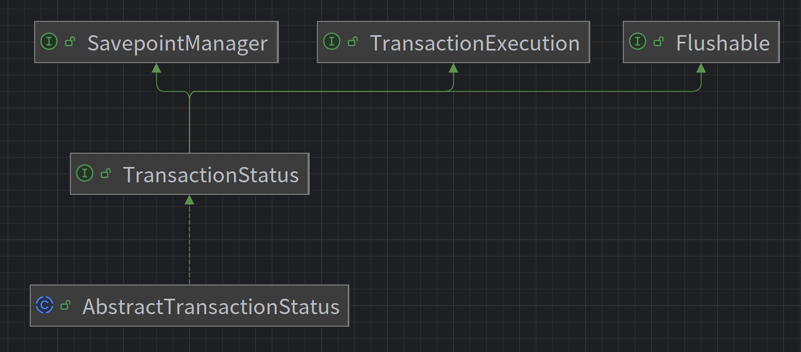

TransactionStatus接口用来记录事务的状态 该接口定义了一组方法,用来获取或判断事务的相应状态信息.

PlatformTransactionManager.getTransaction(…) 方法返回一个 TransactionStatus 对象。返回的TransactionStatus 对象可能代表一个新的或已经存在的事务（如果在当前调用堆栈有一个符合条件的事务）。

**AbstractTransactionStatus接口接口内容如下：**

```java
/**
 * TransactionStatus接口的抽象基实现。
 * 预实现本地回滚和已完成标志的处理，并委托给底层SavepointManager 。还提供了在事务中保存保存点的选项。
 * 不假设任何特定的内部事务处理，例如底层事务对象，也没有事务同步机制。
 */
public interface AbstractTransactionStatus{
    boolean isNewTransaction();  // 是否是新的事物
    boolean hasSavepoint();   // 是否有恢复点
    void setRollbackOnly();    // 设置为只回滚
    boolean isRollbackOnly();   // 是否为只回滚
    boolean isCompleted;    // 是否已完成
}
```

## 缓存

### 缓存穿透是什么？

查询一个**不存在**的数据。导致数据库的请求量激增。

可以通过以下两种方式解决：

1. 缓存空对象，当从 DB 查询数据为空，我们仍然将这个空结果进行缓存，具体的值需要使用**特殊的标识**，能和真正缓存的数据区分开。另外，需要设置较短的过期时间，一般建议不要超过 5 分钟。
2. 添加布隆过滤器，在缓存服务的基础上，构建 BloomFilter 数据结构，在 BloomFilter 中存储对应的 KEY 是否存在，如果存在，说明该 KEY 对应的值**不为空**。那么整个逻辑的如下：
   * 根据 KEY 查询【BloomFilter 缓存】。如果不存在对应的值，直接返回；如果存在，继续向下执行。【后续的流程，就是标准的流程】
   * 根据 KEY 查询在【数据缓存】的值。如果存在值，直接返回；如果不存在值，继续向下执行。
   * 查询 DB 对应的值，如果存在，则更新到缓存，并返回该值

> 请注意布隆过滤器的特性：存在的不一定存在，不存在的一定不存在。

### 缓存雪崩是什么？

缓存雪崩，是指缓存由于某些原因无法提供服务( 例如，缓存挂掉了 )，所有请求全部达到 DB 中，导致 DB 负荷大增，最终挂掉的情况。

预防和解决缓存雪崩的问题，可以从以下**多个方面进行共同着手**。

1. 搭建高可用缓存，例如集群。

2. 本地缓存，避免后续请求全部到达DB中。

3. 请求DB限流，通过限制 DB 的每秒请求数，避免把 DB 也打挂了。这样至少能有两个好处：

   * 可能有一部分用户，还可以使用，系统还没死透。
   * 未来缓存服务恢复后，系统立即就已经恢复，无需再处理 DB 也挂掉的情况。

   当然，被限流的请求，我们最好也要有相应的处理，走【服务降级】，提供一些默认的值，或者友情提示，甚至空白的值也行。

   如果我们使用 Java ，则可以使用 Guava RateLimiter、Sentinel、Hystrix 实现限流的功能。

### 缓存击穿是什么？

某个**极度‘热点’**数据在某个时间点过期后，恰好在这个时间点对这个Key有大量的并非请求，这些请求发现缓存过期一般都会从 DB 加载数据并回设到缓存，但是这个时候大并发的请求可能会瞬间 DB 压垮。

有两种方案可以解决：

1. 使用互斥锁。请求发现缓存不存在后，去查询 DB 前，使用分布式锁，保证有且只有一个线程去查询 DB ，并更新到缓存。流程如下：
   * 获取分布式锁，直到成功或超时。如果超时，则抛出异常，返回。如果成功，继续向下执行。
   * 获取缓存。如果存在值，则直接返回；如果不存在，则继续往下执行。😈 因为，获得到锁，可能已经被“那个”线程去查询过 DB ，并更新到缓存中了。
   * 查询 DB ，并更新到缓存中，返回值。

2. 手动过期。缓存上从不设置过期时间，功能上将过期时间存在 KEY 对应的 VALUE 里。流程如下：

   * 获取缓存。通过 VALUE 的过期时间，判断是否过期。如果未过期，则直接返回；如果已过期，继续往下执行。

   * 通过一个后台的异步线程进行缓存的构建，也就是“手动”过期。通过后台的异步线程，保证有且只有一个线程去查询 DB。

   * 同时，虽然 VALUE 已经过期，还是直接返回。通过这样的方式，保证服务的可用性，虽然损失了一定的时效性。

### 缓存与DB的一致性如何保证？

详见[Cache与DB的数据一致性](./cache-yu-db-de-shu-ju-yi-zhi-xing)

## MySQL

### 三范式和反模式？

数据库设计的三个主要范式（Normal Forms，NF）是确保数据库结构优化，**减少数据冗余和依赖性的原则**。

**第一范式（1NF）**:

* **定义**: 表中的所有字段都是原子性的，即每个字段都不可再分割。
* **例子**: 如果有一个学生表，而其中的“课程”字段包含多个课程（如“数学，科学”），则这不符合1NF。为了满足1NF，每个课程应该有自己的字段或者通过分表来处理。

**第二范式（2NF）**:

* **定义**: 表必须先满足1NF，且所有非键字段都完全依赖于主键。
* **例子**: 如果学生表有字段`学生ID`, `学生姓名`, `课程ID`, `课程名`，其中`学生ID`和`课程ID`共同作为主键，而`课程名`只依赖于`课程ID`，这就违反了2NF。解决方法是将课程信息分离出来，形成一个单独的课程表。

**第三范式（3NF）**:

* **定义**: 表必须先满足2NF，且所有非键字段都不依赖于其他非键字段（消除传递依赖）。
* **例子**: 假设一个学生表包含`学生ID`, `学生姓名`, `宿舍地址`, `宿舍邮编`，其中`宿舍邮编`可以通过`宿舍地址`确定，则存在传递依赖，违反了3NF。解决方法是创建一个独立的宿舍地址表，包含宿舍地址和邮编。

**反模式**：通过空间换时间的方法避免表之间的关联查询。提高查询效率。

### varchar(50) vs varchar(200)?

两者存储`hello`所占的空间一样，**但是后者在排序时会消耗更多内存，因为`ORDER BY col` 采用 fixed_length 计算 col 长度(memory引擎也一样)。**

### delete后重启再insert？

 **一张表，里面有 ID 自增主键，当 insert 了 17 条记录之后，删除了第 15,16,17 条记录，再把 MySQL 重启，再 insert 一条记录，这条记录的 ID 是 18 还是 15？**

* 一般情况下，我们创建的表的类型是 InnoDB ，如果新增一条记录（不重启 MySQL 的情况下），这条记录的 ID 是18 ；但是如果重启 MySQL 的话，这条记录的 ID 是 15 。因为 InnoDB 表只把自增主键的**最大 ID 记录到内存**中，所以重启数据库或者对表 OPTIMIZE 操作，都会使最大 ID 丢失。
* 但是，如果我们使用表的类型是 MyISAM ，那么这条记录的 ID 就是 18 。因为 MyISAM 表会把自增主键的**最大 ID 记录到数据文件**里面，重启 MYSQL 后，自增主键的最大 ID 也不会丢失。

### InnoDB vs MyISAM

|                | InnoDB         | MyISAM |
| :------------- | :------------- | :----- |
| **事务**       | 支持           | 不支持 |
| 存储限制       | 64TB           | 无     |
| **锁粒度**     | 行锁           | 表锁   |
| **崩溃后恢复** | 支持           | 不支持 |
| 外键           | 支持           | 不支持 |
| 全文检索       | 5.7 版本后支持 | 支持   |

> [!Caution]
>
> 最重要的便是对事务的支持。

### 为什么 SELECT COUNT(\*) FROM table 在 InnoDB 比 MyISAM 慢？

对于 `SELECT COUNT(*) FROM table` 语句，在没有 `WHERE` 条件的情况下，InnoDB 比 MyISAM 可能会慢很多，尤其在大表的情况下。因为，InnoDB 是去实时统计结果，会全表扫描；而 MyISAM 内部维持了一个**计数器**，预存了结果，所以直接返回即可。

### 什么是索引？

> [!tIp]
>
> 就像页面对书籍的作用一样。

MySQL 中存储引擎使用类似的方式进行查询，先去索引中查找对应的值，然后根据匹配的索引找到对应的数据行。

好处：

1. 提高数据的检索速度，降低数据库IO成本：使用索引的意义就是通过缩小表中需要查询的记录的数目从而加快搜索的速度。
2. 降低数据排序的成本，降低CPU消耗：索引之所以查的快，是因为先将数据排好序，若该字段正好需要排序，则正好降低了排序的成本。

坏处：

1. 占用存储空间：索引实际上也是一张表，记录了主键与索引字段，一般以索引文件的形式存储在磁盘上。
2. 降低更新表的速度：表的数据发生了变化，对应的索引也需要一起变更，从而减低的更新速度。否则索引指向的物理数据可能不对，这也是索引失效的原因之一。

使用场景：

1. 对非常小的表，大部分情况下全表扫描效率更高。
2. 对中大型表，索引非常有效。
3. 特大型的表，建立和使用索引的代价随着增长，可以使用分区技术来解决。

> [!warning]
>
> 实际场景下，MySQL 分区表很少使用,对于特大型的表，更常用的是“分库分表”，目前解决方案有 Sharding Sphere、MyCAT 等等。

### 索引的类型？

1. 普通索引
2. 唯一索引
3. 主键索引
4. 联合索引
5. 全文索引，适合对大文本建立该索引，也可以使用es
6. 外键索引

### 索引的创建原则？

1. 最适合索引的列是**出现在 `WHERE` 子句中的列**，或连接子句中的列，而不是出现在 `SELECT` 关键字后的列。
2. 索引列的**基数越大，索引效果越好**。低基数索引甚至会对性能产生负面影响。
3. 根据情况**创建复合索引**，复合索引可以提高查询效率。
4. **避免创建过多的索引**，索引会额外占用磁盘空间，降低写操作效率。
5. **主键尽可能选择较短的数据类型**，可以有效减少索引的磁盘占用提高查询效率。
6. **对字符串进行索引，应该定制一个前缀长度**，可以节省大量的索引空间。

### 索引失效？使用注意事项有哪些？

1. 应尽量**避免在 `WHERE` 子句中使用 `!=` 或 `<>` 操作符**，否则将引擎放弃使用索引而进行全表扫描。优化器将无法通过索引来确定将要命中的行数,因此需要搜索该表的所有行。

   > [!tip]
   >
   > 注意，`column IS NULL` 也是不可以使用索引的。

2. 应尽量**避免在 `WHERE` 子句中使用 `OR` 来连接条件**，否则将导致引擎放弃使用索引而进行全表扫描，如：`SELECT id FROM t WHERE num = 10 OR num = 20`

3. 应尽量**避免在 `WHERE` 子句中对字段进行表达式或函数操作**，这将导致引擎放弃使用索引而进行全表扫描。

4. **不要在 `WHERE` 子句中的 `=` 左边进行函数、算术运算**或其他表达式运算，否则系统将可能无法正确使用索引。

5. 复合索引遵循**前缀原则**。

6. 如果 MySQL 评估使用索引比全表扫描更慢，会放弃使用索引。如果此时想要索引，可以在语句中添加强制索引。

7. **隐式类型转换导致索引失效**：列类型是字符串类型，查询时一定要给值加引号，否则索引失效。

   假设有一个名为`users`的表，其中包含一个名为`age`的整数列，并且为该列创建了一个索引。现在，我们执行以下查询：

   ```sql
   sqlCopy CodeSELECT * FROM users WHERE age = '25';
   ```

   尽管`age`列是一个整数类型的列，但在查询中，我们将它与字符串`'25'`进行了相等比较。由于MySQL具有隐式类型转换的能力，在执行查询之前，MySQL会将字符串`'25'`隐式地转换为整数。这意味着查询实际上等同于以下查询：

   ```sql
   sqlCopy CodeSELECT * FROM users WHERE age = 25;
   ```

   然而，这种隐式类型转换可能导致索引失效。因为索引是根据列的数据类型来构建的

8. `LIKE` 查询，`%` 不能在前，因为无法使用索引。如果需要模糊匹配，可以使用全文索引。

> 前面四条也可以概况为一条：避免在where子句中进行表达式运算或用OR连接条件。

### B-Tree 索引简介

B-Tree 是为磁盘等外存储设备设计的一种平衡查找树。为了描述B-Tree，首先定义一条记录为一个二元组 \([key, data]\)，其中 `key` 为记录的键值，对应表中的主键值，`data` 为一行记录中除主键外的数据。对于不同的记录，`key` 值互不相同。

**磁盘相关知识**

系统从磁盘读取数据到内存时是以磁盘块（block）为基本单位的，位于同一个磁盘块中的数据会被一次性读取出来，而不是需要什么取什么。

InnoDB 存储引擎中有页（Page）的概念，页是其磁盘管理的最小单位。InnoDB 存储引擎中默认每个页的大小为 16KB，可通过参数 `innodb_page_size` 将页的大小设置为 4KB、8KB 或 16KB。在 MySQL 中可通过如下命令查看页的大小：

```sql
mysql> show variables like 'innodb_page_size';
```

系统一个磁盘块的存储空间往往没有这么大，因此 **InnoDB 每次申请磁盘空间时都会是若干地址连续的磁盘块来达到页的大小 16KB**。InnoDB 在把磁盘数据读入内存时会**以页为基本单位**，在查询数据时，如果一个页中的每条数据都能有助于定位数据记录的位置，这将会减少磁盘 I/O 次数，提高查询效率。

**B-Tree 的特性**

一棵 $m$ 阶的 B-Tree 有如下特性：

1. 每个节点最多有 $m$ 个孩子。
2. 除了根节点和叶子节点外，其它每个节点至少有 $\lceil m/2 \rceil$ 个孩子。
3. 若根节点不是叶子节点，则至少有 2 个孩子。
4. 所有叶子节点都在同一层，且不包含其它关键字信息。
5. 每个非叶子节点包含 $n$ 个关键字信息（$P_0,P_1,…P_n, k_1,…k_n$）。
6. 关键字的个数 $n$ 满足：$\lceil m/2 \rceil - 1 \leq n \leq m-1$。
7. $k_i (i=1,…n)$ 为关键字，且关键字升序排序。
8. $P_i (i=0,…n)$ 为指向子树根节点的指针。$P_{i-1}$ 指向的子树的所有节点关键字均小于 $k_i$，但都大于 $k_{i-1}$。

**B-Tree 的结构**

B-Tree 的每个节点占用一个页的磁盘空间，一个节点上有多个升序排序的 key 和多个指向子树根节点的 pointer，pointer 存储的是子节点的地址。多个 key 划分成的范围域，对应 pointer 指向的子树的数据范围域。

以根节点为例，假设 key 为 17 和 35，P1 指针指向的子树的数据范围为小于 17，P2 指针指向的子树的数据范围为 [17, 35]，P3 指针指向的子树的数据范围为大于 35。

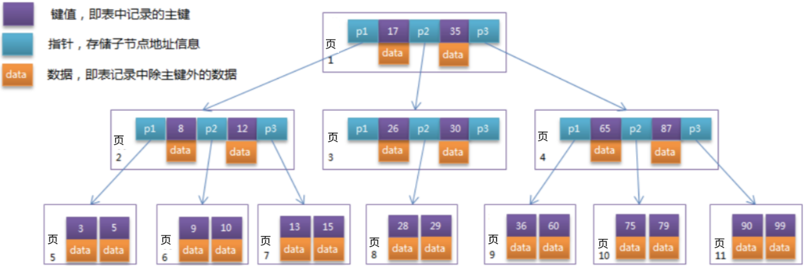

**模拟查找过程**

假设我们要查找 key 为 29 的记录，查找过程如下：

1. 根据根节点找到页 1，读入内存。【磁盘I/O操作第1次】
2. 比较 key 29 在区间（17, 35），找到页 1 的指针 P2。
3. 根据 P2 指针找到页 3，读入内存。【磁盘I/O操作第2次】
4. 比较 key 29 在区间（26, 30），找到页 3 的指针 P2。
5. 根据 P2 指针找到页 8，读入内存。【磁盘I/O操作第3次】
6. 在页 8 中的 key 列表中找到 key 29。

分析上述过程，需要 3 次磁盘 I/O 操作和 3 次内存查找操作。由于内存中的 key 是一个有序表结构，可以利用二分法查找提高效率。而 3 次磁盘 I/O 操作是影响整个 B-Tree 查找效率的决定因素。B-Tree 相对于 AVL Tree 缩减了节点个数，使每次磁盘 I/O 取到内存的数据都发挥了作用，从而提高了查询效率。

### B+Tree索引简介

B+Tree 索引是一种常见的数据结构，特别适合用于数据库系统中的索引实现。它在 B-Tree 的基础上进行了优化，主要用于支持外存储（如硬盘）的索引结构，常见于诸如 InnoDB 存储引擎等数据库系统中。

以下是 B+Tree 相对于 B-Tree 的主要特点和优势：

1. **非叶子节点的存储方式**：
   * B-Tree 的非叶子节点除了存储键值（key），还会存储数据（data）指针。**这样会导致每个节点的空间被数据占用，限制了节点能够存储的键值数量，进而增加了树的高度。**
   * B+Tree 的非叶子节点只存储键值信息，不包含指向数据的指针。这样可以使得每个非叶子节点能够容纳更多的键值，减少树的高度，从而减少查询时需要的磁盘 I/O 次数，提高查询效率。

2. **叶子节点的特性**：
   * 所有数据记录（key-value 对）都存储在叶子节点中，而非在非叶子节点。这种设计使得所有叶子节点都能够直接按照键值顺序形成一个链表，**便于范围查询和顺序遍历**。

3. **链式结构**：
   * 所有叶子节点之间通过链指针连接成链表，这种链表结构有助于**范围查询**操作，可以高效地遍历查询结果。

4. **头指针**：
   * 通常，B+Tree 会有两个头指针：一个指向根节点，另一个指向最小键值的叶子节点。这些头指针有助于加速查找操作的起始点定位。

综上所述，B+Tree 相较于传统的 B-Tree 在存储结构上的优化，使得它更适合于大数据量的数据库索引实现，能够有效减少磁盘 I/O，提高查询效率，并支持更好的范围查询操作。

### 聚簇索引 & 非聚簇索引

**聚簇索引（Clustered Index）**：聚簇索引指的是按照索引键的顺序来组织表中的数据的一种索引结构。具体来说，对于使用聚簇索引的表而言：

* **物理排序**：表的行数据按照索引的顺序存储在磁盘上。换句话说，索引本身就是数据的物理排序方式。
* **索引键与数据行的关系**：索引的叶子节点直接包含数据行，而非单独的指针。这意味着通过聚簇索引可以直接访问到需要的数据行，因为数据行本身就是按照索引键的顺序存储的。
* **示例**：MySQL 中的 InnoDB 存储引擎默认使用聚簇索引，通常是主键索引。例如，如果有一个名为 `users` 的表，主键是 `user_id`，那么 `user_id` 就是聚簇索引。这样，根据 `user_id` 查找数据时，数据库引擎会直接定位到包含该 `user_id` 的数据行。

**非聚簇索引（Non-clustered Index）**：非聚簇索引是另一种常见的索引类型，它与聚簇索引在实现方式和访问方式上有所不同：

* **数据存储方式**：索引的叶子节点不包含实际的数据行，而是包含指向数据行的指针。因此，通过非聚簇索引查找数据时，首先通过索引找到对应的数据行指针，然后再根据指针找到数据行本身。
* **示例**：假设有一个名为 `orders` 的表，其中有一个非聚簇索引是基于 `order_date` 字段的。在这种情况下，索引树的叶子节点包含 `order_date` 值和指向对应数据行的指针。当按照 `order_date` 条件查询数据时，数据库引擎首先使用非聚簇索引定位到符合条件的数据行指针，然后再访问实际的数据行。

### 事务四大特性？

ACID：原子性，一致性，隔离性，持久性。

### 并发问题？

脏读：读到未提交的数据。

不可重复读：事务A对数据进行多次读取，事务B在事务A读取时对数据进行了修改并提交，导致事务A读到的数据发生不一致。

幻读：事务A执行某种范围查询操作，事务B在A未提交的情况下，插入或删除了一条符合事务A查询条件的数据。事务A在本次事务中再次查询时，会发现多了（少了）一行数据。

> [!tip]
>
> 为什么说**读已提交（RR）解决了部分幻读问题**？
>
> **保持一致的读取快照**：
>
> * 在可重复读隔离级别下，事务在第一次读取数据后会创建一个**快照**（snapshot），用于之后的所有读操作。这个快照保持了事务开始时数据库中所有数据的一个一致性视图。（MVCC）
> * 如果其他事务在事务执行期间插入新的数据，可重复读事务不会看到这些新插入的数据。这是因为它们在事务开始之前就已经创建了快照，之后的查询都基于这个一致性快照进行，而不会受到其他事务的影响。
>
> **避免幻读的一部分情况（间隙锁）**：
>
> * 幻读主要发生在范围查询中，例如通过 WHERE 条件检索多行数据。在可重复读隔离级别下，数据库通常会使用**间隙锁**（gap locks）来防止其他事务在查询范围内插入新的数据，从而避免了一部分幻读现象。
> * 间隙锁是一种锁定范围而不是特定行的锁定方式，它会锁定事务查询范围内的间隙，防止其他事务插入新的数据，确保事务在同一范围内的多次查询结果一致。
>
> **事务内部一致性**：
>
> * 可重复读隔离级别还保证了事务内部的一致性，即事务开始后，其内部所有查询看到的数据保持一致，不会受到其他事务修改的影响，这也有助于减少幻读的发生。
>
> **那么为什么说是部分呢？**
>
> 尽管可重复读隔离级别有助于减少幻读的发生，但仍存在一些情况下可能会导致幻读的情况：
>
> * **长事务**：如果事务持续时间较长，可能会使快照中的数据状态与实际数据库中的数据状态产生较大差异，从而增加发生幻读的可能性。
> * **复杂的查询**：包含多个表或者复杂条件的范围查询，可能会因为间隙锁的覆盖范围不完整而导致部分幻读。
> * **不同数据库实现**：不同的数据库实现对于可重复读隔离级别的实现方式有所不同，可能导致行为上的差异。

### MySQL的行锁？

**1. Record Lock（行锁）**

**Record Lock**，即行锁，用于锁定某行数据，防止其他事务修改或删除该行。行锁在 MySQL 中是最基本的锁类型，可以在单行数据上实现精确的并发控制。

* **生成条件**：当一个事务更新或删除一行数据时，MySQL 会自动在该行上设置行锁。其他事务如果要修改同一行数据，必须等待行锁释放。
* **例子**：假设有一张表 `users`，其中有多个用户记录。当事务 A 更新用户 ID 为 1 的记录时，MySQL 将在用户 ID 为 1 的行上设置行锁，阻止其他事务同时更新同一行。

**2. Gap Lock（间隙锁）**

**Gap Lock**，即间隙锁，用于锁定一个范围的数据，而不是具体的行。它在 MySQL 中通常与范围查询和唯一索引扫描相关联。

* **生成条件**：当一个事务执行范围查询或使用唯一索引扫描时，MySQL 可能会在扫描的范围之间设置间隙锁，防止其他事务在该范围内插入新数据。
* **例子**：如果事务 B 正在扫描用户 ID 从 1 到 10 的范围，并且事务 A 插入了一个新的用户 ID 为 5 的记录，MySQL 可能会为范围 1 到 10 之间的间隙设置间隙锁，防止其他事务在这个范围内插入新数据。

**3. Insert Intention Lock（插入意向锁）**

**Insert Intention Lock**，即插入意向锁，用于在插入操作之前，通知其他事务该事务打算插入新行。**RR特有**，本质上仍然是间隙锁。

* **生成条件**：当一个事务打算在表中插入新行时，MySQL 可能会为整个表设置插入意向锁。这样其他事务仍然可以并发地读取现有数据，但是在插入操作执行时，必须等待插入意向锁释放。
* **例子**：事务 C 打算向 `orders` 表中插入一条新订单记录，MySQL 可能会为 `orders` 表设置插入意向锁，以通知其他事务有插入操作正在进行。

> [!important]
>
> 如果需要加表锁，如何判断表中有没有行锁呢？肯定不能一遍遍遍历，所以加完行锁后需要用一个"假的表锁"来告诉后面的表锁，这就是意向锁。
>
> 意向锁是表级锁，有两种：
>
> * **意向共享锁(Intention Shared Lock，IS锁）：**加共享锁前必须先获得该表的IS锁。
> * **意向排他锁（IX锁）：**加排他锁之前必须先获得该表的IX锁。
>
> 意向锁由存储引擎维护，用户无法手动操作。

**4. Next-Key Lock（下个键锁）**

**Next-Key Lock**，结合了行锁和间隙锁的特性，用于确保范围查询的一致性，并且避免幻读问题。**RR特有**。

* **生成条件**：当一个事务执行范围查询时，MySQL 可能会在查询的范围内的行和间隙上设置 Next-Key Lock。这样可以防止其他事务插入新数据或更新数据，从而保证查询结果的一致性。
* **例子**：当事务 D 执行范围查询 `SELECT * FROM users WHERE id > 5 FOR UPDATE;` 时，MySQL 可能会在 ID 大于 5 的行和其相邻的间隙上设置 Next-Key Lock，确保在事务 D 读取数据期间，不会有其他事务插入新的 ID 大于 5 的行或者修改现有的数据。

> [!note]
>
> **Next-Key Lock 和 Gap Lock 的主要区别** 在于它们的应用场景和锁定的对象：
>
> * **应用场景**：Next-Key Lock 主要用于范围查询，保证了查询结果的一致性和防止幻读；而 Gap Lock 主要用于防止并发事务在范围内插入新数据，通常与唯一索引扫描和范围查询结合使用。
> * **锁定对象**：Next-Key Lock 同时锁定了查询范围内的行和间隙，而 Gap Lock 只锁定了间隙，不直接锁定行数据。
> * **影响范围**：Next-Key Lock 的影响范围更广，因为它不仅防止了新数据的插入，还保证了查询结果的完整性；而 Gap Lock 主要影响插入操作的并发控制。

### MySQL死锁？

原因：不可抢占，不可剥夺，循环等待，请求和保持条件。

如何降低死锁发生的概率：

* 设置获得锁的超时时间。

  > 通过超时，至少保证最差最差最差情况下，可以有退出的口子。

* 按同一顺序访问对象。

  > 这个是最重要的方式。

* 避免事务中的用户交互。

* 保持事务简短并在一个批处理中。

* 使用低隔离级别。

* 使用绑定连接。

生产事故：请参考<https://cloud.tencent.com/developer/article/1801978>

上述生产事故解决方法：

1. **使用联合唯一索引**: 确保查询条件中包含唯一索引，使 Next-Key Lock 优化为 Record Lock。
2. **减少长事务**: 缩短事务时间，减少锁的持有时间，降低死锁几率。
3. **优化锁粒度**: 通过精细化锁粒度，减少锁冲突。
4. **重试机制**: 在应用层增加重试机制，处理 `Deadlock` 异常。

### MySQL查询执行顺序？

```sql
(1)     SELECT
(2)     DISTINCT <select_list>
(3)     FROM <left_table>
(4)     <join_type> JOIN <right_table>
(5)     ON <join_condition>
(6)     WHERE <where_condition>
(7)     GROUP BY <group_by_list>
(8)     HAVING <having_condition>
(9)     ORDER BY <order_by_condition>
(10)    LIMIT <limit_number>
```

### MySQL优化？

索引优化，查询优化，表设计优化，事务优化，充分利用分析工具

### MVCC是什么？

多版本并发控制（MVCC），是一种用来**解决读-写冲突**的无锁并发控制，也就是为事务分配单向增长的时间戳，为每个修改保存一个版本，版本与事务时间戳关联，读操作只读该事务开始前的数据库的快照。 这样在读操作不用阻塞写操作，写操作不用阻塞读操作的同时，避免了脏读和不可重复读。

**InnoDB对MVCC的实现**

`MVCC` 的实现依赖于：**隐藏字段、Read View、undo log**。在内部实现中，`InnoDB` 通过数据行的 `DB_TRX_ID` 和 `Read View` 来判断数据的可见性，如不可见，则通过数据行的 `DB_ROLL_PTR` 找到 `undo log` 中的历史版本。每个事务读到的数据版本可能是不一样的，在同一个事务中，用户只能看到该事务创建 `Read View` 之前已经提交的修改和该事务本身做的修改

1. **隐藏字段**：在内部，`InnoDB` 存储引擎为每行数据添加了三个 [隐藏字段open in new window](https://dev.mysql.com/doc/refman/5.7/en/innodb-multi-versioning.html)：

   * `DB_TRX_ID（6字节）`：表示最后一次插入或更新该行的事务 id。此外，`delete` 操作在内部被视为更新，只不过会在记录头 `Record header` 中的 `deleted_flag` 字段将其标记为已删除

   * `DB_ROLL_PTR（7字节）` 回滚指针，指向该行的 `undo log` 。如果该行未被更新，则为空

   * `DB_ROW_ID（6字节）`：如果没有设置主键且该表没有唯一非空索引时，`InnoDB` 会使用该 id 来生成聚簇索引

2. **ReadView**:[`Read View`](https://github.com/facebook/mysql-8.0/blob/8.0/storage/innobase/include/read0types.h#L298) 主要是用来做可见性判断，里面保存了 “当前对本事务不可见的其他活跃事务”

   ```java
   class ReadView {
     /* ... */
   private:
     trx_id_t m_low_limit_id;      /* 大于等于这个 ID 的事务均不可见 */
   
     trx_id_t m_up_limit_id;       /* 小于这个 ID 的事务均可见 */
   
     trx_id_t m_creator_trx_id;    /* 创建该 Read View 的事务ID */
   
     trx_id_t m_low_limit_no;      /* 事务 Number, 小于该 Number 的 Undo Logs 均可以被 Purge */
   
     ids_t m_ids;                  /* 创建 Read View 时的活跃事务列表 */
   
     m_closed;                     /* 标记 Read View 是否 close */
   }
   ```

   主要有以下字段：

   * `m_low_limit_id`：**目前出现过的最大的事务 ID+1**，即下一个将被分配的事务 ID。大于等于这个 ID 的数据版本均不可见
   * `m_up_limit_id`：**活跃事务列表 `m_ids` 中最小的事务 ID**，如果 `m_ids` 为空，则 `m_up_limit_id` 为 `m_low_limit_id`。小于这个 ID 的数据版本均可见
   * `m_ids`：**`Read View` 创建时其他未提交的活跃事务 ID 列表**。创建 `Read View`时，将当前未提交事务 ID 记录下来，后续即使它们修改了记录行的值，对于当前事务也是不可见的。`m_ids` 不包括当前事务自己和已提交的事务（正在内存中）
   * `m_creator_trx_id`：**创建该 `Read View` 的事务 ID**

   

   > [!tip]
   >
   > 一言以蔽之：==**在 MVCC 中，当前事务在读取数据时，只能看到在该事务开始之前已经提交的修改，任何在事务开始之后的修改（包括尚未提交的事务以及当前事务之后创建的事务）对该事务都是不可见的。**==

3. **undo-log**:`undo log` 主要有两个作用：

   * 当事务回滚时用于将数据恢复到修改前的样子
   * 另一个作用是 `MVCC` ，当读取记录时，若该记录被其他事务占用或当前版本对该事务不可见，则可以通过 `undo log` 读取之前的版本数据，以此实现非锁定读

   **在 `InnoDB` 存储引擎中 `undo log` 分为两种：`insert undo log` 和 `update undo log`：**

   1. **`insert undo log`**：指在 `insert` 操作中产生的 `undo log`。因为 `insert` 操作的记录只对事务本身可见，对其他事务不可见，故该 `undo log` 可以在事务提交后直接删除。不需要进行 `purge` 操作

   2. **`update undo log`**：`update` 或 `delete` 操作中产生的 `undo log`。该 `undo log`可能需要提供 `MVCC` 机制，因此不能在事务提交时就进行删除。提交时放入 `undo log` 链表，等待 `purge线程` 进行最后的删除。

      

> [!tip]
>
> 前面也有提及，在RR级别下，InnoDB引擎会通过`MVCC`和`Next-key Lock`来解决幻读问题。

### 慢查询日志（slow query log）是什么？

记录执行时间超过`long_query_time`（默认是10，通常设为1）的查询，可以用来分析SQL慢查询。默认是关闭的。

```bash
# 如何查询当前慢查询语句个数？
show global status like 'Slow_querys'
```

### 二进制日志（binlog）是什么？

binlog主要记录了对MySQL数据库执行了更改的所有操作，包括DDL和DML语句，但是不包括select、show这类不会对数据库造成更改的操作。

可以使用`show binary logs`查看所有binlog列表，binlog文件名为`文件名.00000*`形式。

binlog通过追加的方式写入文件，无大小限制。通过设置`max_binlog_size`可以指定每个文件最大容量。

### binlog有哪几种格式？

* Statement模式：记录每一条修改数据的sql
* Row模式（推荐）：记录每一行的具体变更事件
* Mixed模式：Statement和Row的混合，默认使用Statement，少数特殊场景自动切换到Row

5.1.5之前binlog只有Statement，5.1.5开始支持Row，5.1.8之后支持Mixed。

MySQL5.7.7之前默认使用Statement模式，之后默认使用Row模式。

Statement模式日志文件更小，磁盘IO压力小，性能较好，但准确性不如Row模式。

### binlog主要用来做什么？

最主要的应用场景是**主从复制**，主备、主主、主从都需要依赖binlog来同步数据，保证数据一致性。

主从复制流程：

1. 主库将数据库中的数据变化写入binlog
2. 从库连接主库
3. 从库创建一个IO线程向主库请求更新的binlog
4. 主库创建一个binlog dump线程来发送binlog，从库中的IO线程用于接收
5. 从库的IO线程将接收到的binlog写入relay log中
6. 从库的SQL线程读取relay log同步到本地（再执行一遍SQL）

除了主从复制外，binlog还能实现**数据恢复。**

### binlog的刷盘时机如何选择？

通过控制`sync_binlog`参数控制binlog的刷盘时机，取值范围是0-N：

* 0：不强制要求，由系统自行判断刷盘时机
* 1：每次提交事务的时候都要把binlog写入磁盘
* N：每N个事务才将binlog写入磁盘

MySQL5.7之前，默认值是0，之后默认值是1。

以sync_binlog=1为例，事务执行过程中，会先把日志写入binlog cache中，事务提交时才会把binlog cache中的日志持久化到磁盘的binlog文件中。可以通过控制binlog_cache_size参数控制单个线程binlog cache的大小，如果存储的内容超过这个值，就要暂存到磁盘（Swap）

### 什么情况下会重新生成binlog？

以下三种情况生成新binlog，文件序号递增：

* MySQL服务器停止或重启
* 使用`flush logs`命令
* binlog文件大小超过`max_binlog_size`的阈值后

### 重做日志（redo log）是什么？

InnoDB存储引擎以页为单位管理存储空间，插入的数据都存储在数据页（一页默认为16kb）中。为了减少磁盘IO开销，还有一个叫Buffer Pool（缓冲池）的区域，存在于内存中。如果要修改的数据不在Buffer Pool中，会先把数据页从磁盘读到Buffer Pool，再对Buffer Pool里的数据进行修改。大大提高了读写性能。

但如果一个事务提交后Buffer Pool中的数据还未持久化到磁盘，数据会不会丢失呢？

很显然不会，因为事务具有**持久性**的特点。

InnoDB用redo log来保证事务的持久性。redo log主要记录页的修改，比如某个页面某个偏移量处修改了几个字节的值以及具体修改的内容等等。

在事务提交时，会把redo log按照刷盘策略刷到磁盘中，即使MySQL宕机，重启之后也能恢复未能写入磁盘的数据，从而保证事务的持久性。redo log让MySQL具备了崩溃恢复的能力。

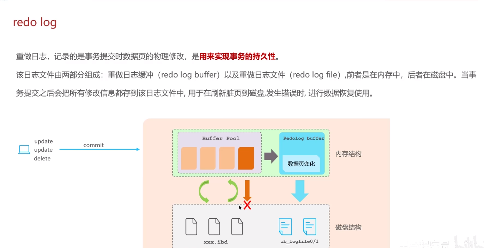


要想真正不丢失任何数据，还要正确设置刷盘策略`innodb_flush_log_at_trx_commit`，将其设为1（默认值就是1）时才不会丢失任何数据。

redo log采用循环写的方式进行写入，如下图：

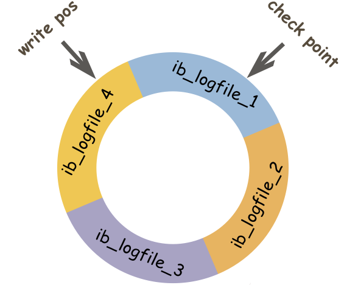

`write pos`表示redo log当前记录的写到的位置，`check point`表示当前要擦除的位置。当`write pos`追上`check point`时，表示`redo log`文件被写满了。此时无法再执行更新操作，数据库的更新操作会被阻塞，接下来会执行CheckPoint刷盘机制，CheckPoint会按照一定的条件将内存中的脏页刷到磁盘中，成功刷盘后，checkpoint会向后移动（顺时针），然后就可以继续写入`redo log`了，此时更新操作才能继续执行。

### 页修改后为什么不直接刷盘？

性能太差。InnoDB页大小是16KB，页又是磁盘和内存交互的基本单位。这就导致即使只修改了页中几个字节的数据，也要把整页16KB刷到磁盘。而且这些修改的页可能不相邻，也就是说可能是随机IO。

那为什么redo log性能好呢？

因为redo log的写入属于顺序IO，而且一行redo log记录只占几十字节。

另外，Buffer Pool中的页（脏页）在某些情况下也会进行刷盘操作，不过此时刷盘操作会合并顺序写入，更高效。

### binlog和redo log的区别

* binlog主要用于数据库还原，属于数据级别的数据恢复。主从复制是binlog最常见的一个应用场景。而redo log主要用于保证事务的持久性，属于事务级别的数据恢复。
* redo log是InnoDB独有的，而binlog是MySQL的Server层实现的
* redo log属于物理日志，主要记录的是某个页的修改。binlog属于逻辑日志，主要记录数据库执行的所有DDL和DML语句
* binlog通过追加的方式进行写入，没有大小限制。redo log采用循环写的方式进行写入，大小固定，当写到结尾时，会回到开头循环写

### 撤销日志（undo log）是什么？

在事务执行过程中undo log会记录对数据的修改，当执行事务出现问题或需要回滚时，MySQL可以利用undo log里的记录将数据恢复到执行事务之前。

undo log属于逻辑日志，记录的是SQL语句，比如如果事务执行过程中执行了DELETE操作，undo log会记录一条对应的INSERT语句。

> [!tip]
>
> 多次提及的是，InnoDB的MVCC（多版本并发控制）的实现用到了undo log。当用户读取一条记录时，若该记录已经被其他事务占用，当前事务可以通过undo log读取之前行的版本信息，以此实现非锁定读取。

### 当前读和快照读有什么区别？

**快照读**（一致性非锁定读）就是单纯的SELECT语句，但不包括下面两类：

```sql
select ... for update
select ... lock in share mode
```

快照即记录的历史版本，每行记录都可能存在多个历史版本。

快照读时，如果读取的记录正在执行UPDATE/DELETE操作，读取操作不会等待记录的X锁的释放，而是会去读取行的一个快照。

只有在读已提交和可重复读事务隔离级别下，InnoDB才会使用快照读：

* 在读已提交级别下，快照读读取的是被锁定行的最新一份快照数据
* 在可重复读级别下，快照读总是读取本事务开始时的行数据版本

快照读比较适合对于数据一致性要求不是特别高且追求极致性能的场景。

**当前读**（一致性锁定读）就是给行记录加X或S锁。

```sql
# 对读的记录加一个X锁
SELECT...FOR UPDATE
# 对读的记录加一个S锁
SELECT...LOCK IN SHARE MODE
# 对修改的记录加一个X锁
INSERT...
UPDATE...
DELETE...
```

### 自增锁是什么？（不重要，了解）

设计表时，一般会有一个自增主键。InnoDB中的自增主键（或其他auto_increment字段）会涉及到自增锁（表级锁）。

如果一个事务正在插入数据到有自增列的表时，会先获取自增锁，获取不到就可能被阻塞。

## Redis

### 什么是Redis？

基于c语言开发的开源高性能内存数据库。

### Redis为什么这么快？

* 基于内存存储，访问速度是磁盘的上千倍
* 基于[Reactor模式](https://zhuanlan.zhihu.com/p/389756053)开发了一套高效的事件处理模型，主要是**单线程事件循环**和**IO多路复用**
* 内置了多种优化后的数据结构实现，性能非常高

### Redis和Memcached的区别和共同点?

**相同点：**

* 都是基于内存，一般都用来当作缓存使用
* 都有过期策略
* 性能都非常高

 **区别：**

* Redis数据类型更丰富。不仅支持简单的k/v类型数据，还提供list、set、zset、hash等数据结构的存储。Memcached只支持最简单的k/v
* Redis支持数据的持久化，Memcached不支持
* Redis有灾难恢复机制，因为可以持久化
* Redis在服务器内存用完后可以将不常用的放在磁盘，而Memcache会直接报异常
* Redis有原生的集群模式（cluster模式），Memcached没有，需要依赖客户端
* Redis是单线程的，使用IO多路复用模型（Redis6.0）针对网络数据的读写引入了多线程），而Memcached是多线程的，非阻塞的IO复用网络模型
* Redis支持发布订阅模型、Lua脚本、事务等功能，且支持更多编程语言
* Redis针对过期数据采用惰性删除+定期删除，而Memcached只有惰性删除

### Redis除了做缓存，还能干什么？

* **分布式锁**：通过Redis做分布式锁是一种比较常见的方式。通常情况下，我们都是基于Redisson来实现分布式锁。详情看：[分布式锁详解](https://blog.csdn.net/weixin_45150104/article/details/125131846)
* **限流**：一般通过Redis+Lua脚本来实现限流以及Nginx的动态缓存，具体看：[文章](https://mp.weixin.qq.com/s/kyFAWH3mVNJvurQDt4vchA)
* **消息队列**：Redis自带的list数据结构可以作为一个简单的队列使用。Redis5.0中增加的Stream类型的数据结构更加适合用作消息队列
* **复杂业务场景**：通过 Redis 以及 Redis 扩展（比如 Redisson）提供的数据结构，我们可以很方便地完成很多复杂的业务场景比如通过 bitmap 统计活跃用户、通过 sorted set 维护排行榜

### Redis可以用来作为消息队列使用吗？

可以。但基本没人用。

可以用list数据结构中的LPUSH-RPOP或RPUSH-LPOP来实现简易的消息队列。

但是性能很低，需要不断轮询，list为空时会极大浪费系统资源。

为此，Redis还提供了BLPOP、BRPOP这种阻塞的命令（B-Blocking），而且可以设置超时参数，为0时可以无限等待，直到拿到消息。

缺点：

* **性能低**
* 不支持消息确认机制、没有广播机制等等

Redis2.0引入了发布订阅（pub/sub）解决了list实现消息队列没有广播机制的问题。

发布订阅中引入了channel（频道），涉及发布者和订阅者（消费者）两个角色：

* 发布者通过PUBLISH投递消息给指定channel
* 订阅者通过SUBSCRIBE订阅它关心的channel。订阅者可以订阅一个或多个channel。

pub/sub既能单播又能广播，还支持channel的简单正则匹配。不过不能解决消息丢失、消息堆积等问题。

为此，Redis5.0新增了Stream数据结构来做消息队列。Stream支持：

* 发布订阅模式
* 按照消费者组进行消费
* 消息持久化（RDB和AOF）

仍存在问题：在 Redis 发生故障恢复后不能保证消息至少被消费一次。

相关文章：[Redis 消息队列发展历程 - 阿里开发者 - 2022](https://mp.weixin.qq.com/s/gCUT5TcCQRAxYkTJfTRjJw)

### Redis有哪些数据结构？

5种基本数据结构：

String、List、Set、Zset、Hash

* [Redis 5 种基本数据结构详解](https://javaguide.cn/database/redis/redis-data-structures-01.html)

3种特殊数据结构：

HyperLogLogs（基数统计）、Bitmap （位存储）、Geospatial (地理位置)

* [Redis 3 种特殊数据结构详解](https://javaguide.cn/database/redis/redis-data-structures-02.html)

### String的应用场景有哪些？

* 常规数据：session、token、序列化的对象、图片的路径等
* 计数：页面的访问次数等
* 分布式锁：利用`SETNX key value`命令实现简易的分布式锁

### String和Hash存储对象数据哪个更好？

* 如果对象中某些字段需要经常变动或者需要单独查询对象中的个别字段，用Hash合适
* 如果对系统性能和资源消耗比较敏感，String比较合适（占用的内存只有Hash的一半）

### String的底层实现是什么？

Redis基于C语言。但Redis的String并不是C语言中的简单字符串，而是自己实现的简单动态字符串SDS（Simple Dynamic String）。

SDS相比于C语言中的字符串有如下提升：

* **可以避免缓冲区溢出**：C语言字符串被修改时可能会溢出，但SDS会先进行检查，如果大小不满足要求会先扩容
* **获取字符串长度的复杂度低**：C中获取字符串长度是通过遍历来的，复杂度O（n）。SDS直接读取len，复杂度O（1）。
* 减少内存分配次数
* 二进制安全： C 语言中的字符串以空字符 \0 作为字符串结束的标识，一些二进制文件（比如图片、视频、音频）就可能包括空字符，C 字符串无法正确保存。SDS 使用 len 属性判断字符串是否结束，不存在这个问题。

### 购物车信息用String还是Hash存储？

用Hash，因为要经常改动。

key为用户id，field为商品id，value为商品数量。


### 怎么使用Redis实现一个排行榜？

Redis中的`sorted set`（Zset），经常被用在各种排行榜的场景，比如直播间礼物榜等。

相关指令：ZRANGE (从小到大排序)、 ZREVRANGE （从大到小排序）、ZREVRANK (指定元素排名)。

### Set的应用场景有哪些？

* 存放的数据不能重复的场景：文章点赞（文章id为key，value为点赞用户的id，可以避免重复点赞）等
* 需要多个数据源之间的交集、并集、差集的场景：共同好友(交集)、共同粉丝(交集)、共同关注(交集)、好友推荐（差集）、音乐推荐（差集）、订阅号推荐（差集+交集） 等等。
* 需要随机获取数据源中的元素的场景：抽奖、随机点名等

### 怎么用Set实现抽奖系统？

* SADD key member1 member2 ...：向指定集合添加一个或多个元素。
* SPOP key count：随机移除并获取指定集合中一个或多个元素，适合不允许重复中奖的场景。
* SRANDMEMBER key count : 随机获取指定集合中指定数量的元素，适合允许重复中奖的场景。

### 什么是 RDB 持久化？

> RDB文件的载入是在服务器启动时自动执行的

Redis 可以通过创建快照来获得存储在内存里面的数据在 **某个时间点** 上的副本。Redis 创建快照之后，可以对快照进行备份，可以将快照复制到其他服务器从而创建具有相同数据的服务器副本（Redis 主从结构，主要用来提高 Redis 性能），还可以将快照留在原地以便重启服务器的时候使用。

快照持久化是 Redis 默认采用的持久化方式，在 `redis.conf` 配置文件中默认有此下配置：

```clojure
save 900 1           #在900秒(15分钟)之后，如果至少有1个key发生变化，Redis就会自动触发bgsave命令创建快照。

save 300 10          #在300秒(5分钟)之后，如果至少有10个key发生变化，Redis就会自动触发bgsave命令创建快照。

save 60 10000        #在60秒(1分钟)之后，如果至少有10000个key发生变化，Redis就会自动触发bgsave命令创建快照。
```

### RDB 文件的创建与载入？

Redis 提供了两个命令来生成 RDB 快照文件：

* `save` : 同步保存操作，会阻塞 Redis 主线程；
* `bgsave` : fork 出一个子进程，子进程执行，不会阻塞 Redis 主线程，默认选项。

> 这里说 Redis 主线程而不是主进程的主要是因为 Redis 启动之后主要是通过单线程的方式完成主要的工作。如果你想将其描述为 Redis 主进程，也没毛病。

RDB文件的载入工作是在服务器启动时自动执行的，所以Redis并没有专门用于载入RDB文件的命令，只要Redis服务器在启动时检测到RDB文件存在，它就会自动载入RDB文件。

另外值得一提的是，因为AOF文件的更新频率通常比RDB文件的更新频率高，所以：

* 如果服务器开启了AOF持久化功能，那么服务器会优先使用AOF文件来还原数据库状态。
* 只有在AOF持久化功能处于关闭状态时，服务器才会使用RDB文件来还原数据库状态。

因为BGSAVE命令可以在不阻塞服务器进程的情况下执行，所以Redis允许用户通过设置服务器配置的save选项，让服务器每隔一段时间自动执行一次BGSAVE命令。

用户可以通过save选项设置多个保存条件，但只要其中任意一个条件被满足，服务器就会执行BGSAVE命令。

### 什么是 AOF 持久化？

与快照持久化相比，AOF 持久化的实时性更好。默认情况下 Redis 没有开启 AOF（append only file）方式的持久化（Redis 6.0 之后已经默认是开启了），可以通过 `appendonly` 参数开启：

```bash
appendonly yes
```

开启 AOF 持久化后每执行一条会更改 Redis 中的数据的命令，Redis 就会将该命令写入到 AOF 缓冲区 `server.aof_buf` 中，然后再写入到 AOF 文件中（此时还在系统内核缓存区未同步到磁盘），最后再根据持久化方式（ `fsync`策略）的配置来决定何时将系统内核缓存区的数据同步到硬盘中的。

只有同步到磁盘中才算持久化保存了，否则依然存在数据丢失的风险，比如说：系统内核缓存区的数据还未同步，磁盘机器就宕机了，那这部分数据就算丢失了。

AOF 文件的保存位置和 RDB 文件的位置相同，都是通过 `dir` 参数设置的，默认的文件名是 `appendonly.aof`。

### AOF 工作基本流程是怎样的？

AOF 持久化功能的实现可以简单分为 5 步：

1. **命令追加（append）**：所有的写命令会追加到 AOF 缓冲区中。
2. **文件写入（write）**：将 AOF 缓冲区的数据写入到 AOF 文件中。这一步需要调用`write`函数（系统调用），`write`将数据写入到了系统内核缓冲区之后直接返回了（延迟写）。注意！！！此时并没有同步到磁盘。
3. **文件同步（fsync）**：AOF 缓冲区根据对应的持久化方式（ `fsync` 策略）向硬盘做同步操作。这一步需要调用 `fsync` 函数（系统调用）， `fsync` 针对单个文件操作，对其进行强制硬盘同步，`fsync` 将阻塞直到写入磁盘完成后返回，保证了数据持久化。
4. **文件重写（rewrite）**：随着 AOF 文件越来越大，需要定期对 AOF 文件进行重写，达到压缩的目的。
5. **重启加载（load）**：当 Redis 重启时，可以加载 AOF 文件进行数据恢复。

> Linux 系统直接提供了一些函数用于对文件和设备进行访问和控制，这些函数被称为 **系统调用（syscall）**。

这里对上面提到的一些 Linux 系统调用再做一遍解释：

* `write`：写入系统内核缓冲区之后直接返回（仅仅是写到缓冲区），不会立即同步到硬盘。虽然提高了效率，但也带来了数据丢失的风险。同步硬盘操作通常依赖于系统调度机制，Linux 内核通常为 30s 同步一次，具体值取决于写出的数据量和 I/O 缓冲区的状态。
* `fsync`：`fsync`用于强制刷新系统内核缓冲区（同步到到磁盘），确保写磁盘操作结束才会返回。

AOF 工作流程图如下：

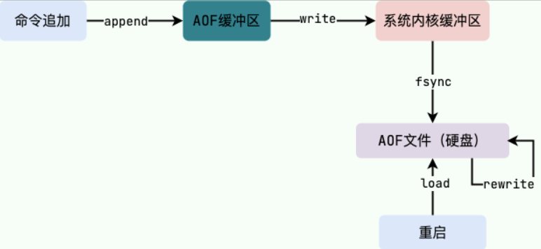

### AOF 持久化方式有哪些？

在 Redis 的配置文件中存在三种不同的 AOF 持久化方式（ `fsync`策略），它们分别是：

1. `appendfsync always`：主线程调用 `write` 执行写操作后，后台线程（ `aof_fsync` 线程）立即会调用 `fsync` 函数同步 AOF 文件（刷盘），`fsync` 完成后线程返回，这样会严重降低 Redis 的性能（`write` + `fsync`）。
2. `appendfsync everysec`：主线程调用 `write` 执行写操作后立即返回，由后台线程（ `aof_fsync` 线程）每秒钟调用 `fsync` 函数（系统调用）同步一次 AOF 文件（`write`+`fsync`，`fsync`间隔为 1 秒）
3. `appendfsync no`：主线程调用 `write` 执行写操作后立即返回，让操作系统决定何时进行同步，Linux 下一般为 30 秒一次（`write`但不`fsync`，`fsync` 的时机由操作系统决定）。

可以看出：**这 3 种持久化方式的主要区别在于 `fsync` 同步 AOF 文件的时机（刷盘）**。

为了兼顾数据和写入性能，可以考虑 `appendfsync everysec` 选项 ，让 Redis 每秒同步一次 AOF 文件，Redis 性能受到的影响较小。而且这样即使出现系统崩溃，用户最多只会丢失一秒之内产生的数据。当硬盘忙于执行写入操作的时候，Redis 还会优雅的放慢自己的速度以便适应硬盘的最大写入速度。

从 Redis 7.0.0 开始，Redis 使用了 **Multi Part AOF** 机制。顾名思义，Multi Part AOF 就是将原来的单个 AOF 文件拆分成多个 AOF 文件。在 Multi Part AOF 中，AOF 文件被分为三种类型，分别为：

* BASE：表示基础 AOF 文件，它一般由子进程通过重写产生，该文件最多只有一个。
* INCR：表示增量 AOF 文件，它一般会在 AOFRW 开始执行时被创建，该文件可能存在多个。
* HISTORY：表示历史 AOF 文件，它由 BASE 和 INCR AOF 变化而来，每次 AOFRW 成功完成时，本次 AOFRW 之前对应的 BASE 和 INCR AOF 都将变为 HISTORY，HISTORY 类型的 AOF 会被 Redis 自动删除。

Multi Part AOF 不是重点，了解即可，详细介绍可以看看阿里开发者的[Redis 7.0 Multi Part AOF 的设计和实现open in new window](https://zhuanlan.zhihu.com/p/467217082) 这篇文章。

**相关 issue**：[Redis 的 AOF 方式 #783open in new window](https://github.com/Snailclimb/JavaGuide/issues/783)。

### AOF 为什么是在执行完命令之后记录日志？

关系型数据库（如 MySQL）通常都是执行命令之前记录日志（方便故障恢复），而 Redis AOF 持久化机制是在执行完命令之后再记录日志。

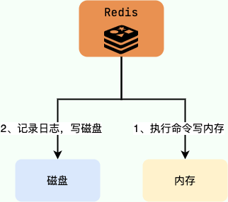

**为什么是在执行完命令之后记录日志呢？**

* 避免额外的检查开销，AOF 记录日志不会对命令进行语法检查；
* 在命令执行完之后再记录，不会阻塞当前的命令执行。

这样也带来了风险（我在前面介绍 AOF 持久化的时候也提到过）：

* 如果刚执行完命令 Redis 就宕机会导致对应的修改丢失；
* 可能会阻塞后续其他命令的执行（AOF 记录日志是在 Redis 主线程中进行的）。

### AOF 重写了解吗？

当 AOF 变得太大时，Redis 能够在后台自动重写 AOF 产生一个新的 AOF 文件，这个新的 AOF 文件和原有的 AOF 文件所保存的数据库状态一样，但体积更小。


> AOF 重写（rewrite） 是一个有歧义的名字，该功能是通过读取数据库中的键值对来实现的，程序无须对现有 AOF 文件进行任何读入、分析或者写入操作。

由于 AOF 重写会进行大量的写入操作，为了避免对 Redis 正常处理命令请求造成影响，Redis 将 AOF 重写程序放到子进程里执行。

AOF 文件重写期间，Redis 还会维护一个 **AOF 重写缓冲区**，该缓冲区会在子进程创建新 AOF 文件期间，记录服务器执行的所有写命令。当子进程完成创建新 AOF 文件的工作之后，服务器会将重写缓冲区中的所有内容追加到新 AOF 文件的末尾，使得新的 AOF 文件保存的数据库状态与现有的数据库状态一致。最后，服务器用新的 AOF 文件替换旧的 AOF 文件，以此来完成 AOF 文件重写操作。

开启 AOF 重写功能，可以调用 `BGREWRITEAOF` 命令手动执行，也可以设置下面两个配置项，让程序自动决定触发时机：

* `auto-aof-rewrite-min-size`：如果 AOF 文件大小小于该值，则不会触发 AOF 重写。默认值为 64 MB;
* `auto-aof-rewrite-percentage`：执行 AOF 重写时，当前 AOF 大小（aof_current_size）和上一次重写时 AOF 大小（aof_base_size）的比值。如果当前 AOF 文件大小增加了这个百分比值，将触发 AOF 重写。将此值设置为 0 将禁用自动 AOF 重写。默认值为 100。

Redis 7.0 版本之前，如果在重写期间有写入命令，AOF 可能会使用大量内存，重写期间到达的所有写入命令都会写入磁盘两次。

Redis 7.0 版本之后，AOF 重写机制得到了优化改进。下面这段内容摘自阿里开发者的[从 Redis7.0 发布看 Redis 的过去与未来open in new window](https://mp.weixin.qq.com/s/RnoPPL7jiFSKkx3G4p57Pg) 这篇文章。

> AOF 重写期间的增量数据如何处理一直是个问题，在过去写期间的增量数据需要在内存中保留，写结束后再把这部分增量数据写入新的 AOF 文件中以保证数据完整性。可以看出来 AOF 写会额外消耗内存和磁盘 IO，这也是 Redis AOF 写的痛点，虽然之前也进行过多次改进但是资源消耗的本质问题一直没有解决。
>
> 阿里云的 Redis 企业版在最初也遇到了这个问题，在内部经过多次迭代开发，实现了 Multi-part AOF 机制来解决，同时也贡献给了社区并随此次 7.0 发布。具体方法是采用 base（全量数据）+inc（增量数据）独立文件存储的方式，彻底解决内存和 IO 资源的浪费，同时也支持对历史 AOF 文件的保存管理，结合 AOF 文件中的时间信息还可以实现 PITR 按时间点恢复（阿里云企业版 Tair 已支持），这进一步增强了 Redis 的数据可靠性，满足用户数据回档等需求。

**相关 issue**：[Redis AOF 重写描述不准确 #1439](https://github.com/Snailclimb/JavaGuide/issues/1439)。

### AOF 校验机制了解吗？

AOF 校验机制是 Redis 在启动时对 AOF 文件进行检查，以判断文件是否完整，是否有损坏或者丢失的数据。这个机制的原理其实非常简单，就是通过使用一种叫做 **校验和（checksum）** 的数字来验证 AOF 文件。这个校验和是通过对整个 AOF 文件内容进行 CRC64 算法计算得出的数字。如果文件内容发生了变化，那么校验和也会随之改变。因此，Redis 在启动时会比较计算出的校验和与文件末尾保存的校验和（计算的时候会把最后一行保存校验和的内容给忽略点），从而判断 AOF 文件是否完整。如果发现文件有问题，Redis 就会拒绝启动并提供相应的错误信息。AOF 校验机制十分简单有效，可以提高 Redis 数据的可靠性。

类似地，RDB 文件也有类似的校验机制来保证 RDB 文件的正确性，这里就不重复进行介绍了。

### Redis 4.0 对于持久化机制做了什么优化？

由于 RDB 和 AOF 各有优势，于是，Redis 4.0 开始支持 RDB 和 AOF 的混合持久化（默认关闭，可以通过配置项 `aof-use-rdb-preamble` 开启）。

如果把混合持久化打开，AOF 重写的时候就直接把 RDB 的内容写到 AOF 文件开头。这样做的好处是可以结合 RDB 和 AOF 的优点, 快速加载同时避免丢失过多的数据。当然缺点也是有的， AOF 里面的 RDB 部分是压缩格式不再是 AOF 格式，可读性较差。

官方文档地址：[https://redis.io/topics/persistenceopen in new window](https://redis.io/topics/persistence)

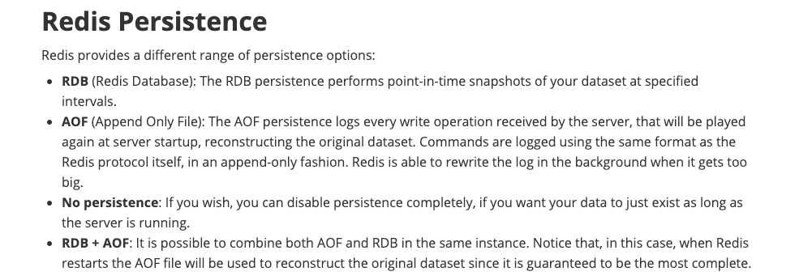

### 如何选择 RDB 和 AOF？

关于 RDB 和 AOF 的优缺点，官网上面也给了比较详细的说明[Redis persistenceopen in new window](https://redis.io/docs/manual/persistence/)，这里结合自己的理解简单总结一下。

**RDB 比 AOF 优秀的地方**：

* RDB 文件存储的内容是经过压缩的二进制数据， 保存着某个时间点的数据集，文件很小，适合做数据的备份，灾难恢复。AOF 文件存储的是每一次写命令，类似于 MySQL 的 binlog 日志，通常会比 RDB 文件大很多。当 AOF 变得太大时，Redis 能够在后台自动重写 AOF。新的 AOF 文件和原有的 AOF 文件所保存的数据库状态一样，但体积更小。不过， Redis 7.0 版本之前，如果在重写期间有写入命令，AOF 可能会使用大量内存，重写期间到达的所有写入命令都会写入磁盘两次。
* 使用 RDB 文件恢复数据，直接解析还原数据即可，不需要一条一条地执行命令，速度非常快。而 AOF 则需要依次执行每个写命令，速度非常慢。也就是说，与 AOF 相比，恢复大数据集的时候，RDB 速度更快。

**AOF 比 RDB 优秀的地方**：

* RDB 的数据安全性不如 AOF，没有办法实时或者秒级持久化数据。生成 RDB 文件的过程是比较繁重的， 虽然 BGSAVE 子进程写入 RDB 文件的工作不会阻塞主线程，但会对机器的 CPU 资源和内存资源产生影响，严重的情况下甚至会直接把 Redis 服务干宕机。AOF 支持秒级数据丢失（取决 fsync 策略，如果是 everysec，最多丢失 1 秒的数据），仅仅是追加命令到 AOF 文件，操作轻量。
* RDB 文件是以特定的二进制格式保存的，并且在 Redis 版本演进中有多个版本的 RDB，所以存在老版本的 Redis 服务不兼容新版本的 RDB 格式的问题。
* AOF 以一种易于理解和解析的格式包含所有操作的日志。你可以轻松地导出 AOF 文件进行分析，你也可以直接操作 AOF 文件来解决一些问题。比如，如果执行`FLUSHALL`命令意外地刷新了所有内容后，只要 AOF 文件没有被重写，删除最新命令并重启即可恢复之前的状态。

**综上**：

* Redis 保存的数据丢失一些也没什么影响的话，可以选择使用 RDB。
* 不建议单独使用 AOF，因为时不时地创建一个 RDB 快照可以进行数据库备份、更快的重启以及解决 AOF 引擎错误。
* 如果保存的数据要求安全性比较高的话，建议同时开启 RDB 和 AOF 持久化或者开启 RDB 和 AOF 混合持久化。

### Redis线程模型？

对于读写命令来说，Redis 一直是单线程模型。不过，在 Redis 4.0 版本之后引入了多线程来执行一些大键值对的异步删除操作， Redis 6.0 版本之后引入了多线程来处理网络请求（提高网络 IO 读写性能）。

**Redis单线程模型**

**Redis 基于 Reactor 模式设计开发了一套高效的事件处理模型**，这套事件处理模型对应的是 Redis 中的文件事件处理器（file event handler）。由于文件事件处理器是单线程方式运行的，所以我们一般都说 Redis 是单线程模型。

Redis 基于 Reactor 模式开发了自己的网络事件处理器：这个处理器被称为文件事件处理器（file event handler）。

* 文件事件处理器使用 I/O 多路复用（multiplexing）程序来同时监听多个套接字，并根据套接字目前执行的任务来为套接字关联不同的事件处理器。
* 当被监听的套接字准备好执行连接应答（accept）、读取（read）、写入（write）、关 闭（close）等操作时，与操作相对应的文件事件就会产生，这时文件事件处理器就会调用套接字之前关联好的事件处理器来处理这些事件。

**虽然文件事件处理器以单线程方式运行，但通过使用 I/O 多路复用程序来监听多个套接字**，文件事件处理器既实现了高性能的网络通信模型，又可以很好地与 Redis 服务器中其他同样以单线程方式运行的模块进行对接，这保持了 Redis 内部单线程设计的简单性。

**既然是单线程，那怎么监听大量的客户端连接呢？**

Redis 通过 **IO 多路复用程序** 来监听来自客户端的大量连接（或者说是监听多个 socket），它会将感兴趣的事件及类型（读、写）注册到内核中并监听每个事件是否发生。

这样的好处非常明显：**I/O 多路复用技术的使用让 Redis 不需要额外创建多余的线程来监听客户端的大量连接，降低了资源的消耗**。

文件事件处理器（file event handler）主要是包含 4 个部分：

* 多个 socket（客户端连接）
* IO 多路复用程序（支持多个客户端连接的关键）
* 文件事件分派器（将 socket 关联到相应的事件处理器）
* 事件处理器（连接应答处理器、命令请求处理器、命令回复处理器）

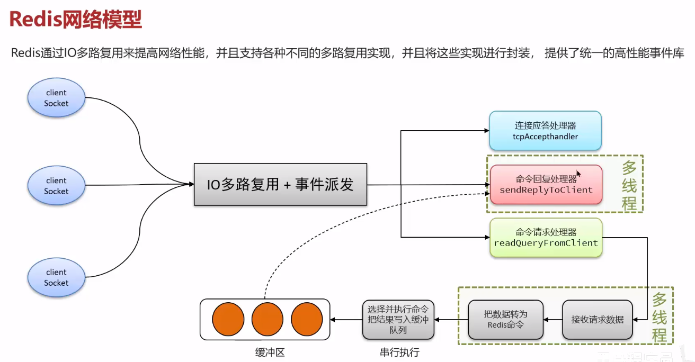

文件事件处理器（file event handler）

相关阅读：[Redis 事件机制详解](http://remcarpediem.net/article/1aa2da89/) 。

**Redis6.0 之前为什么不使用多线程？**

虽然说 Redis 是单线程模型，但是，实际上，**Redis 在 4.0 之后的版本中就已经加入了对多线程的支持。**

不过，Redis 4.0 增加的多线程主要是针对一些大键值对的删除操作的命令，使用这些命令就会使用主线程之外的其他线程来“异步处理”。

为此，Redis 4.0 之后新增了UNLINK（可以看作是 DEL 的异步版本）、FLUSHALL ASYNC（清空所有数据库的所有 key，不仅仅是当前 SELECT 的数据库）、FLUSHDB ASYNC（清空当前 SELECT 数据库中的所有 key）等异步命令。

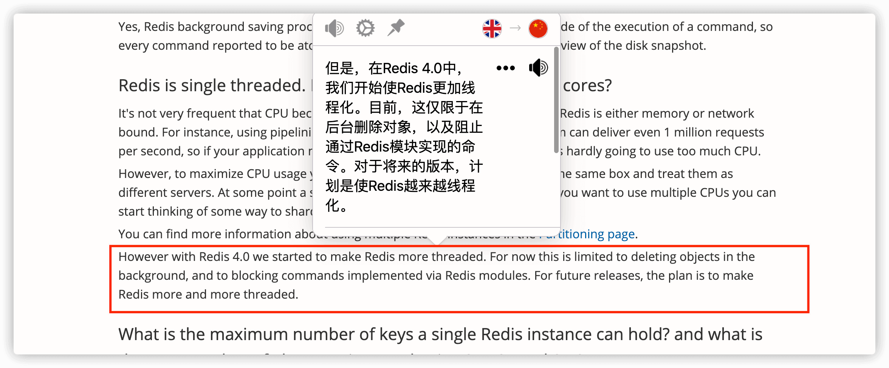

大体上来说，Redis 6.0 之前主要还是单线程处理。

**那 Redis6.0 之前为什么不使用多线程？** 我觉得主要原因有 3 点：

* 单线程编程容易并且更容易维护；
* Redis 的性能瓶颈不在 CPU ，主要在内存和网络；
* 多线程就会存在死锁、线程上下文切换等问题，甚至会影响性能。

### Redis后台线程？

我们虽然经常说 Redis 是单线程模型（主要逻辑是单线程完成的），但实际还有一些后台线程用于执行一些比较耗时的操作：

* 通过 bio_close_file 后台线程来释放 AOF / RDB 等过程中产生的临时文件资源
* 通过 bio_aof_fsync 后台线程调用 fsync 函数将系统内核缓冲区还未同步到到磁盘的数据强制刷到磁盘（ AOF 文件）
* 通过 bio_lazy_free后台线程释放大对象（已删除）占用的内存空间

### Redis 给缓存数据设置过期时间有什么用？

1. 大量数据导致OOM
2. 过期业务，例如用户登录的token

### Redis如何判断数据是否过期？

Redis 通过一个叫做**过期字典**（可以看作是 hash 表）来保存数据过期的时间。过期字典的键指向 Redis 数据库中的某个 key(键)，过期字典的值是一个 long long 类型的整数，这个整数保存了 key 所指向的数据库键的过期时间（毫秒精度的 UNIX 时间戳）。

### 过期数据的删除策略?

* **惰性删除：**只有取出key时才对数据进行过期检查，对CPU很友好，但是可能导致很多过期key没有被删除
* **定期删除：**每隔一段时间顺序遍历字典抽取一批key进行过期删除。Redis 底层会通过限制删除操作执行的时长和频率来减少删除操作对 CPU 时间的影响。ps：定亲删除对内存友好，但是对CPU不友好。

Redis采用的是**惰性删除+定期删除**。

但是这样仍有可能存在大量过期的key存在内存的情况，要靠**Redis 内存淘汰机制**来解决。

### Redis内存淘汰机制?

> Redis的对象系统还实现了基于引用计数的内存回收机制，当程序不再使用某个对象的时候，这个对象所占用的内存就会被自动释放

相关问题：MySQL 里有 2000w 数据，Redis 中只存 20w 的数据，如何保证 Redis 中的数据都是热点数据?

Redis 提供 6 种数据淘汰策略：

1. **volatile-lru（least recently used）**：从已设置过期时间的数据集（server.db[i].expires）中挑选最近最少使用的数据淘汰。*、
2. **volatile-ttl**：从已设置过期时间的数据集（server.db[i].expires）中挑选将要过期的数据淘汰。
3. **volatile-random**：从已设置过期时间的数据集（server.db[i].expires）中任意选择数据淘汰。
4. **allkeys-lru（least recently used）**：当内存不足以容纳新写入数据时，在键空间中，移除最近最少使用的 key（**这个是最常用的**）。
5. **allkeys-random**：从数据集（server.db[i].dict）中任意选择数据淘汰。
6. **no-eviction**：禁止驱逐数据，也就是说当内存不足以容纳新写入数据时，新写入操作会报错。这个应该没人使用吧！

4.0 版本后增加以下两种：

1. **volatile-lfu（least frequently used）**：从已设置过期时间的数据集（server.db[i].expires）中挑选最不经常使用的数据淘汰。
2. **allkeys-lfu（least frequently used）**：当内存不足以容纳新写入数据时，在键空间中，移除最不经常使用的 key。

### 什么是Redis事务？

**Redis 事务提供了一种将多个命令请求打包的功能。然后，再按顺序执行打包的所有命令，并且不会被中途打断。**

1. Redis 可以通过 **MULTI**，**EXEC**，**DISCARD** 和 **WATCH** 等命令来实现事务(Transaction)功能。
   * 开始事务（MULTI）；
   * 命令入队(批量操作 Redis 的命令，先进先出（FIFO）的顺序执行)；
   * 执行事务(EXEC)。

2. Redis事务不支持原子性。
3. 虽然Redis支持持久化，但只有在AOF持久化策略设为always时才可以满足持久性，但性能太差，一般不这样，所以Redis事务的持久性也没办法保证。

> 不推荐使用。

### 如何解决Redis事务的缺陷？

Redis 从 2.6 版本开始支持执行 **Lua 脚本**，它的功能和事务非常类似。我们可以利用 Lua 脚本来批量执行多条 Redis 命令，这些 Redis 命令会被提交到 Redis 服务器**一次性**执行完成，大幅减小了网络开销。

不过，如果 Lua 脚本运行时出错并中途结束，出错之后的命令是不会被执行的。并且，出错之前执行的命令是无法被撤销的，无法实现类似关系型数据库执行失败可以回滚的那种原子性效果。因此， **严格来说的话，通过 Lua 脚本来批量执行 Redis 命令实际也是不完全满足原子性的。**

> 如果想要让 Lua 脚本中的命令全部执行，必须保证语句语法和命令都是对的。

### Redis性能优化有哪些方法？

1. 使用批量操作减少网络传输
   * 原生批量操作
   * pipeline
   * lua脚本

### 大量key集中过期问题如何解决？

> 个人觉得这里可以先讲一下缓存雪崩,再讲一下key的删除策略.

Redis对于过期key采用的是定期删除+惰性删除的策略。

定期删除执行过程中如果出现大量key集中过期，客户端必须等待定期清理完成。因为这个定期任务是Redis主线程执行的。就会导致客户端响应慢。

解决方法：

* 给key设置随机过期时间
* 开启lazy-free（惰性删除/延迟释放）。lazy-free 特性是 Redis 4.0 开始引入的，指的是让 Redis 采用异步方式延迟释放 key 使用的内存，将该操作交给单独的子线程处理，避免阻塞主线程。

### Redis bigkey是什么？

**什么是bigkey？**

如果一个key对应的value占用内存比较大，这个key就可以看作bigkey。

bigkey除了会消耗更多内存和宽带，还会对性能造成影响。应该尽量避免Redis中存在bigkey。

**如何发现bigkey？**

1. **使用Redis自带的`--bigkeys`来查找**
2. 借助开源工具分析RDB文件
3. 借助公有云的Redis分析服务

**如何处理bigkey？**

* 分割bigkey：将一个bigkey分割成多个小key。需要修改业务层代码，不推荐
* 手动清理：Redis 4.0+ 可以使用 `UNLINK` 命令来异步删除一个或多个指定的 key。Redis 4.0 以下可以考虑使用 `SCAN` 命令结合 `DEL` 命令来分批次删除。
* 采用合适的数据结构：比如使用 [HyperLogLog](https://www.runoob.com/redis/redis-hyperloglog.html) 统计页面唯一访问者的数量。

### Redis hotkey是什么？

**什么是hotkey？**

> 与缓存击穿相对应.

如果一个key的访问次数比较多且明显多于其他key，这个key就称为hotkey。

处理hotkey会占用大量带宽和cpu，可能影响其他请求的处理。另外，如果hotkey的访问量过大导致Redis宕机，请求就会全部打到数据库上，导致数据库崩溃。

**如何发现hotkey？**

1. **使用Redis自带的`--hotkeys` 参数**
2. 使用`menter`命令
3. 借助开源项目
4. 根据业务情况提前估计
5. 业务代码中记录分析
6. 借助公有云的Redis分析服务

**如何解决hotkey？**

* 读写分离：主节点写，从节点读
* 使用Redis Cluster
* 二级缓存：将hotkey在JVM本地内存放一份（Caffeine）

### Redis内存碎片？

**什么是内存碎片？**

可以简单理解为那些不可用的空闲空间。

**为什么会有Redis内存碎片问题？**

1. Redis存储数据时向操作系统申请的内存空间可能会大于数据实际需要的内存
2. 频繁修改Redis中数据时也会产生内存碎片问题：当Redis中的某个key删除时，Redis通常不会轻易释放内存给操作系统

**如何查看Redis内存碎片的信息？**

使用 `info memory` 命令即可查看 Redis 内存相关的信息。

Redis 内存碎片率的计算公式：`mem_fragmentation_ratio` （内存碎片率）= `used_memory_rss` (操作系统实际分配给 Redis 的物理内存空间大小)/ `used_memory`(Redis 内存分配器为了存储数据实际申请使用的内存空间大小)

通常情况下，我们认为 mem_fragmentation_ratio > 1.5 的话才需要清理内存碎片。

如果想要快速查看内存碎片率的话，还可以通过下面这个命令：

```bash
> redis-cli -p 6379 info | grep mem_fragmentation_ratio
```

另外，内存碎片率可能存在小于 1 的情况。 相关文章：[故障分析 | Redis 内存碎片率太低该怎么办？- 爱可生开源社区](https://mp.weixin.qq.com/s/drlDvp7bfq5jt2M5pTqJCw) 。

**如何清理Redis内存碎片？**

Redis4.0-RC3 版本以后自带了内存整理，可以避免内存碎片率过大的问题。

直接通过 config set 命令将 activedefrag 配置项设置为 yes 即可。

```bash
config set activedefrag yes
```

具体什么时候清理需要通过下面两个参数控制：

```bash
# 内存碎片占用空间达到 500mb 的时候开始清理
config set active-defrag-ignore-bytes 500mb
# 内存碎片率大于 1.5 的时候开始清理
config set active-defrag-threshold-lower 50
```

通过 Redis 自动内存碎片清理机制可能会对 Redis 的性能产生影响，我们可以通过下面两个参数来减少对 Redis 性能的影响：

```bash
# 内存碎片清理所占用 CPU 时间的比例不低于 20%
config set active-defrag-cycle-min 20
# 内存碎片清理所占用 CPU 时间的比例不高于 50%
config set active-defrag-cycle-max 50
```

另外，重启节点可以做到内存碎片重新整理。如果你采用的是高可用架构的 Redis 集群的话，你可以将碎片率过高的主节点转换为从节点，以便进行安全重启。

### 什么是缓存穿透？

大量请求的key不合理，根本不存在于缓存层，也不存在于数据库中。导致这些请求直接到了数据库上，对数据库产生巨大压力。

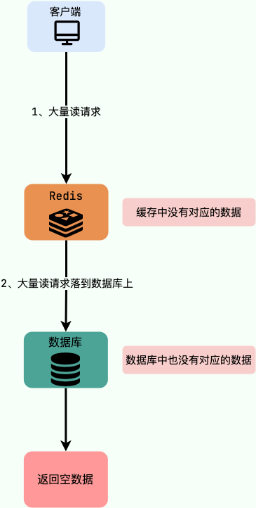

**有哪些解决办法？**

最基本的是首先做好参数校验，一些不合法的参数请求直接抛异常。

1. 缓存无效key

   如果缓存和数据库都查不到某个key，就把这个key写到一个Redis中并设置过期时间。 这种方式可以解决请求的 key 变化不频繁的情况，如果黑客恶意攻击，每次构建不同的请求 key，会导致 Redis 中缓存大量无效的 key 。很明显，这种方案并不能从根本上解决此问题。如果非要用这种方式来解决穿透问题的话，尽量将无效的 key 的过期时间设置短一点比如 1 分钟。

2. 布隆过滤器

   布隆过滤器说某个元素存在，小概率会误判。布隆过滤器说某个元素不在，那么这个元素一定不在。

   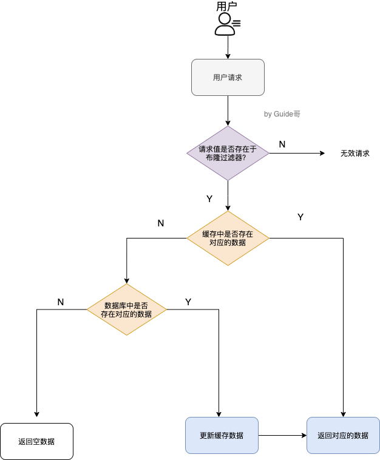

### 什么是缓存击穿？

请求的key是热点数据，该数据存在于数据库中，但不存在于缓存中（可能因为一瞬间的缓存过期），可能导致瞬时大量的请求直接打到数据库上，对数据库造成了巨大压力。


**有哪些解决办法？**

* 设置热点数据永不过期或过期时间长
* 针对热点数据提前预热，将其存入缓存中并设置合理的过期时间：比如秒杀场景下保证秒杀结束前不过期
* 请求数据库写数据到缓存之前，先获取互斥锁，保证只有一个请求会落到数据库上，减少数据库压力

### 什么是缓存雪崩？

缓存在同一时间大面积失效，导致大量的请求都直接落到数据库上，对数据库造成巨大压力。

另外，缓存服务宕机也会导致缓存雪崩现象。


**有哪些解决办法？**

**针对Redis服务不可用的情况：**

* 采用Redis集群
* 限流，避免同时处理大量请求

**针对热点缓存失效的情况：**

* 设置不同的失效时间，比如随机设置缓存的失效时间
* 缓存用不失效（不推荐）
* 设置二级缓存

### 读写键空间时的维护操作？

当使用Redis命令对数据库进行读写时，服务器不仅会对键空间执行指定的读写操作，还会执行一些额外的维护操作，其中包括：

1. 在读取一个键之后（读操作和写操作都要对键进行读取），服务器会根据键是否存在来更新服务器的键空间命中（hit）次数或键空间不命中（miss）次数，这两个值可以在INFO stats命令的keyspace_hits属性和keyspace_misses属性中查看。
2. 在读取一个键之后，服务器会更新键的LRU（最后一次使用）时间，这个值可以用于计算键的闲置时间，使用OBJECT idletime命令可以查看键key的闲置时间。
3. 如果服务器在读取一个键时发现该键已经过期，那么服务器会先删除这个过期键，然后才执行余下的其他操作，本章稍后对过期键的讨论会详细说明这一点。
4. 如果有客户端使用WATCH命令监视了某个键，那么服务器在对被监视的键进行修改之后，会将这个键标记为脏（dirty），从而让事务程序注意到这个键已经被修改过
5. 服务器每次修改一个键之后，都会对脏（dirty）键计数器的值增1，这个计数器会触发服务器的持久化以及复制操作
6. 如果服务器开启了数据库通知功能，那么在对键进行修改之后，服务器将按配置发送相应的数据库通知，本章稍后讨论数据库通知功能的实现时会详细说明这一点

## ElasticSearch

### ElasticSearch是什么？

ElasticSearch是一个开源的分布式、RESTful**搜索和分析引擎**。可以用来解决使用数据库进行模糊搜索时存在的性能问题，适用于所有类型的数据，包括文本、数字、地理空间、结构化和非结构化数据。

**ES有什么功能？**

* 本地生活类App，比如美团基于定位实现附近美食功能
* 结合ES、Kibana等实现一个功能完善的日志系统
* 使用ES作为地理信息系统管理、集成和分析空间信息

### 为什么不用MySQL？

MySQL主要提供数据存储功能，而ES主要提供搜索功能。

MySQL虽然也能提供简单的搜索功能，但有以下缺点：

* 查询效率低下，模糊匹配有可能导致全表扫描
* MySQL全文索引只支持CHAR、VARCHAR和TEXT类型，不支持分词器

而ES有以下优点：

* 支持多种数据类型，非结构化，数值，地理信息
* 简单的RESTful API，兼容多语言
* 提供更丰富的**分词器**，支持热点词查询
* 近实时查询，ES每隔一秒把数据存储至系统缓存中，且使用倒排索引提高搜索效率
* 支持相关性搜索，可以给搜索结果打分
* 天然分布式存储，使用分片支持更大数据量

### ES中的基本概念

* **Index（索引）**：索引是一类拥有相似特征的文档的集合。**类似MySQL中的表**
* **Document（文档）**：可搜索最小单位，用于存储数据，一般为JSON格式。文档由一个或多个字段（Field）组成，字段类型可以是布尔、数值、字符串、二进制、日期等，**类似MySQL中的一行**
* **Type（字段类型）**：**在旧版本中**，每个文档都必须设置它的类型。但7.0之后被弃用，每个索引只包含一种类型。原因是为了简化数据模型，降低复杂度
* **Mapping（映射）**：定义字段名、数据类型、优化信息（是否索引）、分词器，类似MySQL中的表的定义。一个Index对应一个Mapping，**即Index的字段定义**。
* **Node（节点）**：相当于一个节点，多个节点构成一个集群
* **Shard（分片）**：Index被分为多个部分存储在不同Node上的分片中，以提高吞吐性能
* **Replica（副本）**：Index副本，每个Index有一个或多个副本，提高拓展功能和吞吐量
* **DSL（查询语言）**：基于JSON的查询语言，类似SQL语句

### 倒排索引和正排索引

**什么是倒排索引**？

倒排索引是用于提高数据检索速度的一种数据结构，空间消耗比较大。倒排索引首先将检索文档进行分词得到多个词条，然后将词条和文档ID建立联系，提高检索效率。


**倒排索引创建和检索的大体流程**

**创建流程：**

1. 建立文档列表，每个文档都有唯一的文档ID与之对应
2. 通过分词器对文档进行分词，生成类似`<词语，文档ID>`的一组数据
3. 将词语作为索引关键字，记录词语和文档的对应关系，也就是哪些文档中包含了该词语


**检索流程：**

1. 根据分词器分词
2. 根据分词查找对应文档ID
3. 根据文档ID找到文档

**倒排索引由什么组成**？

* **单词字典**：用于存储单词列表。一般用B+树或Hash拉链法存储

* **倒排列表**：记录单词对应的文档的集合，分为：

  * DocID：文档id

  * TF：单词出现的频率
  * Position：单词在文档中出现的位置，用于检索
  * Offset：偏移量，记录单词开始结束位置，用于高亮显示

**正排索引由什么组成**？

正排索引将文档id和分词建立联系：


正排索引和倒排索引的区别：

* 正排索引维护成本低，新增数据时只需要在末尾增加一个id；倒排索引维护成本高，因为每次的文档更新都意味着倒排索引的重建
* 正排索引查询效率低，需要一个个比对；倒排索引建立了分词和DocID的关系，效率高

### 分词器的作用

分词器负责对文档内容进行分词，将一个文档转换为单词词典。单词词典是由文档中出现过的所有单词组成的字符串集合。

**常用的分词器有哪些**？

**非中文分词器：**

* **Standart Analyzer:** 标准分词器，是默认分词器，英文转换成小写，中文只支持单字切分
* **Simple Analyzer:** 简单分词器，通过非字母字符分割文本，英文转换成小写，非英文不分词
* **Stop Analyzer:** 在`Simple Analyzer`的基础上去除了the,a,is等词
* **Whitespace Analyzer:** 通过空格分词，非英文不分

以上是ES自带的几个分词器。

**中文分词器：**

* **IK Analyzer：**最常用，分为：

* - ik_max_word：细粒度切分，会做最细粒度拆分，尽可能拆分出更多单词
  * ik_smart：智能模式，做粗粒度拆分，已被分出的词语不会再被其他词语占有

* **其他**

### 分词器由什么组成？

三部分（按顺序）：

* Character Filter：处理原始文本，例如去掉HTML标签
* Tokenizer：按分词器规则切分单词
* Token Filters：对切分后的单词加工，包括转小写、切除停用词、添加近义词等

三者个数：

Character Filter(0个或多个）+Tokenizer（1个）+Token Filters（0个或多个）

####

### ES常见的数据类型有哪些？

**常见类型：**

* 关键词：keyword、constant_keyword、wildcard
* 数值型：long、integer、short、byte、double、float、half_float、scaled_float
* 布尔型：boolean
* 日期型：data、data_nanos
* 二进制：binary

**结构化数据类型：**

* 范围型：integer_range、float_range、long_range、double_range、data_range
* ip地址类型：ip
* 软件版本：version

**文字搜索类型：**

* 非结构化文本：text
* 包含特殊标记的文本：annotated-text
* 自动完成建议：completion

**对象和关系类型：**

* 嵌套类型：nested、join
* 对象类型：object、flattened

**空间类型：**

* 地理坐标类型：geo_point
* 地理形状类型：geo_shape

### keyword和text有什么区别？

keyword不走分词器，text会走，keyword效率更高，一般在fields中定义keyword类型字段：<https://netcut.cn/p/7c5238151898340e>

```json
"name": {
  "type":"text",
  "fields": {
    "keyword": {
      "type": "keyword"
    }
  }
}
```

### ES中有数组类型吗？

没有专门的数组类型，默认情况下，任何字段都可以包含零个或多个值，但数组中的所有值必须有相同的数据类型。

### 可以在Mapping中直接修改字段类型吗？

不可以。mapping就像mysql的表定义，只能新增不能修改。但是可以`reindex`重新索引或重新进行数据建模并导入数据。

### Nested数据类型是干嘛的？

Nested数据类型可以避免**数组扁平化处理**（多个数组的字段做笛卡尔积）。<https://netcut.cn/p/1bae8387f079d30a>

```json
// 会导致查询John White也会匹配，将类型改为nested问题解决 
PUT my_index/_doc/1 
{  
    "group" : "fans",
    "user" : [
        {
            "first" : "John",
            "last" :  "Smith"
        },
        {
            "first" : "Alice",
            "last" :  "White"
        }
    ]
}
```

如果需要保证每个对象的独立性，要用Nested。

### 怎么将多个字段合并成一个字段？

使用`copy_to`，比如把first_name和last_name合并为full_name，但full_name不在查询结果中展示：

```json
PUT /my_index
{
  "mappings":{
    "properties":{
      "first_name":{
       "type": "text",
        "copy_to": "full_name"
      },
      "last_name": {
       "type": "text",
        "copy_to": "full_name"
      },
      "full_name": {
       "type": "text"
      }
    }
  }
}
```

### 什么是Mapping？

Mapping（映射）定义字段名、数据类型、优化信息（是否索引）、分词器，类似MySQL中的表的定义。一个Index对应一个Mapping。

Mapping分为动态Mapping和显式Mapping两种：

* 动态Mapping：根据待索引数据自动建立索引、自动定义映射类型
* 显式Mapping：手动控制字段的存储和索引方式，比如哪些字符串应该被视为全文字段

### 如何快速创建Mapping？

* 先创建临时Index，插入一些临时数据
* 访问Mapping API，获取Mapping定义
* 在此基础上做一些修改
* 删除临时Index

### 动态Mapping有哪几种属性配置？

一共4种，默认为true。

* `dynamic = true`：新字段被添加到映射中
* `dynamic = runtime`：新字段作为运行时字段被添加到映射中，这些字段未编入索引，在查询时加载
* `dynamic = flase`：新字段将被忽略，这些字段不会被索引或可搜索
* `dynamic = strict`：不允许添加新字段，新字段必须显式添加到映射中

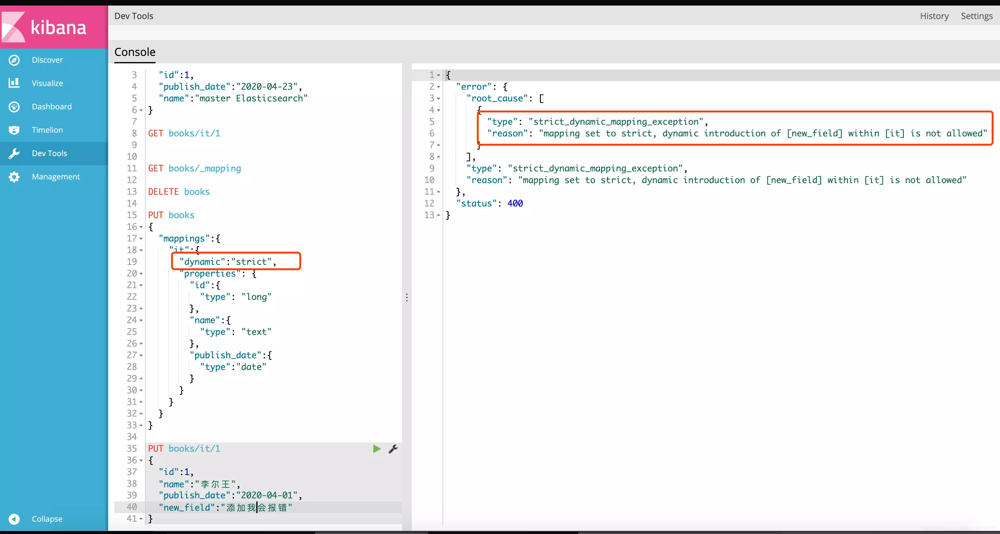

### 动态Mapping如何防止字段无限增加？

如果使用了动态映射，插入的每一个新文档都可能引入新字段。可以使用**映射限制设置**来限制字段映射的数量并防止映射爆炸。

<https://netcut.cn/p/e5daf6ac18bbc3fd>

### 想要某个字段不被索引怎么做？

在Mapping中设置属性index=false，则该字段不可作为检索条件，但结果中仍包含该字段。

另外，还有一个属性index_operations可以控制倒排索引记录内容，属性有：

* docs：只包括DocID
* freqs：包括DocID/词频
* options：默认属性，包括DocID/词频/位置
* offsets：DocID/词频/位置/字符偏移量

####

### ES和MySQL同步策略有哪些？

可以将同步类型分为**全量同步**和**增量同步**。

1. 全量同步即建好ES索引后一次性导入MySQL的所有数据。

   go-mysql-elasticsearch是一项将MySQL数据同步到ES中的服务，同样支持增量同分布：<https://github.com/go-mysql-org/go-mysql-elasticsearch>

2. 增量同步即对MySQL中新增，修改，删除的数据进行同步：

   * 同步双写：修改数据时同步到ES，性能较差，有数据丢失风险，一般不用

   * 异步双写：修改数据时，使用MQ异步写入ES提高效率。这种方式引入了新的组件和服务，增加了整体的复杂性

   * 定时器：定时同步数据到ES，时效性较差

   * binlog同步组件Canal（推荐）：Canal通过解析MySQL的binlog日志文件进行数据同步，使用Cannal可以做到业务代码完全解耦，API完全解耦，零代码实时同步

### Cannal增量同步数据到ES的原理

1. Canal 模拟 MySQL Slave 节点与 MySQL Master 节点的交互协议，把自己伪装成一 MySQL Slave 节点，向 MySQL Master 节点请求 binlog
2. MySQL Master 节点接收到请求之后，根据偏移量将新的 binlog 发送给 MySQL Slave 节点
3. Canal 接收到 binlog 之后，就可以对这部分日志进行解析，获取主库的结构及数据变更

  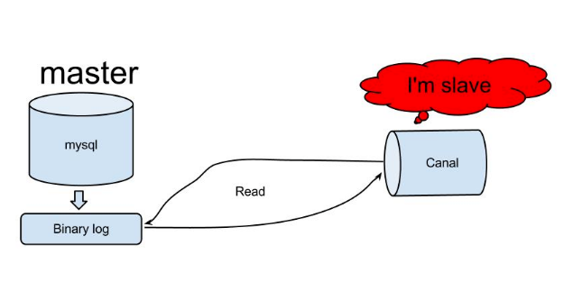

### ES索引优化策略有哪些？

* ES 提供了 Bulk API 支持批量操作，当我们有大量的写任务时，可以使用 Bulk 来进行批量写入。不过，使用 Bulk 请求时，每个请求尽量不要超过几十 M，因为太大会导致内存使用过大。
* ES 默认副本数量为 3 个，这样可以提高可用性，但会影响写入索引的效率。某些业务场景下，可以设置副本数量为 1 或者 0，提高写入索引的效率。
* ES 在写入数据的时候，采用延迟写入的策略，默认 1 秒之后将内存中 segment 数据更新到磁盘中，此时我们才能将数据搜索出来。这就是为什么 Elasticsearch 提供的是近实时搜索功能。某些业务场景下，可以增加刷新时间间隔比如设置刷新时间间隔为 30s( `dex.refresh_interval=30s` )，减少 segment 合并压力，提高写入索引的效率。
* 加大 index_buffer_size ，这个是 ES 活跃分片共享的内存区，官方建议每个分片至少 512MB，且为 JVM 内存的 10%。
* 使用 ES 的默认 ID 生成策略或使用数字类型 ID 做为主键。
* 合理的配置使用 index 属性， `analyzed` 和 `not_analyzed` ，根据业务需求来控制字段是否分词或不分词。只有 `groupby` 需求的字段，配置时就设置成 `not_analyzed` ，以提高查询或聚类的效率。
* 加大 Flush 设置。 Flush 的主要目的是把文件缓存系统中的段持久化到硬盘，当 Translog 的数据量达到 512MB 或者 30 分钟时，会触发一次 Flush，我们可以加大 `dex.translog.flush_threshold_size` ，但必须为操作系统的文件缓存系统留下足够的空间。

### ES查询优化策略有哪些？

* 建立冷热索引库（可用固态硬盘存放热库数据，普通硬盘存放冷库数据），热库数据可提前预热加载至内存，提高检索效率。
* 自定义路由规则，让某一类型的文档都被存储到同一分片。
* 使用 copy_to 将多个字段整合为一个。
* 控制字段的数量，业务中不使用的字段，就不要索引。
* 不要返回无用的字段，使用 _source 进行指定。
* 避免大型文档存储，默认最大长度为 100MB。
* 使用 keyword 数据类型，该类型不会走分词器，效率大大提高。
* 开启慢查询配置定位慢查询。
* ES 查询的时候，使用 filter 查询会使用 query cache, 如果业务场景中的过滤查询比较多，建议将 querycache 设置大一些，以提高查询速度。
* 尽量避免分页过深。
* 增加分片副本提高查询吞吐量，避免使用通配符。
* 加大堆内存，ES 默认安装后设置的内存是 1GB，可以适当加大但不要超过物理内存的 50%，且最好不要超过 32GB。
* 分配一半物理内存给文件系统缓存，以便加载热点数据。  

## MongoDB

### MongoDB 是什么？

* 基于**分布式文件存储**的文档类型数据库（NoSQL数据库）
* 面向文档的存储方式，支持”**无模式**“的数据建模
* 天然支持水平拓展和高可用

> 在许多场景下，MongoDB 可以用于代替传统的关系型数据库或键/值存储方式，皆在为 Web 应用提供可扩展的高可用高性能数据存储解决方案。

### MongoDB 的存储结构是什么？

* **文档（Document）**：MongoDB 中最基本的单元，由 BSON 键值对（key-value）组成，类似于关系型数据库中的行（Row）。
* **集合（Collection）**：一个集合可以包含多个文档，类似于关系型数据库中的表（Table）。
* **数据库（Database）**：一个数据库中可以包含多个集合，可以在 MongoDB 中创建多个数据库，类似于关系型数据库中的数据库（Database）。

也就是说，MongoDB 将数据记录存储为文档 （更具体来说是[BSON 文档](https://www.mongodb.com/docs/manual/core/document/#std-label-bson-document-format)），这些文档在集合中聚集在一起，数据库中存储一个或多个文档集合。

**SQL 与 MongoDB 常见术语对比**：

| SQL                      | MongoDB                         |
| ------------------------ | ------------------------------- |
| 表（Table）              | 集合（Collection）              |
| 行（Row）                | 文档（Document）                |
| 列（Col）                | 字段（Field）                   |
| 主键（Primary Key）      | 对象 ID（Objectid）             |
| 索引（Index）            | 索引（Index）                   |
| 嵌套表（Embedded Table） | 嵌入式文档（Embedded Document） |
| 数组（Array）            | 数组（Array）                   |

**文档**

MongoDB 中的记录就是一个 BSON 文档，它是由键值对组成的数据结构，类似于 JSON 对象，是 MongoDB 中的基本数据单元。字段的值可能包括其他文档、数组和文档数组。

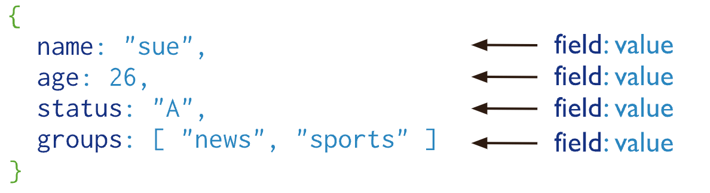MongoDB 文档

文档的键是字符串。除了少数例外情况，键可以使用任意 UTF-8 字符。

* 键不能含有 `\0`(空字符）。这个字符用来表示键的结尾。
* `.` 和 `$` 有特别的意义，只有在特定环境下才能使用。
* 以下划线`_`开头的键是保留的(不是严格要求的)。

> **BSON [bee·sahn]** 是 [Binary JSON](http://json.org/)的简称，是 JSON 文档的二进制表示，支持将文档和数组嵌入到其他文档和数组中，还包含允许表示不属于 JSON 规范的数据类型的扩展。有关 BSON 规范的内容，可以参考 [bsonspec.org](http://bsonspec.org/)，另见[BSON 类型](https://www.mongodb.com/docs/manual/reference/bson-types/)。
>
> 根据维基百科对 BJSON 的介绍，BJSON 的遍历速度优于 JSON，这也是 MongoDB 选择 BSON 的主要原因，但 BJSON 需要更多的存储空间。
>
> 与 JSON 相比，BSON 着眼于提高存储和扫描效率。BSON 文档中的大型元素以长度字段为前缀以便于扫描。在某些情况下，由于长度前缀和显式数组索引的存在，BSON 使用的空间会多于 JSON。

**集合**

MongoDB 集合存在于数据库中，**没有固定的结构**，也就是 **无模式** 的，这意味着可以往集合插入不同格式和类型的数据。不过，通常情况下，插入集合中的数据都会有一定的关联性。

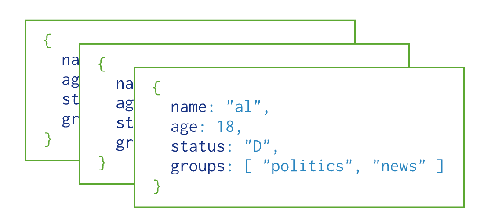

**集合不需要事先创建**，当第一个文档插入或者第一个索引创建时，如果该集合不存在，则会创建一个新的集合。

集合名可以是满足下列条件的任意 UTF-8 字符串：

* 集合名不能是空字符串`""`。
* 集合名不能含有 `\0` （空字符)，这个字符表示集合名的结尾。
* 集合名不能以"system."开头，这是为系统集合保留的前缀。例如 `system.users` 这个集合保存着数据库的用户信息，`system.namespaces` 集合保存着所有数据库集合的信息。
* 集合名必须以下划线或者字母符号开始，并且不能包含 `$`。

**数据库**

数据库用于存储所有集合.

MongoDB 预留了几个特殊的数据库。

* **admin** : admin 数据库主要是保存 root 用户和角色。

> 例如，system.users 表存储用户，system.roles 表存储角色。一般不建议用户直接操作这个数据库。将一个用户添加到这个数据库，且使它拥有 admin 库上的名为 dbAdminAnyDatabase 的角色权限，这个用户自动继承所有数据库的权限。一些特定的服务器端命令也只能从这个数据库运行，比如关闭服务器。

* **local** : local 数据库是不会被复制到其他分片的，因此可以用来存储本地单台服务器的任意 collection。

> 一般不建议用户直接使用 local 库存储任何数据，也不建议进行 CRUD 操作，因为数据无法被正常备份与恢复。

* **config** : 当 MongoDB 使用分片设置时，config 数据库可用来保存分片的相关信息。
* **test** : 默认创建的测试库，连接 [mongod](https://mongoing.com/docs/reference/program/mongod.html) 服务时，如果不指定连接的具体数据库，默认就会连接到 test 数据库。

数据库名可以是满足以下条件的任意 UTF-8 字符串：

* 不能是空字符串`""`。
* 不得含有`' '`（空格)、`.`、`$`、`/`、`\`和 `\0` (空字符)。
* 应全部小写。
* 最多 64 字节。

数据库名最终会变成文件系统里的文件，这也就是有如此多限制的原因。

### MongoDB 有什么特点？

* **数据记录被存储为文档**：MongoDB 中的记录就是一个 BSON 文档，它是由键值对组成的数据结构，类似于 JSON 对象，是 MongoDB 中的基本数据单元。
* **无模式**：集合的概念类似 MySQL 里的表，但它不需要定义任何模式，能够用更少的数据对象表现复杂的领域模型对象。
* **支持多种查询方式**：MongoDB 查询 API 支持读写操作 (CRUD)以及数据聚合、文本搜索和地理空间查询。
* **支持 ACID 事务**：NoSQL 数据库通常不支持事务，为了可扩展和高性能进行了权衡。不过，也有例外，MongoDB 就支持事务。与关系型数据库一样，MongoDB 事务同样具有 ACID 特性。MongoDB 单文档原生支持原子性，也具备事务的特性。MongoDB 4.0 加入了对多文档事务的支持，但只支持复制集部署模式下的事务，也就是说事务的作用域限制为一个副本集内。MongoDB 4.2 引入了分布式事务，增加了对分片集群上多文档事务的支持，并合并了对副本集上多文档事务的现有支持。
* **高效的二进制存储**：存储在集合中的文档，是以键值对的形式存在的。键用于唯一标识一个文档，一般是 ObjectId 类型，值是以 BSON 形式存在的。BSON = Binary JSON， 是在 JSON 基础上加了一些类型及元数据描述的格式。
* **自带数据压缩功能**：存储同样的数据所需的资源更少。
* **支持 mapreduce**：通过分治的方式完成复杂的聚合任务。不过，从 MongoDB 5.0 开始，map-reduce 已经不被官方推荐使用了，替代方案是 [聚合管道](https://www.mongodb.com/docs/manual/core/aggregation-pipeline/)。聚合管道提供比 map-reduce 更好的性能和可用性。[例子](https://netcut.cn/p/cb3d3340b4207948)
* **支持多种类型的索引**：MongoDB 支持多种类型的索引，包括单字段索引、复合索引、多键索引、哈希索引、文本索引、 地理位置索引等，每种类型的索引有不同的使用场合。
* **支持 failover**：提供自动故障恢复的功能，主节点发生故障时，自动从从节点中选举出一个新的主节点，确保集群的正常使用，这对于客户端来说是无感知的。
* **支持分片集群**：MongoDB 支持集群自动切分数据，让集群存储更多的数据，具备更强的性能。在数据插入和更新时，能够自动路由和存储。
* **支持存储大文件**：MongoDB 的单文档存储空间要求不超过 16MB。对于超过 16MB 的大文件，MongoDB 提供了 GridFS 来进行存储，通过 GridFS，可以将大型数据进行分块处理，然后将这些切分后的小文档保存在数据库中。

### MongoDB 适合什么应用场景？

**MongoDB 的优势在于其数据模型和存储引擎的灵活性、架构的可扩展性以及对强大的索引支持。**

选用 MongoDB 应该充分考虑 MongoDB 的优势，结合实际项目的需求来决定：

* 随着项目的发展，使用类 JSON 格式（BSON）保存数据是否满足项目需求？MongoDB 中的记录就是一个 BSON 文档，它是由键值对组成的数据结构，类似于 JSON 对象，是 MongoDB 中的基本数据单元。
* 是否需要大数据量的存储？是否需要快速水平扩展？MongoDB 支持分片集群，可以很方便地添加更多的节点（实例），让集群存储更多的数据，具备更强的性能。
* 是否需要更多类型索引来满足更多应用场景？MongoDB 支持多种类型的索引，包括单字段索引、复合索引、多键索引、哈希索引、文本索引、 地理位置索引等，每种类型的索引有不同的使用场合。
* ......

### MongoDB 支持哪些存储引擎？

存储引擎（Storage Engine）是数据库的核心组件，负责管理数据在内存和磁盘中的存储方式。

与 MySQL 一样，MongoDB 采用的也是 **插件式的存储引擎架构** 。

> 插件式的存储引擎架构可以实现 Server 层和存储引擎层的解耦，可以支持多种存储引擎，如 MySQL 既可以支持 B-Tree 结构的 InnoDB 存储引擎，还可以支持 LSM 结构的 RocksDB 存储引擎。

现在主要有下面这两种存储引擎：

* **WiredTiger 存储引擎**：自 MongoDB 3.2 以后，默认的存储引擎为 [WiredTiger 存储引擎](https://www.mongodb.com/docs/manual/core/wiredtiger/) 。非常适合大多数工作负载，建议用于新部署。WiredTiger 提供文档级并发模型、检查点和数据压缩（后文会介绍到）等功能。
* **In-Memory 存储引擎**：[In-Memory 存储引擎](https://www.mongodb.com/docs/manual/core/inmemory/)在 MongoDB Enterprise 中可用。它不是将文档存储在磁盘上，而是将它们保留在内存中以获得更可预测的数据延迟。

> MongoDB 3.0 提供了 **可插拔的存储引擎 API** ，允许第三方为 MongoDB 开发存储引擎，这点和 MySQL 也比较类似。

### WiredTiger 基于 LSM Tree 还是 B+ Tree？

WiredTiger 支持 [LSM(Log Structured Merge)](https://source.wiredtiger.com/3.1.0/lsm.html) 树作为存储结构，默认使用的是 B+ 树。

> 如果想要了解 MongoDB 使用 B 树的原因，可以看看这篇文章：[为什么 MongoDB 使用 B 树？](https://mp.weixin.qq.com/s/mMWdpbYRiT6LQcdaj4hgXQ)。

使用 B+ 树时，WiredTiger 以 **page** 为基本单位往磁盘读写数据。B+ 树的每个节点为一个 page，共有三种类型的 page：

* **root page（根节点）**：B+ 树的根节点。
* **internal page（内部节点）**：不实际存储数据的中间索引节点。
* **leaf page（叶子节点）**：真正存储数据的叶子节点，包含一个页头（page header）、块头（block header）和真正的数据（key/value），其中页头定义了页的类型、页中实际载荷数据的大小、页中记录条数等信息；块头定义了此页的 checksum、块在磁盘上的寻址位置等信息。

其整体结构如下图所示：

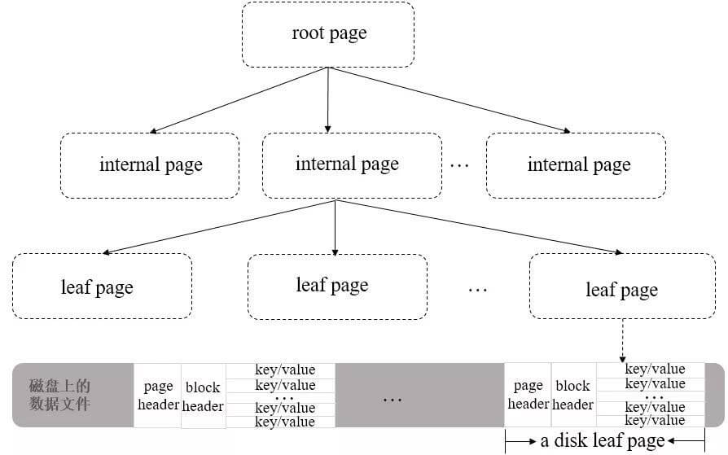

> 如果想要深入研究学习 WiredTiger 存储引擎，推荐阅读 MongoDB 中文社区的 [WiredTiger 存储引擎系列](https://mongoing.com/archives/category/wiredtiger存储引擎系列)。

### MongoDB 聚合有什么用？

实际项目中，我们经常需要将多个文档甚至是多个集合汇总到一起计算分析（比如求和、取最大值）并返回计算后的结果，这个过程被称为 **聚合操作**。

根据官方文档介绍，我们可以使用聚合操作来：

* 将来自多个文档的值组合在一起。
* 对集合中的数据进行的一系列运算。
* 分析数据随时间的变化。

### MongoDB 提供了哪几种执行聚合的方法？

MongoDB 提供了两种执行聚合的方法：

* **聚合管道（Aggregation Pipeline）**：执行聚合操作的首选方法。
* **单一目的聚合方法（Single purpose aggregation methods）**：也就是单一作用的聚合函数比如 `count()`、`distinct()`、`estimatedDocumentCount()`。

绝大部分文章中还提到了 **map-reduce** 这种聚合方法。不过，从 MongoDB 5.0 开始，map-reduce 已经不被官方推荐使用了，替代方案是 [聚合管道](https://www.mongodb.com/docs/manual/core/aggregation-pipeline/)。聚合管道提供比 map-reduce 更好的性能和可用性。

MongoDB 聚合管道由多个阶段组成，每个阶段在文档通过管道时转换文档。每个阶段接收前一个阶段的输出，进一步处理数据，并将其作为输入数据发送到下一个阶段。

每个管道的工作流程是：

1. 接受一系列原始数据文档
2. 对这些文档进行一系列运算
3. 结果文档输出给下一个阶段

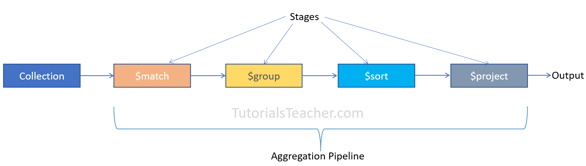

**常用阶段操作符**：

| 操作符   | 简述                                                         |
| -------- | ------------------------------------------------------------ |
| $match   | 匹配操作符，用于对文档集合进行筛选                           |
| $project | 投射操作符，用于重构每一个文档的字段，可以提取字段，重命名字段，甚至可以对原有字段进行操作后新增字段 |
| $sort    | 排序操作符，用于根据一个或多个字段对文档进行排序             |
| $limit   | 限制操作符，用于限制返回文档的数量                           |
| $skip    | 跳过操作符，用于跳过指定数量的文档                           |
| $count   | 统计操作符，用于统计文档的数量                               |
| $group   | 分组操作符，用于对文档集合进行分组                           |
| $unwind  | 拆分操作符，用于将数组中的每一个值拆分为单独的文档           |
| $lookup  | 连接操作符，用于连接同一个数据库中另一个集合，并获取指定的文档，类似于 populate |

更多操作符介绍详见官方文档：[https://docs.mongodb.com/manual/reference/operator/aggregation/](https://docs.mongodb.com/manual/reference/operator/aggregation/)

阶段操作符用于 `db.collection.aggregate` 方法里面，数组参数中的第一层。

```sql
db.collection.aggregate( [ { 阶段操作符：表述 }, { 阶段操作符：表述 }, ... ] )
```

下面是 MongoDB 官方文档中的一个例子：

```sql
db.orders.aggregate([
   # 第一阶段：$match阶段按status字段过滤文档，并将status等于"A"的文档传递到下一阶段。
    { $match: { status: "A" } },
  # 第二阶段：$group阶段按cust_id字段将文档分组，以计算每个cust_id唯一值的金额总和。
    { $group: { _id: "$cust_id", total: { $sum: "$amount" } } }
])
```
