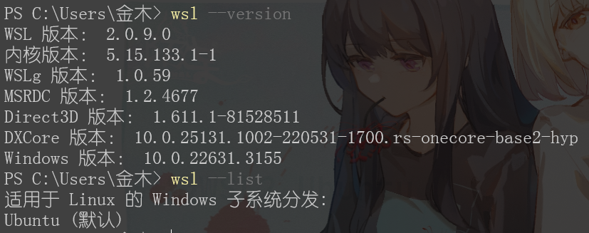

# Download MySQL on WSL2 Ubuntu

### 前言

在`CSDN`上找了一圈如何在WSL2上的Ubuntu下载Mysql8.0,并于Windows主机上的Navicat进行连接的教程,找了七八篇,跟着走了一遍,结果全部失败!全部失败!

于是我果断的选择谷歌搜索,找到一篇一次成功的文章,这里是[原文](https://pen-y-fan.github.io/2021/08/08/How-to-install-MySQL-on-WSL-2-Ubuntu/).这里仅做转载,感谢作者大佬!

在这里贴出自己的版本号.

<figure><figcaption></figcaption></figure>

<figure><figcaption></figcaption></figure>

### 1. 升级WSL2 Ubuntu

```
sudo apt update && sudo apt upgrade
```

> 这里可能需要输入管理员密码.

### 2. 下载Mysql(默认最新版)

```
sudo apt install mysql-server
```

检查mysql版本

```
mysql --version
```

### 3. 进行mysql的安全设置

> You may also want to run the included security script. This changes some less secure default options for things like remote root logins and sample users.
>
> 您可能还想运行所包含的安全脚本。这改变了一些不太安全的默认选项，如远程root登录和示例用户。

1. 启动mysql

```
sudo service mysql start
```

2. 运行安全脚本

```
sudo mysql_secure_installation
```

3. 你看看到如下输出(可以参照我的选择)

> Securing the MySQL server deployment.
>
> Connecting to MySQL using a blank password.
>
> VALIDATE PASSWORD COMPONENT can be used to test passwords and improve security. It checks the strength of password and allows the users to set only those passwords which are secure enough. Would you like to setup VALIDATE PASSWORD component?
>
> Press y|Y for Yes, any other key for No: **n** //你是否要下载密码验证组件以设置强度足够的密码
>
> Please set the password for root here.
>
> New password: **root**
>
> Re-enter new password: **root**
>
> By default, a MySQL installation has an anonymous user, allowing anyone to log into MySQL without having to have a user account created for them. This is intended only for testing, and to make the installation go a bit smoother. You should remove them before moving into a production environment.
>
> Remove anonymous users? (Press y|Y for Yes, any other key for No) : **y** //默认有一个匿名用户,是否进行删除
>
> Success.
>
> Note: Normally, root should only be allowed to connect from ’localhost’. This ensures that someone cannot guess at the root password from the network.
>
> Disallow root login remotely? (Press y|Y for Yes, any other key for No) : **n** //是否不允许远程登录
>
> … skipping.
>
> By default, MySQL comes with a database named ’test’ that anyone can access. This is also intended only for testing, and should be removed before moving into a production environment.
>
> Remove test database and access to it? (Press y|Y for Yes, any other key for No) : **n** //是否移除测试数据库
>
> … skipping.
>
> Reloading the privilege tables will ensure that all changes made so far will take effect immediately.
>
> Reload privilege tables now? (Press y|Y for Yes, any other key for No) : **y** //是否重新加载权限表
>
> Success.
>
> All done!

### 4. 确定mysql正在运行

1. 进入mysql

```
sudo mysql
```

2. 查看可用数据库

```
show databases;
```

<figure><figcaption></figcaption></figure>

### 5. 允许远程连接

> 这里我想吐槽的是,CSDN很多帖子都会教授我们如何允许mysql8的远程登录,但是在这里显得如此简单...

在上一步运行show...的地方继续运行

```
ALTER
USER 'root'@'localhost' IDENTIFIED WITH mysql_native_password BY 'root';
```

> 请注意你的密码设置,这里演示为'root'

退出mysql

```
exit
```

### 6. 使用客户端进行连接

> 原文给出的示例客户端为HeidiSQL,但是我使用的是Navicat

* 连接名:`任取`
* 主机:`localhost`
* 默认端口:`3306`
* 用户名:`root`
* 密码:`root`

<figure><figcaption></figcaption></figure>

> 吐槽一下这里的主机名,看来其它博文都需要自行去找wsl的ifconfig,而这里只需localhost...

演示到这里就结束了,如果有更多需求,请自行参考原文
