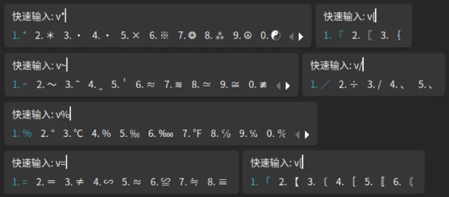
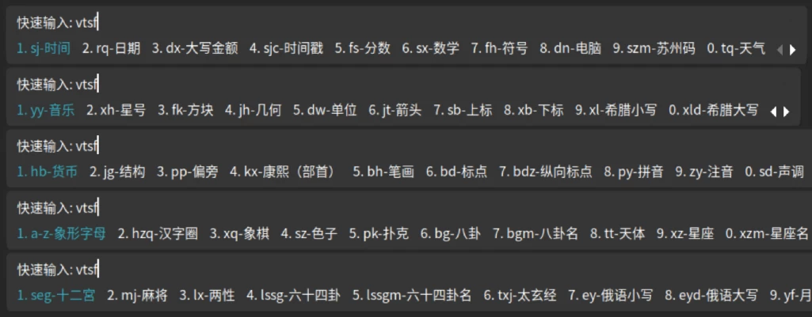
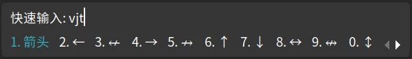
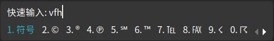
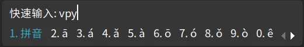
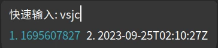
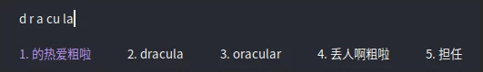

# Fcitx5

> 转载自：[https://www.debuggerx.com/2023/09/20/fcitx5-customizer/](https://www.debuggerx.com/2023/09/20/fcitx5-customizer/)

[Fcitx](https://wiki.archlinuxcn.org/wiki/Fcitx) (Flexible Input Method Framework) ──即小企鹅输入法，它是一个以 GPL 方式发布的输入法平台,是在 Linux 操作系统中常用的中文输入法。它的优点是，短小精悍、跟程序的兼容性比较好。而 [Fcitx5](https://wiki.archlinuxcn.org/wiki/Fcitx5) 则是 Fcitx 的接替版本，其 slogen 是 [maybe a new fcitx.](https://github.com/fcitx/fcitx5) 但是初始状态下的 Fcitx5 由于词库的缺失以及默认配置与很多人的习惯不同，所以需要进行一些修改和配置才能获得比较好的体验，于是我创建了一个专门用于优化 Fcitx5 的脚本——[fcitx5\_customizer](https://github.com/debuggerx01/fcitx5\_customizer)

## 使用方法

```
# 完全自定义
bash fcitx5_customizer.sh
​
# 使用推荐配置
bash fcitx5_customizer.sh recommend
​
# 在线运行
bash -c "$(curl -fsSL https://www.debuggerx.com/fcitx5_customizer/fcitx5_customizer.sh)"
​
# 在线运行并使用推荐配置
curl -sSL https://www.debuggerx.com/fcitx5_customizer/fcitx5_customizer.sh | bash -s -- recommend
```

## 优化后使用技巧

> 当应用`配置快速输入`优化项后，可以利用快速输入(默认按V键进入该模式)来输入标点、特殊符号、时间日期，以及实现数字转大写金额等功能

### 输入标点

默认配置下的 Fcitx5 有一个让很多新手非常困扰的问题，就是当按下键盘上的`[`和`]`时，输入法打出的标点却是`·`和`「`，而不是习惯中的中文方括号`【`和`】`，所以我的优化脚本中提供了一个`优化中文标点`的选项用于修正这个问题。此时如果就是想输入包括`·`和`「`等在内的各种标点，就可以利用快速输入，先按V键，再按标点按键，即可出现各种特殊标点可供选择输入：



### 查看所有的快速输入命令

快速输入的使用方式是，先按键(默认是V键)触发进入快速输入模式，然后输入指令，例如`vfh`就是输入符号，`vsz`就是输入各种样式的数字。 当想要查看所有的快速输入命令时，可以输入`vtsf`(提示符的拼音首字母)，即可看到所有的命令缩写：



### 输入特殊符号

由于 Fcitx5 暂时还没有实现类似 Fcitx 以及搜狗等输入法中的特殊符号输入面板，所以折中的办法是利用快速输入来实现。 感谢来自deepin论坛的`doodo`分享的方案及配置文件，大部分数据来自[rime](https://github.com/rime)项目，本人在此基础上进行了一些补充和缺失的函数实现。 下面进行说明：

#### 箭头

箭头是非常常用的特殊符号，优化后的快速输入有三种输入箭头的方法：

* 直接输入`vzuo`、`vyou`、`vshang`、`vxia`即可输入←、→、↑、↓这几个常用的箭头
* 输入`vjt`后，选择想要的箭头



* 输入`v\`后，选择想要的粗箭头


#### 符号

建议先输入`vtsf`查看所有的命令，下面列出几种常用的符号输入







#### emoji表情

对于常见的emoji表情，可以尝试直接输入拼音，比如`haha`、`xiaoku`、`wuyu`、`ai`、`zhadan`：


更多emoji表情，可以尝试输入`v:[emoji的英文名]`输入：


### 时间日期

* 输入当前日期


* 输入当前时间


* 输入当前时间的时间戳/ISO8601格式



### 数字转大写金额

> 实现该功能的lua脚本来自[https://github.com/iDvel/rime-ice/issues/264](https://github.com/iDvel/rime-ice/issues/264)

使用方法是`vdx[数字]`，例如整数：


也支持小数：


## 一些说明

### 关于词库

1. 脚本中的`安装搜狗词库`是从系统的仓库中尝试下载安装`fcitx5-pinyin-sougou`这个包，deepin的仓库中是有这个包的，而 debian、ubuntu 中默认是没有的，所以会显示安装失败。不过在安装了维基中文、精选搜狗细胞词库，并开启云拼音的情况下，少这么一个词库的影响也并不是很大。如果一定想要，可以参考源仓库的说明自行处理：[sougou-dict](https://github.com/CHN-beta/sougou-dict)。
2. 脚本中的`中文维基词库`来自仓库：[fcitx5-pinyin-zhwiki](https://github.com/felixonmars/fcitx5-pinyin-zhwiki)
3.  脚本中的

    ```
    精选搜狗细胞词库
    ```

    来自搜狗

    细胞词库官网

    ，目前包含如下词库：

    * 财经金融词汇大全【官方推荐】
    * 法律词汇大全【官方推荐】
    * 古诗词名句【官方推荐】
    * 机械词汇大全【官方推荐】
    * 计算机词汇大全【官方推荐】
    * 建筑词汇大全【官方推荐】
    * 农业词汇大全【官方推荐】
    * 搜狗标准词库
    * 医学词汇大全【官方推荐】
    * 政府机关团体机构大全【官方推荐】
    * 中国历史词汇大全【官方推荐】

### 候选词数量和修改加减号翻页

Fcitx5 默认配置下，拼音和通用(例如在快速输入模式)的配置是不统一的，所以会出现拼音输入是候选词是7个、可以用加减号翻页，而快速输入时候选词是5个、不能用加减号翻页，造成体验上的不一致。所以当通过脚本修改这两项配置时，会同时修改两边的配置，从而降低输入时的差异感。

### 关闭预编辑

也就是禁用`单行模式`，因为该模式在某些程序下无效，在一些程序中会出现问题，并造成某些未知BUG，所以建议禁用，参考：[https://github.com/fcitx/fcitx5/issues/60](https://github.com/fcitx/fcitx5/issues/60)

### 禁用不常用快捷键

禁用一些不常用的快捷键，放置和第三方应用(如IDE)出现热键冲突。当前禁用的快捷键有：

* unicode相关快捷键 —— Ctrl+Alt+Shift+U
* 云拼音切换快捷键 —— Ctrl+Shift+C / Ctrl+Alt+Shift+C
* 简繁体切换 —— Ctrl+Shift+F
* 剪切板 —— Ctrl+;

### 配置快速输入

参考上面的说明[输入特殊符号](https://www.debuggerx.com/2023/09/20/fcitx5-customizer/#%E8%BE%93%E5%85%A5%E7%89%B9%E6%AE%8A%E7%AC%A6%E5%8F%B7)，快速输入可以输入多种特殊符号，而输入时间日期和数字转大写金额的功能由于依赖lua脚本实现，所以需要勾选下面的`大写时关闭拼音输入`选项后才能使用。

### 大写时关闭拼音输入

这个选项除了安装`大写时关闭拼音输入`的逻辑脚本，同时还安装了 Fcitx5 支持 lua 脚本的所有相关支持。如果只想开启脚本支持的功能，而不习惯这个`大写时关闭拼音输入`的特性，则可以在配置结束后执行如下命令删除脚本，并重启输入法：

```
SHELL
rm ~/.local/share/fcitx5/addon/uppercase_dis_ime.conf
```

### 关于皮肤

本脚本当前收录的皮肤及效果图如下：

* 星空黑(我转换并修正的一个搜狗皮肤，原地址：[https://pinyin.sogou.com/skins/detail/view/info/526130](https://pinyin.sogou.com/skins/detail/view/info/526130))


* breeze(原地址：[https://github.com/scratch-er/fcitx5-breeze](https://github.com/scratch-er/fcitx5-breeze))


* material-color(原地址：[https://github.com/hosxy/Fcitx5-Material-Color](https://github.com/hosxy/Fcitx5-Material-Color))


* nord(原地址：[https://github.com/tonyfettes/fcitx5-nord](https://github.com/tonyfettes/fcitx5-nord))


* solarized(原地址：[https://github.com/mingyech/fcitx5-solarized](https://github.com/mingyech/fcitx5-solarized))


* 简约黑/白(Maicss专为深度制作的主题，原地址：[https://bbs.deepin.org/post/223743](https://bbs.deepin.org/post/223743))


* dracula(drbbr制作的德古拉主题，原地址：[https://github.com/drbbr/fcitx5-dracula-theme](https://github.com/drbbr/fcitx5-dracula-theme))



### 可能遇到的问题

#### curl未找到命令

如果执行优化命令时提示`curl`未找到命令，请先手动执行 `sudo apt install curl` 安装即可。

#### 当前输入法不是fcitx

只有当前系统正确安装并启用了 Fcitx5 输入法是，优化脚本才会真正执行。有一种情况是，当使用系统自带的输入法切换器将系统的输入法切换为 Fcitx5 时，虽然看上去已经切换成功并且输入法已经可以正常使用，但是系统的环境变量还没有及时刷新，所以脚本还是会认为系统输入法不是 Fcitx5。此时只要注销或重启一次系统，再次执行优化命令即可正确识别。

## 部分参考资料及链接

* \[[经验分享\] deepin安装fctix5输入法（无需编译，配图）](https://bbs.deepin.org/post/229204)
* \[[经验分享\] fcitx5输入法使用技巧&简约皮肤分享](https://bbs.deepin.org/post/223743)
* [使用 fcitx5-lua 编写 lua 插件](https://www.aloxaf.com/2020/09/fcitx5\_plugin/)
* [Fcitx5 - Arch Linux 中文维基](https://wiki.archlinuxcn.org/wiki/Fcitx5)
* [CS Slayer | Unlimited Code Works](https://www.csslayer.info/wordpress/)
