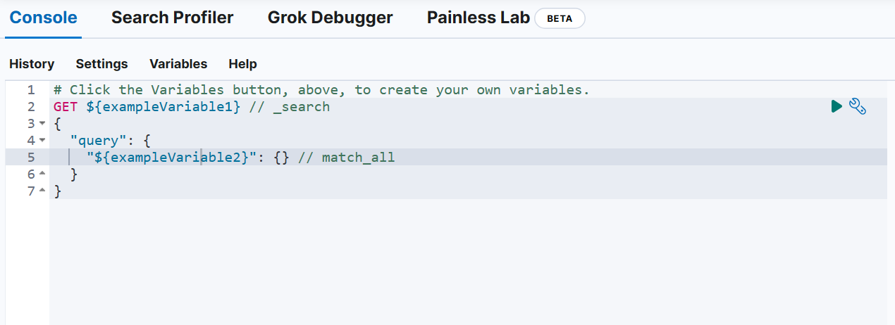

# Quick Start

#### 1. 前言

> [Quick start | Elasticsearch Guide 8.12](https://www.elastic.co/guide/en/elasticsearch/reference/current/getting-started.html)

跟着官方文档去学习了解Elasticsearch...

#### 2. 注册Elastic Cloud以获取免费试用

> 不自己下载Elastic而是选择Elastic Cloud的14天免费试用

1. [注册,获取免费试用的账户](https://www.elastic.co/cloud/elasticsearch-service/signup?page=docs\&placement=docs-body).
2. 登录到 [Elastic Cloud](https://cloud.elastic.co/?page=docs\&placement=docs-body).
3. 点击 **Create deployment**.
4. 为你的实例起名

点击打开Kibana的主菜单(Elastic徽标附近的"**☰**")，然后进入`DEV Tools`>`Console`。

<figure><figcaption></figcaption></figure>

#### 3. 快速入门

**上传单个文档**

> `/books`是索引名,没有则自动新建 `/_doc`表明上传一个文档 `?pretty`表明返回易阅读的json格式数据

```
POST /books/_doc?pretty
{"name": "Snow Crash", "author": "Neal Stephenson", "release_date": "1992-06-01", "page_count": 470}
```

**批量上传**

> `/_bulk`表明批量上传文档

```
POST /_bulk
{ "index" : { "_index" : "books" } }
{"name": "Revelation Space", "author": "Alastair Reynolds", "release_date": "2000-03-15", "page_count": 585}
{ "index" : { "_index" : "books" } }
{"name": "1984", "author": "George Orwell", "release_date": "1985-06-01", "page_count": 328}
{ "index" : { "_index" : "books" } }
{"name": "Fahrenheit 451", "author": "Ray Bradbury", "release_date": "1953-10-15", "page_count": 227}
{ "index" : { "_index" : "books" } }
{"name": "Brave New World", "author": "Aldous Huxley", "release_date": "1932-06-01", "page_count": 268}
{ "index" : { "_index" : "books" } }
{"name": "The Handmaids Tale", "author": "Margaret Atwood", "release_date": "1985-06-01", "page_count": 311}
```

**查询文档**

> `/books`表明查询文档的索引
>
> `/_search`表明操作为查询

```
GET /books/_search?pretty
```

**match查询**

> `match`表明查询模式
>
> `name`:`brave`表明查询name中含有brave的文档
>
> 这是一个执行全文搜索的标准查询

```
GET /books/_search?pretty
{
  "query": {
    "match": {
      "name": "brave"
    }
  }
}
```

> * [Search your data](https://www.elastic.co/guide/en/elasticsearch/reference/current/search-with-elasticsearch.html). Jump here to learn about exact value search, full-text search, vector search, and more, using the [search API](https://www.elastic.co/guide/en/elasticsearch/reference/current/search-search.html).
> * 光看文档太枯燥,还是需要用到的时候再去查这些api吧
