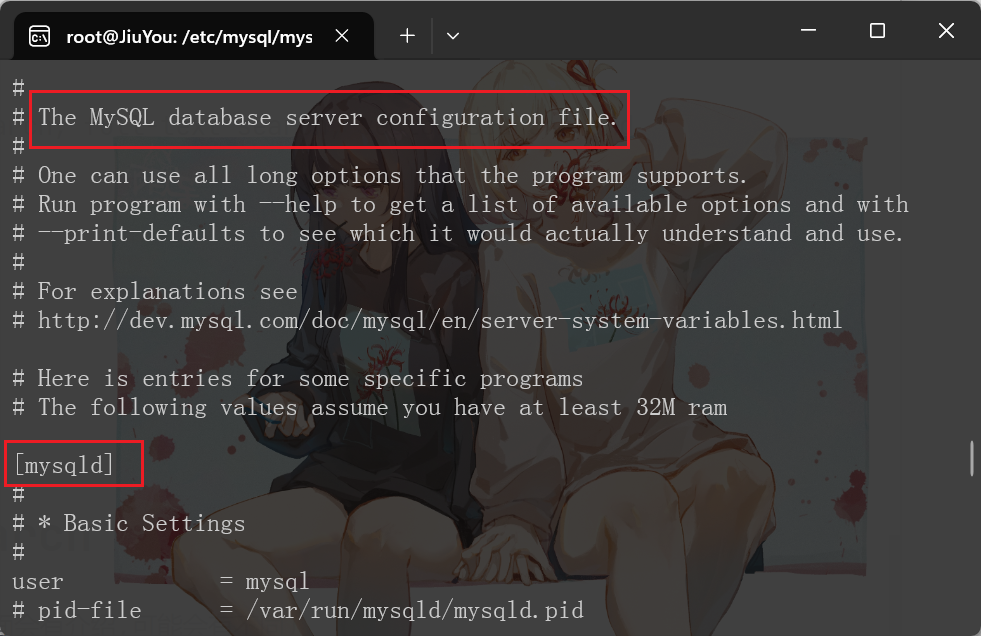
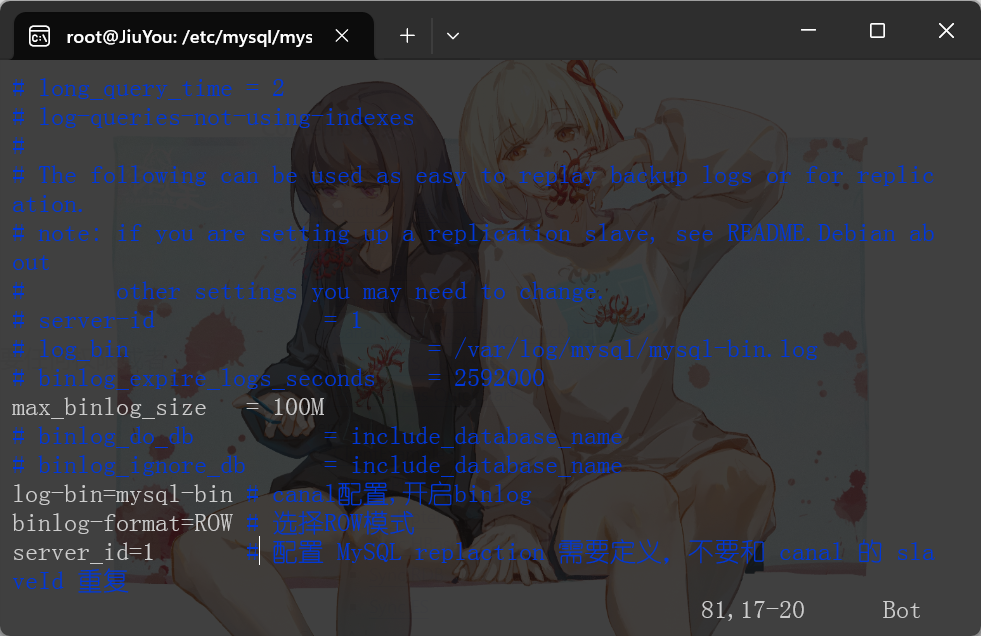
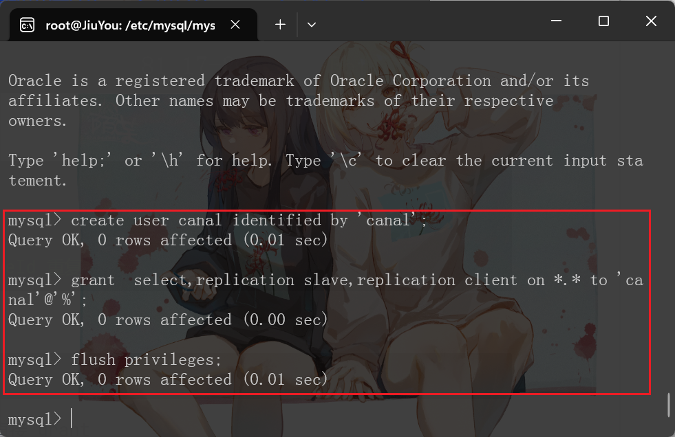
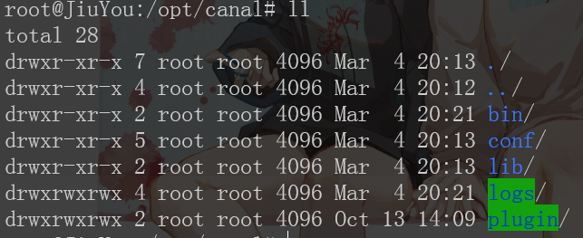
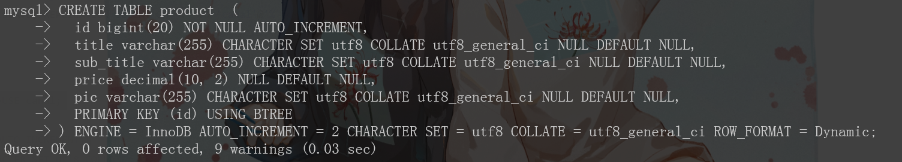
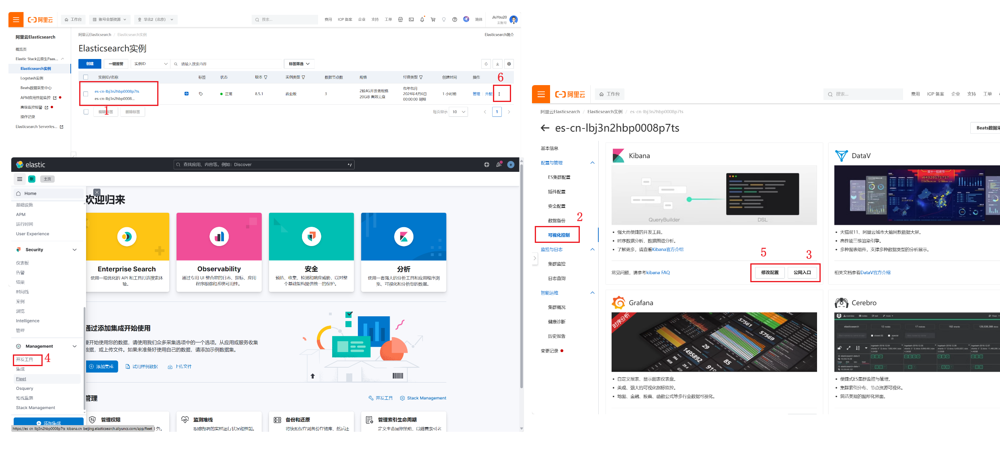
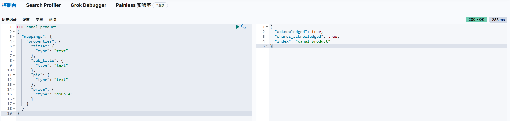
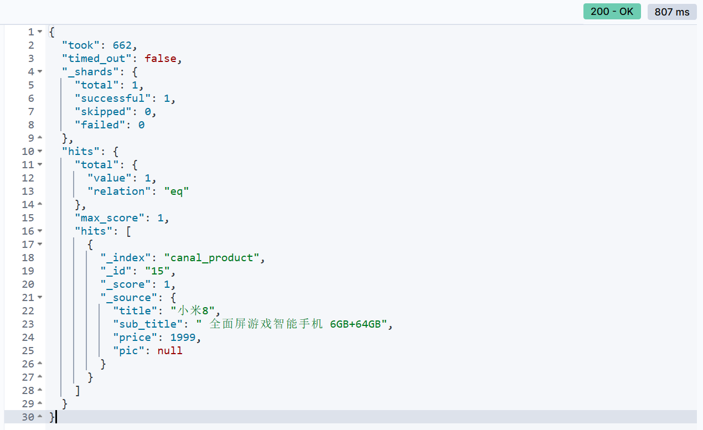

# Synchronize data :MySQL to ES

### 使用`Canal`同步mysql数据到Elasticsearch

> [同步方案选取指南](https://www.alibabacloud.com/help/zh/es/use-cases/select-a-synchronization-method?spm=a2c63.p38356.0.0.3496bdf0jX4CwQ)

#### 1. 安装canal-deployer

修改`/etc/mysql/mysql.conf.d/mysqld.cnf`文件(配置文件有好几个,但是里面会有介绍,可能会有不同)

<figure><figcaption></figcaption></figure>

<figure><figcaption></figcaption></figure>

添加上面三行

```properties
[mysqld]
log-bin=mysql-bin # 开启 binlog
binlog-format=ROW # 选择 ROW 模式
server_id=1 # 配置 MySQL replaction 需要定义，不要和 canal 的 slaveId 重复
```

重启

```sh
service mysql restart
```

授权 canal 链接 MySQL 账号具有作为 MySQL slave 的权限, 如果已有账户可直接 grant

<figure><figcaption></figcaption></figure>

```sql
CREATE USER canal IDENTIFIED BY 'canal';  
GRANT SELECT, REPLICATION SLAVE, REPLICATION CLIENT ON *.* TO 'canal'@'%';
-- GRANT ALL PRIVILEGES ON *.* TO 'canal'@'%' ;
FLUSH PRIVILEGES;
```

下载`canal`,访问 [release 页面](https://github.com/alibaba/canal/releases) , 选择需要的包下载, 如以 1.1.7 版本为例

```sh
wget https://github.com/alibaba/canal/releases/download/canal-1.1.7/canal.deployer-1.1.7.tar.gz
```

解压缩

```sh
mkdir /opt/canal
tar zxvf canal.deployer-1.1.7.tar.gz -C /opt/canal
```

进入,可以看到如下结构

<figure><figcaption></figcaption></figure>

```
drwxr-xr-x 7 root root 4096 Mar  4 20:13 ./
drwxr-xr-x 4 root root 4096 Mar  4 20:12 ../
drwxr-xr-x 2 root root 4096 Mar  4 20:21 bin/
drwxr-xr-x 5 root root 4096 Mar  4 20:13 conf/
drwxr-xr-x 2 root root 4096 Mar  4 20:13 lib/
drwxrwxrwx 4 root root 4096 Mar  4 20:21 logs/
drwxrwxrwx 2 root root 4096 Oct 13 14:09 plugin/
```

配置修改

```sh
vim conf/example/instance.properties
```

```properties
## mysql serverId
canal.instance.mysql.slaveId = 1234
#position info，需要改成自己的数据库信息
canal.instance.master.address = 127.0.0.1:3306 
canal.instance.master.journal.name = 
canal.instance.master.position = 
canal.instance.master.timestamp = 
#canal.instance.standby.address = 
#canal.instance.standby.journal.name =
#canal.instance.standby.position = 
#canal.instance.standby.timestamp = 
#username/password，需要改成自己的数据库信息
canal.instance.dbUsername = canal  
canal.instance.dbPassword = canal
canal.instance.defaultDatabaseName =
canal.instance.connectionCharset = UTF-8
#table regex
canal.instance.filter.regex = .\*\\\\..\*
```

> 我只改了slaveId和账户密码
>
> * canal.instance.connectionCharset 代表数据库的编码方式对应到 java 中的编码类型，比如 UTF-8，GBK , ISO-8859-1
> * 如果系统是1个 cpu，需要将 canal.instance.parser.parallel 设置为 false

启动

```sh
sh bin/startup.sh
```

查看server日志

```sh
cat logs/canal/canal.log
```

```log
2024-03-04 20:21:04.233 [main] INFO  com.alibaba.otter.canal.deployer.CanalLauncher - ## set default uncaught exception handler
2024-03-04 20:21:04.238 [main] INFO  com.alibaba.otter.canal.deployer.CanalLauncher - ## load canal configurations
2024-03-04 20:21:04.245 [main] INFO  com.alibaba.otter.canal.deployer.CanalStarter - ## start the canal server.
2024-03-04 20:21:04.267 [main] INFO  com.alibaba.otter.canal.deployer.CanalController - ## start the canal server[172.18.0.1(172.18.0.1):11111]
2024-03-04 20:21:05.025 [main] INFO  com.alibaba.otter.canal.deployer.CanalStarter - ## the canal server is running now ......
```

查看 instance的日志

```sh
cat logs/example/example.log
```

```log
2024-03-04 20:21:04.588 [main] INFO  c.a.otter.canal.instance.spring.CanalInstanceWithSpring - start CannalInstance for 1-example
2024-03-04 20:21:05.002 [main] WARN  c.a.o.canal.parse.inbound.mysql.dbsync.LogEventConvert - --> init table filter : ^.*\..*$
2024-03-04 20:21:05.003 [main] WARN  c.a.o.canal.parse.inbound.mysql.dbsync.LogEventConvert - --> init table black filter : ^mysql\.slave_.*$
2024-03-04 20:21:05.005 [main] INFO  c.a.otter.canal.instance.core.AbstractCanalInstance - start successful....
2024-03-04 20:21:05.060 [destination = example , address = /127.0.0.1:3306 , EventParser] WARN  c.a.o.c.p.inbound.mysql.rds.RdsBinlogEventParserProxy - ---> begin to find start position, it will be long time for reset or first position
2024-03-04 20:21:05.060 [destination = example , address = /127.0.0.1:3306 , EventParser] WARN  c.a.o.c.p.inbound.mysql.rds.RdsBinlogEventParserProxy - prepare to find start position just show master status
2024-03-04 20:21:05.641 [destination = example , address = /127.0.0.1:3306 , EventParser] WARN  c.a.o.c.p.inbound.mysql.rds.RdsBinlogEventParserProxy - ---> find start position successfully, EntryPosition[included=false,journalName=mysql-bin.000002,position=4,serverId=1,gtid=<null>,timestamp=1709554248000] cost : 577ms , the next step is binlog dump
```

关闭

#### 2. 安装配置ClientAdapter(阿里云ES)

> 参考[文章](https://www.alibabacloud.com/help/zh/es/use-cases/use-canal-to-synchronize-mysql-data-to-alibaba-cloud-elasticsearch?spm=a2c63.p38356.0.0.571c1da7QOB5gc)
>
> 感悟:很多中间件升级了版本之后很多旧的配置教程都不管用了,所以最重要的是:
>
> 1. 参考官方文档
> 2. 很多配置见名知意,注释详细,注意观察
> 3. 参考旧的文档
> 4. 是参考!!!不是照搬!

**前提条件**

> MySQL 8.0: WSL2 Ubuntu中
>
> ES 8.5: 阿里云ES
>
> Canal 1.1.7: WSL2 Ubuntu中
>
> 操作环境: WSL2 Ubuntu中

已创建MySQL实例、阿里云ES实例。

* 已创建MYSQL实例。本文以MySQL 8.0版本为例。
* 已创建阿里云ES实例。具体操作请参见[创建阿里云Elasticsearch实例](https://www.alibabacloud.com/help/zh/es/user-guide/create-an-alibaba-cloud-elasticsearch-cluster#task-2444429)。本文以阿里云ES 8.5通用版为例。

**说明**:

通过canal将数据写入到ES实例中，需将阿里云ECS实例的IP地址加入ES实例中。具体操作，请参见[配置ES实例公网或私网访问白名单](https://www.alibabacloud.com/help/zh/es/user-guide/configure-a-public-or-private-ip-address-whitelist-for-an-elasticsearch-cluster)。

**使用限制**

* 本方案仅支持将MySQL增量数据同步至阿里云ES。
* 安装的JDK版本必须大于等于1.8.0(**本文为1.8**)。
*   Canal 1.1.4版本不支持ES 7.x版本。

    ES 7.x版本的数据写入需使用Canal 1.1.5版本，ES 8.x版本请选择1.1.7版本。您也可以通过其他方式（例如Logstash、DTS）实现MySQL数据同步。
* 在进行数据同步时支持自定义索引Mapping，但需保证Mapping中定义的字段（名称+类型）与MySQL中一致。
* 本方案需要您自行保证Canal的可用性，避免出现业务不可用或故障。例如：当出现ECS重启，Canal异常退出等场景时如何继续同步数据等。
* **Canal Adapter不支持使用HTTPS协议连接阿里云ES实例。**

**操作步骤**

**步骤一：准备MySQL数据源**

本文使用的建表语句如下。

```sql
-- create table
create database canal;<br>USE canal;
CREATE TABLE product  (
  id bigint(20) NOT NULL AUTO_INCREMENT,
  title varchar(255) CHARACTER SET utf8 COLLATE utf8_general_ci NULL DEFAULT NULL,
  sub_title varchar(255) CHARACTER SET utf8 COLLATE utf8_general_ci NULL DEFAULT NULL,
  price decimal(10, 2) NULL DEFAULT NULL,
  pic varchar(255) CHARACTER SET utf8 COLLATE utf8_general_ci NULL DEFAULT NULL,
  PRIMARY KEY (id) USING BTREE
) ENGINE = InnoDB AUTO_INCREMENT = 2 CHARACTER SET = utf8 COLLATE = utf8_general_ci ROW_FORMAT = Dynamic;
```

<figure><figcaption></figcaption></figure>

**步骤二：创建索引**

Dev-tool位置,见下图1-4

<figure><figcaption></figcaption></figure>

5. 在这里将公网白名单加上你的ip地址([ip查询器](https://www.cip.cc/))
6. 点击此处也可找到入口
7. 请不要忘记在**安全配置**页面将你的ip地址加入公网白名单

在控制台输入以下DSL语句并执行

```json
PUT canal_product
{
  "mappings": {
    "properties": {
      "title": {
        "type": "text"
      },
      "sub_title": {
        "type": "text"
      },
      "pic": {
        "type": "text"
      },
      "price": {
        "type": "double"
      }
    }
  }
}
```

创建成功后，返回如下结果。

```json
{
  "acknowledged" : true,
  "shards_acknowledged" : true,
  "index" : "es_test"
}
```

<figure><figcaption></figcaption></figure>

**步骤三：安装JDK**

1.  查看可用的JDK软件包列表。

    ```sh
    sudo yum search java | grep -i --color JDK
    ```
2.  选择合适的版本，安装JDK。

    本文选择**java-1.8.0-openjdk-devel.x86\_64**。

    ```sh
    sudo yum install java-1.8.0-openjdk-devel.x86_64
    ```
3. 配置环境变量。
   1.  打开etc文件夹下的profile文件。

       ```sh
       vim ~/.bash_profile
       ```
   2.  在文件内添加如下的环境变量。

       ```properties
       export JAVA_HOME=/usr/lib/jvm/java-1.8.0-openjdk-1.8.0.362.b08-1.el7_9.x86_64
       export CLASSPATH=.:$JAVA_HOME/jre/lib/rt.jar:$JAVA_HOME/lib/dt.jar:$JAVA_HOME/lib/tools.jar
       export PATH=$PATH:$JAVA_HOME/bin
       ```

       **重要**

       JAVA\_HOME需要替换为您JDK的安装路径，可通过`find / -name 'java'`命令查看。
   3.  按下**Esc**键，然后使用`:wq`保存文件并退出vi模式，随后执行以下命令使配置生效。

       ```sh
       source ~/.bash_profile
       ```
4.  执行以下命令，验证JDK是否安装成功。

    ```sh
    java -version
    ```

    显示如下结果说明JDK安装成功。

    ```
    openjdk version "1.8.0_362"
    OpenJDK Runtime Environment (build 1.8.0_362-b08)
    OpenJDK 64-Bit Server VM (build 25.362-b08, mixed mode)
    ```

**步骤四：安装并启动Canal-adapter**

> 先启动上面安装的Server

1.  下载Canal-adapter。

    本文使用1.1.4版本。

    ```sh
    wget https://github.com/alibaba/canal/releases/download/canal-1.1.7/canal.adapter-1.1.7.tar.gz
    ```

    **说明**

    * 如果你的是ES 8.0,Canal版本至少在1.1.7及以上
    * 目前Canal 1.1.5版本已支持ES 7.0版本，如果您使用的是ES 7.0，需要下载Canal 1.1.5版本。详细信息请参见[Canal release note](https://github.com/alibaba/canal/releases)。
2.  解压。

    ```sh
    mkdir canal_adapter
    tar -zxvf canal.adapter-1.1.7.tar.gz -C canal_adapter/
    ```
3.  修改`conf/application.yml`文件。

    ```sh
    vim conf/application.yml
    ```

    ```yaml
    server:
      port: 8081
    spring:
      jackson:
        date-format: yyyy-MM-dd HH:mm:ss
        time-zone: GMT+8
        default-property-inclusion: non_null
    ​
    canal.conf:
      mode: tcp #tcp kafka rocketMQ rabbitMQ
      flatMessage: true
      zookeeperHosts:
      syncBatchSize: 1000
      retries: 0
      timeout:
      accessKey:
      secretKey:
      consumerProperties:
        # canal tcp consumer
        canal.tcp.server.host: 127.0.0.1:11111
        canal.tcp.zookeeper.hosts:
        canal.tcp.batch.size: 500
        canal.tcp.username:
        canal.tcp.password:
        # kafka consumer
        kafka.bootstrap.servers: 127.0.0.1:9092
        kafka.enable.auto.commit: false
        kafka.auto.commit.interval.ms: 1000
        kafka.auto.offset.reset: latest
        kafka.request.timeout.ms: 40000
        kafka.session.timeout.ms: 30000
        kafka.isolation.level: read_committed
        kafka.max.poll.records: 1000
        # rocketMQ consumer
        rocketmq.namespace:
        rocketmq.namesrv.addr: 127.0.0.1:9876
        rocketmq.batch.size: 1000
        rocketmq.enable.message.trace: false
        rocketmq.customized.trace.topic:
        rocketmq.access.channel:
        rocketmq.subscribe.filter:
        # rabbitMQ consumer
        rabbitmq.host:
        rabbitmq.virtual.host:
        rabbitmq.username:
        rabbitmq.password:
        rabbitmq.resource.ownerId:
    # 1. 这里需要将注释去掉,并且注意格式对齐,我这里被坑惨了
      srcDataSources:
        defaultDS:
          url: jdbc:mysql://127.0.0.1:3306/elastic-search-lab?useUnicode=true
          username: root
          password: 123456
      canalAdapters:
      - instance: example # canal instance Name or mq topic name
        groups:
        - groupId: g1
          outerAdapters:
          - name: logger
          # 2. 首先注意对齐,把名称改成es6/es7/es8
          - name: es8
            hosts: http://es-cn-xxxxxxxxxxxxx.public.elasticsearch.aliyuncs.com:9200 # 127.0.0.1:9200 for rest mode
            properties:
              mode: rest # or rest
              security.auth: elastic:xxxxxxxxxx #  only used for rest mode
              cluster.name: es-cn-xxxxxxxxxxxxx
    #      - name: rdb
    #        key: mysql1
    #        properties:
    #          jdbc.driverClassName: com.mysql.jdbc.Driver
    #          jdbc.url: jdbc:mysql://127.0.0.1:3306/mytest2?useUnicode=true
    #          jdbc.username: root
    #          jdbc.password: 121212
    #          druid.stat.enable: false
    #          druid.stat.slowSqlMillis: 1000
    #      - name: rdb
    #        key: oracle1
    #        properties:
    #          jdbc.driverClassName: oracle.jdbc.OracleDriver
    #          jdbc.url: jdbc:oracle:thin:@localhost:49161:XE
    #          jdbc.username: mytest
    #          jdbc.password: m121212
    #      - name: rdb
    #        key: postgres1
    #        properties:
    #          jdbc.driverClassName: org.postgresql.Driver
    #          jdbc.url: jdbc:postgresql://localhost:5432/postgres
    #          jdbc.username: postgres
    #          jdbc.password: 121212
    #          threads: 1
    #          commitSize: 3000
    #      - name: hbase
    #        properties:
    #          hbase.zookeeper.quorum: 127.0.0.1
    #          hbase.zookeeper.property.clientPort: 2181
    #          zookeeper.znode.parent: /hbase
    #      - name: kudu
    #        key: kudu
    #        properties:
    #          kudu.master.address: 127.0.0.1 # ',' split multi address
    #      - name: phoenix
    #        key: phoenix
    #        properties:
    #          jdbc.driverClassName: org.apache.phoenix.jdbc.PhoenixDriver
    #          jdbc.url: jdbc:phoenix:127.0.0.1:2181:/hbase/db
    #          jdbc.username:
    #          jdbc.password:
    ​
    ```

    | **配置项**                                                                | **说明**                                                                                                                     |
    | ---------------------------------------------------------------------- | -------------------------------------------------------------------------------------------------------------------------- |
    | canal.conf.canalServerHost                                             | canalDeployer访问地址。保持默认（127.0.0.1:11111）即可。                                                                                 |
    | canal.conf.srcDataSources.defaultDS.url                                | mysql所在 ip:port                                                                                                            |
    | canal.conf.srcDataSources.defaultDS.username                           | RDS MySQL数据库的账号名称，可在RDS MySQL实例的**账号管理**页面获取。                                                                              |
    | canal.conf.srcDataSources.defaultDS.password                           | RDS MySQL数据库的密码。                                                                                                           |
    | canal.conf.canalAdapters.groups.outerAdapters.hosts                    | 定位到name:es的位置，将hosts替换为\<ES实例的公网地址>:<内网端口>，相关信息可在ES实例的基本信息页面获取。例如，es-cn-v64xxxxxxxxx3medp.elasticsearch.aliyuncs.com:9200。 |
    | canal.conf.canalAdapters.groups.outerAdapters.mode                     | 必须设置为rest。                                                                                                                 |
    | canal.conf.canalAdapters.groups.outerAdapters.properties.security.auth | 需要设置为\<ES实例的账号>:<密码>。例如elastic:es\_password。                                                                               |
    | canal.conf.canalAdapters.groups.outerAdapters.properties.cluster.name  | ES实例的ID，可在ES实例的基本信息页面获取。例如es-cn-v64xxxxxxxxx3medp。                                                                         |
4. 按下**Esc**键，然后使用`:wq`命令保存文件并退出vi模式。
5. 修改conf/es8/mytest\_user.yml (对应自己的版本)

```yaml
dataSourceKey: defaultDS
destination: example
groupId: g1
esMapping:
  # 1. 改索引
  _index: canal_product
  _id: _id
  #  upsert: true
  #  pk: id
  # 2. 该sql
  sql: "SELECT
         p.id AS _id,
         p.title,
         p.sub_title,
         p.price,
         p.pic
        FROM
         product p"
  #  objFields:
  #    _labels: array:;
  etlCondition: "where a.c_time>={}"
  commitBatch: 3000
```

启动Canal-adapter服务，并查看日志。

```sh
./bin/startup.sh
cat logs/adapter/adapter.log
```

```log
# 这是启动成功的日志信息
2024-03-06 01:16:01.939 [main] INFO  c.a.otter.canal.adapter.launcher.CanalAdapterApplication - Starting CanalAdapterApplication using Java 1.8.0_392 on JiuYou. with PID 15483 (/opt/canal.adapter-1.1.7/lib/client-adapter.launcher-1.1.7.jar started by root in /opt/canal.adapter-1.1.7/bin)
2024-03-06 01:16:01.949 [main] INFO  c.a.otter.canal.adapter.launcher.CanalAdapterApplication - No active profile set, falling back to default profiles: default
2024-03-06 01:16:02.431 [main] INFO  org.springframework.cloud.context.scope.GenericScope - BeanFactory id=a6cee8d1-48d1-3e64-a5f9-a1d1e90caee9
2024-03-06 01:16:02.631 [main] INFO  o.s.boot.web.embedded.tomcat.TomcatWebServer - Tomcat initialized with port(s): 8081 (http)
2024-03-06 01:16:02.639 [main] INFO  org.apache.coyote.http11.Http11NioProtocol - Initializing ProtocolHandler ["http-nio-8081"]
2024-03-06 01:16:02.639 [main] INFO  org.apache.catalina.core.StandardService - Starting service [Tomcat]
2024-03-06 01:16:02.639 [main] INFO  org.apache.catalina.core.StandardEngine - Starting Servlet engine: [Apache Tomcat/9.0.52]
2024-03-06 01:16:02.681 [main] INFO  o.a.catalina.core.ContainerBase.[Tomcat].[localhost].[/] - Initializing Spring embedded WebApplicationContext
2024-03-06 01:16:02.681 [main] INFO  o.s.b.w.s.context.ServletWebServerApplicationContext - Root WebApplicationContext: initialization completed in 640 ms
2024-03-06 01:16:03.132 [main] INFO  com.alibaba.druid.pool.DruidDataSource - {dataSource-1} inited
2024-03-06 01:16:03.453 [main] INFO  org.apache.coyote.http11.Http11NioProtocol - Starting ProtocolHandler ["http-nio-8081"]
2024-03-06 01:16:03.461 [main] INFO  o.s.boot.web.embedded.tomcat.TomcatWebServer - Tomcat started on port(s): 8081 (http) with context path ''
2024-03-06 01:16:03.464 [main] INFO  c.a.o.canal.adapter.launcher.loader.CanalAdapterService - ## syncSwitch refreshed.
2024-03-06 01:16:03.464 [main] INFO  c.a.o.canal.adapter.launcher.loader.CanalAdapterService - ## start the canal client adapters.
2024-03-06 01:16:03.467 [main] INFO  c.a.otter.canal.client.adapter.support.ExtensionLoader - extension classpath dir: /opt/canal.adapter-1.1.7/plugin
2024-03-06 01:16:03.487 [main] INFO  c.a.o.canal.adapter.launcher.loader.CanalAdapterLoader - Load canal adapter: logger succeed
2024-03-06 01:16:03.633 [main] INFO  c.a.o.c.client.adapter.es.core.config.ESSyncConfigLoader - ## Start loading es mapping config ... 
2024-03-06 01:16:03.655 [main] INFO  c.a.o.c.client.adapter.es.core.config.ESSyncConfigLoader - ## ES mapping config loaded
2024-03-06 01:16:03.864 [main] INFO  c.a.o.canal.adapter.launcher.loader.CanalAdapterLoader - Load canal adapter: es8 succeed
2024-03-06 01:16:03.869 [main] INFO  c.alibaba.otter.canal.connector.core.spi.ExtensionLoader - extension classpath dir: /opt/canal.adapter-1.1.7/plugin
2024-03-06 01:16:03.880 [main] INFO  c.a.o.canal.adapter.launcher.loader.CanalAdapterLoader - Start adapter for canal-client mq topic: example-g1 succeed
2024-03-06 01:16:03.880 [Thread-4] INFO  c.a.otter.canal.adapter.launcher.loader.AdapterProcessor - =============> Start to connect destination: example <=============
2024-03-06 01:16:03.880 [main] INFO  c.a.o.canal.adapter.launcher.loader.CanalAdapterService - ## the canal client adapters are running now ......
2024-03-06 01:16:03.886 [main] INFO  c.a.otter.canal.adapter.launcher.CanalAdapterApplication - Started CanalAdapterApplication in 2.246 seconds (JVM running for 2.59)
2024-03-06 01:16:03.959 [Thread-4] INFO  c.a.otter.canal.adapter.launcher.loader.AdapterProcessor - =============> Subscribe destination: example succeed <=============
```

**步骤五：验证增量数据同步**

1.  在RDS MySQL数据库中，新增、修改或删除数据库中**es\_test**表的数据。

    ```sql
    INSERT INTO product ( id, title, sub_title, price, pic ) VALUES ( 15, '小米8', ' 全面屏游戏智能手机 6GB+64GB', 1999.00, NULL );
    ```
2.  查看日志

    ```log
    2024-03-06 01:17:28.284 [pool-3-thread-1] INFO  c.a.o.canal.client.adapter.logger.LoggerAdapterExample - DML: {"data":[{"id":15,"title":"小米8","sub_title":" 全面屏游戏智能手机 6GB+64GB","price":1999.0,"pic":null}],"database":"elastic-search-lab","destination":"example","es":1709659047000,"groupId":"g1","isDdl":false,"old":null,"pkNames":["id"],"sql":"","table":"product","ts":1709659048171,"type":"INSERT"}
    2024-03-06 01:17:28.790 [pool-3-thread-1] DEBUG c.a.o.canal.client.adapter.es.core.service.ESSyncService - DML: {"data":[{"id":15,"title":"小米8","sub_title":" 全面屏游戏智能手机 6GB+64GB","price":1999.0,"pic":null}],"database":"elastic-search-lab","destination":"example","es":1709659047000,"groupId":"g1","isDdl":false,"old":null,"pkNames":["id"],"sql":"","table":"product","ts":1709659048171,"type":"INSERT"} 
    Affected indexes: canal_product 
    ```
3. 登录目标阿里云ES实例的Kibana控制台，具体操作请参见[登录Kibana控制台](https://www.alibabacloud.com/help/zh/es/user-guide/log-on-to-the-kibana-console)。
4. 在左侧导航栏，单击**Dev Tools**。
5.  在**Console**中，执行以下命令查询同步成功的数据。

    ```sql
    GET /product/_search
    ```

    预期结果如下。

<figure><figcaption></figcaption></figure>

> Canal同步的是增量数据，不会同步之前的存量数据。

#### 3. 安装配置ClientAdapter(ElasticCloud)

> 好吧,经过尝试,在**这里**连接elastic cloud似乎会报超时,或许需要代理?因此这里就不演示该模式了
