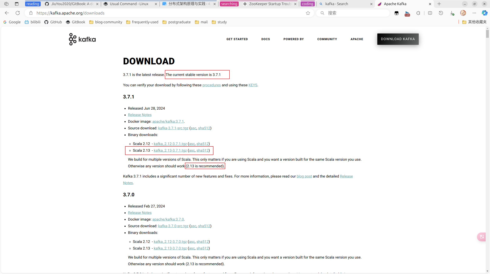
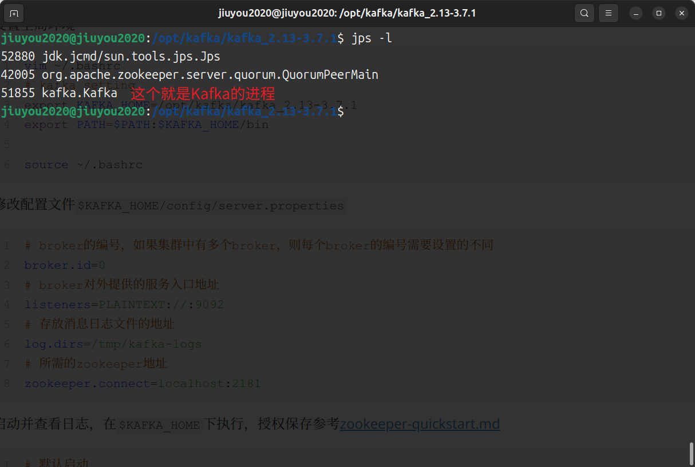

# Kafka-QuickStart

## 安装配置

1. 下载安装包

   

2. 复制到opt目录下解压缩

   ```shell
   sudo mkdir /opt/kafka
   sudo mv kafka_2.13-3.7.1.tgz /opt/kafka/
   sudo tar -zxvf kafka_2.13-3.7.1.tgz
   cd kafka_2.13-3.7.1/
   ```

3. 设置全局环境

   ```shell
   vim ~/.bashrc
   # kafka setting
   export KAFKA_HOME=/opt/kafka/kafka_2.13-3.7.1
   export PATH=$PATH:$KAFKA_HOME/bin
   
   source ~/.bashrc
   ```

4. 修改配置文件`$KAFKA_HOME/config/server.properties`

   ```properties
   # broker的编号，如果集群中有多个broker，则每个broker的编号需要设置的不同
   broker.id=0
   # broker对外提供的服务入口地址
   listeners=PLAINTEXT://:9092
   # 存放消息日志文件的地址
   log.dirs=/tmp/kafka-logs
   # 所需的zookeeper地址
   zookeeper.connect=localhost:2181
   ```

5. 启动并查看日志，在`$KAFKA_HOME`下执行，授权保存参考[zookeeper-quickstart.md](./zookeeper-quickstart.md)

   ```shell
   # 默认启动
   bin/kafka-server-start.sh config/server.properties 
   # 后台启动
   bin/kafka-server-start.sh -daemon config/server.properties 
   bin/kafka-server-start.sh config/server.properties &
   
   jps -l
   ```
   
   
