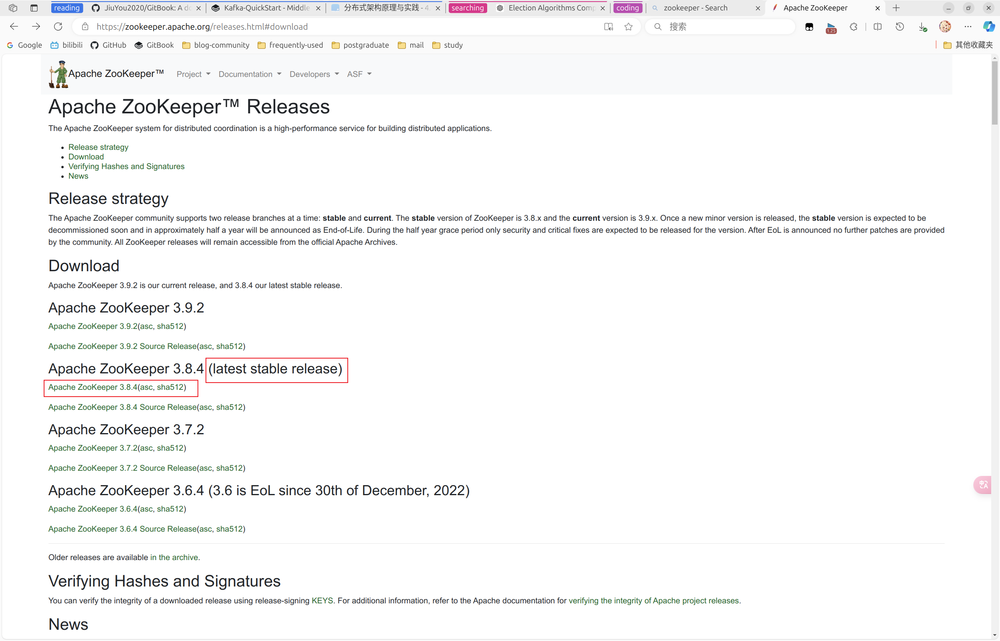

# Zookeeper-QuickStart

## 安装配置

1. 从官网下载压缩包，示例中使用的压缩包是[**apache-zookeeper-3.8.4-bin.tar.gz**](https://dlcdn.apache.org/zookeeper/zookeeper-3.8.4/apache-zookeeper-3.8.4-bin.tar.gz)

   

2. 复制到`/opt`目录下，然后解压缩，参考代码如下

   ```shell
   sudo mkdir /opt/zookeeper
   sudo mv apache-zookeeper-3.8.4-bin.tar.gz /opt/zookeeper/
   cd /opt/zookeeper
   sudo tar -zxvf apache-zookeeper-3.8.4-bin.tar.gz
   ```

3. 添加全局配置，向`etc/profile`或者`~/.bashrc`中添加如下内容，并执行`source`命令

   ```shell
   export ZOOKEEPER_HOME=/opt/zookeeper/apache-zookeeper-3.8.4-bin
   export PATH=$PATH:$ZOOKEEPER_HOME/bin
   
   source ~/.bashrc
   ```

4. 修改配置文件，进入到`$ZOOKEEPER_HOME/conf`目录，复制一份`zoo_sample.cfg` 为`zoo.cfg`，参考如下
   ```shell
   cd conf
   cp zoo_sample.cfg zoo.cfg
   
   vim zoo.cfg
   ```

   ```properties
   # The number of milliseconds of each tick
   # ZooKeeper服务器心跳时间，单位毫秒
   tickTime=2000
   # The number of ticks that the initial 
   # synchronization phase can take
   # 投票选举新leader的初始化时间
   initLimit=10
   # The number of ticks that can pass between 
   # sending a request and getting an acknowledgement
   
   # leader与follower心跳检查最大延迟时间，响应超过syncLimit*tickTime，leader认为follower挂掉，从服务器列表中删除follower
   syncLimit=5
   # the directory where the snapshot is stored.
   # do not use /tmp for storage, /tmp here is just 
   # example sakes.
   
   # 数据目录
   dataDir=/tmp/zookeeper/data
   # 日志目录
   dataLogDir=/tmp/zookeeper/log
   # the port at which the clients will connect
   clientPort=2181
   ```

5. 创建上述的两个目录

   ```shell
   sudo mkdir -p /tmp/zookeeper/data
   sudo mkdir -p /tmp/zookeeper/log
   ```

6. 启动并查看状态

   ```shell
   # 启动
   zkServer.sh start
   # 查看状态
   zkServer.sh status
   ```

> 权限问题解决：给`/opt/zookeeper`和上述`data` 、`log`目录授权，授权代码参考如下：
>
> ```shell
> # 将文件的所有者更改为自己
> sudo chown -R jiuyou2020:jiuyou2020 /file_path
> # 给文件添加指定用户的权限
> sudo chmod -R 755 /file_path
> ```

集群配置参考[文章](https://weread.qq.com/web/reader/e9a32a0071848698e9a39b8k8f132430178f14e45fce0f7)

