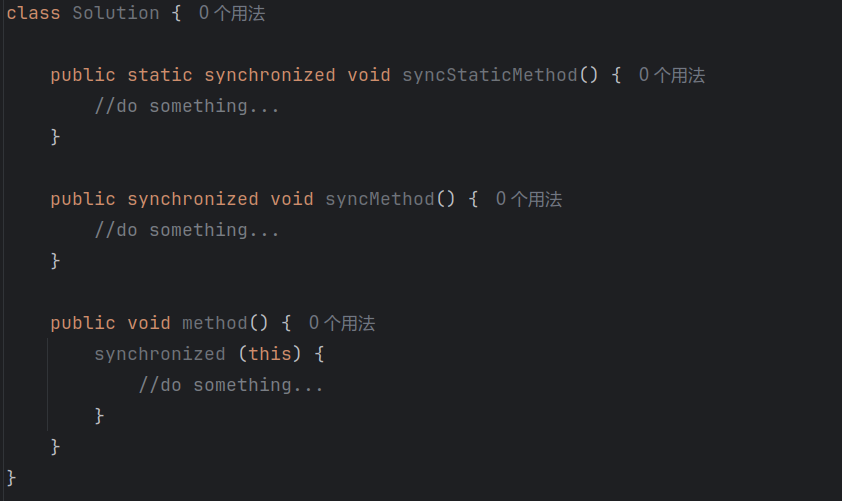

# Java并发的艺术

## synchronized的实现原理与应用

Java中的每一个对象都可以作为锁。具体表现为以下3种形式。

* 对于普通同步方法，锁是当前实例对象。
* 对于静态同步方法，锁是当前类的Class对象。
* 对于同步方法块，锁是Synchonized括号里配置的对象。

当一个线程试图访问同步代码块时，它首先必须得到锁，退出或抛出异常时必须释放锁。那么锁到底存在哪里呢？锁里面会存储什么信息呢？

从JVM规范中可以看到Synchonized在JVM里的实现原理，JVM基于进入和退出Monitor对象来实现方法同步和代码块同步，但两者的实现细节不一样。代码块同步是使用monitorenter和monitorexit指令实现的，而方法同步是使用另外一种方式实现的，细节在JVM规范里并没有详细说明。但是，方法的同步同样可以使用这两个指令来实现。

monitorenter指令是在编译后插入到同步代码块的开始位置，而monitorexit是插入到方法结束处和异常处，JVM要保证每个monitorenter必须有对应的monitorexit与之配对。任何对象都有一个monitor与之关联，当且一个monitor被持有后，它将处于锁定状态。线程执行到monitorenter指令时，将会尝试获取对象所对应的monitor的所有权，即尝试获得对象的锁。

<figure><figcaption></figcaption></figure>

<figure><figcaption></figcaption></figure>

### **Java对象头**

synchronized用的锁是存在Java对象头里的。如果对象是数组类型，则虚拟机用3个字宽（Word）存储对象头，如果对象是非数组类型，则用2字宽存储对象头。在32位虚拟机中，1字宽等于4字节，即32bit。

<figure><figcaption></figcaption></figure>

Java对象头里的Mark Word里默认存储对象的HashCode、分代年龄和锁标记位。

<figure><figcaption></figcaption></figure>

在运行期间，Mark Word里存储的数据会随着锁标志位的变化而变化。

<figure><figcaption></figcaption></figure>

在64位虚拟机下，Mark Word是64bit大小的。

<figure><figcaption></figcaption></figure>

### 锁的升级与对比

锁一共有4种状态，级别从低到高依次是：无锁状态、偏向锁状态、轻量级锁状态和重量级锁状态，这几个状态会随着竞争情况逐渐升级。锁可以升级但不能降级，意味着偏向锁升级成轻量级锁后不能降级成偏向锁。这种锁升级却不能降级的策略，目的是为了提高获得锁和释放锁的效率，下文会详细分析。

#### 偏向锁

HotSpot\[1]的作者经过研究发现，大多数情况下，锁不仅不存在多线程竞争，而且总是由同一线程多次获得，为了让线程获得锁的代价更低而引入了偏向锁。当一个线程访问同步块并获取锁时，会在对象头和栈帧中的锁记录里存储锁偏向的线程ID，以后该线程在进入和退出同步块时不需要进行CAS操作来加锁和解锁，只需简单地测试一下对象头的Mark Word里是否 存储着指向当前线程的偏向锁。如果测试成功，表示线程已经获得了锁。如果测试失败，则需 要再测试一下Mark Word中偏向锁的标识是否设置成1（表示当前是偏向锁）：如果没有设置，则 使用CAS竞争锁；如果设置了，则尝试使用CAS将对象头的偏向锁指向当前线程。

偏向锁使用了一种等到竞争出现才释放锁的机制，所以当其他线程尝试竞争偏向锁时，持有偏向锁的线程才会释放锁。偏向锁的撤销，需要等待全局安全点（在这个时间点上没有正在执行的字节码）。它会首先暂停拥有偏向锁的线程，然后检查持有偏向锁的线程是否活着，如果线程不处于活动状态，则将对象头设置成无锁状态；如果线程仍然活着，拥有偏向锁的栈会被执行，遍历偏向对象的锁记录，栈中的锁记录和对象头的Mark Word要么重新偏向于其他线程，要么恢复到无锁或者标记对象不适合作为偏向锁，最后唤醒暂停的线程。下图中的线程1演示了偏向锁初始化的流程，线程2演示了偏向锁撤销的流程

<figure><figcaption></figcaption></figure>

#### 轻量级锁

1. 轻量级锁加锁

线程在执行同步块之前，JVM会先在当前线程的栈桢中创建用于存储锁记录的空间，并将对象头中的Mark Word复制到锁记录中，官方称为Displaced Mark Word。然后线程尝试使用CAS将对象头中的Mark Word替换为指向锁记录的指针。如果成功，当前线程获得锁，如果失败，表示其他线程竞争锁，当前线程便尝试使用自旋来获取锁。

2. 轻量级锁解锁

轻量级解锁时，会使用原子的CAS操作将Displaced Mark Word替换回到对象头，如果成功，则表示没有竞争发生。如果失败，表示当前锁存在竞争，锁就会膨胀成重量级锁。图2-2是两个线程同时争夺锁，导致锁膨胀的流程图。

<figure><figcaption></figcaption></figure>

因为自旋会消耗CPU，为了避免无用的自旋（比如获得锁的线程被阻塞住了），一旦锁升级成重量级锁，就不会再恢复到轻量级锁状态。当锁处于这个状态下，其他线程试图获取锁时，都会被阻塞住，当持有锁的线程释放锁之后会唤醒这些线程，被唤醒的线程就会进行新一轮的夺锁之争。

#### 锁的优缺点对比

<figure><figcaption></figcaption></figure>

