# [设计模式的艺术](https://github.com/JiuYou2020/ReadingBook)

## 创造型模式

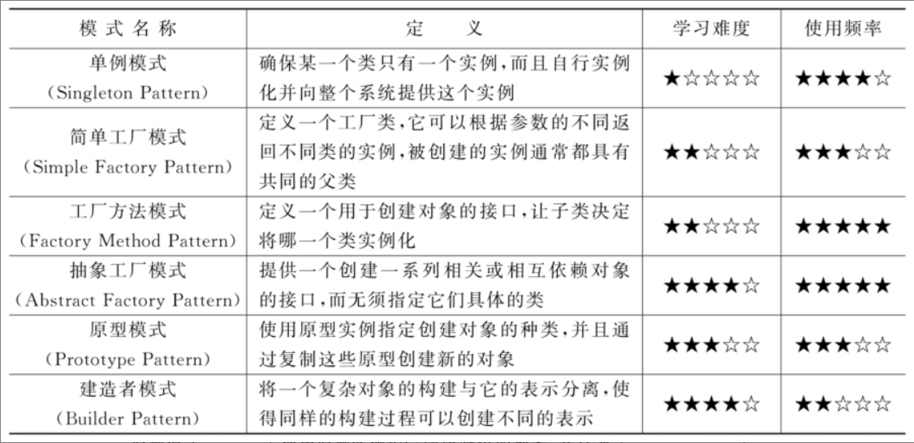

### 什么时候使用单例模式？

1. **系统只需要一个实例对象。**例如，系统要求提供一个唯一的序列号生成器或资源管理器，或者需要考虑资源消耗太大而只允许创建一个对象。
2. **客户调用类的单个实例只允许使用一个公共访问点。**除了该公共访问点，不能通过其他途径访问该实例。

例子：

Sunny软件公司承接了一个服务器负载均衡（Load Balance）软件的开发工作，该软件运行在一台负载均衡服务器上，可以将并发访问和数据流量分发到服务器集群中的多台设备上进行并发处理，提高系统的整体处理能力，缩短响应时间。由于集群中的服务器需要动态删减，且客户端请求需要统一分发，因此需要确保负载均衡器的唯一性，即只能有一个负载均衡器来负责服务器的管理和请求的分发，否则将会带来服务器状态的不一致以及请求分配冲突等问题。如何确保负载均衡器的唯一性是该软件成功的关键。

文档+代码实例：[https://github.com/JiuYou2020/learning/blob/master/design-patterns/src/singleton\_pattern/SingletonPattern.md](https://github.com/JiuYou2020/learning/blob/master/design-patterns/src/singleton\_pattern/SingletonPattern.md)

### 什么时候使用简单工厂模式？

1. **工厂类负责创建的对象比较少。**由于创建的对象较少，不会造成工厂方法中的业务逻辑太过复杂。
2. **客户端只知道传入工厂类的参数，对于如何创建对象并不关心。**

例子：

Sunny软件公司欲基于Java语言开发一套图表库，该图表库可以为应用系统提供各种不同外观的图表，例如柱状图、饼状图、折线图等。Sunny软件公司图表库设计人员希望为应用系统开发人员提供一套灵活易用的图表库，而且可以较为方便地对图表库进行扩展，以便能够在将来增加一些新类型的图表。

文档+代码实例：[https://github.com/JiuYou2020/learning/blob/master/design-patterns/src/simple\_factory\_pattern/SimpleFactoryPattern.md](https://github.com/JiuYou2020/learning/blob/master/design-patterns/src/simple\_factory\_pattern/SimpleFactoryPattern.md)

### 什么时候使用工厂方法模式？

1. **客户端不知道其所需要的对象的类**。在工厂方法模式中，客户端不需要知道具体产品类的类名，只需要知道所对应的工厂即可，具体的产品对象由具体工厂类创建，可将具体工厂类的类名存储在配置文件或数据库中。
2. **抽象工厂类通过其子类来指定创建哪个对象**。在工厂方法模式中，抽象工厂类只需要提供一个创建产品的接口，而由其子类来确定具体要创建的对象，利用面向对象的多态性和里氏代换原则，在程序运行时，子类对象将覆盖父类对象，从而使得系统更容易扩展。

与简单工厂对比？参考文档

简单工厂模式虽然简单，但存在一个很严重的问题：当系统中需要引入新产品时，由于静态工厂方法通过所传入参数的不同来创建不同的产品，这必定要修改工厂类的源代码，将违背开闭原则。

例子：

Sunny软件公司欲开发一个系统运行日志记录器（Logger），该记录器可以通过多种途径保存系统的运行日志，例如通过**文件记录**或**数据库记录**，用户可以通过修改配置文件灵活地更换日志记录方式。在设计各类日志记录器时，Sunny公司的开发人员发现需要对日志记录器进行一些初始化工作，初始化参数的设置过程较为复杂，而且某些参数的设置有严格的先后次序，否则可能会发生记录失败。如何封装记录器的初始化过程并保证多种记录器切换的灵活性是Sunny公司开发人员面临的一个难题。

文档+代码实例：[https://github.com/JiuYou2020/learning/blob/master/design-patterns/src/factory\_method\_pattern/FactoryMethodPattern.md](https://github.com/JiuYou2020/learning/blob/master/design-patterns/src/factory\_method\_pattern/FactoryMethodPattern.md)

### 什么时候使用抽象工厂模式？

1. **一个系统不应当依赖于产品类实例如何被创建、组合和表达的细节**，这对于所有类型的工厂模式都是很重要的，用户无须关心对象的创建过程，将对象的创建和使用解耦。
2. **系统中有多于一个的产品族，而每次只使用其中某一个产品族**。可以通过配置文件等方式来使得用户可以动态改变产品族，也可以很方便地增加新的产品族。
3. **属于同一个产品族的产品将在一起使用**，这一约束必须在系统的设计中体现出来。同一个产品族中的产品可以是没有任何关系的对象，但是它们都具有一些共同的约束。例如同一操作系统下的按钮和文本框，按钮与文本框之间没有直接关系，但它们都是属于某一操作系统的，此时具有一个共同的约束条件：操作系统的类型。
4. **产品等级结构稳定，设计完成之后，不会向系统中增加新的产品等级结构或者删除已有的产品等级结构。**

在工厂方法模式中，具体工厂负责生产具体的产品，每个具体工厂对应一种具体产品，工厂方法具有唯一性。一般情况下，一个具体工厂中只有一个或者一组重载的工厂方法。但是，有时希望一个工厂可以提供多个产品对象，而不是单一的产品对象。例如一个电器工厂，它可以生产电视机、电冰箱、空调等多种电器，而不是只生产某一种电器。为了更好地理解抽象工厂模式，这里先引入如下两个概念：

1. 产品等级结构。产品等级结构即产品的继承结构，例如一个抽象类是电视机，其子类有海尔电视机、海信电视机、TCL电视机，则抽象电视机与具体品牌的电视机之间构成了一个产品等级结构，抽象电视机是父类，而具体品牌的电视机是其子类。
2. 产品族。在抽象工厂模式中，产品族是指由同一个工厂生产的，位于不同产品等级结构中的一组产品。例如海尔电器工厂生产的海尔电视机、海尔电冰箱，海尔电视机位于电视机产品等级结构中，海尔电冰箱位于电冰箱产品等级结构中，海尔电视机、海尔电冰箱构成了一个产品族。

例子：

Sunny软件公司欲开发一套界面皮肤库，可以对Java桌面软件进行界面美化。为了保护版权，该皮肤库源代码不打算公开，而只向用户提供已打包为jar文件的class字节码文件。用户在使用时可以通过菜单来选择皮肤，不同的皮肤将提供视觉效果不同的按钮、文本框、组合框等界面元素。

文档+代码实例：[https://github.com/JiuYou2020/learning/blob/master/design-patterns/src/abstract\_factory\_pattern/abstract\_factory\_pattern.md](https://github.com/JiuYou2020/learning/blob/master/design-patterns/src/abstract\_factory\_pattern/abstract\_factory\_pattern.md)


### 什么时候使用原型模式？

1. 创建新对象成本较大（例如初始化需要占用较长的时间，占用太多的CPU资源或网络资源）。新的对象可以通过原型模式对已有对象进行复制来获得，如果是相似对象，则可以对其成员变量稍作修改。
2. 如果系统要保存对象的状态，而对象的状态变化很小，或者对象本身占用内存较少时，**可以使用原型模式配合备忘录模式来实现。**
3. 需要避免使用分层次的工厂类来创建分层次的对象，并且类的实例对象只有一个或很少的几个组合状态。通过复制原型对象得到新实例可能比使用构造函数创建一个新实例更加方便。


原型模式作为一种快速创建大量相同或相似对象的方式，在软件开发中应用较为广泛，很多软件提供的复制（Ctrl+C）和粘贴（Ctrl+V）操作就是原型模式的典型应用。

例子：

Sunny软件公司一直使用自行开发的一套OA（Office Automatic，办公自动化）系统进行日常工作办理，但在使用过程中，越来越多的人对工作周报的创建和编写模块产生了抱怨。追其原因，Sunny软件公司的OA管理员发现，由于某些岗位每周工作存在重复性，工作周报内容都大同小异，如图7-1所示。这些周报只有一些小地方存在差异，但是现行系统每周默认创建的周报都是空白报表，用户只能通过重新输入或不断复制、粘贴来填写重复的周报内容，极大降低了工作效率，浪费宝贵的时间。如何快速创建相同或者相似的工作周报，成为Sunny公司OA开发人员面临的一个新问题。

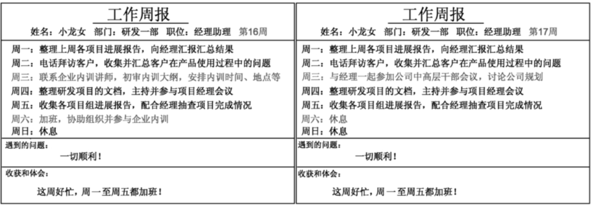

文档+代码实例：


### 什么时候使用建造者模式？

1. 需要生成的产品对象有复杂的内部结构，这些产品对象通常包含多个成员变量。
2. 需要生成的产品对象的属性相互依赖，需要指定其生成顺序。
3. 对象的创建过程独立于创建该对象的类。在建造者模式中通过引入指挥者类，将创建过程封装在指挥者类中，而不在建造者类和客户类中。
4. 隔离复杂对象的创建和使用，并使得相同的创建过程可以创建不同的产品。

**建造者模式的核心在于如何一步一步地构建一个包含多个组成部件的完整对象**，使用相同的构建过程构建不同的产品。在软件开发中，如果需要创建复杂对象，并希望系统具备很好的灵活性和可扩展性，可以考虑使用建造者模式。

例子：

Sunny软件公司游戏开发小组决定开发一款名为《Sunny群侠传》的网络游戏，该游戏采用主流的RPG（Role Playing Game，角色扮演游戏）模式。玩家可以在游戏中扮演虚拟世界中的一个特定角色，角色根据不同的游戏情节和统计数据（如力量、魔法、技能等）具有不同的能力，角色也会随着不断升级而拥有更加强大的能力。

作为RPG游戏的一个重要组成部分，需要对游戏角色进行设计，而且随着该游戏的升级将不断增加新的角色。不同类型的游戏角色，其性别、脸型、服装、发型等外部特性都有所差异，例如“天使”拥有美丽的面容和披肩的长发，并身穿一袭白裙；而“恶魔”极其丑陋，留着光头并穿一件刺眼的黑衣。

Sunny公司决定开发一个小工具来创建游戏角色，可以创建不同类型的角色并可以灵活也增加新的角色。

Sunny公司的开发人员通过分析发现，游戏角色是一个复杂对象，它包含性别、脸型等多个组成部分，不同的游戏角色其组成部分有所差异，如图8-1所示。

无论是何种造型的游戏角色，它们的创建步骤都大同小异，都需要逐步创建其组成部分，再将各组成部分装配成一个完整的游戏角色。如何一步一步地创建一个包含多个组成部分的复杂对象，建造者模式为解决此类问题而诞生。

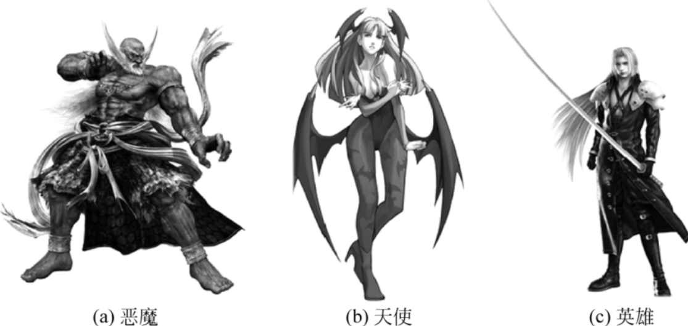

## 结构型模式


### 什么时候使用适配器模式？

1. 系统需要使用一些现有的类，而这些类的接口（例如方法名）不符合系统的需要，甚至没有这些类的源代码。
2. 想创建一个可以重复使用的类，用于与一些彼此之间没有太大关联的类，包括一些可能在将来引进的类一起工作。

与电源适配器相似，在适配器模式中引入了一个被称为适配器（Adapter）的包装类，而它所包装的对象称为适配者（Adaptee），即被适配的类。适配器的实现就是把客户类的请求转化为对适配者的相应接口的调用。也就是说：当客户类调用适配器的方法时，在适配器类的内部将调用适配者类的方法，而这个过程对客户类是透明的，客户类并不直接访问适配者类。


例子：

有的笔记本电脑的工作电压是20V，而我国的家庭用电是220V，如何让20V的笔记本电脑能够在220V的电压下工作？答案是引入一个电源适配器（AC Adapter），俗称充电器／变压器。有了这个电源适配器，生活用电和笔记本电脑即可兼容。

生活用电、电源适配器、笔记本电脑示意图在软件开发中，有时也存在类似这种不兼容的情况，也可以像引入一个电源适配器一样引入一个被称为适配器的角色来协调这些存在不兼容的结构，这种设计方案即为适配器模式。本章将介绍第一个结构型模式——适配器模式。


### 什么时候使用桥接模式？

1. 如果一个系统需要在抽象类和具体类之间增加更多的灵活性，避免在两个层次之间建立静态的继承关系，通过桥接模式可以使它们在抽象层建立一个关联关系。
2. 抽象部分和实现部分可以以继承的方式独立扩展而互不影响，在程序运行时可以动态地将一个抽象类子类的对象和一个实现类子类的对象进行组合，即系统需要对抽象类角色和实现类角色进行动态耦合。
3. 一个类存在两个（或多个）独立变化的维度，且这两个（或多个）维度都需要独立进行扩展。
4. 对于那些不希望使用继承或因为多层继承导致系统类的个数急剧增加的系统，桥接模式尤为适用。

在使用桥接模式时，首先应该识别出一个类所具有的两个独立变化的维度，将它们设计为两个独立的继承等级结构，为两个维度都提供抽象层，并建立抽象耦合。通常情况下，将具有两个独立变化维度的类的一些普通业务方法和与之关系最密切的维度设计为抽象类层次结构（抽象部分），而将另一个维度设计为实现类层次结构（实现部分）。例如，对于毛笔而言，由于型号是其固有的维度，因此可以设计一个抽象的毛笔类，在该类中声明并部分实现毛笔的业务方法，而将各种型号的毛笔作为其子类。颜色是毛笔的另一个维度，由于它与毛笔之间存在一种“设置”的关系，因此可以提供一个抽象的颜色接口，而将具体的颜色作为实现该接口的子类。在此，型号可认为是毛笔的抽象部分，而颜色是毛笔的实现部分。

例子：

Sunny软件公司欲开发一个跨平台图像浏览系统，要求该系统能够显示BMP、JPG、GIF、PNG等多种格式的文件，并且能够在Windows、Linux、UNIX等多个操作系统上运行。该系统首先将各种格式的文件解析为像素矩阵（Matrix），然后将像素矩阵显示在屏幕上，在不同的操作系统中可以调用不同的绘制函数来绘制像素矩阵。该系统需具有较好的扩展性以支持新的文件格式和操作系统。

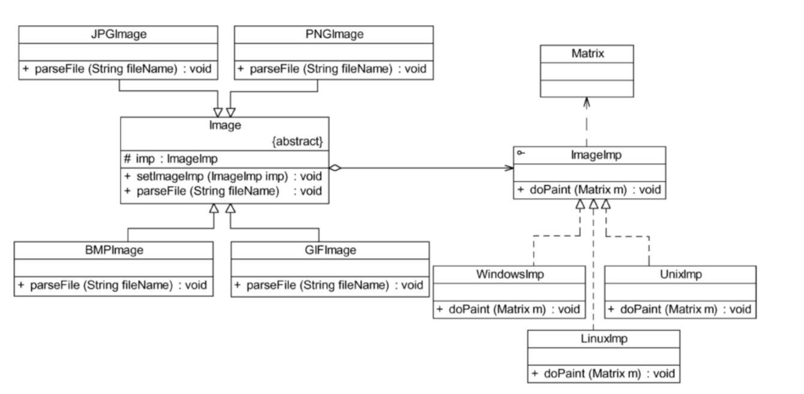

### 什么时候使用组合模式？

1. 在**具有整体和部分的层次结构**中，希望通过一种方式忽略整体与部分的差异，客户端可以一致性地对待它们。
2. 在一个使用面向对象语言开发的系统中需要处理一个树形结构。
3. 在一个系统中能够分离出叶子对象和容器对象，而且它们的类型不固定，将来需要增加一些新的类型。

对于树形结构，当容器对象（例如文件夹）的某一个方法被调用时，将遍历整个树形结构，寻找也包含这个方法的成员对象（可以是容器对象，也可以是叶子对象）并调用执行，牵一而动百，其中使用了递归调用的机制来对整个结构进行处理。由于容器对象和叶子对象在功能上的区别，在使用这些对象的代码中必须有区别地对待容器对象和叶子对象，而实际上大多数情况下希望一致地处理它们，因为对于这些对象的区别对待将会使得程序非常复杂。组合模式为解决此类问题而诞生，它可以让叶子对象和容器对象的使用具有一致性。


例子：

Sunny软件公司欲开发一个杀毒（AntiVirus）软件，该软件既可以对某个文件夹（Folder）杀毒，也可以对某个指定的文件（File）进行杀毒。该杀毒软件还可以根据各类文件的特点，为不同类型的文件提供不同的杀毒方式，例如图像文件（ImageFile）和文本文件（TextFile）的杀毒方式就有所差异。现需要提供该杀毒软件的整体框架设计方案。

可以看出，在下图中包含文件（灰色节点）和文件夹（白色节点）两类不同的元素。其中，在文件夹中可以包含文件，还可以继续包含子文件夹，但是在文件中不能再包含子文件或者子文件夹。在此，可以称文件夹为容器（Container），而不同类型的各种文件是其成员，也称为叶子（Leaf），一个文件夹也可以作为另一个更大的文件夹的成员。如果现在要对某一个文件夹进行操作，例如查找文件，那么需要对指定的文件夹进行遍历，如果存在子文件夹则打开其子文件夹继续遍历，如果是文件则判断之后返回查找结果。


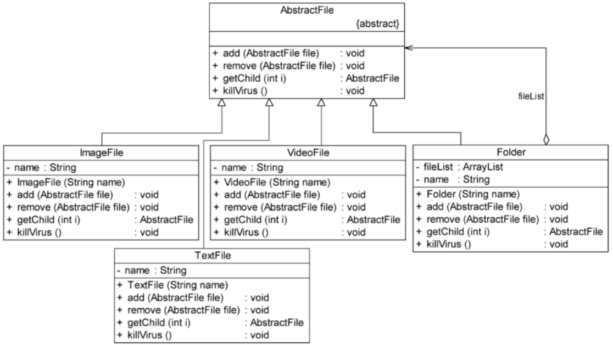


### 什么时候使用装饰模式？

1. **在不影响其他对象的情况下，以动态、透明的方式给单个对象添加职责。**
2. **当不能采用继承的方式对系统进行扩展或者采用继承不利于系统扩展和维护时可以使用装饰模式。**不能采用继承的情况主要有两类：第1类是系统中存在大量独立的扩展，为支持每一种扩展或者扩展之间的组合将产生大量的子类，使得子类数目呈爆炸性增长；第2类是因为类已定义为不能被继承（如Java语言中的final类）。

装饰模式可以在不改变一个对象本身功能的基础上给对象增加额外的新行为。在现实生活中，这种情况也到处存在。例如一张照片，可以不改变照片本身，给它增加一个相框，使得它具有防潮的功能，而且用户可以根据需要给它增加不同类型的相框，甚至可以在一个小相框的外面再套一个大相框。

装饰模式是一种用于替代继承的技术，它通过一种无须定义子类的方式来给对象动态增加职责，使用对象之间的关联关系取代类之间的继承关系。在装饰模式中引入了装饰类，在装饰类中既可以调用待装饰的原有类的方法，还可以增加新的方法，以扩充原有类的功能。

例子：

Sunny软件公司基于面向对象技术开发了一套图形界面构件库Visual Component，该构件库提供了大量基本构件，如窗体、文本框、列表框等。由于在使用该构件库时，用户经常要求定制一些特殊的显示效果，例如带滚动条的窗体、带黑色边框的文本框、既带滚动条又带黑色边框的列表框等，因此经常需要对该构件库进行扩展以增强其功能

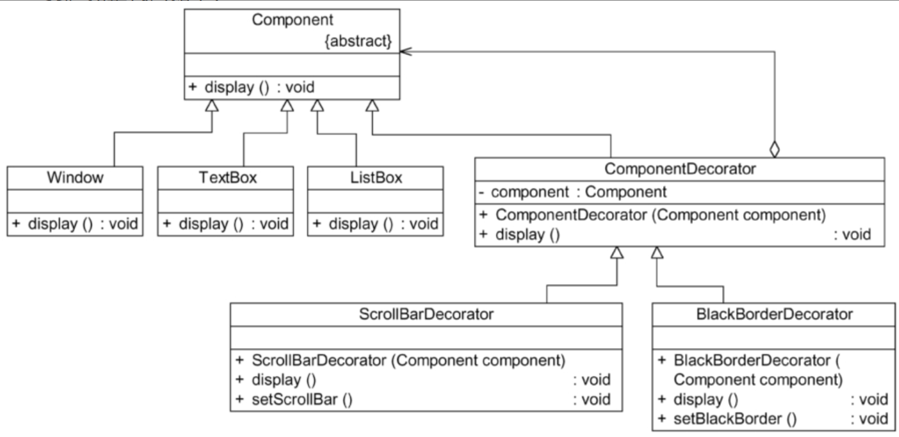


### 什么时候使用外观模式？

1. 当要为访问一系列复杂的子系统提供一个简单入口时可以使用外观模式。
2. 客户端程序与多个子系统之间存在很大的依赖性。引入外观类可以将子系统与客户端解耦，从而提高子系统的独立性和可移植性。
3. 在层次化结构中，可以使用外观模式定义系统中每一层的入口，层与层之间不直接产生联系，而通过外观类建立联系，降低层之间的耦合度。


根据单一职责原则，在软件中将一个系统划分为若干个子系统（Subsystem）有利于降低整个系统的复杂性。一个常见的设计目标是使客户类与子系统之间的通信和相互依赖关系达到最小，而达到该目标的途径之一就是引入一个外观（Facade）角色，它为子系统的访问提供了一个简单而单一的入口。外观模式也是迪米特法则的体现，通过引入一个新的外观角色可以降低原有系统的复杂度，同时降低客户类与子系统类的耦合度。

如果没有外观角色，每个客户端可能需要和多个子系统之间进行复杂的交互，系统的耦合度将很大，如图a所示。而增加一个外观角色之后，客户端只需要直接与外观角色交互，客户端与子系统之间原有的复杂关系由外观角色来实现，从而降低了系统的耦合度，如图

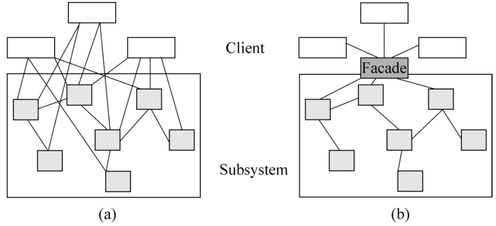


例子：

Sunny软件公司欲开发一个可应用于多个软件的文件加密模块，该模块可以对文件中的数据进行加密并将加密之后的数据存储在一个新文件中。具体的流程包括3个部分，分别是读取源文件、加密、保存加密之后的文件。其中，读取文件和保存文件使用流来实现，加密操作通过求模运算实现。这3个操作相对独立，为了实现代码的独立重用，让设计更符合单一职责原则，这3个操作的业务代码封装在3个不同的类中。

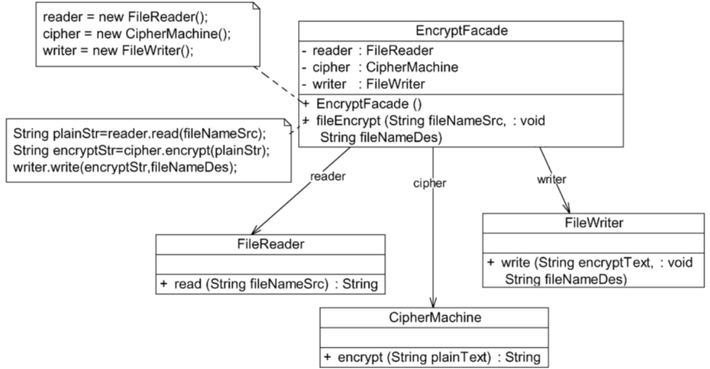

### 什么时候使用享元模式？

1. 一个系统有大量相同或者相似的对象，造成内存的大量耗费。
2. 对象的大部分状态都可以外部化，可以将这些外部状态传入对象中。

3. 在使用享元模式时需要维护一个存储享元对象的享元池，而这需要耗费一定的系统资源。因此，在需要多次重复使用同一享元对象时才值得使用享元模式。

构建和谐社会的一个重要组成部分就是建设资源节约型社会，“浪费可耻，节俭光荣”。在软件系统中，有时也会存在资源浪费的情况。例如，在计算机内存中存储了多个完全相同或者非常相似的对象，如果这些对象的数量太多将导致系统运行代价过高，内存属于计算机的“稀缺资源”，不应该“随便浪费”。那么，**是否存在一种技术可以用于节约内存使用空间，实现对这些相同或者相似对象的共享访问呢**？答案是肯定的，这种技术就是本章将要学习的享元模式。


例子：

Sunny软件公司开发人员通过对围棋软件进行分析，发现在围棋棋盘中包含大量的黑子和白子，它们的形状、大小都一模一样，只是出现的位置不同而已。如果将每个棋子都作为一个独立的对象存储在内存中，将导致该围棋软件在运行时所需内存空间较大。如何降低运行代价、提高系统性能是Sunny公司开发人员需要解决的一个问题。为了解决这个问题，Sunny公司开发人员决定使用享元模式来设计该围棋软件的棋子对象。

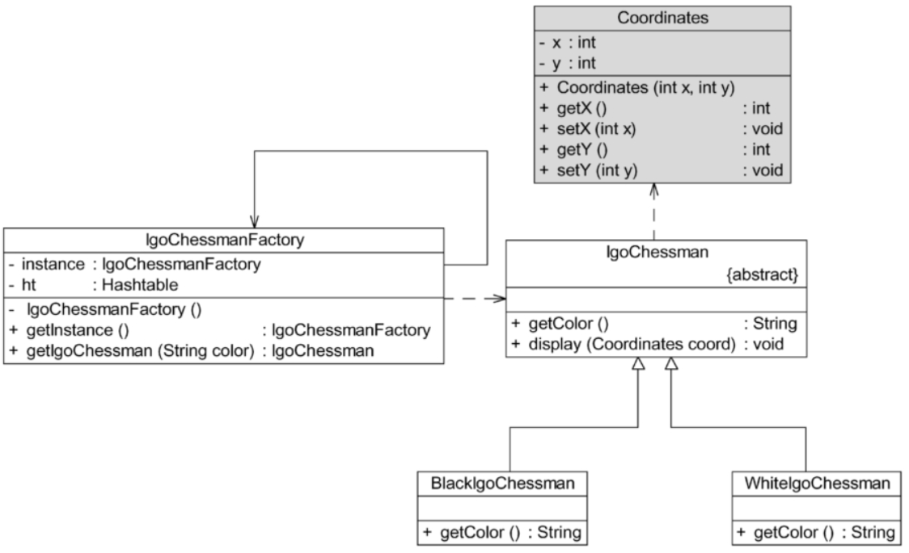


### 什么时候使用代理模式？

1. 当客户端对象需要访问远程主机中的对象时，可以使用**远程代理**。
2. 当需要用一个消耗资源较少的对象来代表一个消耗资源较多的对象，从而降低系统开销、缩短运行时间时，可以使用**虚拟代理**。例如一个对象需要很长时间才能完成加载时。
3. 当需要控制对一个对象的访问，为不同用户提供不同级别的访问权限时，可以使用**保护代理**。
4. 当需要为某一个被频繁访问的操作结果提供一个临时存储空间，以供多个客户端共享访问这些结果时，可以使用**缓冲代理**。通过缓冲代理，系统无须在客户端每次访问时都重新执行操作，只需直接从临时缓冲区获取操作结果即可。
5. 当需要为一个对象的访问（引用）提供一些额外的操作时，可以使用**智能引用代理**。

在软件开发中，有一种设计模式可以提供与代购网站类似的功能。由于某些原因，客户端不想或不能直接访问某个对象，此时可以通过一个被称为“代理”的第三者来实现间接访问，该方案对应的设计模式被称为代理模式。


例子：

Sunny软件公司承接了某信息咨询公司的收费商务信息查询系统的开发任务，该系统的基本需求如下：

1. 在进行商务信息查询之前用户需要通过身份验证，只有合法用户才能够使用该查询系统。
2. 在进行商务信息查询时，系统需要记录查询日志，以便根据查询次数收取查询费用。

Sunny软件公司开发人员已完成了商务信息查询模块的开发任务，他们希望能够以一种松耦合的方式向原有系统增加身份验证和日志记录功能。客户端代码可以无区别地对待原始的商务信息查询模块和增加新功能之后的商务信息查询模块，而且可能在将来还要在该信息查询模块中增加一些新的功能。

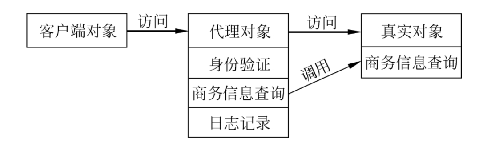

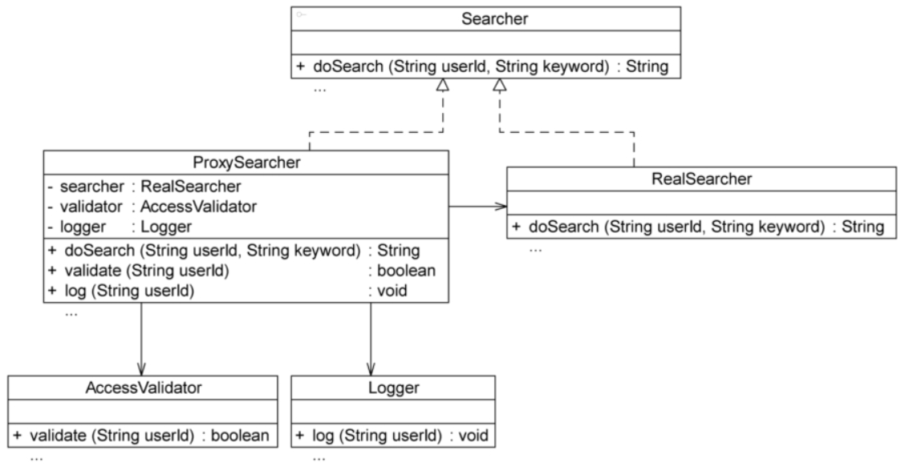


## 行为型模式

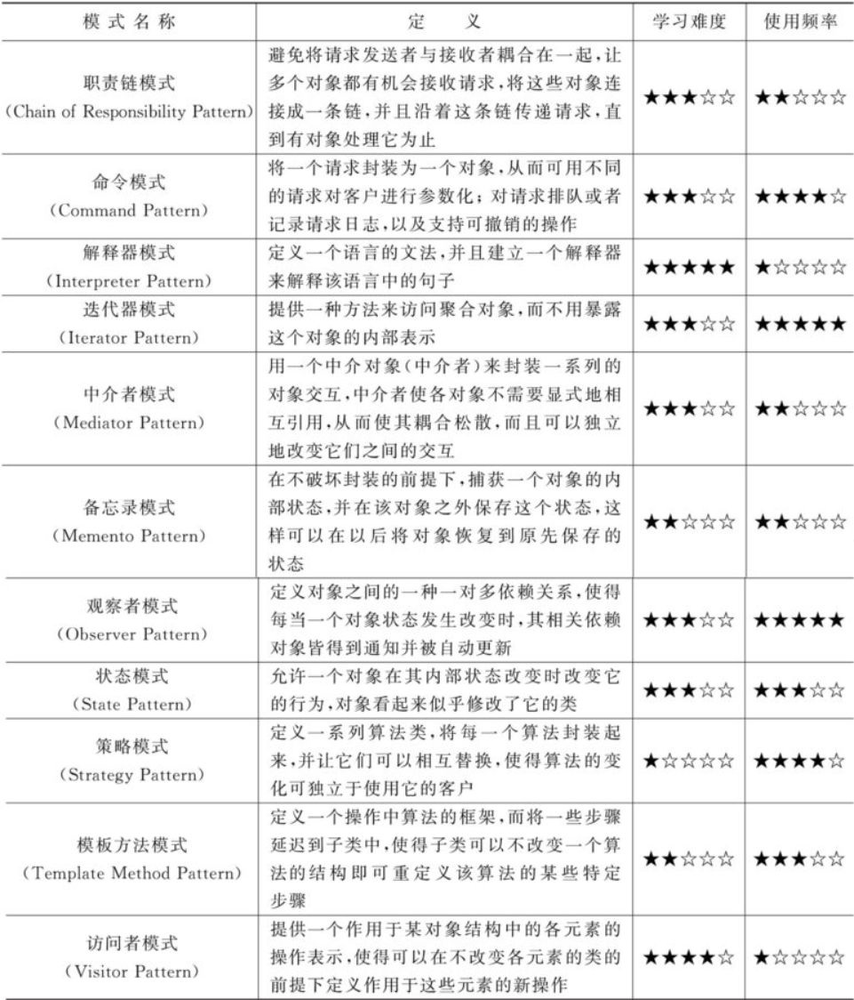


### 什么时候使用职责链模式？

1. 有多个对象可以处理同一个请求，具体哪个对象处理该请求待运行时刻再确定。客户端只需将请求提交到链上，而无须关心请求的处理对象是谁以及它是如何处理的。
2. 在不明确指定接收者的情况下，向多个对象中的一个提交一个请求。
3. 可动态指定一组对象处理请求。客户端可以动态创建职责链来处理请求，还可以改变链中处理者之间的先后次序。

很多情况下，在一个软件系统中可以处理某个请求的对象不止一个。例如SCM系统中的采购单审批，主任、副董事长、董事长和董事会都可以处理采购单，他们可以构成一条处理采购单的链式结构。采购单沿着这条链进行传递，这条链就称为职责链。职责链可以是一条直线、一个环或者一个树形结构，最常见的职责链是直线型，即沿着一条单向的链来传递请求。链上的每一个对象都是请求处理者，职责链模式可以将请求的处理者组织成一条链，并让请求沿着链传递，由链上的处理者对请求进行相应的处理，客户端无须关心请求的处理细节以及请求的传递，只需将请求发送到链上即可，实现请求发送者和请求处理者解耦。


例子：

Sunny软件公司承接了某企业SCM（Supply Chain Management，供应链管理）系统的开发任务，其中包含一个采购审批子系统。该企业的采购审批是分级进行的，即根据采购金额的不同由不同层次的主管人员来审批。主任可以审批5万元以下（不包括5万元）的采购单，副董事长可以审批5万～10万元（不包括10万元）的采购单，董事长可以审批10万～50万元（不包括50万元）的采购单，50万元及以上的采购单就需要开董事会讨论决定。采购单分级审批示意图如图16-1所示。

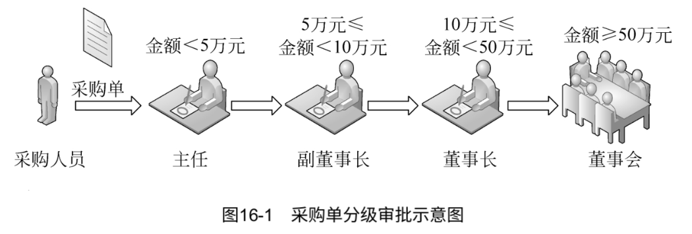

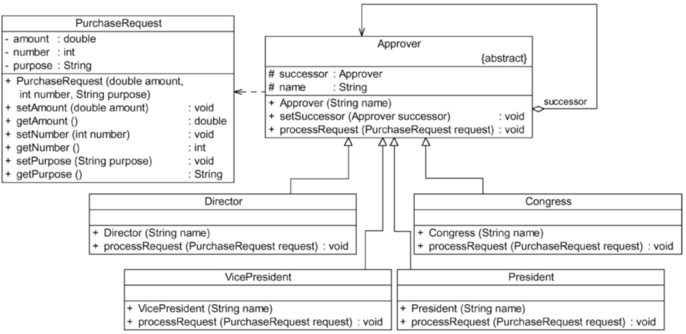


### 什么时候使用命令模式？

1. **系统需要将请求调用者和请求接收者解耦，使得调用者和接收者不直接交互**。请求调用者无须知道接收者的存在，也无须知道接收者是谁，接收者也无须关心何时被调用。
2. **系统需要在不同的时间指定请求、将请求排队和执行请求。**一个命令对象和请求的初始调用者可以有不同的生命期。换言之，最初的请求发出者可能已经不在了，而命令对象本身仍然是活动的，可以通过该命令对象去调用请求接收者，而无须关心请求调用者的存在性，可以通过**请求日志文件**等机制来具体实现。
3. 系统需要支持命令的**撤销（Undo）操作和恢复（Redo）操作**。
4. 系统需要将一组操作组合在一起形成**宏**命令。

在软件开发中，经常需要向某些对象发送请求（调用其中的某个或某些方法），但是并不知道请求的接收者是谁，也不知道被请求的操作是哪个。此时，特别希望能够以一种松耦合的方式来设计软件，使得请求发送者与请求接收者能够消除彼此之间的耦合，让对象之间的调用关系更加灵活，可以灵活地指定请求接收者以及被请求的操作。命令模式为此类问题提供了一个较为完美的解决方案。

命令模式可以将请求发送者和接收者完全解耦。发送者与接收者之间没有直接引用关系，发送请求的对象只需要知道如何发送请求，而不必知道如何完成请求。


例子：

Sunny软件公司开发人员为公司内部OA系统开发了一个桌面版应用程序。该应用程序为用户提供了一系列自定义功能键，用户可以通过这些功能键来实现一些快捷操作。Sunny软件公司开发人员通过分析，发现不同的用户可能会有不同的使用习惯。在设置功能键的时候每个人都有自己的喜好，例如有的人喜欢将第一个功能键设置为“打开帮助文档”，有的人则喜欢将该功能键设置为“最小化至托盘”。为了让用户能够灵活地进行功能键的设置，开发人员提供了一个“功能键设置”窗口，如图17-2所示。

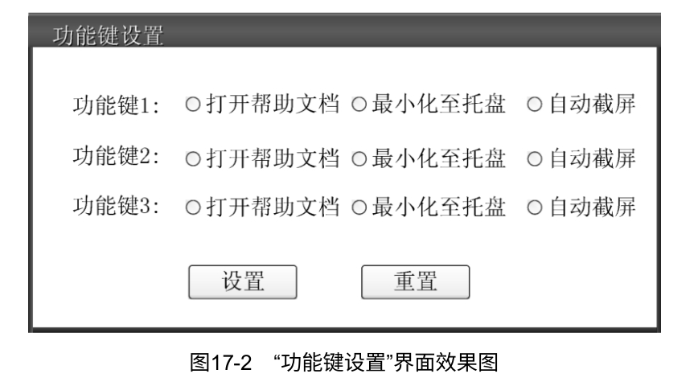

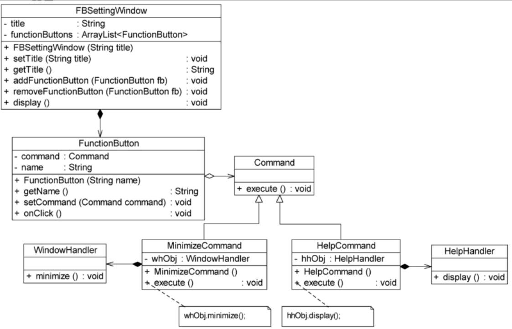


### 什么时候使用解释器模式？

> **解释器模式是一种使用频率相对较低但学习难度较大的设计模式。**

1. 可以将一个需要解释执行的语言中的句子表示为一个抽象语法树。
2. 一些重复出现的问题可以用一种简单的语言来进行表达。
3. 一个语言的文法较为简单。
4. **执行效率不是关键问题**。（注：高效的解释器通常不是通过直接解释抽象语法树来实现的，而是需要将它们转换成其他形式，使用解释器模式的执行效率并不高。）

在某些情况下，为了更好地描述某些特定类型的问题，可以创建一种新的语言。这种语言拥有自己的表达式和结构，即文法规则，这些问题的实例将对应为该语言中的句子。此时，可以使用解释器模式来设计这种新的语言。对解释器模式的学习能够加深对面向对象思想的理解，并且掌握编程语言中文法规则的解释过程。


例子：

Sunny软件公司欲为某玩具公司开发一套机器人控制程序。在该机器人控制程序中包含一些简单的英文控制指令，每个指令对应一个表达式（expression），该表达式可以是简单表达式，也可以是复合表达式。每个简单表达式由移动方向（direction）、移动方式（action）和移动距离（distance）三部分组成，其中移动方向包括上（up）、下（down）、左（left）、右（right）；移动方式包括移动（move）和快速移动（run）；移动距离为一个正整数。两个表达式之间可以通过与（and）连接，形成复合（composite）表达式。

用户通过对图形化的设置界面进行操作可以创建一个机器人控制指令，机器人在收到指令后将按照指令的设置进行移动。例如，输入控制指令“up move 5”，则向上移动5个单位；输入控制指令“down run 10 and left move 20”，则向下快速移动10个单位再向左移动20个单位。

Sunny软件公司开发人员决定自定义一个简单的语言来解释机器人控制指令。根据上述需求描述，用形式化语言来表示该简单语言的文法规则如下：

```java
expression ::= directin action distance | composite		//表达式
composite ::= expression 'and' expression				//符合表达式
direction ::= 'up' | 'down' | 'left' | 'right'			//移动方向
action ::= 'move' | 'run'								//移动方式
distance ::= an integer									//移动举例
```

上述语言一共定义了5条文法规则，对应5个语言单位。这些语言单位可以分为两类：一类为终结符（也称为终结符表达式），例如direction、action和distance，它们是语言的最小组成单位，不能再进行拆分；另一类为非终结符（也称为非终结符表达式），例如expression和composite，它们都是一个完整的句子，包含一系列终结符或非终结符。

根据上述规则定义出的语言可以构成很多语句，计算机程序将根据这些语句进行某种操作。为了实现对语句的解释，可以使用解释器模式。在解释器模式中每一条文法规则都将对应一个类，扩展、改变文法以及增加新的文法规则都很方便。

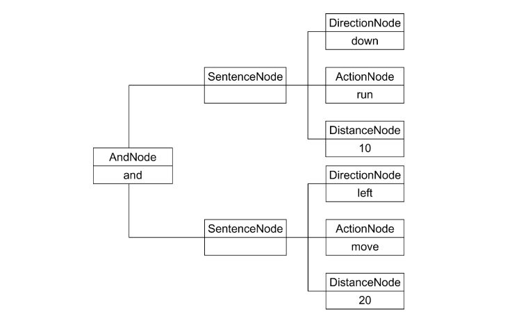

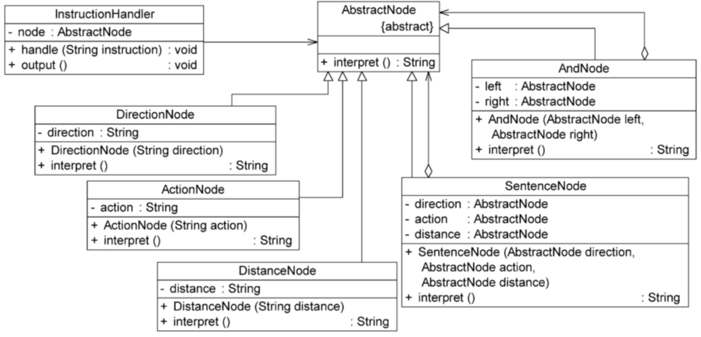


### 什么时候使用迭代器模式？

1. **访问一个聚合对象的内容而无须暴露它的内部表示**。将聚合对象的访问与内部数据的存储分离，使得访问聚合对象时无须了解其内部实现细节。
2. **需要为一个聚合对象提供多种遍历方式。**
3. **为遍历不同的聚合结构提供一个统一的接口**，在该接口的实现类中为不同的聚合结构提供不同的遍历方式，而客户端可以一致性地操作该接口。

在软件开发时，经常需要使用聚合对象来存储一系列数据。聚合对象拥有两个职责：一是存储数据；二是遍历数据。从依赖性来看，前者是聚合对象的基本职责；而后者既是可变化的，又是可分离的。因此，可以将遍历数据的行为从聚合对象中分离出来，封装在一个被称之为“迭代器”的对象中。由迭代器来提供遍历聚合对象内部数据的行为，这将简化聚合对象的设计，更符合单一职责原则的要求。

例子：

Sunny软件公司为某商场开发了一套销售管理系统。在对该系统进行分析和设计时，Sunny软件公司开发人员发现经常需要对系统中的商品数据、客户数据等进行遍历。为了复用这些遍历代码，Sunny公司开发人员设计了一个抽象的数据聚合类AbstractObjectList，而将存储商品和客户等数据的类作为其子类。AbstractObjectList类结构如图19-2所示。

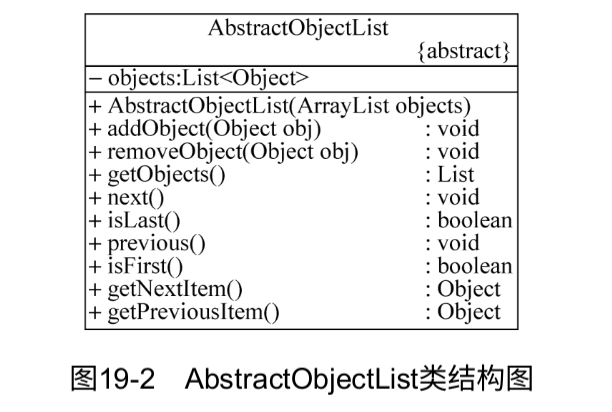

在图19-2中，List类型的对象objects用于存储数据，AbstractObjectList类的方法说明如表19-1所示。

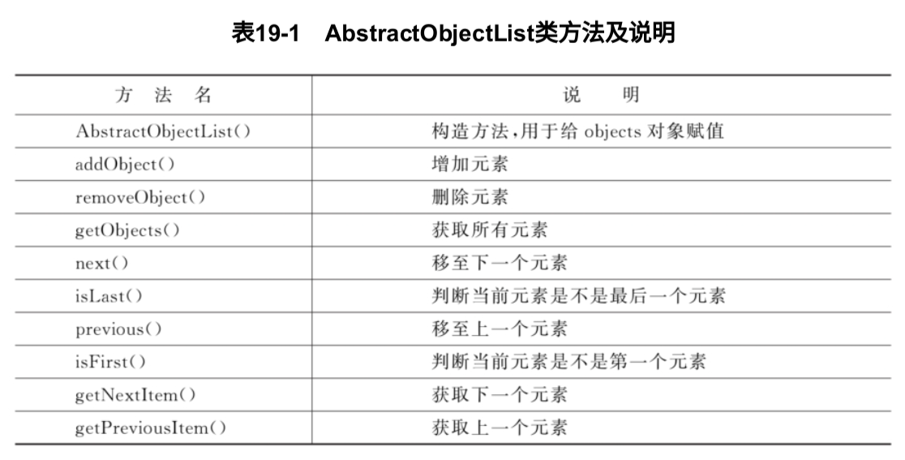

AbstractObjectList类的子类ProductList和CustomerList分别用于存储商品数据和客户数据。AbstractObjectList类的子类ProductList和CustomerList分别用于存储商品数据和客户数据。

Sunny软件公司开发人员通过对AbstractObjectList类结构进行分析，发现该设计方案存在以下问题：

1. 在图19-2所示类图中，addObject（）、removeObject（）等方法用于管理数据，而next（）、isLast（）、previous（）、isFirst（）等方法用于遍历数据。这将导致聚合类的职责过重，它既负责存储和管理数据，又负责遍历数据，违反了单一职责原则。由于聚合类非常庞大，实现代码过长，还将给测试和维护增加难度。
2. 如果将抽象聚合类声明为一个接口，则在这个接口中充斥着大量方法，不利于子类实现，违反了接口隔离原则。
3. 如果将所有的遍历操作都交给子类来实现，将导致子类代码庞大。而且，还必须暴露AbstractObjectList的内部存储细节，向子类公开自己的私有属性，否则子类无法实施对数据的遍历，这将破坏AbstractObjectList类的封装性。

解决方案：

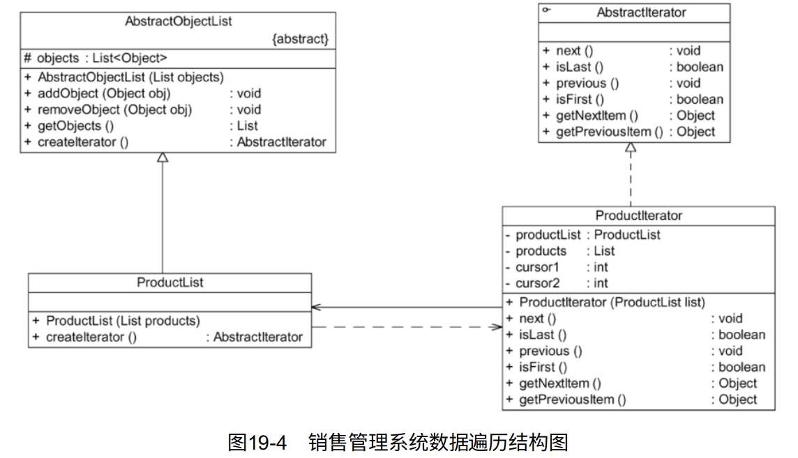


### 什么时候使用中介者模式？

1.  系统中对象之间存在复杂的引用关系，系统结构混乱且难以理解。
2. 一个对象由于引用了其他很多对象并且直接和这些对象通信，导致难以复用该对象。
3. 想通过一个中间类来封装多个类中的行为，而又不想生成太多的子类。可以通过引入中介者类来实现，在中介者中定义对象交互的公共行为，如果需要改变行为则可以增加新的具体中介者类。

如果在一个系统中对象之间存在多对多的相互关系，可以将对象之间的一些交互行为从各个对象中分离出来，并集中封装在一个中介者对象中，由该中介者进行统一协调，这样对象之间多对多的复杂关系就转化为相对简单的一对多关系。通过引入中介者来简化对象之间的复杂交互，中介者模式是迪米特法则的一个典型应用。

例子：

Sunny软件公司欲开发一套CRM系统，其中包含一个客户信息管理模块，所设计的“客户信息管理窗口”界面效果图如图20-2所示。

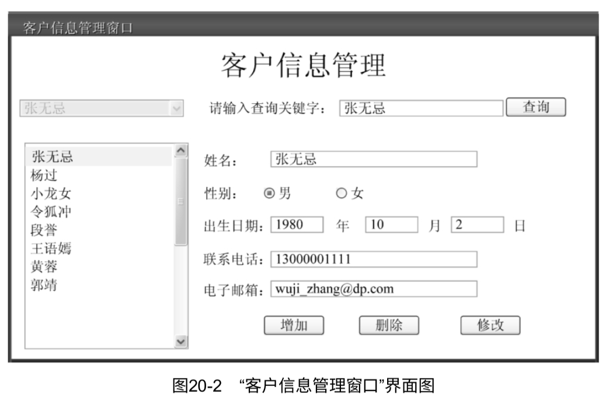

Sunny公司开发人员通过分析发现，在图20-2中，界面组件之间存在较为复杂的交互关系：如果删除一个客户，则将从客户列表（List）中删掉对应的项，客户选择组合框（ComboBox）中客户名称也将减少一个；如果增加一个客户信息，则客户列表中将增加一个客户，且组合框中也将增加一项。

如何实现界面组件之间的交互是Sunny公司开发人员必须面对的一个问题。

Sunny公司开发人员对组件之间的交互关系进行了分析，结果如下：

（1）当用户单击“增加”“删除”“修改”或“查询”按钮时，界面左侧的“客户选择组合框”“客户列表”以及界面中的文本框将产生响应。

（2）当用户通过“客户选择组合框”选中某个客户姓名时，“客户列表”和文本框将产生响应。

（3）当用户通过“客户列表”选中某个客户姓名时，“客户选择组合框”和文本框将产生响应。

为了协调界面组件对象之间的复杂交互关系，Sunny公司开发人员使用中介者模式来设计客户信息管理窗口，其结构示意图如图20-7所示。

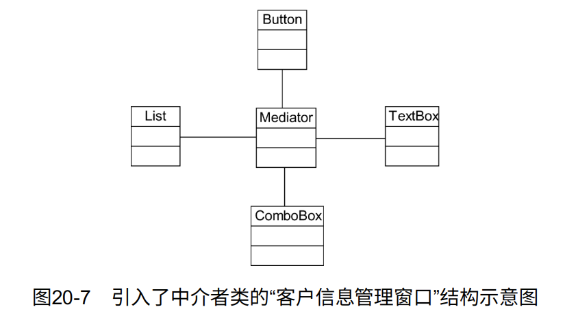

图20-7只是一个重构之后的结构示意图。在具体实现时，为了确保系统具有更好的灵活性和可扩展性，需要定义抽象中介者和抽象组件类，其中抽象组件类是所有具体组件类的公共父类。完整类图如图20-8所示。

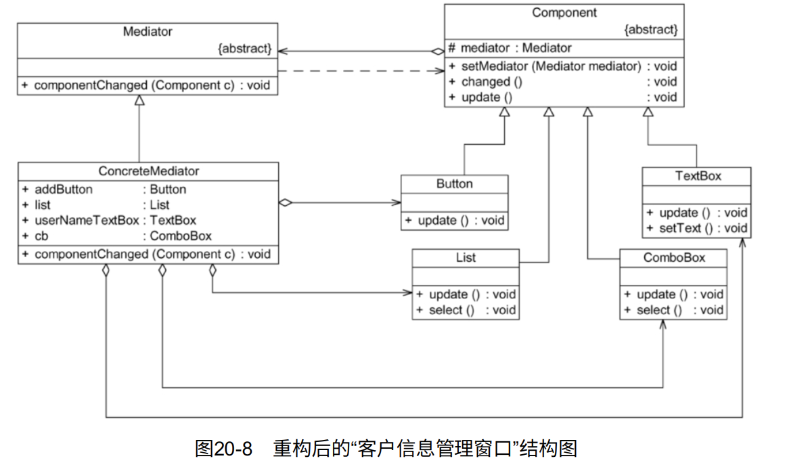


### 什么时候使用备忘录模式？

1. 保存一个对象在某一个时刻的全部状态或部分状态，这样以后需要时就能够恢复到先前的状态，实现撤销操作。
2. 防止外界对象破坏一个对象历史状态的封装性，避免将对象历史状态的实现细节暴露给外界对象。

**备忘录模式在很多软件的使用过程中普遍存在，但是在应用软件开发中，它的使用频率并不太高，因为现在很多基于窗体和浏览器的应用软件并没有提供撤销操作。**如果需要为软件提供撤销功能，备忘录模式无疑是一种很好的解决方案。在一些字处理软件、图像编辑软件、数据库管理系统等软件中备忘录模式都得到了很好的应用。

备忘录模式提供了一种状态恢复的实现机制，使得用户可以方便地回到一个特定的历史步骤。当新的状态无效或者存在问题时，可以使用暂时存储起来的备忘录将状态复原。当前很多软件都提供了撤销（Undo）操作，其中就使用了备忘录模式。


例子：

Sunny软件公司欲开发一款可以运行在Android平台的触摸式中国象棋软件，如图21-1所示。由于考虑到有些用户是新手，经常不小心走错棋；还有些用户因为不习惯使用手指在手机屏幕上拖动棋子，常常出现操作失误。因此，该中国象棋软件要提供“悔棋”功能，用户走错棋或操作失误后可恢复到前一个步骤。

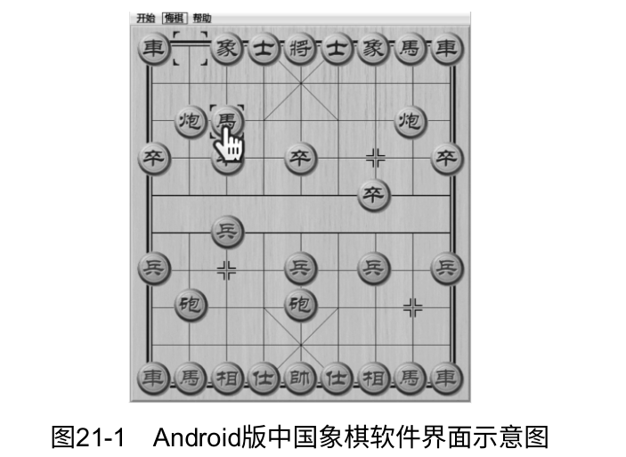

如何实现“悔棋”功能是Sunny软件公司开发人员需要面对的一个重要问题。“悔棋”就是让系统恢复到某个历史状态，在很多软件中通常称之为“撤销”。下面来简单分析一下撤销功能的实现原理。在实现撤销时，首先必须保存软件系统的历史状态。当用户需要取消错误操作并且返回到某个历史状态时，可以取出事先保存的历史状态来覆盖当前状态，如图21-2所示。备忘录模式正为解决此类撤销问题而诞生，它为软件提供了“后悔药”。通过使用备忘录模式可以使系统恢复到某一特定的历史状态。

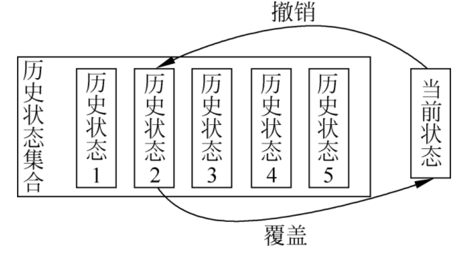

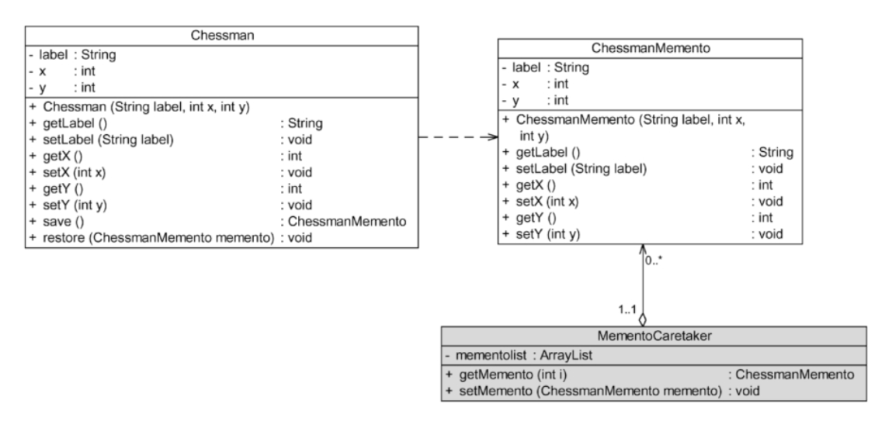

### 什么时候使用观察者模式？

1. 一个抽象模型有两个方面，其中一个方面依赖于另一个方面，将这两个依赖方面封装在独立的对象中以使它们可以各自独立地改变和复用。
2. 一个对象的改变将导致一个或多个其他对象也发生改变，而并不知道具体有多少对象将发生改变，也不知道这些对象是谁。
3. 需要在系统中创建一个触发链，A对象的行为将影响B对象，B对象的行为将影响C对象……可以使用观察者模式创建一种链式触发机制。

在软件系统中，有些对象之间也存在类似交通信号灯和汽车之间的关系。一个对象的状态或行为的变化将导致其他对象的状态或行为也发生改变，它们之间将产生联动，正所谓“触一而牵百发”。为了更好地描述对象之间存在的这种一对多（包括一对一）的联动，观察者模式应运而生。它定义了对象之间一对多的依赖关系，让一个对象的改变能够影响其他对象。

**观察者模式是使用频率最高的设计模式之一，用于建立对象与对象之间的依赖关系**。一个对象发生改变时将自动通知其他对象，其他对象将相应做出反应。在观察者模式中，发生改变的对象称为观察目标，而被通知的对象称为观察者。一个观察目标可以对应多个观察者，而且这些观察者之间可以没有任何相互联系，可以根据需要增加和删除观察者，使得系统更易于扩展。

例子：

Sunny软件公司欲开发一款多人联机对战游戏（类似魔兽世界、星际争霸等游戏）。在该游戏中，多个玩家可以加入同一战队组成联盟，当战队中某一成员受到敌人攻击时将给所有其他盟友发送通知，盟友收到通知后将做出响应。

Sunny软件公司开发人员需要提供一个设计方案来实现战队成员之间的联动。

Sunny软件公司开发人员通过对系统功能需求进行分析，发现在该系统中战队成员之间的联动过程可以简单描述如下：

联盟成员受到攻击→发送通知给盟友→盟友做出响应。

如果按照上述思路来设计系统，由于联盟成员在受到攻击时需要通知他的每个盟友，每个联盟成员都需要持有其他所有盟友的信息，这将导致系统开销较大。因此Sunny公司开发人员决定引入一个新的角色——“战队控制中心”来负责维护和管理每个战队所有成员的信息。当一个联盟成员受到攻击时，将向相应的战队控制中心发送求助信息。战队控制中心再逐一通知每个盟友，盟友再做出响应，如图22-2所示。

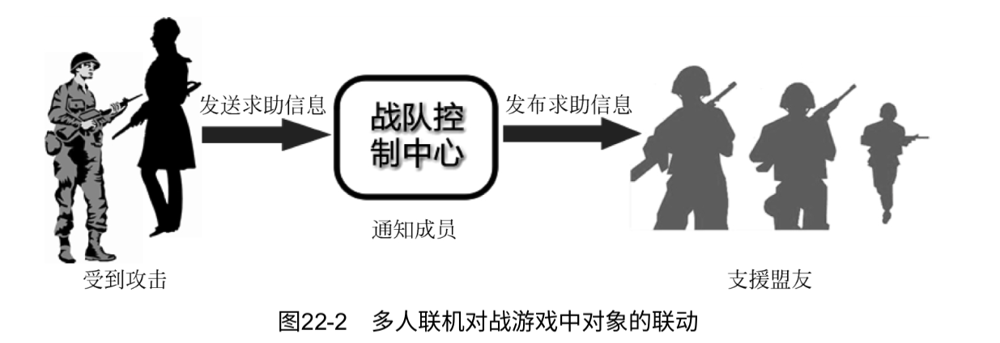

在图22-2中，受攻击的联盟成员将与战队控制中心产生联动，战队控制中心还将与其他盟友产生联动。

如何实现对象之间的联动？如何让一个对象的状态或行为改变时，依赖于它的对象能够得到通知并进行相应的处理？

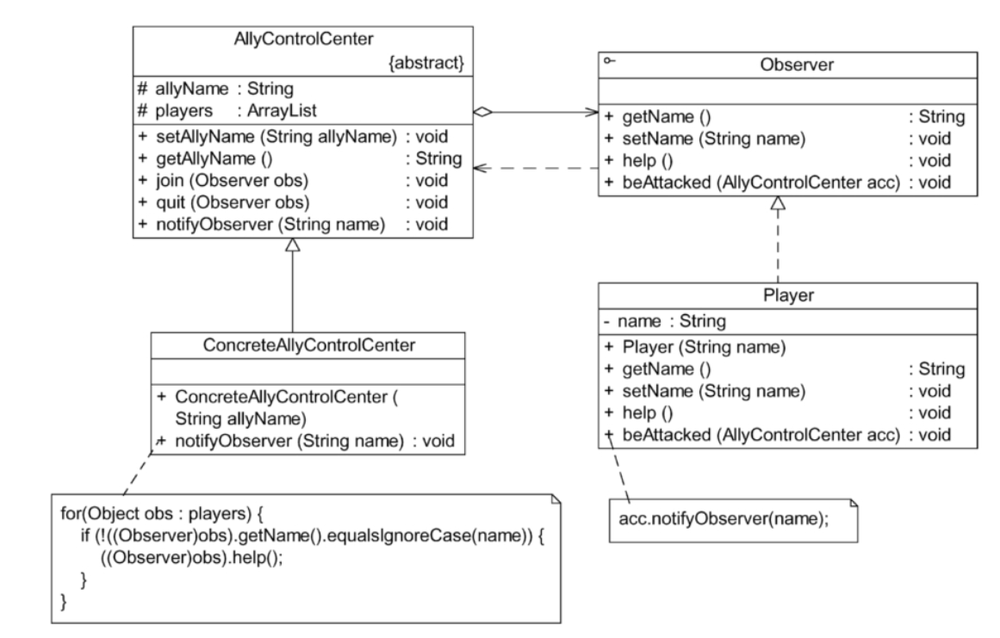


### 什么时候使用状态模式？

1. **对象的行为依赖于它的状态（例如某些属性值），状态的改变将导致行为的变化**。
2. **在代码中包含大量与对象状态有关的条件语句**。这些条件语句的出现，会导致代码的可维护性和灵活性变差，不能方便地增加和删除状态，并且导致客户类与类库之间的耦合增强。

“人有悲欢离合，月有阴晴圆缺”。包括人在内，很多事物都具有多种状态，而且在不同状态下会具有不同的行为，这些状态在特定条件下还将发生相互转换。就像水，它可以凝固成冰，也可以受热蒸发后变成水蒸气，水可以流动，冰可以雕刻，蒸汽可以扩散。这里可以用UML状态图来描述H2O的3种状态，如图23-1所示。

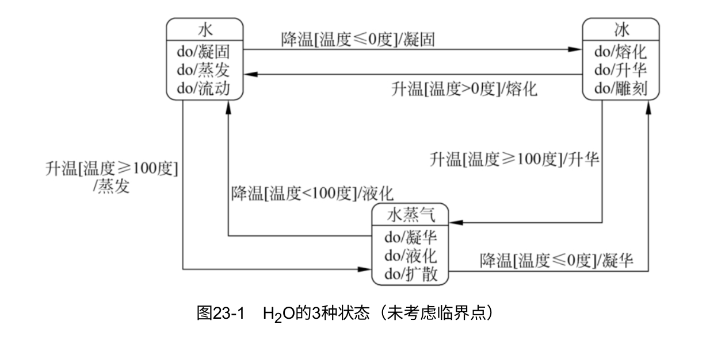

在软件系统中，有些对象也像水一样具有多种状态，这些状态在某些情况下能够相互转换，而且对象在不同的状态下也将具有不同的行为。为了更好地对这些具有多种状态的对象进行设计，可以使用一种被称为状态模式的设计模式。


例子：

Sunny软件公司欲为某银行开发一套信用卡业务系统，银行账户（Account）是该系统的核心类之一。通过分析，Sunny软件公司开发人员发现在该系统中账户存在3种状态，且在不同状态下账户存在不同的行为，具体说明如下：

1. 如果账户中余额大于或等于0，则账户的状态为正常状态（Normal State），此时用户既可以向该账户存款也可以从该账户取款。
2. 如果账户中余额小于0，并且大于-2000，则账户的状态为透支状态（Overdraft State），此时用户既可以向该账户存款也可以从该账户取款，但需要按天计算利息。
3. 如果账户中余额等于-2000，那么账户的状态为受限状态（Restricted State），此时用户只能向该账户存款，不能再从中取款，同时也将按天计算利息。
4. 根据余额的不同，以上3种状态可发生相互转换。Sunny软件公司开发人员对银行账户类进行分析，绘制了如图23-4所示UML状态图。

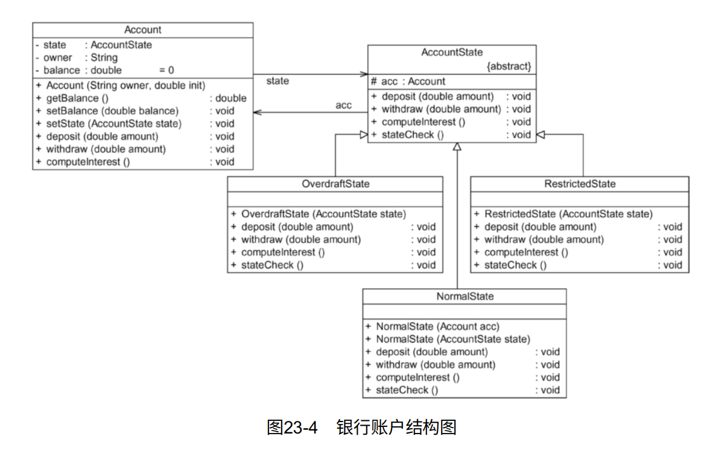


### 什么时候使用策略模式？

1. **一个系统需要动态地在几种算法中选择一种。可以将这些算法封装到一个个的具体算法类中，而这些具体算法类都是一个抽象算法类的子类**。换言之，这些具体算法类均具有统一的接口。根据里氏代换原则和面向对象的多态性，客户端可以选择使用任何一个具体算法类，并只需要维持一个数据类型是抽象算法类的对象。
2. **一个对象有很多的行为，如果不用恰当的模式，这些行为就只好使用多重条件选择语句来实现**。此时，使用策略模式，把这些行为转移到相应的具体策略类里面，就可以避免使用难以维护的多重条件选择语句。
3. 不希望客户端知道复杂的、与算法相关的数据结构。在具体策略类中封装算法与相关的数据结构，可以提高算法的保密性与安全性。

俗话说：条条大路通罗马。在很多情况下，实现某个目标的途径不止一条，例如在外出旅游时可以根据实际情况（目的地、旅游预算、旅游时间等）来选择一种最适合的出行方式。在制订旅行计划时，如果目的地较远、时间不多，但不差钱，可以选择坐飞机去旅游；如果目的地虽远，但假期长，且需控制旅游成本时可以选择坐火车或汽车；如果从健康和环保的角度考虑，而且有足够的毅力，自行车游或者徒步旅游也是个不错的选择。

在软件开发中，也常常会遇到类似的情况，实现某一个功能有多条途径。每一条途径对应一种算法，此时可以使用一种设计模式来实现灵活地选择解决途径，也能够方便地增加新的解决途径。本章将介绍一种为了适应算法灵活性而产生的设计模式——策略模式。

策略模式的主要目的是将算法的定义与使用分开，也就是将算法的行为和环境分开。将算法的定义放在专门的策略类中，每个策略类封装了一种实现算法。使用算法的环境类针对抽象策略类进行编程，符合依赖倒转原则。在出现新的算法时，只需要增加一个新的实现了抽象策略类的具体策略类即可。

例子：

Sunny软件公司为某电影院开发了一套影院售票系统，在该系统中需要为不同类型的用户提供不同的电影票打折方式，具体打折方案如下：

1. 学生凭学生证可享受票价8折优惠。
2. 年龄在10周岁及以下的儿童可享受每张票减免10元的优惠（原始票价需大于或等于20元）。
3. 影院VIP用户除享受票价半价优惠外还可进行积分，积分累积到一定额度可换取电影院赠送的礼品。

该系统在将来可能还要根据需要引入新的打折方式。

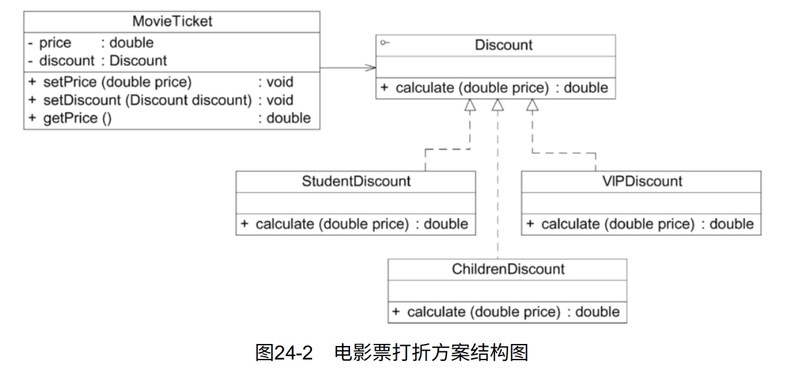
